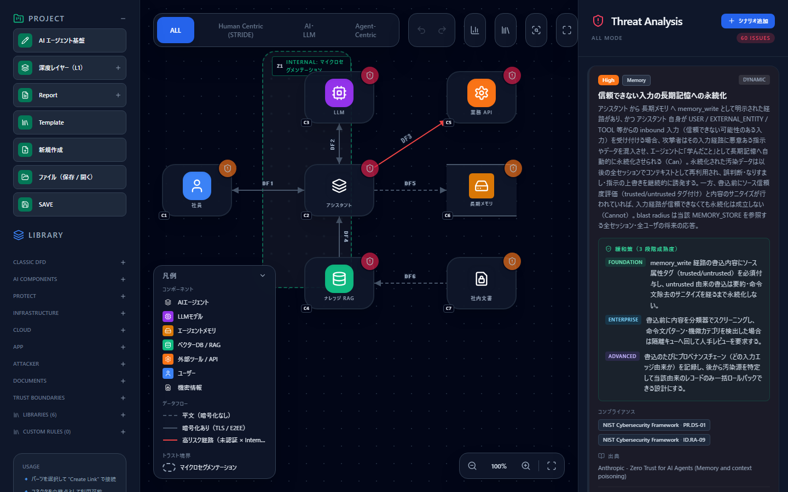

# CyberRiskScape

**AI・LLM・エージェントシステム・PQC に対応した、OSS のビジュアル脅威モデリングツール**

[](LICENSE)
[](data/threat-library)
[](#開発)

ブラウザ上でシステム構成図（DFD）を描くと、構成に応じた脅威が自動で列挙されます。
サーバ不要・完全ローカル動作で、設計データが外部に送信されることはありません。

> **English**: CyberRiskScape is an open-source visual threat modeling tool that
> covers AI, LLM, agentic systems, and post-quantum cryptography. Draw a data flow
> diagram in your browser and it enumerates the threats that apply to your
> architecture, using 113 rules from 11 sources (OWASP LLM/ASI Top 10, MITRE ATLAS,
> NIST, and others). It runs entirely client-side — no server, no data leaves your
> machine. The UI is currently Japanese-first with partial English support.

---

## 特徴

### エージェント型 AI の脅威モデリングに対応

古典的な STRIDE に加えて、**AI エージェント・LLM・MCP サーバ・長期メモリ**といった
現代的な構成要素を第一級のコンポーネント型として扱います。

| フレームワーク区分 | ルール数 | 内容 |
|---|---:|---|
| `STRIDE` | 47 | 古典的な脅威（なりすまし・改ざん・情報漏えい 等） |
| `AI` | 25 | 敵対的 ML、モデル抽出、学習データ汚染 等 |
| `AgenticAI` | 41 | 目標乗っ取り、ツール誤用、権限の持ち越し、メモリ汚染 等 |

### 脅威知識はコードに埋め込まない

脅威ルールは **すべて YAML**（`data/threat-library/`）にあり、エンジンのコードから
分離されています。ルールの追加・修正に再コンパイルもフォークも必要ありません。

```yaml
- id: agentic-memory-write-untrusted-persistence-001
  name: 信頼できない入力の長期メモリへの永続化
  framework: AgenticAI
  severity: High
  appliesTo:
    edge:
      semantic: [memory_write]
      sourceType: [AGENT, SUB_AGENT]
      targetType: [MEMORY_STORE]
  mitigation: |
    [Foundation] メモリ書き込み経路に出所の記録を必須化する。
    [Enterprise] 書き込み前に信頼度を評価し、閾値未満は隔離領域へ退避する。
```

### 主な機能

- **ビジュアル DFD エディタ** — 38 種のコンポーネント型（6 ライブラリ・9 カテゴリ）、
  トラスト境界、データフローの暗号化区分・認証状態の表現
- **脅威の自動検出** — 配置しただけで発火する内在脅威と、接続条件つきで発火する
  経路依存脅威を区別して検出
- **攻撃経路グラフ分析** — 攻撃者から資産に至る経路を可視化し、チョークポイント
  （複数経路が集中する防御点）を特定
- **コンプライアンスマッピング** — 検出脅威を NIST CSF 2.0（128 項目）/
  NIST AI RMF（72 項目）/ AI 事業者ガイドライン（34 項目）に紐付け
- **リスク評価** — DREAD スコアリング、リスク対応方針（低減・受容・移転・回避）の記録
- **カスタムルール** — UI 上のエディタから独自の脅威ルールを追加
- **脅威ライブラリ・インスペクタ** — どのルールがどの条件で発火するかを読み取り専用で確認
- **エクスポート** — 脅威一覧を CSV / JSON、および Anthropic 公式
  `defending-code-reference-harness` の `THREAT_MODEL.md` 互換 Markdown で出力
- **ローカル保存** — IndexedDB による自動保持と、File System Access API による
  ローカルファイルへの明示的な保存

---

## スクリーンショット



左：コンポーネントパレットとライブラリ管理 ／ 中央：DFD キャンバスと凡例 ／
右：検出された脅威（発火条件・3 段階成熟度の緩和策・コンプライアンス対応・出典）

---

## 動作要件

| 項目 | 要件 |
|---|---|
| Node.js | 20 以上（開発・ビルド時のみ） |
| ブラウザ | Chromium 系（Chrome / Edge）を推奨 |

ローカルファイルへの保存機能は File System Access API を使うため、Chromium 系
ブラウザでのみ有効です。Firefox / Safari では当該機能が無効表示になりますが、
それ以外の機能はすべて利用できます。

---

## クイックスタート

```bash
git clone https://github.com/takashi-ohmoto-git/CyberRiskScape.git
cd CyberRiskScape
npm install
npm run dev
```

表示された URL（既定では http://localhost:5173）をブラウザで開きます。

本番ビルドは以下で生成できます。出力は静的ファイルのみなので、任意の静的ホスティング
に配置できます。

```bash
npm run build     # dist/ に出力
npm run preview   # ビルド成果物をローカルで確認
```

---

## 使い方

1. **コンポーネントを配置** — 左サイドバーから DFD 要素（ユーザー、LLM、エージェント、
   データストア 等）をキャンバスへ配置します
2. **接続を引く** — 要素間にデータフローを引き、暗号化区分・認証状態・
   セマンティクス（ツール呼び出し、メモリ書き込み 等）を設定します
3. **トラスト境界を描く** — 信頼境界を配置し、境界をまたぐ通信を明示します
4. **脅威を確認** — 構成に応じた脅威が自動で列挙されます。各脅威は「検出根拠」から
   発火条件・ルール ID・出典を辿れます
5. **評価と対応方針を記録** — DREAD スコアと対応方針（低減／受容／移転／回避）を
   入力します。誤検知は抑制できます
6. **エクスポート** — 脅威一覧を CSV / JSON / Markdown で出力します

---

## 脅威ライブラリ

113 ルールを 11 のソース別ファイルで管理しています。

| ファイル | ルール数 | 主な出典 |
|---|---:|---|
| `stride-ai.yaml` | 33 | STRIDE、敵対的 ML |
| `zero-trust-access.yaml` | 14 | NIST SP 800-207 / 800-63B、CISA ZTMM v2 |
| `anthropic-zt-agents.yaml` | 13 | Anthropic "Zero Trust for AI Agents" |
| `mitre-atlas.yaml` | 12 | MITRE ATLAS |
| `maestro.yaml` | 11 | OWASP ASI Top 10 / AI Exchange / LLM Top 10 |
| `owasp-llm-top10.yaml` | 10 | OWASP Top 10 for LLM Applications |
| `owasp-asi-top10.yaml` | 5 | OWASP Top 10 for Agentic Applications 2026 |
| `agentic-zt-components.yaml` | 5 | MCP 公式 Security Best Practices |
| `pqc.yaml` | 4 | NIST IR 8547 / FIPS 203-205、CNSA 2.0 |
| `endpoint.yaml` | 3 | NIST SP 800-46 / 800-124 / IR 8259 |
| `agentic-memory-rag-edges.yaml` | 3 | メモリ・RAG 経路の脅威 |

複数のソースが同じ脅威を扱う場合は `canonicalId` でグループ化し、表示時に
「⧉ n ソース」として畳み込むことで重複表示を防いでいます。

各ファイルの先頭には出典が明記されています。外部フレームワークの記述は
カテゴリ名・技法 ID・URL による参照と日本語要約に留めており、原文の逐語転載は
行っていません。詳細は [NOTICE](NOTICE) を参照してください。

### 独自の脅威ルールを追加する

`data/threat-library/` に YAML ファイルを追加して再ビルドするか、アプリ内の
カスタムルールエディタから追加します。スキーマは Zod で検証され、不正なルールは
起動時にエラーとして報告されます。

同様に、独自のコンポーネント型は `data/component-library/` に YAML を追加することで
導入できます。

---

## 技術スタック

| 領域 | 採用技術 |
|---|---|
| フレームワーク | React 18 + TypeScript (strict) + Vite 6 |
| 状態管理 | Zustand |
| 永続化 | IndexedDB（`idb`）／ File System Access API |
| スキーマ検証 | Zod |
| スタイル | Tailwind CSS |
| テスト | Vitest |

```
src/
  core/              エディタ・キャンバス・脅威エンジン・データモデル
  features/          機能単位（攻撃経路分析・カスタムルール・エクスポート・永続化 等）
  threat-library/    脅威ルールのスキーマとローダー
  component-library/ コンポーネント型のスキーマとローダー
  compliance/        コンプライアンスマップのスキーマとローダー
  ui/                画面コンポーネント
  i18n/              多言語リソース
data/
  threat-library/    脅威ルール（YAML）
  component-library/ コンポーネント型（YAML）
  compliance/        コンプライアンスマップ（YAML）
```

---

## 開発

```bash
npm run dev          # 開発サーバ起動
npm run build        # 本番ビルド
npm run preview      # ビルド成果物の確認
npm run test         # テスト一括実行
npm run test:watch   # テスト watch モード
npx tsc --noEmit     # 型チェック（strict）
```

変更後の標準的な検証は `npx tsc --noEmit` とテストの実行です。現在 468 件の
テストが通ります。

---

## コントリビュート

Issue と Pull Request を歓迎します。以下の点にご協力ください。

- **脅威ルールはコードにハードコードせず**、`data/threat-library/` の YAML に追加する
- 新しいルールには **出典を明記** し、原文の逐語転載を避けて要約に留める
- ロジックの変更にはテストを添える
- コミットメッセージは [Conventional Commits](https://www.conventionalcommits.org/) に従う

UI 文言は i18n 経由で管理しています。現在は日本語が既定で、英語は一部のみ対応して
います。英語リソースの拡充は歓迎します。

---

## セキュリティ

脆弱性を発見した場合は、公開の Issue ではなく GitHub の Security Advisory 機能から
非公開でご報告ください。

利用にあたっての注意点:

- **信頼できない YAML を読み込まないでください。** コンポーネントライブラリの
  インライン SVG アイコンは現在サニタイズされていないため、第三者が配布する
  ライブラリ YAML は内容を確認してから使用してください
- 本ツールは脅威モデリングの**設計支援**を目的としており、検出結果の網羅性や
  正確性を保証するものではありません。実際のリスク評価は専門家の判断と併用してください

---

## ライセンス

[Apache License 2.0](LICENSE)

脅威ライブラリおよびコンプライアンスマッピングは本プロジェクトの独自著作であり、
参照している外部ソース（OWASP、MITRE ATLAS、NIST、CISA、Anthropic 等）の帰属表示は
[NOTICE](NOTICE) にまとめています。
