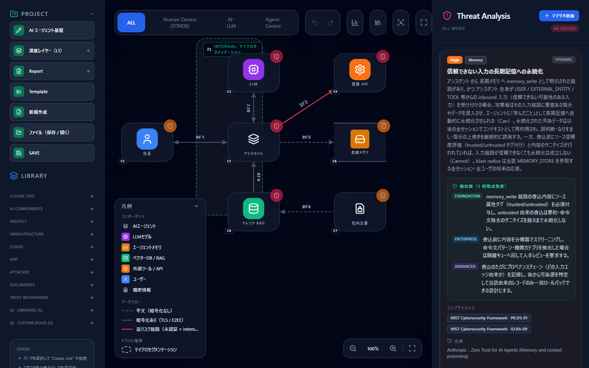

# CyberRiskScape

**Open-source visual threat modeling for AI, LLM, agentic systems, and post-quantum cryptography**

[](LICENSE)
[](data/threat-library)
[](#development)
[](https://takashi-ohmoto-git.github.io/CyberRiskScape/)

**English** | [日本語](README.ja.md)

Draw a data flow diagram in your browser, and CyberRiskScape enumerates the threats that
apply to your architecture — including the ones classical threat modeling tools have no
vocabulary for: goal hijacking, tool misuse, privilege carry-over, memory poisoning.

It runs entirely in the browser. No server, no account, no telemetry — your design never
leaves your machine.

**▶ Live demo: https://takashi-ohmoto-git.github.io/CyberRiskScape/** (nothing to install)

New here? Start with **[Getting Started](guide/getting-started.md)** — what the tool is for,
how the screen is laid out, and how to work on the canvas, with screenshots.
For the thinking behind it, see [An Introduction to Secure by Design](guide/secure-by-design.md).

> **Interface language.** English and Japanese are both supported — use the JA / EN switch
> in the top bar, and your choice is remembered. The interface, all 214 threat rules
> (name, category, description, mitigations) and every component type label are
> translated. Help is welcome.

---

## What makes it different

### Agentic AI is a first-class citizen

Alongside classical STRIDE, CyberRiskScape treats **AI agents, LLMs, MCP servers, and
long-term memory** as first-class component types, with a rule set to match.

| Framework | Rules | Covers |
|---|---:|---|
| `STRIDE` | 118 | Spoofing, tampering, repudiation, information disclosure, DoS, elevation of privilege |
| `AI` | 33 | Adversarial ML, model extraction, training data poisoning |
| `AgenticAI` | 42 | Goal hijacking, tool misuse, privilege carry-over, memory poisoning |

This is where the project invests. Most threat modeling tools have zero rules in the third row.

### Ecosystem — connected to your development, API, and identity stack

The threat model does not stay inside the diagram: it connects to the tools you use to design, build, and verify.
CyberRiskScape **ships an MCP server** and integrates file-based with API gateways, API testing, identity
platforms, and AI agent platforms. It makes no outbound calls, so it also works in air-gapped environments.

| Integrates with | What you get |
|---|---|
| **MCP** (Claude Code, GitHub Copilot, Cursor, and others) | Coding agents query threats and update the diagram while they design ([guide](guide/mcp-integration.md)) |
| **CI** (GitHub Actions) | Detect new threats from diagram diffs, block the PR, and emit SARIF ([guide](guide/ci-integration.md)) |
| **API gateways** (Kong AI Gateway) | Generate the diagram from your decK configuration and watch configuration changes in PRs ([guide](guide/kong-ai-gateway.md)) |
| **API testing** (Postman, Postman CLI, Newman) | Export verification requests that check the detected threats ([guide](guide/postman.md)) |
| **Identity platforms and NHIs** (Okta, SailPoint, CyberArk (Idira), Microsoft Entra ID, Active Directory / LDAP) | Model and assess IdPs, directories, NHIs, PAM and IGA, generate the diagram from a Conjur policy, and pair with each vendor's MCP server to cross-check against the real state of your identities ([guide](guide/nhi-identity.md)) |
| **ASM and external exposure** (Shodan) | Generate a diagram of exposed services from a `shodan download` export, assess and reduce exposure along CISA's four steps, and catch new exposure by diffing against the previous import ([guide](guide/exposure-reduction.md)) |
| **AI agent platforms** (Salesforce Agentforce) | Dedicated stencils, threat rules, and a diagram template ([guide](guide/agentforce.md)) |
| **Automotive** (SDV, connected cars) | Dedicated stencils (Vehicle (SDV) category), threat rules based on UN R155 Annex 5, and a zonal-architecture diagram template ([guide](guide/sdv.md)) |
| **AI-driven vulnerability review** (Anthropic `defending-code-reference-harness`) | Export the threat model as `THREAT_MODEL.md`-compatible input for the review ([guide](guide/security-context.md)) |

For the full list of products and how they connect, see [Integrations](guide/integrations.md).

### Features

- **Visual DFD editor** — 103 component types across 13 libraries and 16 categories, trust
  boundaries, and data flows carrying encryption, authentication, and semantic attributes.
  The library covers network and security appliances (with examples of the equivalent cloud
  services), Storage & Databases, and Basic Shapes (DFD) drawn in the classic Yourdon notation
- **Automatic threat detection** — distinguishes *inherent* threats (a component fires them
  just by existing) from *path-dependent* ones (they need a specific connection to exist)
- **Attack path analysis** — maps routes from attacker to asset and identifies choke points
  where several routes converge on one defensible node
- **PQC migration support** — draw a design on a PQC layer, separate from the depth layers,
  and trace a route from sender to destination, split into segments at each node that
  terminates or decrypts the encryption. Each segment gets a termination verdict, a likelihood,
  and a PQC verdict (based on the CRYPTREC Cryptographic Algorithm List, Table 2, and NIST FIPS
  203/204/205), and a simple report (CSV) can be exported ([guide](guide/pqc-migration.md))
- **Layer copy** — copy a depth layer to the PQC layer (or back) as a draft
- **Compliance mapping** — maps detected threats to NIST CSF 2.0 (128 items), NIST AI RMF
  (72 items), and Japan's AI Business Operator Guidelines (34 items)
- **Risk assessment** — Impact × Likelihood scoring and risk treatment decisions (mitigate / accept /
  transfer / avoid)
- **Custom rules** — add your own detection rules from an in-app editor
- **Threat library inspector** — read-only view of every rule and the exact conditions
  that make it fire
- **Export** — threat lists as CSV / JSON, and as Markdown compatible with the
  `THREAT_MODEL.md` schema used by Anthropic's `defending-code-reference-harness`;
  a **PDF report** (one-page executive summary plus details) and **PNG diagram images**,
  with selectable layers ([guide](guide/report-export.md))
- **Local persistence** — automatic retention via IndexedDB, plus explicit saves to local
  files through the File System Access API

---

## Screenshot



Left: component palette and library management. Center: the DFD canvas and its legend.
Right: detected threats, each with its firing conditions, three-tier mitigations,
compliance references, and sources.

See it running in the [live demo](https://takashi-ohmoto-git.github.io/CyberRiskScape/).

---

## Requirements

| | |
|---|---|
| Node.js | 20 or later (for development and builds only) |
| Browser | Chromium-based (Chrome / Edge) recommended |

Saving to local files uses the File System Access API, which is Chromium-only. On Firefox
and Safari that one feature is disabled; everything else works.

---

## Quick start

```bash
git clone https://github.com/takashi-ohmoto-git/CyberRiskScape.git
cd CyberRiskScape
npm install
npm run dev
```

Open the URL it prints (http://localhost:5173 by default).

Production builds are plain static files and can be hosted anywhere:

```bash
npm run build     # outputs to dist/
npm run preview   # serve the build locally
```

---

## How to use it

1. **Place components** — add DFD elements (users, LLMs, agents, data stores, …) from the
   left sidebar onto the canvas
2. **Connect them** — draw data flows and set encryption, authentication, and semantics
   (tool call, memory write, …)
3. **Draw trust boundaries** — make the crossings explicit
4. **Review threats** — threats appear as you build. Each one opens to show why it fired:
   its conditions, rule ID, and source
5. **Assess and decide** — record risk scores and a risk treatment; suppress false positives
6. **Export** — CSV, JSON, Markdown, a PDF report, or PNG diagram images

[Getting Started](guide/getting-started.md) walks through each of these steps with screenshots.

---

## Development

```bash
npm run dev          # dev server
npm run build        # production build
npm run preview      # preview the build
npm run test         # run all tests
npm run test:watch   # watch mode
npx tsc --noEmit     # type check (strict)
```

The standard check after a change is `npx tsc --noEmit` plus the test suite. 1,181 tests
currently pass.

---

## CLI (preview)

A headless CLI can analyze a saved project file without a browser — useful for CI gates.
It evaluates only the bundled threat rules (custom rules stored in IndexedDB are not
available to it).

```bash
npm run build:cli
node dist-cli/main.js analyze <project.json> [options]
```

| Option | Values | Default |
|---|---|---|
| `--format` | `json` \| `sarif` \| `md` | `json` |
| `--layer` | `L0` \| `L1` \| `L2` \| `L3` | every layer that has nodes |
| `--framework` | `STRIDE` \| `AI` \| `AgenticAI` \| `ALL` | `ALL` |
| `--fail-on` | `Critical` \| `High` \| `Medium` \| `Low` | no gate |
| `--locale` | `ja` \| `en` | `ja` |
| `--out` | output file path | stdout |

Exit codes: `0` success, `1` `--fail-on` gate failed, `2` input/argument error.

### Model diff gate (`diff`)

Compares two versions (base / head) of a saved project file and reports which threat
modeling **triggers** (T1–T8 below) the change hits, plus added/removed threats,
disposition changes, and effective severity changes. Markdown output is ready to paste
as a PR comment; JSON is for machine processing.

```bash
node dist-cli/main.js diff <base.json> <head.json> [options]
```

| Option | Values | Default |
|---|---|---|
| `--format` | `md` \| `json` | `md` |
| `--fail-on` | `Critical` \| `High` \| `Medium` \| `Low` | no gate |
| `--triggers` | path to a trigger-definition YAML | the bundled T1–T8 (translation overlay not applied when set) |
| `--locale` | `ja` \| `en` | `ja` |
| `--out` | output file path | stdout |

The gate only considers **newly added** threats (existing unaddressed ones never fail it).
Disposition changes to accepted/false-positive never fail the gate either — they are
flagged as "needs approval" in the output instead.

Trigger list:

| ID | Trigger |
|---|---|
| T1 | New trust boundary |
| T2 | New external interface |
| T3 | New authentication / authorization mechanism |
| T4 | New technology or runtime |
| T5 | Sensitive data takes a new path |
| T6 | New third-party integration |
| T7 | Expanded agent capability |
| T8 | Change to the model, training data, or RAG source |

T4 cannot be auto-judged from the model diff (the diagram has no tech-stack information),
so it is always reported as "confirm in PR review".

### Triggers checklist (`triggers`) and CI setup

```bash
node dist-cli/main.js triggers [options]
```

| Option | Values | Default |
|---|---|---|
| `--format` | `md` \| `json` | `md` |
| `--triggers` | path to a trigger-definition YAML | the bundled T1–T8 (translation overlay not applied when set) |
| `--locale` | `ja` \| `en` | `ja` |
| `--out` | output file path | stdout |

Outputs the T1–T8 trigger list above as a Markdown checklist (for a PR template or an AI
reviewer's checklist) or as JSON. For a ready-to-use GitHub Action (`action.yml`), example
workflow, CODEOWNERS and PR template, and the full setup guide, see
[Integrating with AI-Driven Development CI](guide/ci-integration.md) in the [user guide](guide/README.md).

### MCP server (`mcp`)

`node dist-cli/main.js mcp` starts an MCP server over stdio so coding agents (Claude Code, GitHub Copilot, etc.)
can query threats and update the diagram's structure. It makes no external calls and cannot change acceptances or risk assessments.
See [Using It from Coding Agents](guide/mcp-integration.md).

---

## Roadmap

Near-term priorities, in order:

1. **Structured audit report** — the PDF report (one-page summary, top-10 details, per-layer
   appendix) has shipped; still to come is an HTML output fit to serve as audit evidence, with
   detection confidence stated explicitly

Done recently: an English UI with a language switcher, plus English translation overlays
for all 214 threat rules and every component type label, all leaving the existing schemas
unchanged.

---

## Contributing

Issues and pull requests are welcome. See [CONTRIBUTING.md](CONTRIBUTING.md) for the
development workflow, the rules for adding threat rules, and how to help with translation.

---

## Security

Please report vulnerabilities privately through
[GitHub Security Advisories](https://github.com/takashi-ohmoto-git/CyberRiskScape/security/advisories/new),
not through public issues. Details are in [SECURITY.md](SECURITY.md).

Two things to be aware of:

- **Do not load untrusted YAML.** Inline SVG icons in component libraries are not yet
  sanitized, so review any third-party library YAML before using it
- This tool is a **design aid** for threat modeling. It does not guarantee that its findings
  are complete or correct; use it alongside expert judgment, not instead of it

---

## License

[Apache License 2.0](LICENSE)

The threat library and compliance mappings are original work of this project. Attribution
for the external sources they reference (OWASP, MITRE ATLAS, NIST, CISA, Anthropic, and
others) is collected in [NOTICE](NOTICE).
