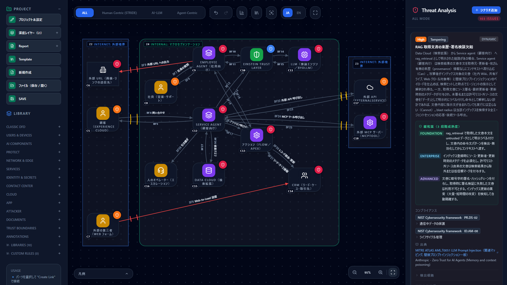
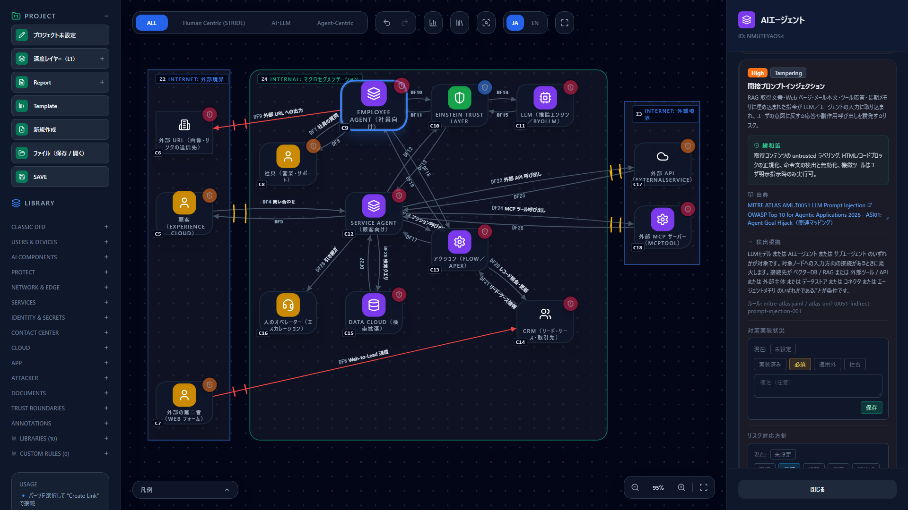
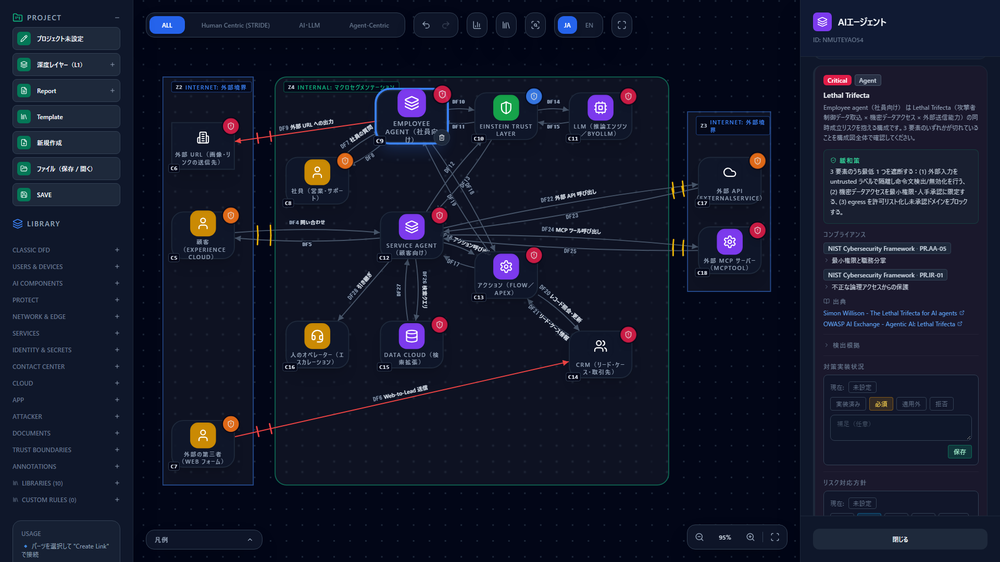
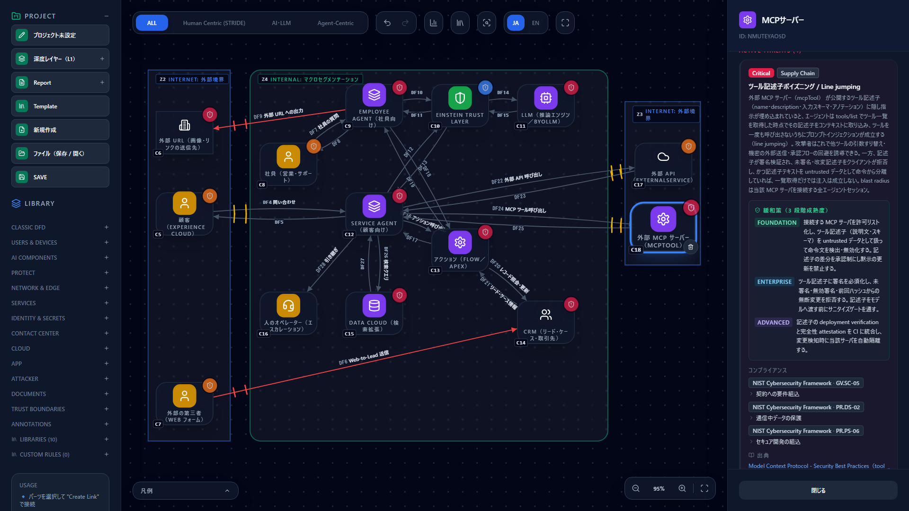
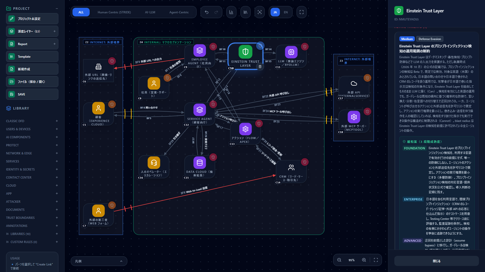
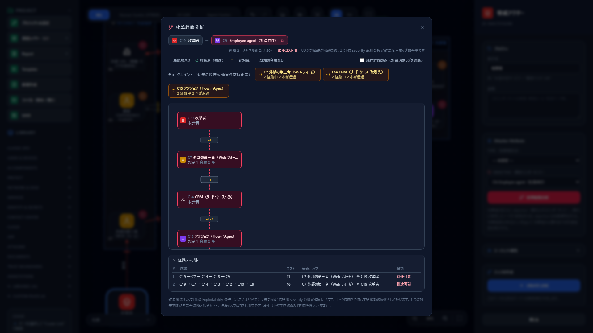

# Salesforce Agentforce を脅威モデリングする — 構成図テンプレートと既存ルールで評価する

[English](agentforce.md) | **日本語**

> Salesforce・Agentforce・Einstein は Salesforce, Inc. の商標です。このページは
> 「CyberRiskScape で Agentforce の構成を脅威モデル化する方法」を説明するもので、Salesforce 社が
> 提供・認定・推奨するものではありません。製品の仕様は変わりうるため、最新は各リンク先の公式の情報で
> 確認してください。

---

## 1. このページで分かること・前提

- Agentforce の構成要素を CyberRiskScape のコンポーネント型に**どう対応づけるか**
- 顧客向けの Service agent を題材にした**構成図テンプレート**（読み込むだけで使えます）と、
  それに対して**実際に検出される脅威**
- 外部から書き込める CRM の項目を経由する間接プロンプトインジェクションなど、Agentforce で
  押さえたい脅威を、どの構成要素で・どのルールが拾うか
- エージェント定義の変更を PR で見張る使い方と、コーディングエージェントに構成図の下書きを作らせる使い方

**前提：Agentforce の概要**（執筆時点の公式の記載による）

- Agentforce は、Salesforce が提供するエージェントの基盤です。顧客向けの **Service agent** は専用の
  エージェントユーザーで動き、社員向けの **Employee agent** はログインしたユーザーとして動きます
  （[出典 1](#参考リンク)）。
- エージェントは**アクション**（Apex・Flow・プロンプト・外部サービスなど）を呼び出して仕事をします。
  推論は Atlas 推論エンジンまたは持ち込みの LLM（BYOLLM）で行い、**Einstein Trust Layer** が
  データマスキング・プロンプト防御・毒性検知などの保護を担います（[出典 2](#参考リンク)）。
- エージェントの定義は**メタデータ**（Agent Script の `.agent` ファイルなど）として Git で管理し、
  CI/CD で昇格することが公式に推奨されています（[出典 3](#参考リンク)）。

**このページの前提となる知識**：[はじめに](getting-started.ja.md)の操作と、
[テンプレートを作る・使う](templates.ja.md)の読み込み手順。

> **確度の表記について** — Salesforce の公式ドキュメントの本文を直接確認できなかった項目は、
> 「公式の記載の抜粋による」と明記しています。最新の内容は必ず公式で確認してください。
> 確認できていない事項や、二次情報だけが根拠の事項は、このページには書いていません。

---

## 2. Agentforce の構成要素と CyberRiskScape の型の対応

| Agentforce の構成要素 | CyberRiskScape の型 | 設定のポイント |
|---|---|---|
| Service agent（顧客向け） | `AGENT` | `agency`・`blastRadius`・`identityTier` を設定する。専用のエージェントユーザーの権限が `blastRadius` の目安 |
| Employee agent（社員向け） | `AGENT` | ログインユーザーの権限で動く。社員を表す `USER`（Employee）から接続する |
| サブエージェント／`connected_subagent` | `SUB_AGENT`（または `AGENT` ＋ エッジ） | 委譲は `semantic: delegation` のエッジで表す |
| 推論エンジン／BYOLLM | `LLM` | |
| Einstein Trust Layer | `EINSTEIN_TRUST_LAYER`（専用ライブラリ「Salesforce Agentforce」） | エージェントと LLM の間に置く。専用ルール（§4.2・§4.5・§4.7）は、**この型とつながったエージェント**に発火する。ライブラリは左サイドバーで無効化でき、無効にするとパレットから消えるだけで、配置済みの図・脅威検出・保存データは変わらない |
| アクション（Apex・Flow・プロンプト・標準アクション） | `TOOL` | エージェントからは `semantic: tool_invocation`。実行権限（ユーザー／システム）は説明欄に書く |
| 外部 MCP サーバー（`mcpTool://`） | `MCP_SERVER` | 組織の外（Internet の境界）に置く |
| 外部 API（`externalService://`、Named Credential 先） | `SAAS` または `EXTERNAL_ENTITY` | 組織の外（Internet の境界）に置く |
| CRM オブジェクト（リード・ケース・取引先） | `CRM` | 外部から書き込める入口（Web-to-Lead など）を別の `USER`／`EXTERNAL_ENTITY` から引く |
| Data Cloud の検索拡張（retriever） | `DB` | 取得結果の復路は `semantic: rag_retrieval` |
| Web-to-Lead・Experience Cloud・メッセージング | `USER`（Guest）／`EXTERNAL_ENTITY` | 外部境界（Internet）に置く |
| 人へのエスカレーション（`@utils.escalate`） | `HUMAN_OPERATOR` | |
| Agentforce Voice | `PBX` → `STT` → `AGENT` → `TTS` | 後述の §4.8 |

> **ひとこと** — 対応づけは「脅威ルールがどの要素に当たるか」を決めるための割り切りです。
> たとえば Flow と Apex をまとめて 1 つの `TOOL` にしても、ルールの当たり方は変わりません。
> 実行権限を分けて評価したいときは、`TOOL` を分けて、説明欄に実行コンテキストを書いてください。

---

## 3. 構成図の例

顧客向けの Service agent と、社員向けの Employee agent を 1 枚にまとめたテンプレートです。



| ファイル | 内容 |
|---|---|
| [`templates/agentforce-service-agent.ja.json`](templates/agentforce-service-agent.ja.json) | 日本語版 |
| [`templates/agentforce-service-agent.en.json`](templates/agentforce-service-agent.en.json) | 英語版 |

**中身：** コンポーネント 14・データフロー 25・トラスト境界 3
（顧客・外部＝Internet、Salesforce 組織＝Internal、外部 API／外部 MCP サーバー＝Internet）。

- **顧客向けの流れ** — 顧客 → Service agent → Trust Layer → LLM。Service agent は、アクション
  （Flow／Apex）・Data Cloud の検索・外部 API・外部 MCP サーバー・人へのエスカレーションを使う
- **ForcedLeak 型の経路** — 外部の第三者が Web フォーム（Web-to-Lead 相当）から CRM に書き込む →
  アクションが CRM のレコードを返す → Employee agent が読む → 外部 URL への出力がある。
  図では、画面左下の「外部の第三者（Web フォーム）」から赤い線で CRM へ入り、
  CRM → アクション → Employee agent → 外部 URL と続きます

読み込み方は[テンプレートの章](templates.ja.md#3-読み込むimport)と同じです。
左サイドバーの **Template** → **Import** で JSON を選び、**適用**します。

**読み込むと 103 件**（Critical 19・High 61・Medium 23）の脅威が検出されます。

### 3.1 図の前提（仮置きの属性）

テンプレートの属性は、**一般的な構成を想定した仮置き**です。自分の環境に合わせて直してください。

| 要素 | 設定 | 理由と、直したくなる場面 |
|---|---|---|
| Service agent | `agency: Bounded`・`blastRadius: Tenant`・`identityTier: LabelOnly` | 専用のエージェントユーザーの権限が組織内に及ぶ想定。権限を絞れているなら `blastRadius` を下げる |
| Employee agent | `agency: Bounded`・`blastRadius: Tenant`・`identityTier: Cryptographic` | ログインした社員の権限で動く想定（SSO を使う前提） |
| アクション（Flow／Apex） | `agency: Bounded`・`blastRadius: Tenant` | 実行コンテキストは図に表れない。説明欄で確認する |
| エッジの `auth` | 社内の接続は `Password`、外部の接続は `Password` | 実際の認証方式（OAuth・Named Credential など）に合わせて直す |
| Web フォーム → CRM | `auth: None`・`network: Internet` | 外部の誰でも書き込める入口として表現している |

> **Employee agent が CRM を直接読む形にしていない理由** — 実際の Agentforce では、エージェントは
> レコードを標準アクション・Flow・Apex・検索拡張などの**アクション経由**で読むことが多いため、テンプレートは
> CRM → アクション → エージェントの順に接続しています。`CRM` 型からエージェントへの**直接の入力経路**
> も、汎用ルール（`owasp-llm01-indirect-business-record-001`、High）が間接プロンプトインジェクションとして
> 検出します（`CRM`・`MAIL`・`CHAT`・`OTHER_APP`・`SAAS` からエージェントへの経路が対象）。
> アクション経由の形でも、アクションの応答を読む既存のルール（`atlas-aml-t0051-…`）が発火します。
> 実際の読み取り経路は、自分の構成に合わせて確認してください。

---

## 4. 押さえるべき脅威

以降、各項目に「CyberRiskScape で検出されるルール」と「Agentforce での意味」を書きます。
**ルール名の後ろの括弧は、発火する構成要素**です。汎用ルールに加えて、**Agentforce 専用ルール**
（`sf-agentforce-…`）が 3 本あり、Einstein Trust Layer 型、またはそれとつながったエージェントに発火します（§7）。
**検出されないことも正直に書きます。**

### 4.1 外部から書き込める CRM の項目を経由する間接プロンプトインジェクション

**事例：ForcedLeak。** セキュリティ企業の Noma Labs が 2025 年に報告した事例（CVSS 9.4）です。
発見者の記事によると、Web-to-Lead フォームの説明欄に悪意ある指示を書き込み、従業員がそのリードに
ついてエージェントに質問すると、エージェントがその指示に従って CRM のデータを、許可リストに
残っていた失効ドメイン経由で外部へ送信できた、とされています。Salesforce は、Trusted URL の
許可リストの強制などで対応したと説明されています（[出典 4](#参考リンク)。対応の詳細は
発見者の記事に基づくもので、公式の説明は公式で確認してください）。

構造として重要なのは、**攻撃者がエージェントに直接話しかけていない**ことです。外部の人が書いた
データを、社内のエージェントが「データ」として読み、そのまま指示として扱ってしまいます。

**検出されるルール**（テンプレートで確認済み）

| ルール | 重大度 | 発火する要素 | 読み方 |
|---|---|---|---|
| 間接プロンプトインジェクション（`atlas-aml-t0051-…`） | High | Employee agent・Service agent | アクションの応答（CRM のレコードを含む）や Data Cloud・外部 MCP の応答が、エージェントの入力に入る |
| 業務アプリのデータ経由の間接プロンプトインジェクション（`owasp-llm01-indirect-business-record-001`） | High | `CRM`・`MAIL`・`CHAT`・`OTHER_APP`・`SAAS` から直接つながったエージェント | 外部の人が書き込めるレコード・メール・チャットをエージェントが入力として読む経路。**CRM 型を直接つないだ構成でも検出される**（このテンプレートは CRM → アクション → エージェントなので、この行は出ず、上の行が出る）。`LINE` は利用者の直接入力として扱うため対象外 |
| Lethal Trifecta（`maestro-lethal-trifecta-001`） | Critical | Employee agent・Service agent | 「攻撃者制御データの取込 × 機密データへのアクセス × 外部送信能力」。**発火条件は図の接続ではなくエージェントの影響範囲の属性**（Tenant／CrossTenant／Admin）。3 要素のどれかが切れているかを、図全体で確認する合図 |
| 正規ツールの連鎖悪用（`anthropic-zt-tool-chaining-001`） | High | Employee agent・Service agent | 内部 CRM の取得と外部送信の組み合わせ |
| 制御外通信（`maestro-agent-internet-egress-001`） | High | 「外部 URL への出力」のデータフローほか | 許可リスト外の宛先への送信経路 |
| なりすまし（`stride-edge-unauth-internet-001`） | Critical | 「Web-to-Lead 送信」・「外部 URL への出力」のデータフロー | 認証のない公衆網からの入口・出口 |
| 外部協働者の機微システムアクセス（`zt-external-collaborator-broad-access-001`） | High | 「Web-to-Lead 送信」・「問い合わせ」のデータフロー | ゲスト区分が機微なシステム（CRM・エージェント）に到達する |



上の画面は、Employee agent を選び、間接プロンプトインジェクションの「検出根拠」を開いたところです。
「対象ノードへの入力方向の接続がある」ことが発火条件だと分かります。
（このスクリーンショットはアクション経由の読み取りのルールです。）



**Agentforce での確認事項**

- 外部から書き込める項目（Web-to-Lead の説明欄・メッセージング・メール・Experience Cloud の
  入力欄など）を、エージェントが読むオブジェクトの**どの項目が受け取るか**
- そのレコードを読んだエージェントが、**外部へ送信できる経路**（外部 URL・外部 API・外部 MCP・
  メール送信など）を持っているか
- 取得した本文を**信頼できない入力**として扱い、命令文を無効化しているか
  （ルールの緩和策：取得コンテンツの untrusted ラベル付け、機微ツールはユーザーの明示指示時のみ実行）
- Trusted URL の許可リストに、**使われていないドメインや失効したドメインが残っていないか**（§4.5）

### 4.2 Service agent の実行ユーザーと権限

- Service agent は**専用のエージェントユーザー**（Einstein Agent ライセンス）で動き、Employee agent は
  **ログインユーザー**として動きます（公式の記載の抜粋による。[出典 1](#参考リンク)）
- 新規のエージェントの権限は既定でゼロで、**エージェントごとに専用ユーザー・最小権限**にすることが
  公式ブログで推奨されています（[出典 5](#参考リンク)）
- Salesforce 組織の GitHub（`forcedotcom/sf-skills`、AI エージェント向けの運用メモで**製品の公式
  ドキュメントではありません**）には、Service agent は共有ルールを尊重しない、という記述があります。
  共有ルールの扱いは、公式ドキュメントで必ず確認してください

**検出されるルール**

| ルール | 重大度 | 発火する要素 |
|---|---|---|
| エージェント識別の不在（`anthropic-zt-agent-identity-attribution-001`） | High | Service agent（`identityTier: LabelOnly` のため。Employee agent は `Cryptographic` なので発火しない） |
| エージェントの実行ユーザーとアクションの実行コンテキストによる権限の過大（`sf-agentforce-runtime-privilege-001`、**専用**） | High（`blastRadius` が `ReadOnly`／`Self` なら Medium） | Trust Layer とつながった Employee agent・Service agent |
| Confused Deputy／委譲時の権限継承（`anthropic-zt-confused-deputy-001`） | High | Employee agent・Service agent |
| セッション跨ぎの権限残留（`anthropic-zt-memory-privilege-retention-001`） | High | Employee agent・Service agent |

専用ルールは、実行ユーザーとアクションの実行コンテキストという Agentforce の権限の決まり方に即した
**点検項目を出す**もので、実際の権限を読むわけではありません。

**検出されないもの** — **共有ルールの扱い・権限セットの中身・実効権限そのものを評価するルールは
ありません。** 図では `blastRadius`（侵害時の影響範囲）で表現し、権限セットの内容は人がレビューします
（UC1 では、権限セットの変更を PR で見張ります）。

### 4.3 システム権限で動くアクション

アクションは、参照先の Apex・Flow の権限に従います。Flow には実行コンテキスト（ユーザー／システムなど）の
種類があり、公式ブログは Apex で `with sharing`・ユーザーモードを推奨しています
（公式の記載の抜粋による。[出典 6](#参考リンク)）。**システムモードで動くかどうかは、
メタデータだけでは決まりません。**

**検出されるルール**

| ルール | 重大度 | 発火する要素 |
|---|---|---|
| Tool poisoning／Rug pull（`anthropic-zt-tool-poisoning-rug-pull-001`） | Critical | アクション |
| 出力の信頼境界違反（`maestro-tool-output-handling-001`） | High | アクション |
| 権限昇格リスク（`maestro-tool-edge-001`） | High | アクション ⇄ CRM のデータフロー |
| 自律動作の暴走（`maestro-agent-runaway-001`） | Critical | Employee agent・Service agent |
| 実行ユーザーとアクションの実行コンテキストによる権限の過大（`sf-agentforce-runtime-privilege-001`、**専用**） | High | Trust Layer とつながったエージェント（§4.2 と同じルール。緩和策に、Apex の `with sharing`・Flow のユーザーコンテキストを含む） |

**検出されないもの** — 「このアクションがシステムモードで動く」ことを見分けるルールはありません。アクションは汎用の `TOOL` のままで、
専用ルールはエージェント側に発火して棚卸しを促すだけです。
該当するアクションは、説明欄に実行コンテキストを書き、`blastRadius` を現実に合わせて上げてください。

### 4.4 書き込み系アクションの人の確認（`require_user_confirmation`）

アクションの属性 `require_user_confirmation` は、実行前に**人の確認ステップ**を挟みます。既定は
`False` とされています（Salesforce 組織の GitHub にある AI エージェント向けの運用メモによる。**製品の公式ドキュメントではない**ため、最新は公式で確認してください）。
レコードの更新・返金・メール送信のような**書き込み系・副作用のあるアクション**では、`True` を
検討します。なお、顧客の側が最小権限・ガードレール・監視・カスタムアクションでの人の確認を担うことは、
Salesforce の責任分界として公式に示されています（[出典 7](#参考リンク)）。

**検出されるルール** — `maestro-agent-runaway-001`（Critical。緩和策に「危険アクションの人手承認」）と、
`owasp-asi09-human-agent-trust-exploitation-001`（Medium。人がエージェントの説明を鵜呑みにして
承認してしまう問題）。図では、機微操作を人が承認する設計を `agency: Bounded` で表します。

**検出されないもの** — `require_user_confirmation` が実際に `True` かどうかは、図にも検出にも
反映されません。Agent Script を人が確認してください。

### 4.5 外部送信と Trusted URL

ForcedLeak への対応として、Salesforce は **Trusted URL の許可リストを強制**するようにしたと
説明されています（2025 年 9 月から。[出典 4](#参考リンク)。Salesforce 側の詳細は公式で確認してください）。
ForcedLeak では、許可リストに残っていた**失効ドメイン**が悪用されたと報告されています。
許可リストは「入れたら終わり」ではなく、棚卸しが要ります。

**検出されるルール**

| ルール | 重大度 | 発火する要素 |
|---|---|---|
| エージェントの出力に埋め込んだ URL による外部送信（Trusted URL の残存ドメイン）（`sf-agentforce-output-url-exfiltration-001`、**専用**） | High | Trust Layer とつながった Employee agent・Service agent |
| 制御外通信（`maestro-agent-internet-egress-001`） | High | 「外部 URL への出力」・外部 API・外部 MCP サーバーへの接続 |

外部 URL のノードには、なりすまし・否認のルールも出ます。専用ルールは、応答に埋め込んだ URL（画像・リンク）の
描画で CRM のデータが送り出される経路と、Trusted URL の棚卸しを点検項目にします（確度は上記のとおり、
ForcedLeak の詳細は発見者の記事に基づきます）。

**検出されないもの** — 許可リストの中身（失効ドメインの有無など）は評価できません。

### 4.6 外部 MCP サーバーの Tool Poisoning

Agentforce は外部の MCP サーバーを呼び出せます（Beta。許可リストとサーバーの審査があります）。
**Salesforce 自身が、Tool Poisoning を脅威として名指ししています**（[出典 8](#参考リンク)）。
また、外部の AI から Salesforce を操作できる、Salesforce がホストする MCP サーバーもあります
（呼び出したユーザーの権限に従います。[出典 9](#参考リンク)）。こちらは向きが逆で、
このテンプレートの対象外です。

**検出されるルール**

| ルール | 重大度 | 発火する要素 |
|---|---|---|
| ツール記述子ポイズニング／Line jumping（`mcp-tool-descriptor-poisoning-001`） | Critical | 外部 MCP サーバー |
| MCP サーバーのなりすまし／タイポスクワッティング（`mcp-server-impersonation-typosquatting-001`） | High | 外部 MCP サーバー |
| 信頼境界外からのプロンプト入力（`maestro-agent-untrusted-ingress-001`） | High | 「ツール応答」などのデータフロー |
| Trust Boundary 跨ぎの直接暴露（`stride-edge-internet-exposed-sensitive-001`） | Critical | 外部 MCP サーバー・外部 API から Service agent への応答のデータフロー |



### 4.7 プロンプトインジェクション検知の制約

Trust Layer には、プロンプトインジェクションの検知機能があります。ただし、執筆時点の公式の記載
（検索結果の抜粋）では、**Beta・既定でオフ・英語（米国）のみ**とされています（[出典 10](#参考リンク)。
**最新は公式で確認してください**）。日本語で運用する場合や、機能をオンにしていない場合は、
検知に頼れない前提で設計します。

**検出されるルール** — Trust Layer の検知の適用範囲の制約（`sf-agentforce-trust-layer-detection-gap-001`、
**専用**、Medium）が、`EINSTEIN_TRUST_LAYER` 型のノードに出ます（Beta・既定でオフ・英語のみ、という公式の記載と、
ガードレールが確率的な防御であることが根拠。汎用のガードレール単体依存のルールの代わりに、この型ではこちらが出ます）。緩和策は、ガードレールの背後に**決定論的な制御**（アクションの許可リスト・
最小権限・出力先の制限・人の承認）を置くことです。



上の画面は、Einstein Trust Layer のノードを選び、専用ルールのカード（Medium）を開いたところです。

### 4.8 Agentforce Voice

Agentforce Voice は、**カスケード型**（音声認識 → 推論 → 音声合成）で、音声から音声へ直接変換する
方式ではありません（[出典 11](#参考リンク)）。電話基盤は Salesforce Voice とパートナーのテレフォニー
（Amazon Connect・Genesys など）です（[出典 12](#参考リンク)）。

カスケード型なので、**文字起こしの結果がそのまま推論の入力になります。** 話した内容に紛れた
指示がインジェクションとして作用しうるほか、不可聴の音声などで音声認識を誤らせる攻撃も
知られています（[出典 14](#参考リンク)）。声紋認証を併用する構成にする場合は、録音から作った合成音声で突破されうることに
注意します。米国 NIST の SP 800-63B-4 は、声による生体照合を使ってはならないとしています
（[出典 13](#参考リンク)）。

このテンプレートには Voice を含めていません（図が煩雑になるため）。構成図に表すときは、
[コンタクトセンターのテンプレート](templates.ja.md#コンタクトセンターのテンプレート)の
PBX → STT → エージェント → TTS の部分を参考にしてください。そのテンプレートでは、
敵対的音声による誤認識（`voice-stt-adversarial-audio-001`）、声紋認証のクローン音声による突破
（`voice-voiceprint-clone-bypass-001`）、エージェントへの直接プロンプトインジェクション、
合成音声によるなりすまし（`voice-synthetic-media-impersonation-001`）などが検出されます。

> **確認できていないこと** — Trust Layer の保護が音声の経路にも及ぶかどうかは、公式の明記を
> 確認できていません。導入前に、公式で確認してください。

---

## 5. 攻撃経路分析で、守りどころを探す

[攻撃経路分析](attack-paths.ja.md)を使うと、「外部の第三者から Employee agent までの経路」のうち、
**どこに対策を置けば最も多くの経路に効くか**が分かります。
次の画面は、テンプレートに攻撃者を 1 つ追加（外部の第三者へ接続し、標的を Employee agent に設定）
した状態です。**この攻撃者はテンプレートには含まれません。** 試すときは、自分で追加してください。



- 経路は 2 本で、どちらも「外部の第三者（Web フォーム）→ CRM → アクション → …→ Employee agent」を
  通ります
- チョークポイントとして、**外部の第三者の入口・CRM・アクション**が出ます（2 経路中 2 本が通過）。
  つまり、Web フォームから CRM への書き込みの制限、CRM の項目の扱い、アクションの出力の扱いが、
  この構成で最も効く場所です
- リスク評価をまだ付けていないため、コストは severity から置いた暫定値です

---

## 6. ユースケース

### UC1：エージェント定義の変更で、PR に脅威モデルの更新を求める

**状況** — エージェント定義・アクション・権限セットを Git で管理している。サブエージェントや
アクションを足す PR が、脅威モデルの更新なしにマージされるのを防ぎたい。

[AI駆動開発のCIに組み込む](ci-integration.ja.md)の GitHub Action の `watch-paths` に、
Salesforce DX のパスを並べます。

```yaml
- uses: takashi-ohmoto-git/CyberRiskScape@v0.2.0   # 本番ではコミット SHA に固定すること
  with:
    model: threat-model/project.json
    fail-on: High
    watch-paths: |
      force-app/**/aiAuthoringBundles/**
      force-app/**/genAiPlannerBundles/**
      force-app/**/genAiPlugins/**
      force-app/**/genAiFunctions/**
      force-app/**/permissionsets/**
      force-app/**/flows/**
      force-app/**/classes/**
```

`watch-paths` の各行は git の pathspec（glob）として扱われます。上の書き方で、
`force-app/main/default/…` 配下の該当ファイルに一致することを確認しています。

| 変更されるもの | 該当しうるトリガー | 見るポイント |
|---|---|---|
| `aiAuthoringBundles`・`genAiPlannerBundles`（エージェントの定義） | **T7** エージェントの能力拡大 | 新しいサブエージェント・アクション・外部 MCP の追加、自律性の引き上げ |
| `genAiPlugins`・`genAiFunctions`（サブエージェント・アクション） | **T7** | 新しいアクションが、書き込み・外部送信を持たないか。`require_user_confirmation` の有無 |
| `permissionsets`（権限セット） | **T3** 認証・認可、**T7** | エージェントユーザーの権限が増えていないか |
| `flows`・`classes`（アクションの実装） | **T7**、**T5** 機密データの新しい経路 | システムモードか。どのオブジェクトを読み書きするか |
| 外部サービスの登録・Named Credential を追加する場合 | **T6** サードパーティ連携 | 顧客データを受け取る外部サービスが増えていないか |

最後の行のように外部サービスの登録や Named Credential のディレクトリも見張りたい場合は、
自分のリポジトリのメタデータの置き場所を確認して、`watch-paths` に足してください
（ディレクトリ名は Salesforce DX のプロジェクト構成に従います）。

**流れ**

1. エージェント定義などを変える PR を出す
2. モデル JSON が更新されていなければ、Action が**実行トリガー T1〜T8 のチェックリスト**を PR に出して
   失敗する
3. 人が、構成図を更新するか、更新が要らないと判断して `threat-model-not-needed` ラベルを付ける
   （ラベルを付けてよい人は社内で合意しておく。[CI の章 §4.3](ci-integration.ja.md#43-codeowners-を設定する)）

**限界** — `watch-paths` は「ファイルが変わった」ことしか見ません。**変更の中身が危険かどうかは
評価しません。** `permissionsets`・`flows`・`classes` は変更が多く、ノイズになりやすいので、
最初は `aiAuthoringBundles` と `genAi*` だけにして、様子を見て足すのが現実的です。

### UC2：コーディングエージェントに `.agent` を読ませて、構成図の下書きを作る

**状況** — Agent Script（`.agent`）で定義したエージェントがあるが、構成図が無い。
コーディングエージェント（Claude Code・GitHub Copilot など）に、構成図の下書きを作らせたい。
[コーディングエージェントから使う](mcp-integration.ja.md)の MCP サーバーを設定済みであることが
前提です。

**エージェントへの指示例**

```text
force-app/main/default/aiAuthoringBundles/ 配下の .agent ファイルを読んで、
このエージェントの構成を CyberRiskScape の構成図にしてください。
- エージェント・アクション（target の種類ごと）・外部サービス・外部 MCP を、
  list_component_types で確認した型で追加する
- アクションは semantic を tool_invocation にする。外部サービスと外部 MCP は Internet の境界に置く
- require_user_confirmation が False の書き込み系アクションを、一覧にして報告する
- Flow・Apex の中身と実行権限は読まず、「要確認」として報告する
まず dryRun で、増える脅威を教えてください。
```

**エージェントが呼ぶツールの流れ**

1. `list_component_types` — 使える型（`AGENT`・`TOOL`・`MCP_SERVER`・`SAAS` など）を確認する
2. `get_model` — 既存のモデルのノード・境界・`revision` を得る
3. `apply_model_changes`（`dryRun: true`） — ノード・エッジ・境界を 1 回で送る。属性
   （`agentAttributes`）や `semantic` も指定できる。書き込まずに、増える脅威が返る
4. `apply_model_changes`（`dryRun` を外す） — 内容が妥当なら書き込む
5. `analyze_threats`・`get_threat` — 検出された脅威と、その根拠を読む

**人がやること** — 下書きの確認と補完です。**エージェントにできるのは、`.agent` に書いてある範囲です。**

- Flow・Apex の**中身**（システムモードか、どのオブジェクトを触るか）と、エージェントユーザーの
  **実効権限**（権限セット・共有ルール）は、`.agent` からは分かりません。人が確認して、
  `blastRadius` や説明欄に反映します
- 外部から書き込める CRM の項目（Web-to-Lead など）は `.agent` に現れません。**人が入口を足します**
- リスク評価・受容・対策の実装状況は、エージェントからは変更できません。人がアプリで設定します
- 書き込みは作業ツリーのファイルを直接更新するので、作業の前にコミットしておきます

### （参考）Salesforce DX の MCP サーバーとの併用

Salesforce は、Salesforce DX の MCP サーバー（`@salesforce/mcp`）を公開しています（[出典 15](#参考リンク)）。
**エージェント関連で提供されているのは、エージェントのテスト実行（`run_agent_test`）だけ**です。
エージェントの定義を読み出したり、構成を取得したりするツールではありません。

そのため、併用の形は「CyberRiskScape が構成図と脅威を扱い、Salesforce DX の MCP サーバーが
エージェントのテスト実行を担う」という分担になります。2 つのサーバーは互いに通信せず、つなぐのは
エージェントです。Salesforce DX の MCP サーバーは組織への認証を要するので、利用の条件と接続先の
権限は、Salesforce の公式ドキュメントで確認してください。

---

## 7. 限界

- **専用ルールは 3 本で、Trust Layer 型とつながったエージェントに発火する設計です。** Trust Layer を
  図に置かないと、エージェント向けの専用ルール（出力 URL・実行権限）は出ません。それ以外の評価は
  既存の汎用ルールによります。共有ルール・Trusted URL の中身・`require_user_confirmation` の設定値・
  システムモードの有無といった **Salesforce 固有の設定は、評価できません**
- **2 段の経路（窓口 → CRM → エージェント）の精密な判定はできず、近似です。** 汎用ルールは
  「エージェントへの直接の入力経路」を見るため、外部の窓口が CRM に書き込み、CRM をアクションが読み、
  エージェントがその応答を受ける、という 2 段以上の経路は、途中のアクションの応答を読むルールや
  攻撃経路分析（§5）で補います
- **Flow・Apex は汎用の `TOOL` のままです。** 実行コンテキストやアクションの種類で当たり方は変わりません
- **メタデータからの構成図の自動生成はありません。** UC2 のようにコーディングエージェントが
  `.agent` を読んで下書きを作れますが、結果は毎回同じとは限らず、人の確認が要ります
- **テンプレートの属性は仮置きです**（§3.1）。検出件数は、属性や接続の置き方で変わります
- **Salesforce 側の仕様は変わりえます。** Beta の機能（外部 MCP、プロンプトインジェクション検知）は
  特に変わりやすいため、最新は公式で確認してください
- ForcedLeak の詳細は、発見者の記事に基づきます。Salesforce 側の公式の説明は、公式で確認してください

---

## 参考リンク

出典の確度：直接確認できた公式の情報と、公式の記載の抜粋（本文を直接確認できなかったもの）を
区別しています。後者は「公式の記載の抜粋による」と本文に明記しました。

1. Employee agent と Service agent の実行ユーザー（公式の記載の抜粋による） —
   <https://help.salesforce.com/s/articleView?id=ai.agent_employee_agent_considerations.htm>
2. Einstein Trust Layer（公式の記載の抜粋による） —
   <https://developer.salesforce.com/docs/einstein/genai/guide/trust.html>
3. エージェントの開発ライフサイクル（メタデータを Git で管理し CI/CD で昇格） —
   <https://architect.salesforce.com/docs/architect/fundamentals/guide/agent-development-lifecycle>
4. ForcedLeak（Noma Labs、発見者の記事） — <https://noma.security/noma-labs/forcedleak>
5. Agentforce を安全に実装するためのベストプラクティス（公式ブログ） —
   <https://www.salesforce.com/blog/best-practices-for-secure-agentforce-implementation-2/>
6. Agentforce の Apex アクションのベストプラクティス（公式ブログ） —
   <https://developer.salesforce.com/blogs/2025/07/best-practices-for-building-agentforce-apex-actions>
7. Salesforce の責任分界と、顧客が担うセキュリティ対策（公式） —
   <https://help.salesforce.com/s/articleView?id=005315874&language=en_US&type=1>
8. Agentforce の MCP（公式ブログ。Tool Poisoning への言及） —
   <https://www.salesforce.com/blog/agentforce-mcp/>
9. Salesforce がホストする MCP サーバーの一般提供（公式ブログ） —
   <https://developer.salesforce.com/blogs/2026/04/salesforce-hosted-mcp-servers-are-now-generally-available>
10. プロンプトインジェクション検知の設定（公式の記載の抜粋による。本文は未確認） —
    <https://help.salesforce.com/s/articleView?language=en_US&id=ai.generative_ai_trust_configure_prompt_injection_detection.htm>
11. Agentforce Voice の構成（公式エンジニアリングブログ） —
    <https://engineering.salesforce.com/how-ai-driven-testing-enabled-sub-second-latency-for-agentforce-voice/>
12. Agentforce Voice のテレフォニー（公式） —
    <https://help.salesforce.com/s/articleView?id=005226934&language=en_US&type=1>
13. NIST SP 800-63B-4 §3.2.3.2（声による生体照合を使ってはならない） —
    <https://nvlpubs.nist.gov/nistpubs/SpecialPublications/NIST.SP.800-63B-4.pdf>
14. DolphinAttack（不可聴の音声コマンドによる音声認識への攻撃、学術論文） — <https://arxiv.org/abs/1708.09537>
15. Salesforce DX MCP サーバー（Salesforce の GitHub） — <https://github.com/salesforcecli/mcp>

このほか、Agent Script の仕様とパーサー（<https://github.com/salesforce/agentscript>、Apache-2.0）と
`sf agent` コマンド（<https://github.com/salesforcecli/plugin-agent>）が Salesforce の GitHub で
公開されています。

---

## 次に読むもの

- 検出された脅威の読み方 — [脅威パネルの読み方](reading-threats.ja.md)
- 経路から守りどころを探す — [攻撃経路分析](attack-paths.ja.md)
- PR で構成図の更新を求める — [AI駆動開発のCIに組み込む](ci-integration.ja.md)
- コーディングエージェントから使う — [ユースケースで学ぶ MCP 連携](mcp-use-cases.ja.md)
