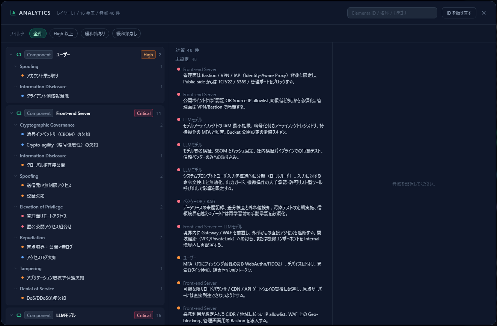
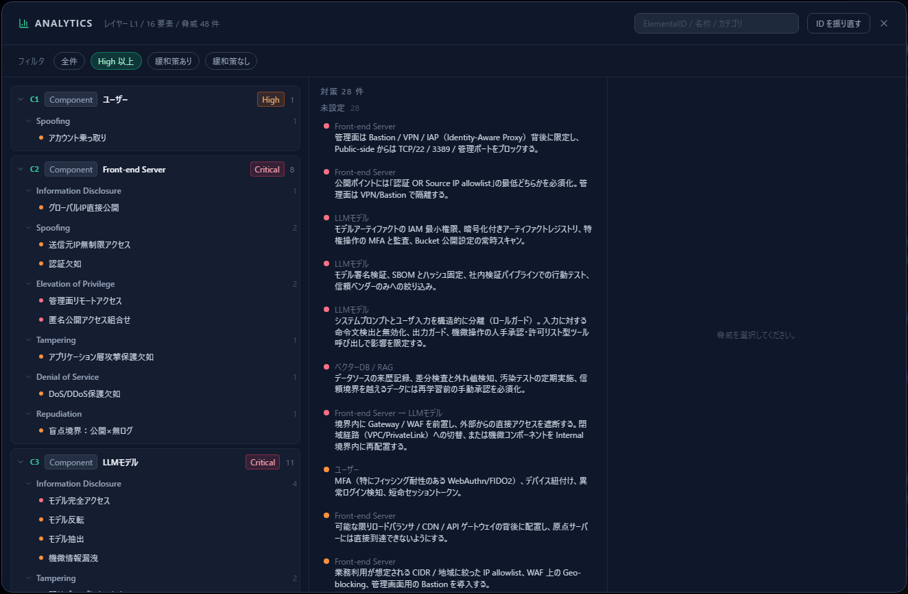
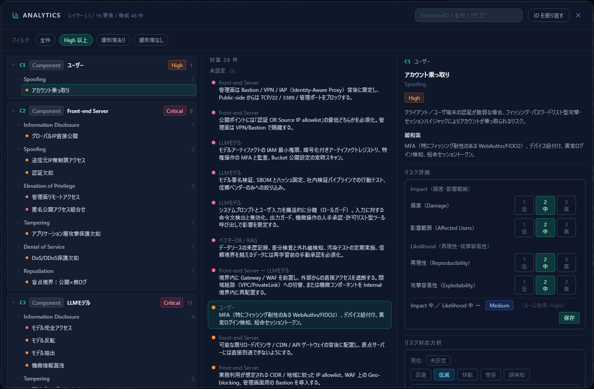
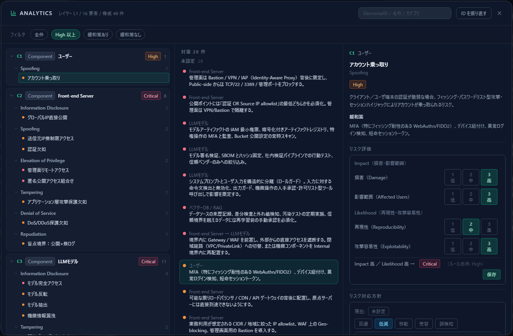
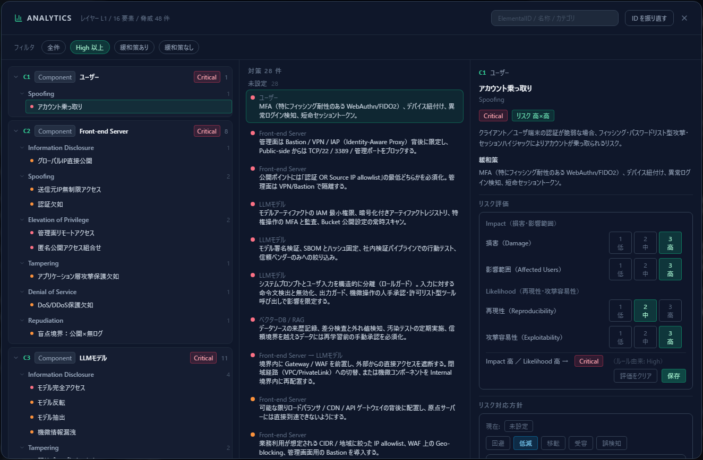
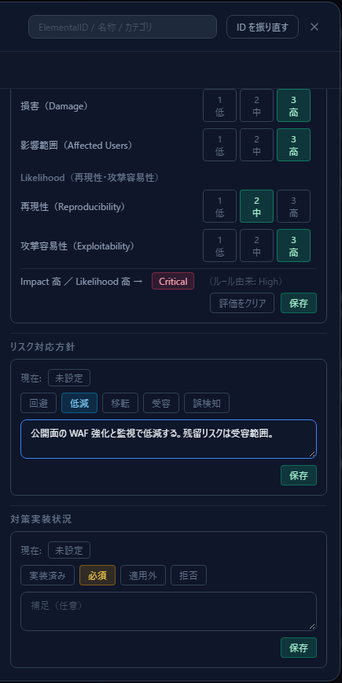
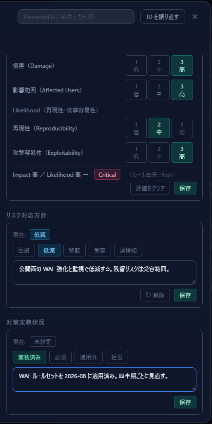
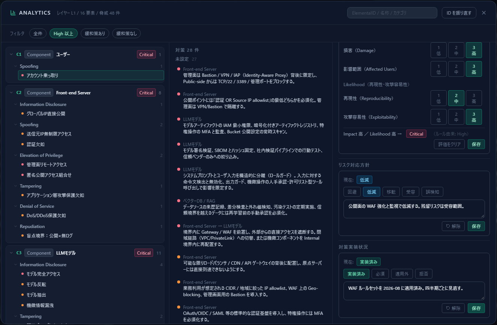
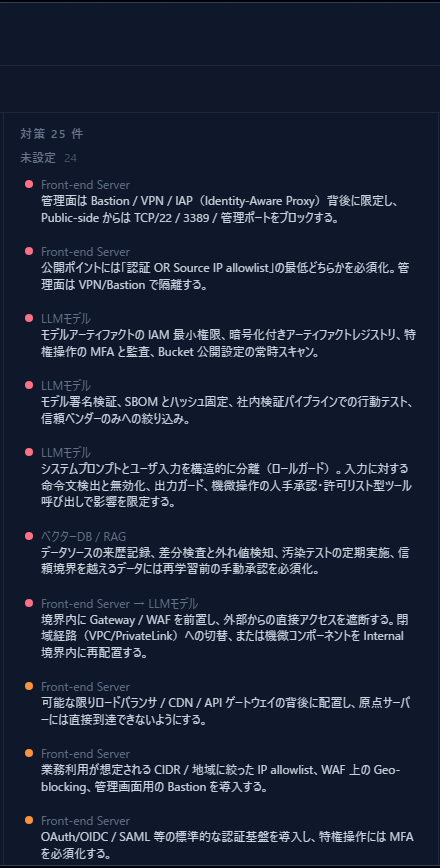

# Analytics でリスクを評価する

[English](analytics-assessment.md) | **日本語**

脅威が並んだら、次は **1 件ずつ評価して記録する**作業です。
Analytics を開けば、**リスク評価・リスク対応方針・対策実装状況の 3 つを 1 画面で**記録できます。

この章は [脅威パネルの読み方](reading-threats.ja.md) の続きで、
[はじめての脅威モデル](first-threat-model.ja.md) で作った **AI チャットボットの図**を
そのまま使います（ユーザー ⇄ Front-end Server ⇄ LLM ⇄ RAG ⇄ データストア、脅威 48 件）。

---

## 1. なぜ Analytics で行うのか

脅威カードからでも記録はできますが、**件数がある程度あると右ペインを延々とスクロールする**ことに
なります。Analytics は、

- 要素ごとにまとまったツリーで**対象を選びやすい**
- **フィルタで優先順位の高いものから**取り掛かれる
- 選んだ 1 件に対して **3 つの記録欄が縦に並ぶ**

ため、評価を回すのに向いています。記録先は脅威カードと同じで、どちらで入力しても同じデータです。

---

## 2. 画面の構成

上部ツールバーの **Analytics**（棒グラフのアイコン）を開きます。

ヘッダに「レイヤー L1 / 16 要素 / 脅威 48 件」と出ます。**いま開いている深度レイヤーが対象**です。

| ペイン | 内容 |
|---|---|
| 左 | コンポーネント別の脅威ツリー。要素ごとに**最大 severity** と件数が出る |
| 中央 | 対策の一覧。**実装状況が未設定の件数**もここで分かる |
| 右 | 選択した脅威の詳細と、**3 つの記録欄** |

---

## 3. 手順 1 — 対象を絞る

いきなり 48 件を順に処理しようとすると続きません。まず絞ります。

| フィルタ | 使いどころ |
|---|---|
| **High 以上** | 最初の 1 巡はこれ。深刻なものから片付ける |
| 緩和策なし | 対策が書かれていない脅威＝自分で考える必要があるもの |
| 緩和策あり | 既存の対策案を実装状況に落とし込む作業 |
| 全件 | 最終確認 |

右上の検索欄では **ElementalID（C2 など）・名称・カテゴリ**で絞れます。
「Front-end Server まわりだけ今日中に片付ける」といった進め方ができます。

---

## 4. 手順 2 — 脅威を 1 件選ぶ

左ツリーから脅威をクリックすると、右ペインにその脅威の詳細が出ます。

ツリーは **コンポーネント → カテゴリ → 脅威**の 3 階層です。
コンポーネント行のバッジ（Critical / High …）は、その要素で**最も高い severity** を示します。
**バッジが赤い要素から潰していく**のが素直な順序です。

---

## 5. 手順 3 — リスクを評価する

右ペインの **リスク評価** で、4 項目をそれぞれ **1（低）／2（中）／3（高）** から選びます。

各ボタンには判断基準が割り当てられています。**評価者による振れ幅を抑えるため、
必ずこの基準に当てはめて**ください。

4 項目は **Impact 軸**（損害・影響範囲）と **Likelihood 軸**（再現性・攻撃容易性）の
2 グループに分かれます。

| 軸 | 項目 | 1（低） | 2（中） | 3（高） |
|---|---|---|---|---|
| Impact | 損害（Damage） | 軽微な障害・限定的な情報露出 | 一部データの漏えい・改ざん | 全データ侵害・システム全停止 |
| Impact | 影響範囲（Affected Users） | ごく一部のユーザー | 相当数のユーザー・テナント | 全ユーザー・管理者を含む |
| Likelihood | 再現性（Reproducibility） | 特定条件下でまれに成立 | 条件が揃えば成立 | 常に成立 |
| Likelihood | 攻撃容易性（Exploitability） | 高度な技術・内部知識が必要 | ツール・手順が一部公開 | 既製ツールで容易に攻撃可能 |

各軸は 2 項目の和（2〜6）を **Low（2〜3）／Medium（4）／High（5〜6）** の 3 段階に畳み、
次のマトリクスで Severity を決めます。

| Impact ＼ Likelihood | Low | Medium | High |
|---|---|---|---|
| High | Medium | High | Critical |
| Medium | Low | Medium | High |
| Low | Low | Low | Medium |

出典：[OWASP Risk Rating Methodology](https://owasp.org/www-community/OWASP_Risk_Rating_Methodology)。
本ツールの Severity は 4 段階のため、OWASP の Informational（Low×Low）は Low に丸めています。

> **旧 DREAD からの変更点：** Discoverability（発見容易性）は廃止しました。「見つけにくいほど
> 低リスク」という評価は security through obscurity をスコアに持ち込むためです。あわせて、
> 合計点方式（5〜15 点）もやめ、Impact × Likelihood の 2 軸評価に切り替えました。
> Microsoft 自身が DREAD を SDL から引退させており、現在の主流はこの 2 軸評価です。
> 1〜3 の 3 段階評価という点は従来どおりです。

**「保存」を押すまで記録されません。** 項目を選んだだけでは反映されないので、
必ず保存してください（誤って付けた場合は「評価をクリア」で戻せます）。

保存すると、**ルール由来の severity は評価由来のランクで上書きされます**。
上の例では、ルール上 High だった「アカウント乗っ取り」が、Impact High × Likelihood High で
**Critical** になりました（括弧内に元の値が残ります）。左ツリーのコンポーネントバッジもこれに追随します。

> 上書きは意図的な設計です。**一般論としての severity より、自分たちの文脈での評価を優先する**
> ためのもので、元の値は消えません。

---

## 6. 手順 4 — リスク対応方針を記録する

リスク評価の下に **リスク対応方針**があります。回避／低減／移転／受容／誤検知から選び、
**判断の根拠**を書いて保存します。

補足欄は任意ですが、**書いてください**。半年後に見返したとき、
「なぜ低減で良いと判断したのか」が残っていないと、同じ議論を最初からやり直すことになります。
残留リスクの説明を 1 行入れておくだけで十分です。

「受容」と「誤検知」を選んだ脅威だけが一覧から抑制されます
（[脅威パネルの読み方](reading-threats.ja.md) §5 を参照）。

---

## 7. 手順 5 — 対策実装状況を記録する

さらに下の **対策実装状況**で、対策側の事実を記録します。

| 状態 | 意味 | 補足 |
|---|---|---|
| 実装済み | 対策が入っている | **必須** |
| 必須 | やると決めた（未実装） | 任意 |
| 適用外 | この構成では不要 | **必須** |
| 拒否 | 入れないと決めた | **必須** |

「実装済み」「適用外」「拒否」は**補足が空だと保存できません**。
いつ・何を入れたのか（例：「WAF ルールセットを 2026-08 に適用済み。四半期ごとに見直す」）を
書いておくと、監査や引き継ぎでそのまま使えます。

3 つを記録し終えると、1 件分の評価が完了です。

---

## 8. 進捗を確認する

中央ペインの見出しが進捗計です。

- **対策 N 件** — フィルタ後の脅威のうち、緩和策を持つものの数
- **未設定 M** — そのうち実装状況を記録していない数

対策は **未設定 → 必須 → 実装済み → 適用外 → 拒否** の順にグループ化され、
グループ内は severity の高い順に並びます。
**「未設定」を 0 に近づけること**が、この作業のゴールです。

---

## 9. 1 巡の回し方

実務で回すときの順序です。

1. **High 以上**で絞る
2. 左ツリーの上から 1 件選ぶ
3. **リスク評価** を付けて保存 → 本当に High 以上なのかが確定する
4. **リスク対応方針**を根拠つきで記録
5. **対策実装状況**を記録（実装済みなら、いつ何をしたか）
6. 中央ペインの「未設定」が減ったことを確認して次へ
7. High 以上が尽きたら「全件」に切り替えて 2 巡目

**1 回で全部やろうとしないこと。** 1 巡目は High 以上だけ、
2 巡目以降で残りを拾う——という進め方のほうが、結果的に早く終わります。

---

## 10. 記録は後工程で効く

ここで入力した内容は、単なるメモではありません。

- **攻撃容易性（Exploitability）の評価** は、[攻撃経路分析](attack-paths.ja.md)の**難易度**に直結します。
  未評価のままだと、経路コストは severity 転用の暫定値で計算されます。
- **対策実装状況**は、攻撃経路分析の**被覆（対策済／一部対策）**の判定材料です。
  「実装済み」「適用外」が揃った要素だけが対策済みとして扱われます。
- **リスク対応方針と補足**は、[エクスポート](reading-threats.ja.md#8-エクスポートする)の
  「状況」「コメント」列にそのまま出ます。

評価を入れるほど、後の分析と成果物の精度が上がります。

---

## 次に読むもの

- 対策の置き場所を決める — [攻撃経路分析](attack-paths.ja.md)
- 規格との対応を確認する — [コンプライアンスマップ](compliance-map.ja.md)
- 脅威カード側の読み方 — [脅威パネルの読み方](reading-threats.ja.md)
