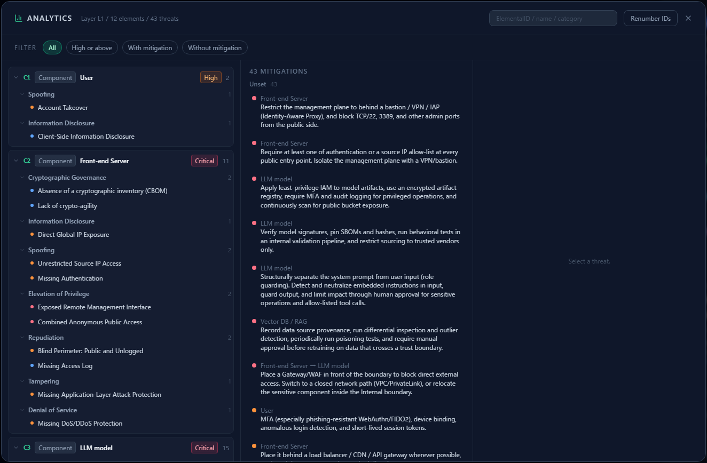
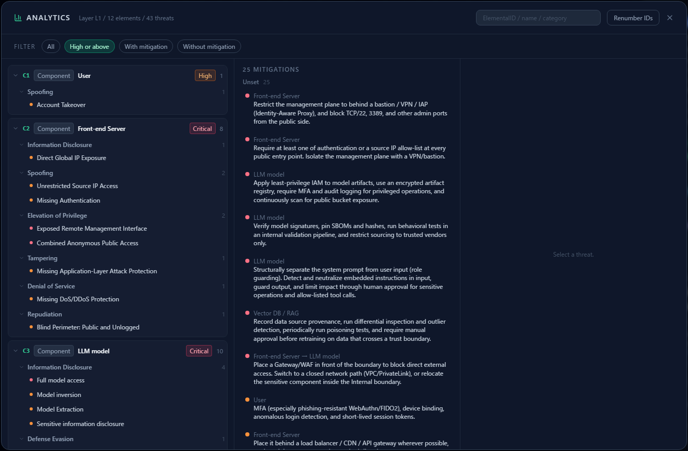
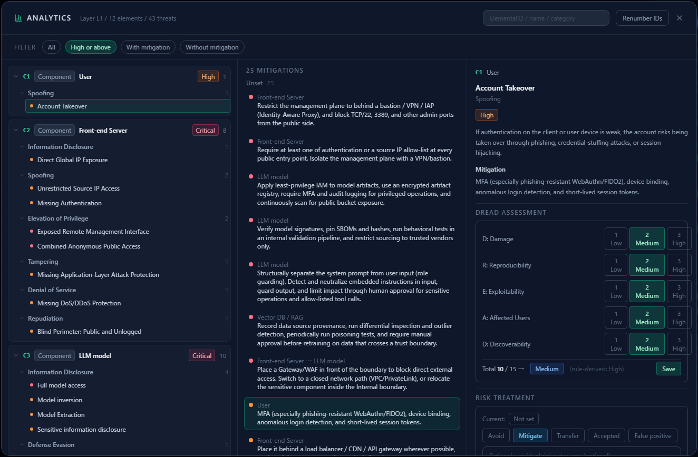
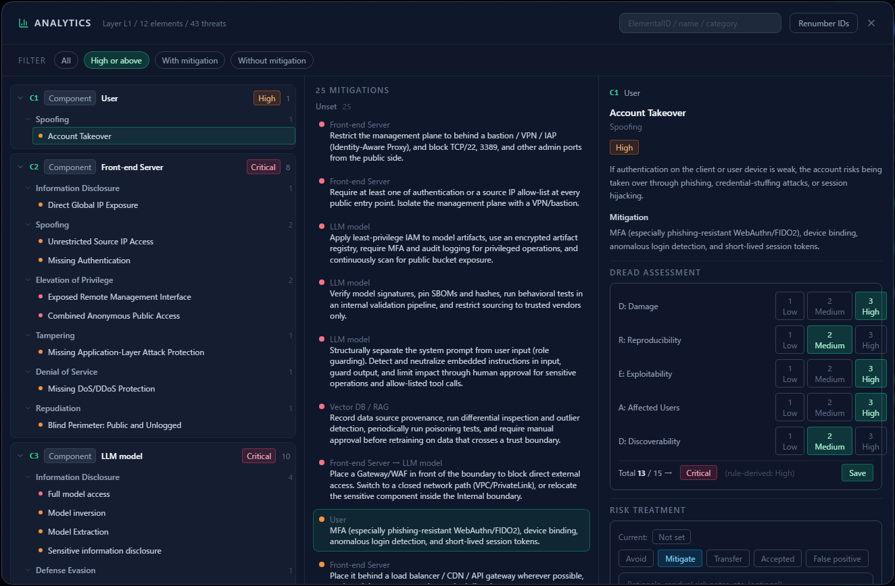
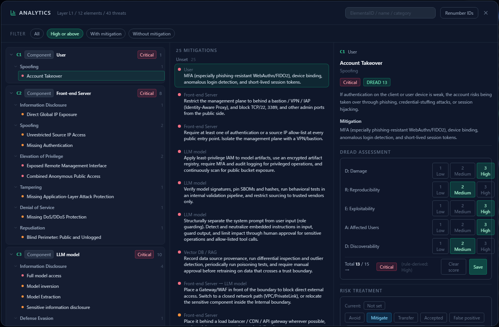
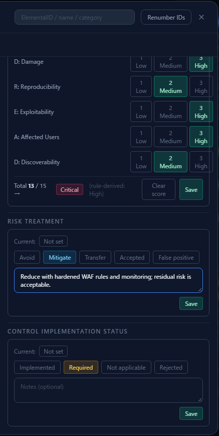
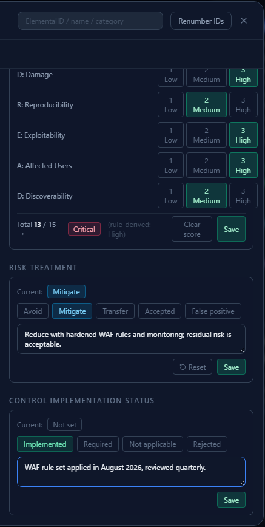
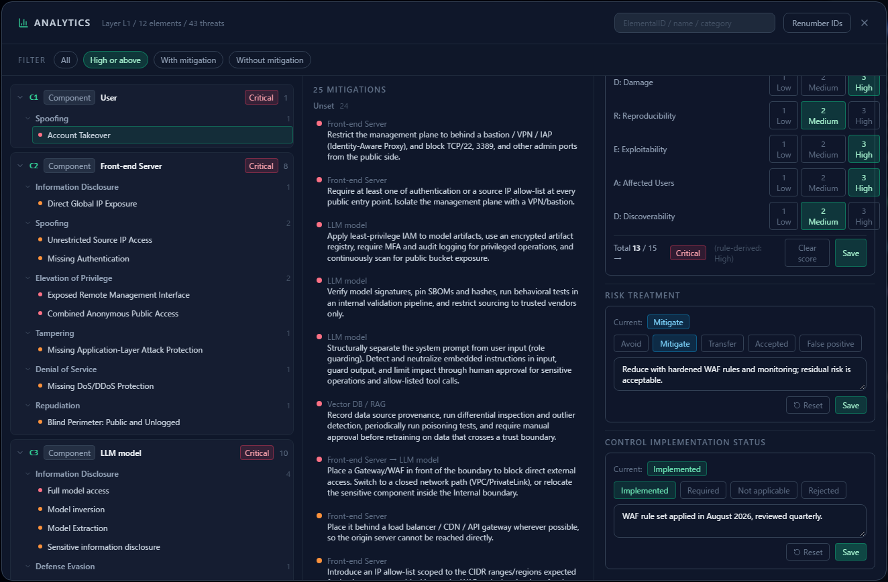
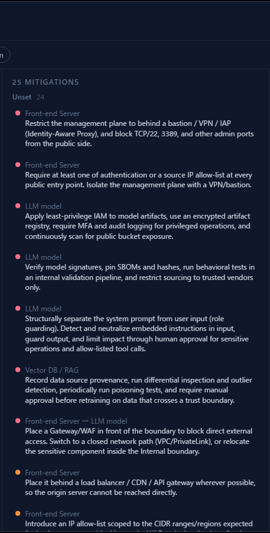

# Assessing Risk in Analytics

**English** | [日本語](analytics-assessment.ja.md)

Once the threats are listed, the work is **assessing and recording them one by one**. Analytics puts
**all three records — DREAD score, risk treatment and control implementation status — on one
screen**.

This chapter follows [Reading the Threat Panel](reading-threats.md) and uses the **AI chatbot
diagram** built in [Your First Threat Model](first-threat-model.md) (User → Front-end Server → LLM →
RAG → Data store, 43 threats).

---

## 1. Why do it here

You can record everything from the threat cards, but once there are a few dozen threats that means
**scrolling the right pane forever**. Analytics is built for the loop:

- a tree grouped by component makes it **easy to pick what to work on**
- filters let you **start with what matters most**
- the three record fields sit **stacked in one pane** for the selected threat

The data is the same either way — whichever surface you type into, it is the same record.

---

## 2. The layout

Open **Analytics** (the bar-chart icon) in the top toolbar.

The header reads "Layer L1 / 12 elements / 43 threats". **The current depth layer is the scope.**

| Pane | What it holds |
|---|---|
| Left | The threat tree by component, with the **highest severity** and count per element |
| Middle | The list of mitigations, including **how many have no implementation status** |
| Right | The selected threat, and the **three record fields** |

---

## 3. Step 1 — narrow the scope

Trying to work through 43 threats in order is how this stops getting done. Filter first.

| Filter | When to use it |
|---|---|
| **High or above** | The first pass. Clear the serious ones |
| Without mitigation | Threats with no suggested control — the ones you have to think about |
| With mitigation | Turning existing suggestions into recorded implementation status |
| All | The final sweep |

The search box at the top right matches **ElementalID (C2 and so on), name and category**, so you can
decide to "finish everything around the Front-end Server today".

---

## 4. Step 2 — select one threat

Click a threat in the left tree and its detail appears on the right.

The tree is three levels: **component → category → threat**. The badge on a component row
(Critical / High …) is **the highest severity** on that element, so **working down from the reddest
badge** is the natural order.

---

## 5. Step 3 — score DREAD

In **DREAD Assessment** on the right, pick **1 (Low) / 2 (Medium) / 3 (High)** for each of the five
factors.

Every button carries written criteria. **Apply the criteria rather than your gut** — that is what
keeps two assessors close together.

| Factor | 1 (Low) | 2 (Medium) | 3 (High) |
|---|---|---|---|
| **D** Damage | Minor disruption or limited information exposure | Partial data leakage or tampering | Full data breach or complete system outage |
| **R** Reproducibility | Rarely reproducible under specific conditions | Reproducible when conditions align | Always reproducible |
| **E** Exploitability | Requires advanced skill or insider knowledge | Tools or procedures partially public | Easily exploitable with off-the-shelf tools |
| **A** Affected Users | A small subset of users | A significant number of users or tenants | All users, including administrators |
| **D** Discoverability | Hard to discover without insider knowledge | Discoverable with careful investigation | Easily discoverable from outside |

The total (5–15) is computed for you and mapped to a rank:

| Total | Rank |
|---|---|
| 13 – 15 | Critical |
| 11 – 12 | High |
| 8 – 10 | Medium |
| 5 – 7 | Low |

**Nothing is recorded until you press Save.** Selecting the buttons alone does not commit it. (If you
get it wrong, "Clear score" removes it.)

Saving **overrides the rule-derived severity with the DREAD rank**. Above, "Account Takeover" — High
by the rule — scores 13 and becomes **Critical**, with the original value kept in parentheses. The
component badge in the left tree follows.

> The override is deliberate: **your assessment in your context beats a general-purpose severity**,
> and the original value is never lost.

---

## 6. Step 4 — record the risk treatment

Below DREAD is **Risk Treatment**: pick avoid / mitigate / transfer / accept / false positive and
write **why**, then save.

The note is optional, but **write it anyway**. Six months later, without a record of why "mitigate"
was enough, you will hold the same discussion from scratch. One line about the residual risk is
plenty.

Only "accept" and "false positive" suppress a threat from the list (see
[Reading the Threat Panel](reading-threats.md) §5).

---

## 7. Step 5 — record the control implementation status

Further down, **Control Implementation Status** records the fact about the control itself.

| Status | Meaning | Note |
|---|---|---|
| Implemented | The control is in place | **Required** |
| Required | Decided to do it; not yet in place | Optional |
| Not applicable | Not needed in this deployment | **Required** |
| Rejected | Decided not to implement | **Required** |

"Implemented", "Not applicable" and "Rejected" **will not save with an empty note**. Recording what
was done and when ("WAF rule set applied in August 2026, reviewed quarterly") makes the entry usable
in an audit or a handover.

With all three recorded, that threat is done.

---

## 8. Track progress

The heading in the middle pane is your progress meter.

- **N mitigations** — how many of the filtered threats carry a suggested control
- **Unset M** — how many of those have no implementation status yet

Mitigations are grouped **unset → required → implemented → not applicable → rejected**, sorted by
severity within each group. **Driving "unset" toward zero** is the goal of this work.

---

## 9. Running one pass

The order that works in practice:

1. Filter to **High or above**
2. Take the first threat in the tree
3. Score **DREAD** and save — now you know whether it really is High or above
4. Record the **risk treatment** with a reason
5. Record the **control implementation status** (if implemented, what and when)
6. Check that "unset" in the middle pane went down, and move on
7. When High or above is exhausted, switch to "All" for a second pass

**Do not try to do it all at once.** One pass over High or above, then pick up the rest later,
finishes sooner than attempting everything in one sitting.

---

## 10. These records feed later steps

What you type here is not just a memo.

- **DREAD Exploitability** drives the **difficulty** values in
  [Attack Path Analysis](attack-paths.md). Leave it unscored and route costs fall back to
  provisional values inferred from severity.
- **Control implementation status** is what decides **coverage** (mitigated / partially mitigated)
  there. Only elements where every threat is "Implemented" or "Not applicable" count as covered.
- **Risk treatment and its note** appear directly in the "status" and "comments" columns of the
  [export](reading-threats.md#8-exporting).

The more you assess, the more the later analysis and the deliverables are worth.

---

## Where to go next

- Deciding where to put controls — [Attack Path Analysis](attack-paths.md)
- Lining threats up against standards — [The Compliance Map](compliance-map.md)
- The threat card side — [Reading the Threat Panel](reading-threats.md)
