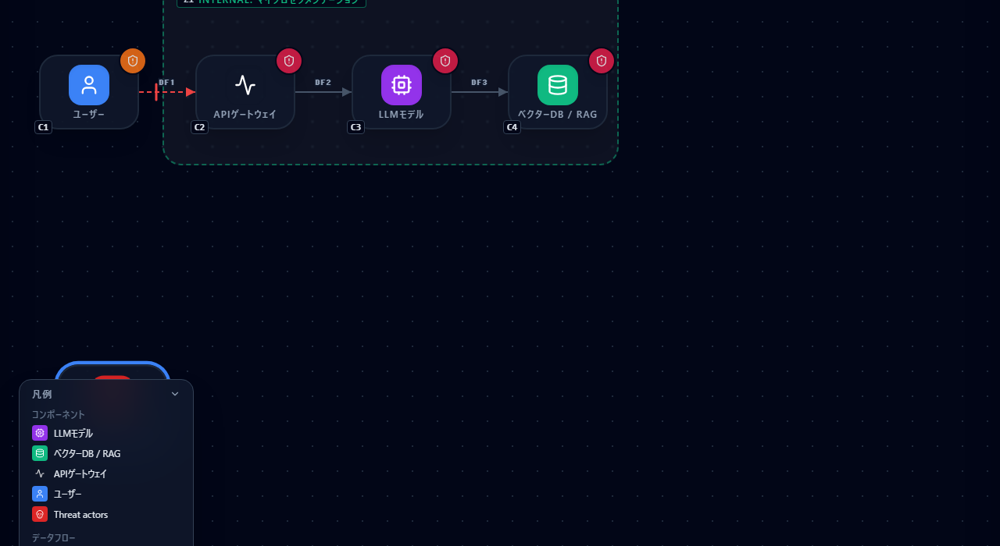
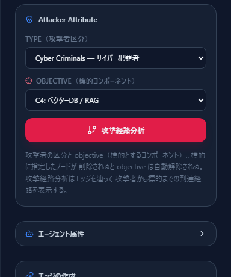
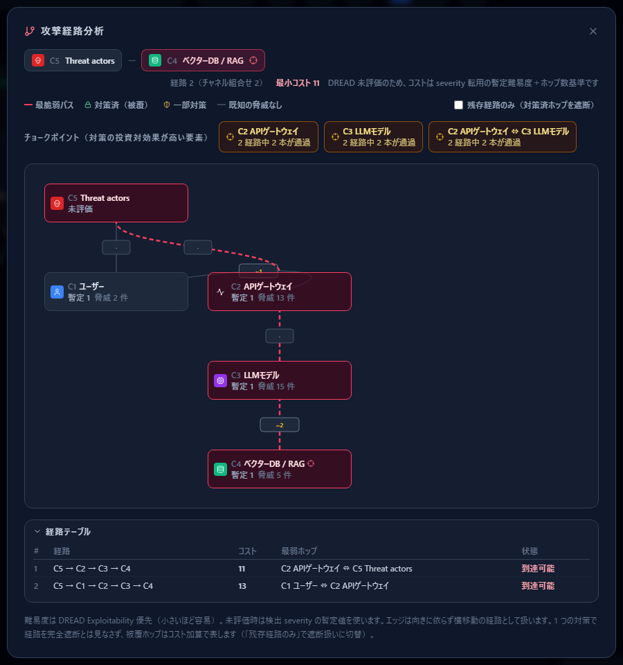
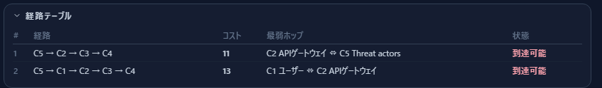
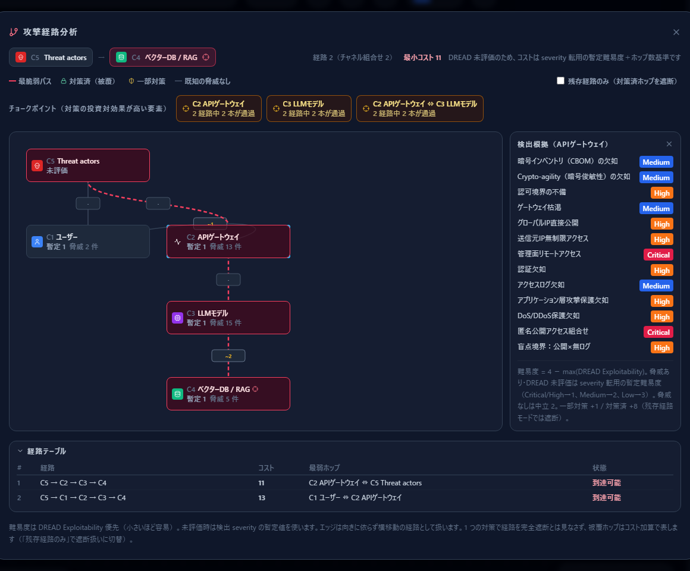

# 攻撃経路分析

[English](attack-paths.md) | **日本語**

脅威の一覧は「何が起こり得るか」を教えてくれますが、**「どこに対策を置けば一番効くか」**
には答えてくれません。攻撃経路分析はそこを埋める機能です。

このページは [脅威パネルの読み方](reading-threats.ja.md) の続きです。
記録した対策実装状況がそのまま分析に効いてくるので、先にそちらを読むことをお勧めします。

---

## 1. 何が分かるのか

攻撃者コンポーネントから標的コンポーネントまで、**図の接続を辿って到達できる経路**を列挙し、
次の 3 つを出します。

1. **経路ごとの到達しやすさ**（コスト） — 攻撃者にとって最も楽な経路はどれか
2. **チョークポイント** — 1 つ対策を置くと、最も多くの経路に効く要素はどこか
3. **各ホップの根拠** — そのホップを「通れる」と判断した理由（発火している脅威）

**経路を数え上げること自体が目的ではありません。**
狙いは、限られた対策の予算をどこに置くかを決めることです。

---

## 2. 準備 — 攻撃者と標的を図に置く

分析を始めるには、図の側に 2 つの情報が必要です。

### 2.1 攻撃者コンポーネントを置き、侵入点へつなぐ

左サイドバーの `Attacker` カテゴリから攻撃者（Threat actors / Insider Threats /
Agentic Attacker）を配置し、**攻撃者が最初に触れるコンポーネント**へ接続します。

侵入点は 1 つとは限りません。上の例では、攻撃者からユーザー（フィッシング等）と
API ゲートウェイ（公開面からの直接攻撃）の 2 本を引いています。
**侵入点を複数引くほど、チョークポイント分析の意味が出てきます。**

### 2.2 TYPE と OBJECTIVE を設定する

攻撃者を選択すると、右ペインに **Attacker Attribute** が出ます。

- **TYPE（攻撃者区分）** — サイバー犯罪者・国家支援型・内部者など
- **OBJECTIVE（標的コンポーネント）** — 攻撃者が最終的に狙うもの

**OBJECTIVE を設定するまで「攻撃経路分析」ボタンは押せません。**
「誰が」「何を狙うか」が決まらなければ経路は引けないからです。

標的に指定したノードを削除すると、OBJECTIVE は自動的に解除されます。

---

## 3. 画面の読み方

「攻撃経路分析」を押すと、分析結果が開きます。

### ヘッダ

- **経路 2（チャネル組合せ 2）** — 到達経路は 2 本。
  括弧内は並行するデータフローの組合せ数で、**参考値**です。
  同じノード列を通る経路は、通信路が何本あっても **1 経路**として数えます。
- **最小コスト 11** — 最も楽な経路のコスト。小さいほど攻撃者にとって容易です。
- **DREAD 未評価のため…** — DREAD を 1 件も付けていないときに出る注記（後述）。

### グラフ

**上が攻撃者、下が標的**です。コンポーネントは何本の経路に現れても **1 枚のカード**で描かれ、
赤い破線が**最も楽な経路（最脆弱パス）**を示します。

各カードには、その要素の**難易度**と**発火している脅威の件数**が出ます。

| 表示 | 意味 |
|---|---|
| 難易度 n | DREAD の Exploitability から算出した値（小さいほど通りやすい） |
| 暫定 n | DREAD 未評価のため、severity から仮に置いた値 |
| 未評価 | 判断材料がない |

ノードの間にある小さなチップは**論理ホップ**です。同じ 2 点を結ぶ並行チャネルが複数ある場合は
`×2` のようにまとめて表示されます。**攻撃者は最も通りやすいチャネルを選べる**ため、
片方だけ対策してもホップは塞がらない、という考え方です。

---

## 4. チョークポイント

この機能の主価値です。**全経路のうち何本がその要素を通るか**を数え、
上位 3 件を表示します（2 本以上通過する要素のみ）。

上の例では、API ゲートウェイ・LLM モデル・その間のホップがいずれも
「2 経路中 2 本が通過」です。つまり**ここに対策を置けば、両方の経路に同時に効く**ことが分かります。

侵入点ごとに個別の対策を考える前に、**全経路が必ず通る場所**を押さえる——
これが投資対効果の高い順序です。

なお攻撃者ノードと標的ノード自身は、対策対象として自明なので候補から除外されます。

---

## 5. 経路テーブル

グラフの下には、経路の一覧が出ます。

| 列 | 意味 |
|---|---|
| 経路 | 通過するコンポーネントの並び |
| コスト | 到達しにくさの合計（小さいほど攻撃者に有利） |
| 最弱ホップ | その経路の中で最も通りやすい箇所＝**最初に手を打つ候補** |
| 状態 | 到達可能／遮断済み |

コストが小さい行から順に見てください。上の例では
`C5 → C2 → C3 → C4`（コスト 11）が最も楽な経路で、
ユーザーを経由する経路（コスト 13）より攻撃者にとって好ましいと読めます。

---

## 6. 根拠を確認する

グラフ上のカードやホップをクリックすると、**そこで発火している脅威の一覧**が出ます。

「このホップは通れる」という判断が、**どの脅威に支えられているか**をここで確認できます。
脅威パネルの「検出根拠」と同じ考え方で、数値だけを信じなくて済むようにしてあります。

脅威が 1 件も無い要素は「既知の脅威なし」としてグレーで表示されます。
これは**安全という意味ではありません**。このツールは横移動を最悪ケースで仮定するため、
根拠がなくても通行可能として扱っています。両者を見た目で区別しているだけです。

---

## 7. 難易度とコストの決まり方

数値の出どころを知っておくと、結果を過信せずに済みます。

**要素ごとの難易度：**

| 条件 | 難易度 |
|---|---|
| DREAD 評価済み | `4 − max(Exploitability)` |
| 脅威はあるが DREAD 未評価 | severity から暫定値（Critical・High → 1、Medium → 2、Low → 3） |
| 脅威なし | 中立の 2 |

**経路コスト** は、通過するノードとチャネルの難易度の合計に、対策の被覆ペナルティを足したものです。

| 被覆状況 | 加算 |
|---|---|
| 一部対策 | +1 |
| 対策済 | +8（「残存経路のみ」モードでは遮断扱い） |

ここでいう**被覆は、前章で記録した「対策実装状況」から決まります**。
その要素で発火している脅威のうち、**「実装済み」または「適用外」**になっているものが
全部なら「対策済」、一部なら「一部対策」です。

> **DREAD を付けるほど精度が上がります。**
> 全要素が未評価のままだと、コストは実質「severity 転用の暫定値＋ホップ数」になります。
> その状態では画面に注記が出るので、数値を確定値として扱わないでください。

---

## 8. 「残存経路のみ」

右上のチェックボックスをオンにすると、**対策済（完全被覆）のホップを遮断として扱い**、
それでも残る経路だけを表示します。

- 通常モード： 対策はコスト加算。「1 つの対策で経路が完全に止まる」とは見なさない
- 残存経路モード： 対策済ホップを通れないものとして扱い、**対策後に残るリスク**を見る

日常的には通常モードで、対策の効果を確認したいときに残存経路モードへ切り替える、
という使い分けになります。

---

## 9. 前提と限界

この分析は次の仮定の上に立っています。**結論を出す前に確認してください。**

- **接続は向きを無視して辿ります。** データフローが片方向でも、横移動の経路としては
  双方向に通れるものとして扱います（最悪ケースの仮定）。
- **経路探索には上限があります。** 深さ 8 ホップ・50 経路を超えると一部が省略され、
  画面に省略の注記が出ます。
- **チョークポイントは単純な通過本数**です。最小カットのような厳密な最適解ではありません。
  図の規模に対して過剰な計算を避けた設計です。
- **脅威ライブラリが覆う範囲しか根拠になりません。** 「既知の脅威なし」は安全の証明ではありません。

---

## 次に読むもの

- 脅威の読み方・DREAD の付け方 — [脅威パネルの読み方](reading-threats.ja.md)
- 作図の手順 — [はじめての脅威モデル](first-threat-model.ja.md)
- 操作の詳細 — [はじめに — CyberRiskScape 入門](getting-started.ja.md)
