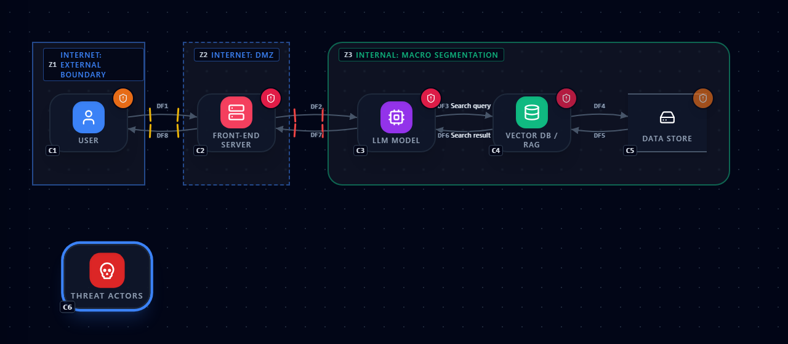
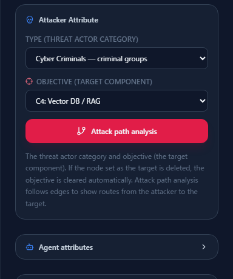
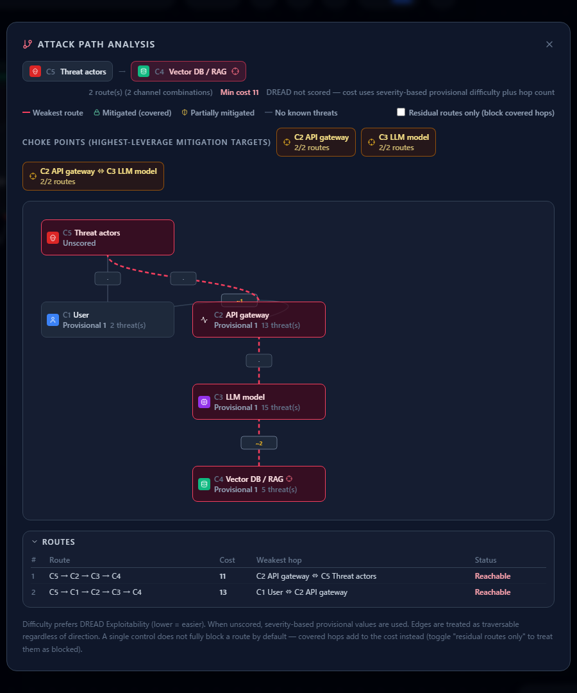
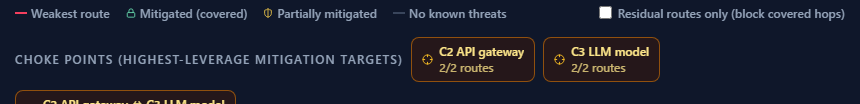
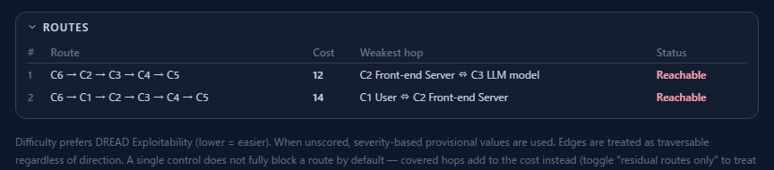
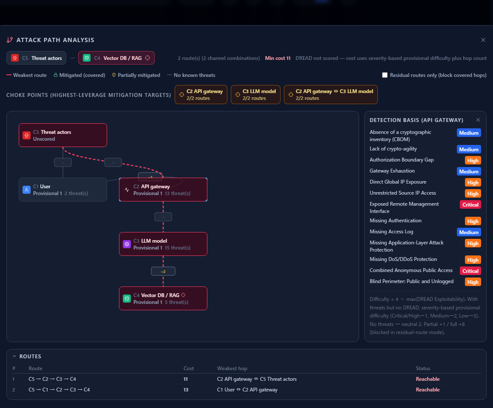

# Attack Path Analysis

**English** | [日本語](attack-paths.ja.md)

A list of threats tells you what could happen. It does not tell you **where a single control buys
you the most**. That is what attack path analysis is for.

This page follows on from [Assessing Risk in Analytics](analytics-assessment.md) — the risk scores
and control implementation status you record there feed directly into this analysis, so read that
first. The diagram is the AI chatbot built in [Your First Threat Model](first-threat-model.md).

---

## 1. What it tells you

It enumerates the routes from an attacker component to a target component **by following the
connections in your diagram**, and reports three things:

1. **How easy each route is** (its cost) — which route is the attacker's path of least resistance
2. **Choke points** — which element, if you put one control on it, covers the most routes
3. **The evidence for each hop** — the threats that make that hop passable

**Counting routes is not the point.** The point is deciding where to spend a limited mitigation
budget.

---

## 2. Setup — put an attacker and a target on the diagram

Two pieces of information have to exist on the canvas first.

### 2.1 Place an attacker and connect it to an entry point

From the `Attacker` category in the left sidebar, place an attacker (Threat actors, Insider Threats
or Agentic Attacker) and connect it to **whatever it touches first**.

There can be more than one entry point. In the example the attacker reaches both the user (phishing
and the like) and the Front-end Server (a direct attack on the public surface).
**The more entry points there are, the more the choke point analysis is worth.**

### 2.2 Set TYPE and OBJECTIVE

Selecting the attacker puts **Attacker Attribute** in the right pane.

- **TYPE** — cyber criminals, nation-state actors, insiders, and so on
- **OBJECTIVE** — the component the attacker is ultimately after

**The "Attack path analysis" button stays disabled until OBJECTIVE is set**, because there is no
route to draw until you have said who is coming and what they want.

Delete the component you named as the target and the objective is cleared automatically.

---

## 3. Reading the result

Press "Attack path analysis" and the analysis opens.

### The header

- **2 route(s) (24 channel combinations)** — two routes reach the target (the data store). The number
  in parentheses counts combinations of parallel data flows and is **informational only**: routes
  through the same sequence of components count as **one route**, however many channels connect them.
  The round-trip flows make 24 combinations here, but there are still two routes.
- **Min cost 12** — the cost of the easiest route. Lower means easier for the attacker.
- **Risk not scored…** — the note shown while no risk assessment exists (see below).

### The graph

**The attacker is at the top, the target at the bottom.** Each component is drawn as **a single
card** no matter how many routes pass through it, and the red dashed line marks the
**weakest route** — the cheapest one.

Every card shows the element's **difficulty** and **how many threats fired on it**.

| Label | Meaning |
|---|---|
| Difficulty n | Derived from the Exploitability score (lower = easier to pass) |
| Provisional n | No risk score, so a value inferred from severity |
| Unscored | Nothing to judge from |

The small chips between cards are **logical hops**. Where several parallel channels connect the same
two elements they collapse into one hop labelled `×2` — every hop shows `×2` here, because the
diagram carries both directions. The reasoning is that **the attacker picks whichever channel is
easiest**, so covering one of them does not close the hop.

---

## 4. Choke points

This is the feature's main value. It counts **how many of the routes pass through each element** and
shows the top three (only elements on two or more routes).

Here the Front-end Server, the LLM model and the Vector DB / RAG each carry "2/2 routes" — put a
control on any of them and **both routes are affected at once**. Hardening only the path through the
user would leave the direct attack on the public surface untouched.

Before designing a separate control per entry point, cover **what every route has to pass through**.
That is the order with the best return.

The attacker and the target themselves are excluded, since they are obvious by definition.

---

## 5. The route table

Below the graph is the list of routes.

| Column | Meaning |
|---|---|
| Route | The sequence of components traversed |
| Cost | Total difficulty of reaching the target (lower favors the attacker) |
| Weakest hop | The easiest step on that route — **the first candidate for a control** |
| Status | Reachable or blocked |

Work from the cheapest row down. Above, `C6 → C2 → C3 → C4 → C5` (cost 12) is the easiest route,
which the attacker would prefer over the one through the user (cost 14).

---

## 6. Checking the evidence

Click a card or a hop in the graph and you get **the threats that fired there**.

This is where you see **which threats support the claim that a hop is passable**. It follows the same
idea as "Why this fired" in the threat panel: you never have to take a number on faith.

An element with no threats at all is greyed out as "no known threats". **That does not mean it is
safe.** The tool assumes worst-case lateral movement, so it treats such an element as passable
anyway — the grey only distinguishes assumption from evidence.

---

## 7. How difficulty and cost are derived

Knowing where the numbers come from keeps you from over-trusting them.

**Difficulty per element:**

| Condition | Difficulty |
|---|---|
| Risk scored | `4 − max(Exploitability)` |
| Threats present but not scored | Provisional, from severity (Critical/High → 1, Medium → 2, Low → 3) |
| No threats | Neutral 2 |

**Route cost** is the sum of the difficulties of the components and channels traversed, plus a
penalty for how well the hop is covered.

| Coverage | Added |
|---|---|
| Partially mitigated | +1 |
| Mitigated (covered) | +8 (treated as blocked in "residual routes only" mode) |

**Coverage comes from the control implementation status you recorded** in
[Analytics](analytics-assessment.md). Of
the threats that fired on that element, if **all** are marked "Implemented" or "Not applicable" it
counts as covered; if only some are, it is partially covered.

> **The more risk you score, the more accurate this gets.**
> With nothing scored, cost is effectively "provisional severity values plus hop count". The screen
> says so when that is the case — do not treat the numbers as settled.

---

## 8. "Residual routes only"

Tick the checkbox at the top right and **fully covered hops are treated as blocked**, leaving only
the routes that survive.

- Normal mode: controls add cost. A single control is not assumed to stop a route outright.
- Residual mode: covered hops are impassable, showing **the risk that remains after mitigation**.

Work in normal mode day to day, and switch to residual mode when you want to see what your controls
actually bought you.

---

## 9. Assumptions and limits

The analysis rests on the following. **Check them before drawing conclusions.**

- **Connections are traversed without regard to direction.** Even a one-way data flow is treated as
  passable both ways for lateral movement — a worst-case assumption.
- **Enumeration is capped.** Beyond 8 hops deep or 50 routes, some are omitted and the screen says
  so.
- **Choke points are a simple hit count**, not an exact minimum cut. That is deliberate: an exact
  solution would be overkill at diagram scale.
- **Only what the threat library covers can serve as evidence.** "No known threats" is not proof of
  safety.

---

## Where to go next

- How to assess and record — [Assessing Risk in Analytics](analytics-assessment.md)
- Reading the threat cards — [Reading the Threat Panel](reading-threats.md)
- Lining threats up against standards — [The Compliance Map](compliance-map.md)
- How to draw the diagram — [Your First Threat Model](first-threat-model.md)
- The operations in detail — [Getting Started with CyberRiskScape](getting-started.md)
