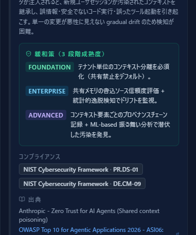
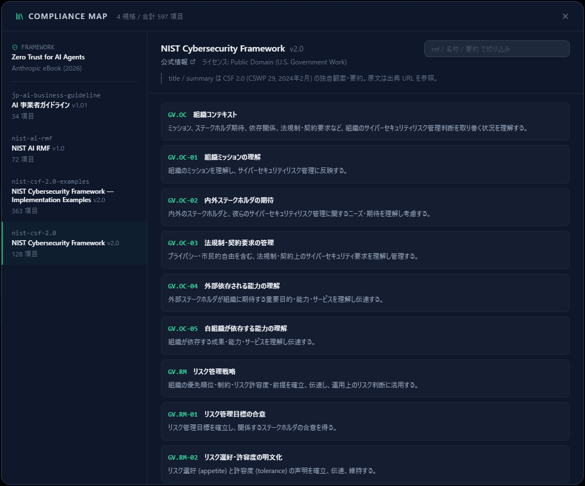
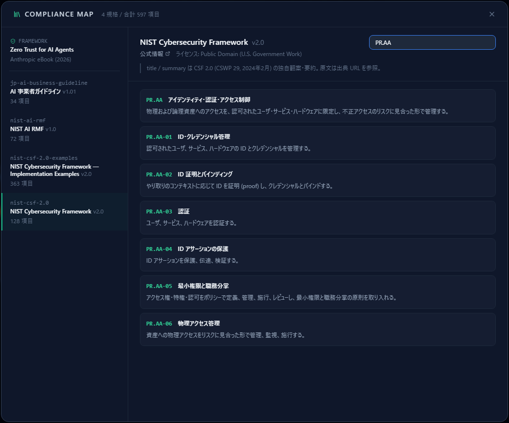
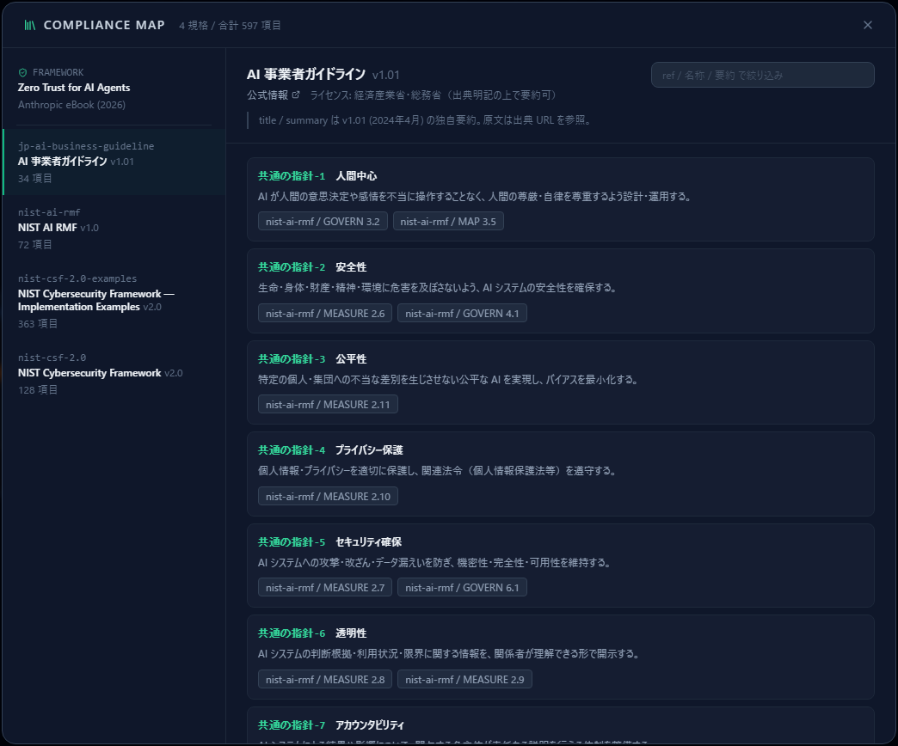
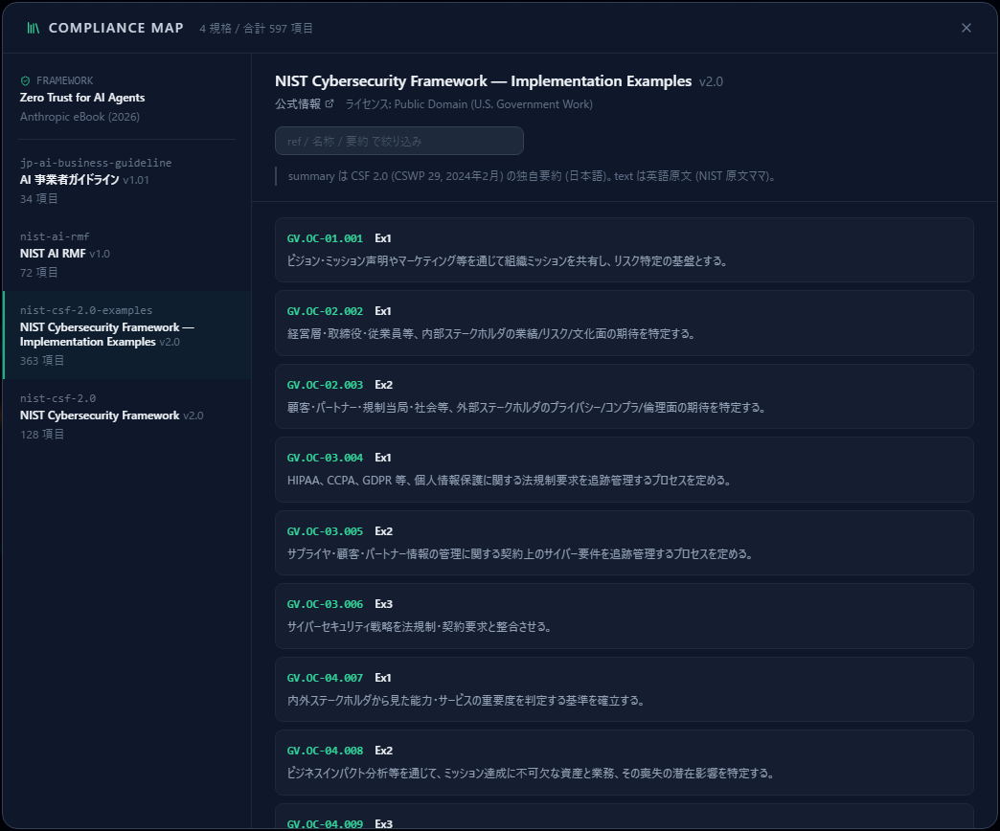
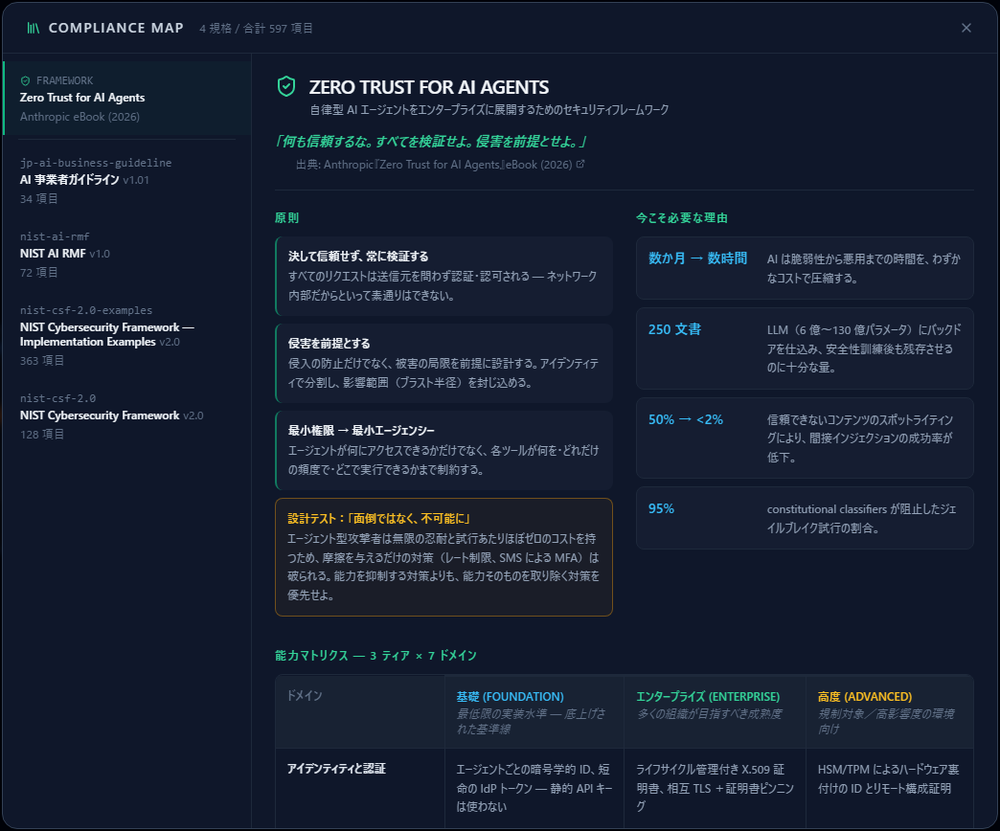

# コンプライアンスマップ

[English](compliance-map.md) | **日本語**

検出された脅威は、NIST CSF 2.0・NIST AI RMF・AI 事業者ガイドラインの項目に紐づいています。
コンプライアンスマップは、その**対応関係を両方向から確認するためのビューア**です。

先に [脅威パネルの読み方](reading-threats.ja.md) を読んでおくと、話がつながります。

> **最初にはっきりさせておきます。これは適合状況のダッシュボードではありません。**
> 「この規格に何 % 適合しているか」は出ませんし、出すべきでもありません。
> ここで分かるのは「**この脅威はどの項目に関係するか**」「**この項目はどういう内容か**」の
> 2 つだけです。適合の判断は、組織の文脈を知る人が行うものです。

---

## 1. 入口は 2 つある

### 脅威の側から引く

脅威カードの中ほどに **コンプライアンス** 欄があります。
その脅威に対応する規格項目がチップで並びます。

「この脅威に対策を打つと、どの要求事項に効くのか」がその場で分かります。
レビューや稟議で「なぜこの対策が必要か」を説明するときの材料になります。

### 規格の側から引く

上部ツールバーの **コンプライアンスマップ**（本棚のアイコン）を開くと、
収録されている規格を項目単位で読めます。

---

## 2. 収録されている規格

現在 **4 規格・合計 597 項目**を収録しています。

| 規格 | 版 | 項目数 | ライセンス |
|---|---|---:|---|
| AI 事業者ガイドライン（経産省・総務省） | 1.01 | 34 | 出典明記の上で要約可 |
| NIST AI RMF | 1.0 | 72 | Public Domain（米国政府著作物） |
| NIST Cybersecurity Framework | 2.0 | 128 | Public Domain（米国政府著作物） |
| NIST CSF — Implementation Examples | 2.0 | 363 | Public Domain（米国政府著作物） |

加えて、規格ではありませんが **Zero Trust for AI Agents**（Anthropic eBook の要約）が
一覧の先頭に固定表示されます（後述）。

---

## 3. 規格ビューの読み方

左で規格を選ぶと、右に項目が並びます。

各項目は **ref（項目 ID）・名称・要約**の 3 つで構成されます。
`GV.OC-01` のような ref は、脅威カードのチップに出ている記号と同じものです。

見出しの下には**公式情報へのリンク**と**ライセンス**、そして注記があります。

> **要約は原文ではありません。**
> 表示されている title / summary は、このプロジェクトによる独自の翻案・要約です。
> 判断の根拠にするときは、必ず公式情報のリンクから原文を確認してください。
> 各規格ビューの注記にも同じことが書かれています。

右上の入力欄で **ref・名称・要約**を横断して絞り込めます。
`PR.AA` のように ref の先頭を入れると、そのカテゴリだけが残ります。

---

## 4. クロスウォーク — 規格をまたいだ対応

項目によっては、**他の規格の対応する項目**がチップで表示されます。

上は AI 事業者ガイドラインの例で、「共通の指針-5 セキュリティ確保」が
NIST AI RMF の MEASURE 2.7 / GOVERN 6.1 に対応することを示しています。

国内のガイドラインで議論しながら、**同じ論点が国際的な枠組みではどう表現されているか**を
その場で確認できます。逆に、NIST ベースで作った対策表を国内ガイドラインの言葉に
置き換えるときにも使えます。

---

## 5. Implementation Examples

NIST CSF には、各サブカテゴリに対する**実装例**が大量に用意されています（363 項目）。
これらは独立した規格として選べます。

「PR.AA-01 を満たすとは、具体的に何をすることか」が分からないときの参照先です。
要約は日本語ですが、原文（英語）も併せて保持しています。

---

## 6. Zero Trust for AI Agents

一覧の先頭にある **Zero Trust for AI Agents** は規格の項目一覧ではなく、
Anthropic の同名 eBook（2026）を 1 画面に要約した参照ページです。

- **3 つの原則** — 決して信頼せず常に検証する／侵害を前提とする／最小権限から最小エージェンシーへ
- **今こそ必要な理由** — 攻撃までの時間短縮、バックドア注入に必要な文書数、
  間接プロンプトインジェクションの成功率など、数字ベースの論拠
- **能力マトリクス** — 3 ティア × 7 ドメイン。脅威カードの
  FOUNDATION / ENTERPRISE / ADVANCED の段階と同じ考え方です

AI エージェントを扱う設計で、**どの成熟度を目指すか**を決めるときの物差しになります。

---

## 7. 使う上での注意

- **すべての脅威に対応項目があるわけではありません。** 現在、脅威ルール 126 件のうち
  103 件がコンプライアンス項目に紐づいています。紐づいていない脅威は、
  規格の枠組みの外にある論点だと考えてください。
- **エクスポートには含まれません。** CSV / JSON / Markdown の出力に、
  コンプライアンス項目の列はありません（2026-09 時点）。規格対応を成果物に残したい場合は、
  この画面を見ながら別途まとめる必要があります。
- **このビューは読み取り専用です。** 項目を追加したり、対応を編集したりはできません。
- **適合の宣言には使えません。** 冒頭のとおり、対応関係を示すだけの機能です。

---

## 次に読むもの

- 脅威の読み方・記録 — [脅威パネルの読み方](reading-threats.ja.md)
- 評価して記録する手順 — [Analytics でリスクを評価する](analytics-assessment.ja.md)
- 対策の置き場所を決める — [攻撃経路分析](attack-paths.ja.md)
- なぜ設計段階で脅威を考えるのか — [Secure by Design 入門](secure-by-design.ja.md)
