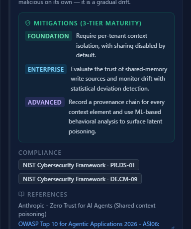
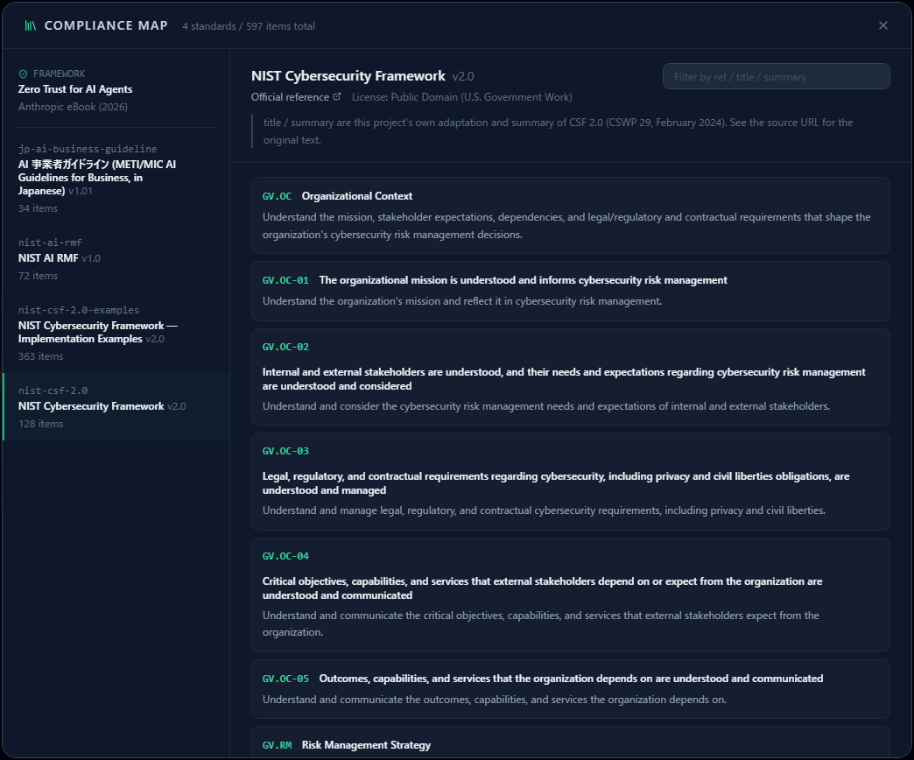
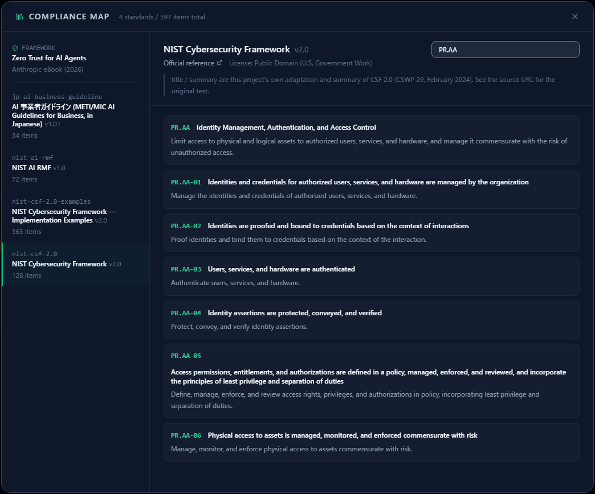
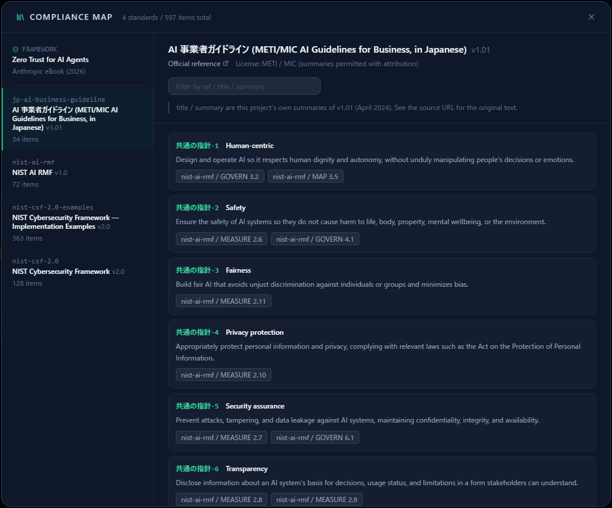
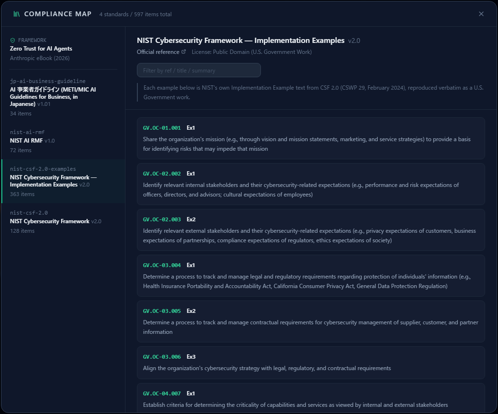
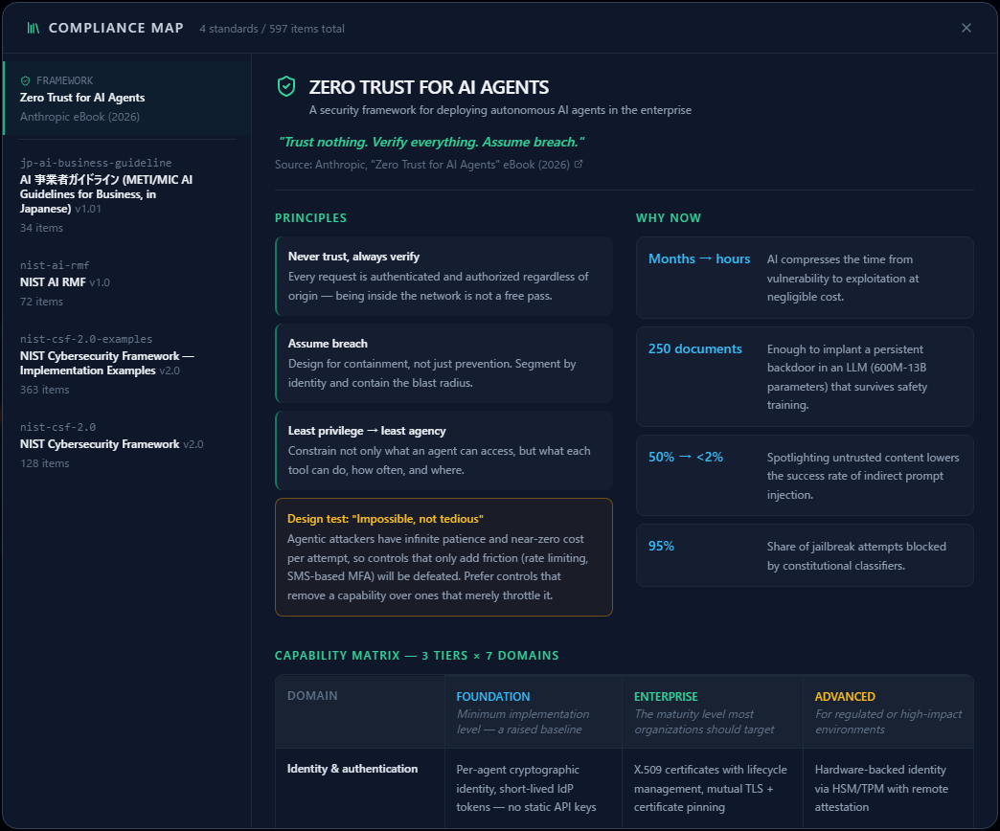

# The Compliance Map

**English** | [日本語](compliance-map.ja.md)

Detected threats are mapped to items in NIST CSF 2.0, the NIST AI RMF and Japan's AI Business
Operator Guidelines. The compliance map is **a viewer for that mapping, in both directions**.

Reading [Reading the Threat Panel](reading-threats.md) first will make this easier to follow.

> **One thing to be clear about up front: this is not a compliance dashboard.**
> It does not tell you "you are 64% compliant with this standard", and it should not.
> It answers two questions: **which items does this threat relate to**, and
> **what does this item actually say**. Judging compliance is for people who know the
> organizational context.

---

## 1. Two ways in

### From the threat

Every threat card has a **Compliance** section in the middle, listing the standard items that threat
maps to.

You can see at a glance which requirements a given control would satisfy — useful material when you
have to explain in a review why the work is needed.

### From the standard

Open **Compliance map** (the library icon) in the top toolbar to browse the bundled standards item
by item.

---

## 2. What is bundled

**4 standards, 597 items** in total.

| Standard | Version | Items | License |
|---|---|---:|---|
| AI Business Operator Guidelines (METI / MIC, Japan) | 1.01 | 34 | Summaries permitted with attribution |
| NIST AI RMF | 1.0 | 72 | Public Domain (US Government work) |
| NIST Cybersecurity Framework | 2.0 | 128 | Public Domain (US Government work) |
| NIST CSF — Implementation Examples | 2.0 | 363 | Public Domain (US Government work) |

Pinned above them — not a standard — is **Zero Trust for AI Agents**, a summary of the Anthropic
eBook (see below).

---

## 3. Reading a standard

Pick a standard on the left and its items appear on the right.

Each item is a **ref (its ID), a title and a summary**. A ref such as `GV.OC-01` is the same
identifier you see on the chips on a threat card.

Under the heading are a **link to the official source**, the **license**, and a disclaimer.

> **The summaries are not the original text.**
> The titles and summaries shown are this project's own adaptations. When you need them for a
> decision, follow the official link and read the source. Each standard's disclaimer says the same.

The box at the top right filters across **ref, title and summary**. Typing a ref prefix such as
`PR.AA` narrows it to that category.

---

## 4. Crosswalks between standards

Some items carry chips pointing to **the corresponding item in another standard**.

Above, "Common guideline 5 — security" in the Japanese guidelines corresponds to MEASURE 2.7 and
GOVERN 6.1 in the NIST AI RMF.

That lets you discuss in the vocabulary of a domestic guideline while checking **how the same point
is expressed in an international framework** — or translate a NIST-based control list into the
language of a local guideline.

---

## 5. Implementation Examples

NIST CSF ships a large set of **implementation examples** for its subcategories (363 items here),
selectable as a standard of their own.

This is where to look when "satisfy PR.AA-01" needs to become something concrete. The summaries are
adaptations, and the original English text is kept alongside them.

---

## 6. Zero Trust for AI Agents

The entry at the top of the list is not a list of standard items. It is a one-page summary of
Anthropic's *Zero Trust for AI Agents* eBook (2026).

- **Three principles** — never trust, always verify; assume breach; least privilege → least agency
- **Why now** — the numbers behind the argument: time from vulnerability to exploitation, how few
  documents it takes to implant a backdoor, the success rate of indirect prompt injection
- **Capability matrix** — 3 tiers × 7 domains, the same tiering as FOUNDATION / ENTERPRISE /
  ADVANCED on the threat cards

It gives you a yardstick for **which maturity level to aim at** when designing around AI agents.

---

## 7. Things to keep in mind

- **Not every threat has a mapped item.** 103 of the 126 threat rules currently carry compliance
  references. A threat without one is a point that sits outside those frameworks.
- **Exports do not include it.** There is no compliance column in the CSV, JSON or Markdown output
  (as of September 2026). To carry the mapping into a deliverable, you have to compile it separately
  from this screen.
- **The view is read-only.** You cannot add items or edit the mapping.
- **It cannot support a claim of compliance.** As said at the top, it shows correspondence and
  nothing more.

---

## Where to go next

- Reading and recording threats — [Reading the Threat Panel](reading-threats.md)
- How to assess and record — [Assessing Risk in Analytics](analytics-assessment.md)
- Deciding where to put controls — [Attack Path Analysis](attack-paths.md)
- Why threats belong in the design stage — [An Introduction to Secure by Design](secure-by-design.md)
