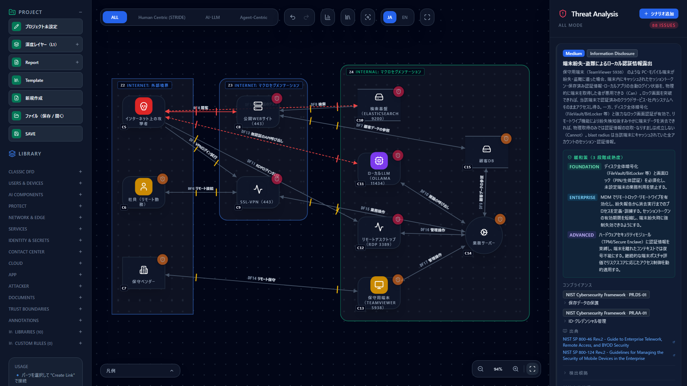
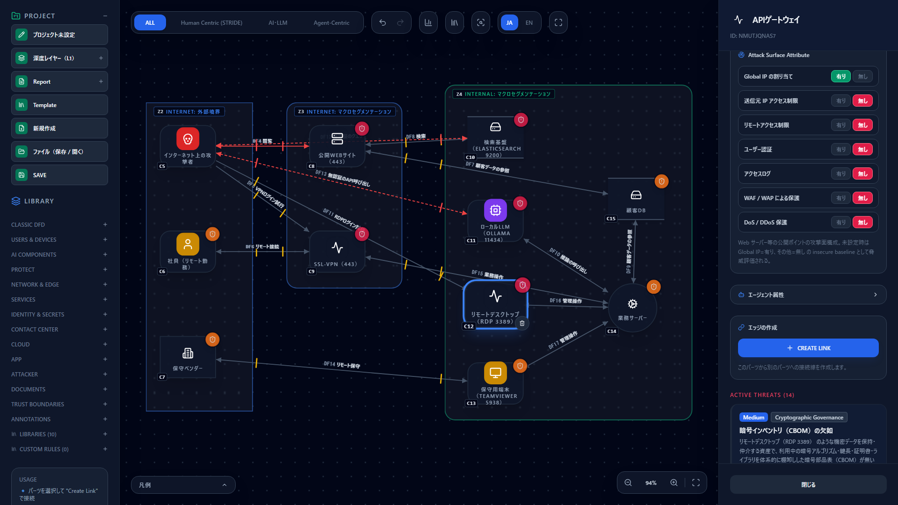
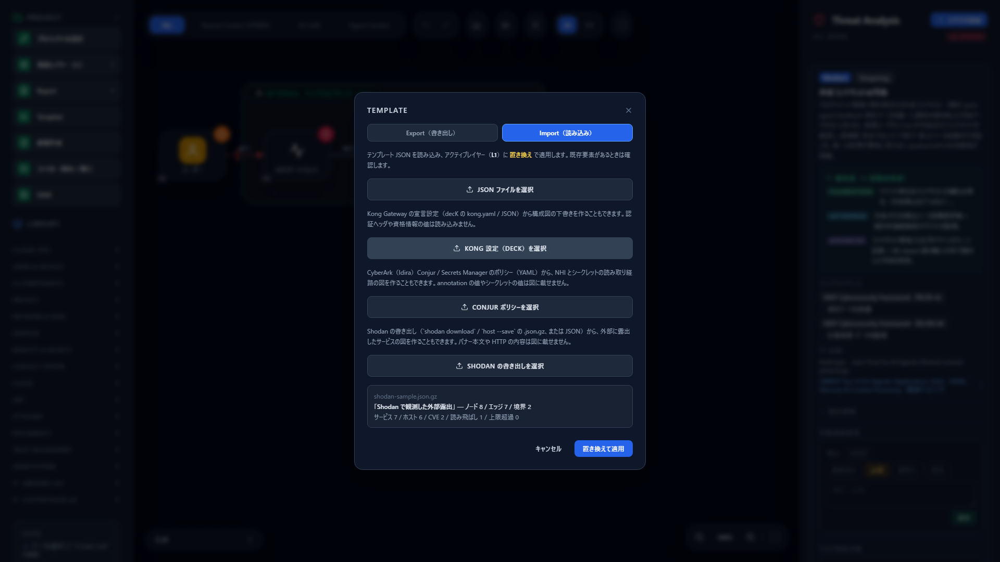
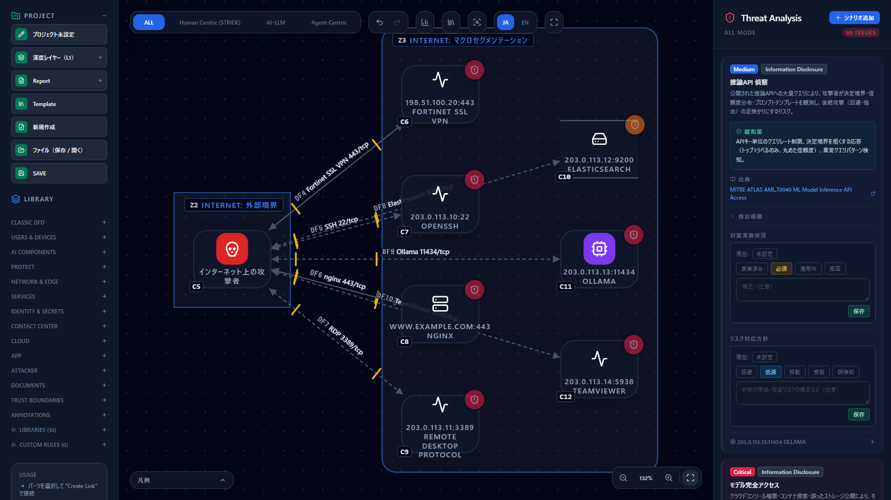
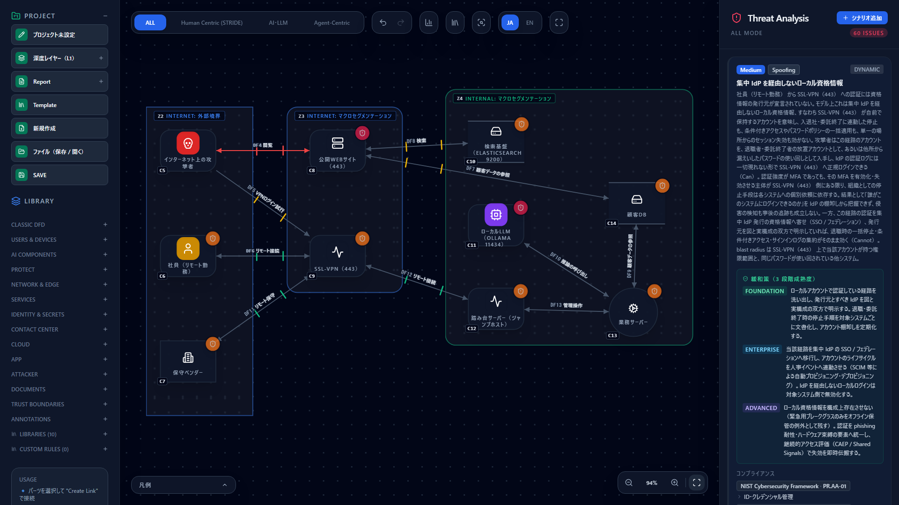
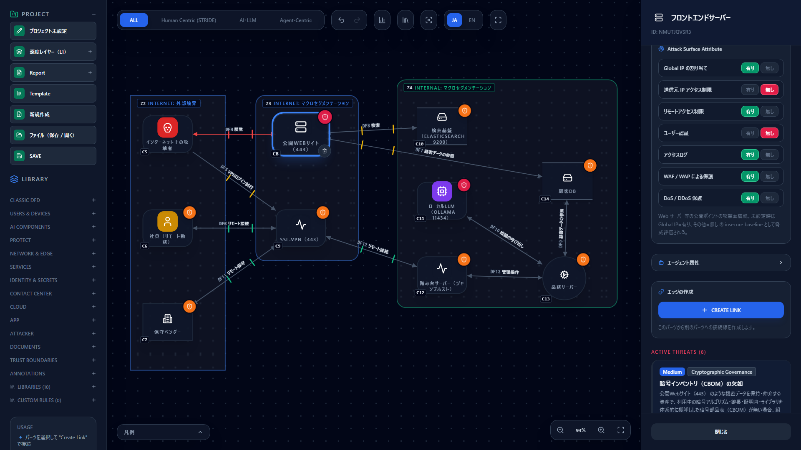

# Reducing Internet Exposure — Running CISA's Four Steps with Shodan, Censys and CyberRiskScape

**English** | [日本語](exposure-reduction.ja.md)

> This page applies the process in the US CISA (Cybersecurity and Infrastructure Security Agency)
> "Internet Exposure Reduction Guidance" (revised August 2026) to work in CyberRiskScape.
> It is not created, certified, or endorsed by CISA. The guidance is summarized here, not reproduced verbatim.
> Shodan and Censys are trademarks of their respective owners. Service details and search syntax follow the information
> at the time of writing (October 2026).

---

## 1. What this page covers and prerequisites

- CISA's **four steps for reducing Internet exposure** (identify → decide whether it is needed → reduce the risk → evaluate regularly)
- How to **draw the exposures you find with Shodan and Censys on a diagram and evaluate them as threats**
- How to **draft the diagram automatically from a Shodan export (.json.gz)**
- How to show the effect of "removing exposure you do not need" and "protecting exposure you do need" as the
  **difference in threats before and after**
- How to use the CLI in regular evaluation to **detect exposure you thought you had removed coming back**

**About the CISA guidance**

Devices and services reachable from the Internet are the entry points attackers look for with search services such as
Shodan, then break into by exploiting misconfigurations, default passwords and outdated software. CISA's guidance sets
out steps for reducing what an organization has put on the Internet without intending to ([source 1](#references)). In
July 2026, PLCs connected directly to the Internet through cellular modems were attacked at more than 100 water and
wastewater utilities.

**Scope of this page: IT exposure.** CISA's guidance mainly targets OT / ICS (PLC, HMI, SCADA, RTU), but the
four-step approach applies directly to IT exposure as well. This page uses the exposure of web, VPN, remote desktop,
databases and **AI infrastructure (such as local LLMs)** as its examples. CyberRiskScape does not yet have stencils or
threat rules for OT devices (Modbus, DNP3, EtherNet/IP, OPC UA, BACnet and so on).

**Assumed knowledge**: the basic operations in [Getting Started](getting-started.md), and
[Reading the Threat Panel](reading-threats.md).

---

## 2. CISA's four steps and the work in CyberRiskScape

| CISA step | What to do (CISA) | What to do in CyberRiskScape |
|---|---|---|
| **1. Identify current exposure** | Identify assets reachable from the Internet. Check your own IP ranges with Shodan, Censys, Thingful, Shadowserver and similar. Also check the remote access held by vendors, MSSPs and system integrators | Draw the exposures you find on the diagram (§4). A Shodan export can be imported as a draft (§4.4). Express exposure with the lines drawn from the Internet side and the **Attack Surface Attributes** of FRONT_END_SERVER / GATEWAY |
| **2. Decide whether the exposure is needed** | Keep only what the business needs to reach from the Internet; stop or restrict access to the rest | Decide per exposure whether it is needed. For those that are not, **delete the line** or **redraw** them behind a VPN or jump host (§5) |
| **3. Reduce the risk of the exposure you keep** | Change default passwords, patch, put in a jump host, monitor traffic, add MFA | Set the Attack Surface Attributes (Source IP restriction, Remote access restriction, User authentication, Access log, WAF, DDoS protection) and line authentication (MFA) to match reality, and check **which threats go away and which remain** (§6) |
| **4. Evaluate regularly** | Regularly check, with external search services or your own scans, whether unexpected ports are open in your IP ranges | Make the after-remediation diagram the source of truth and compare it with a diagram of new observations using `diff`. **Stop CI when new exposure appears** (§7) |

---

## 3. Example diagram

The external exposure of a fictional organization is provided as two templates, before and after remediation. They
contain no IP addresses or organization names.

| File | Contents |
|---|---|
| [`templates/exposure-before.en.json`](templates/exposure-before.en.json) ([Japanese](templates/exposure-before.ja.json)) | Before: the exposure found with Shodan and Censys, drawn as it is |
| [`templates/exposure-after.en.json`](templates/exposure-after.en.json) ([Japanese](templates/exposure-after.ja.json)) | After: exposure you do not need removed, and the risk of the exposure you keep reduced |

For how to load them, see [Creating and Using Templates](templates.md).



**Contents of the "before" diagram:** 11 components, 14 data flows and 3 trust boundaries. In the external boundary
(Internet) are an attacker, a remote employee and a maintenance vendor; in the organization's public segment (DMZ) are
the public website and an SSL-VPN. Lines also reach straight from the Internet to the search cluster (Elasticsearch),
the local LLM (Ollama), the remote desktop of a business server and a maintenance PC (TeamViewer), all of which should
be internal. Loading it produces **91 threats** (Critical 13, High 43, Medium 35) at the time of writing.

---

## 4. Step 1 — Identify current exposure

### 4.1 Search your IP ranges with Shodan and Censys

CISA gives an example of a search filtered by your own IP range and port (port 44818 for EtherNet/IP)
([source 1](#references)). In the same form, you can look for remote desktop, for example, like this.

```text
Shodan:  port:3389 net:203.0.113.0/24
Censys:  host.services.port: 3389 and host.ip: "203.0.113.0/24"
```

`203.0.113.0/24` is an address for illustration. Replace it with your own IP range. Censys search syntax can differ by
product generation (Censys Search and Censys Platform), so check the documentation of the one you use.

> **What you may search** — Search **only IP ranges your organization manages**, and follow each service's terms of use.
> Search services only show the results of past scans, but if you connect to a host you found to check it yourself,
> get approval from the team that manages the target.

**Ports to check first** (the IT-related ones among those CISA lists; [source 1](#references)):

| Port | Service | If exposed |
|---|---|---|
| 22/TCP | SSH | Exposed management plane. Put it behind a jump host or VPN |
| 23/TCP | Telnet | Plaintext management plane. Retire it in principle |
| 80/TCP, 443/TCP | HTTP, HTTPS | Web and device management pages. Check that no management page is mixed in |
| 3389/TCP | RDP (remote desktop) | Exposed management plane. A frequent brute-force target |
| 5900/TCP | VNC | Exposed management plane |
| 5938/TCP | TeamViewer | Often the path for vendors' remote maintenance |

**Ports this page adds** (not in CISA's list; added at CyberRiskScape's discretion): some AI infrastructure has no
authentication by default and is sometimes left exposed after being set up for testing. Examples are 11434/TCP
(Ollama), 8000/TCP (often used by OpenAI-compatible APIs such as vLLM), 8888/TCP (Jupyter), 7860/TCP (Gradio) and
8265/TCP (Ray Dashboard). Also check the database ports 9200/TCP (Elasticsearch), 6379/TCP (Redis) and 27017/TCP
(MongoDB).

### 4.2 Find vendors' remote access

CISA recommends checking the remote access held by system integrators, MSSPs and vendors (VPN credentials, cellular
modems, remote maintenance tools), and **having them submit the global IPs they connect from and update them when they
change**. Search the submitted IPs with Shodan and Censys too, and check that the vendor-side connection is protected.

### 4.3 Draw what you found on the diagram

| What you found | How to draw it |
|---|---|
| Anyone on the Internet | Place a **Threat actor** in the external boundary (Internet) and draw lines from it to the exposed targets |
| Websites and web management pages | `FRONT_END_SERVER` (Front-end Server). Set "Global IP assigned" in the Attack Surface Attributes to **Yes** |
| VPNs, reverse proxies, RDP / SSH / VNC entry points | `GATEWAY` (API gateway). Write the service and port in the label (example: "Remote Desktop (RDP 3389)"). Set "Global IP assigned" to **Yes** |
| Databases and search clusters | `DATA_STORE` (Data store). Draw a line from the threat actor; **None** if there is no authentication, **Plain** if unencrypted |
| Local LLMs and inference APIs | `LLM` (LLM model). Likewise, draw a line from the threat actor |
| Vendors' remote maintenance | Place an `EXTERNAL_ENTITY` (External entity) in the external boundary and draw a line to the maintenance entry point |

**When you do not know, err on the safe side.** What a search service can confirm is that something is reachable, and
the type of service. Source IP restrictions, WAF, access logs and the like cannot be seen from outside, so **enter only
the items you have confirmed** and leave the rest unset (unset is evaluated as "No"). Do not guess whether a line has a
password or MFA when all you know is that a port is open. Leave lines you are unsure of as Password, and raise them
once confirmed.



In the "before" diagram, these threats appear on the remote desktop.

| Threat | Severity | Fires when |
|---|---|---|
| Exposed Remote Management Interface (`stride-web-remote-mgmt-exposed-001`) | Critical | Global IP Yes × Remote access restriction No |
| Combined Anonymous Public Access (`stride-web-anonymous-on-public-001`) | Critical | Global IP Yes × User authentication No × Source IP restriction No |
| Direct Global IP Exposure (`stride-web-global-ip-exposure-001`) | High | Global IP Yes |
| Unrestricted Source IP Access (`stride-web-no-source-ip-restriction-001`) | High | Global IP Yes × Source IP restriction No |
| Blind Perimeter: Public and Unlogged (`stride-web-blind-perimeter-001`) | High | Global IP Yes × Access log No |
| Password- or API-Key-Only Authentication over a Public Network (`stride-edge-password-internet-001`) | High | A line over the Internet is Password |

Lines that reach the search cluster and the local LLM without authentication and in plaintext produce Spoofing
(`stride-edge-unauth-internet-001`, Critical), Eavesdropping (`stride-edge-plain-encryption-001`, High) and Direct
Exposure Across a Trust Boundary (`stride-edge-internet-exposed-sensitive-001`, Critical).

### 4.4 Draft the diagram from a Shodan export

Export your Shodan search results to a file and load it, and you get a draft diagram drawn the way §4.3 describes.
CyberRiskScape does not connect to Shodan (no API key is needed). You run the export yourself with your own Shodan account.

```bash
# Export the results for your IP range (creates exposure.json.gz; consumes Shodan credits depending on your plan)
shodan download --limit 1000 exposure net:203.0.113.0/24
# Export a single IP (creates 203.0.113.10.json.gz)
shodan host --save 203.0.113.10
```

- **From the app**: Template → Import tab → **Select Shodan export**, and pick the `.json.gz` as is (no need to extract it).
- **From the CLI**: `node dist-cli/main.js import-shodan exposure.json.gz --out exposure.json`

Besides `.json.gz`, it also reads extracted JSON Lines, a JSON array of banners, and a host JSON (with an array of banners in `data`).



**Mapping** (one node per service, that is, per IP and port pair; checked from the top):

| Shodan information | CyberRiskScape type |
|---|---|
| Tag `ics` | `IOT` (there are no OT / ICS stencils; the description says so) |
| Tag `ai`, product such as Ollama or vLLM, port 11434 | `LLM` (LLM model) |
| Tag `database`, database ports (3306, 5432, 6379, 9200, 27017 and others) | `DATA_STORE` (Data store) |
| Tag `vpn`, remote management ports (22, 23, 445, 3389, 5900–5903, 5938, 5985, 5986) | `GATEWAY` (API gateway) |
| An HTTP response, ports 80, 443, 8080, 8443 | `FRONT_END_SERVER` (Front-end Server) |
| None of the above | `PROCESS` (Process) |

- Lines from the attacker are **TLS** if there was a TLS response, otherwise **Plain**. Authentication cannot be confirmed from outside, so every line is **Password**.
  If you confirm that a service answers without authentication (a database, for example), change the line's authentication to **None**.
- In the Attack Surface Attributes, "Global IP assigned" is set to **Yes**, and "WAF / WAP protection" is set to **Yes** only when Shodan detected a WAF.
- The description lists the IP, port, product and version, tags, observation date, and the CVE IDs Shodan reported (**unverified**; up to 10).
  CVEs are not treated as threats. Use them as a prompt to check patches.
- **Not read**: banner text, HTTP HTML, headers and title, certificate contents, organization name and location. None of these appear on the diagram.
- The limit is 300 services. Anything beyond is not imported, and the count is shown.



A sample is in [`templates/shodan-sample.json`](templates/shodan-sample.json) (fictional data built with documentation addresses).
It produces a diagram of 7 services (6 hosts) and **96** threats at the time of writing.

The imported diagram is input for the step 2 decisions. Shodan cannot tell you where an asset is supposed to sit (DMZ or internal)
or whether it is a vendor path, so finish the diagram by adding to it, as in the §3 templates.

---

## 5. Step 2 — Decide whether the exposure is needed

For each exposure, decide "does the business need this to be reachable directly from the Internet?" In the template the
decisions were as follows.

| Exposure | Decision | Change in the diagram |
|---|---|---|
| Public website (443) | **Needed** (the public site for customers) | Keep. Reduce its risk in step 3 |
| SSL-VPN (443) | **Needed** (the single entry point for employees and vendors) | Keep. Reduce its risk in step 3 |
| Remote Desktop (RDP 3389) | **Not needed** | Delete the line. Redraw employees' administrative operations as SSL-VPN → jump host → business server |
| Search cluster (Elasticsearch 9200) | **Not needed** (used only by the website) | Delete the line from the Internet |
| Local LLM (Ollama 11434) | **Not needed** (it was left exposed after testing) | Delete the line from the Internet. Use it only from the business server |
| Maintenance PC (TeamViewer 5938) | **Not needed** | Delete the PC; route the maintenance vendor through the SSL-VPN (MFA) to the jump host |

> **Note** — Of the local LLM's threats, those that apply to the LLM itself, such as prompt injection and model theft
> (the OWASP LLM Top 10 and MITRE ATLAS rules), remain even after you delete the line from the Internet. What removing
> exposure reduces is the threats that come from "anyone can reach it". Re-evaluate what remains on the assumption of
> internal users.

---

## 6. Step 3 — Reduce the risk of the exposure you keep

How CISA's measures map to CyberRiskScape inputs.

| CISA measure | How to express it in CyberRiskScape | Threats that go away |
|---|---|---|
| Put in a jump host and funnel administrative access through it | Place a `GATEWAY` (jump host) internally with Global IP No, Source IP restriction Yes, Remote access restriction Yes, User authentication Yes and Access log Yes. Route administrative lines through the jump host | Exposed Remote Management Interface, Direct Global IP Exposure and others (the RDP entry point goes away entirely) |
| Add MFA (at least on the jump host) | Set the lines from employees and vendors to the SSL-VPN, and from the SSL-VPN to the jump host, to **MFA** | Password- or API-Key-Only Authentication over a Public Network (goes away from the employee and vendor lines; remains on the line that represents the attacker's login attempts) |
| Monitor inbound and outbound traffic | Set "Access log" in the Attack Surface Attributes to **Yes** | Missing Access Log, Blind Perimeter: Public and Unlogged |
| Keep management planes off the Internet (go through a centrally managed gateway or VPN) | Set "Remote access restriction" to **Yes** | Exposed Remote Management Interface |
| (Protecting the public web; not an explicit CISA item) | Set "WAF / WAP protection" and "DoS / DDoS protection" to **Yes** | Missing Application-Layer Attack Protection, Missing DoS/DDoS Protection |



In the "after" diagram, threats drop to **63** (Critical 6, High 27, Medium 30) at the time of writing.



**How to handle the threats that remain.** Even after remediation, threats like the following remain. They all come from
"exposure you need", so recording the decision matters more than making them go away. Use
[Assessing Risk in Analytics](analytics-assessment.md) to record the risk treatment (accept, mitigate and so on) and the
reason.

| Remaining threat | Reason | Example treatment |
|---|---|---|
| Combined Anonymous Public Access, Missing Authentication and Unrestricted Source IP Access on the public website | It is a public site, so anyone viewing it without authentication is the premise | Accept (record that it is mitigated with WAF, DDoS protection and logs) |
| Unrestricted Source IP Access and Missing Application-Layer Attack Protection on the SSL-VPN | Employees connect from home and while traveling, so the source cannot be narrowed | Accept, or mitigate, for example by limiting the countries connections come from |
| AiTM phishing session-token theft (MFA bypass) (`zt-aitm-session-token-theft-001`) | Even with MFA, push notifications and one-time codes can be defeated by adversary-in-the-middle phishing | Mitigate by moving to the **phishing-resistant MFA** (FIDO2 / passkeys) that CISA recommends |
| Local credentials that bypass the central IdP (`identity-local-credential-outside-idp-001`) | The diagram does not show an IdP | If the VPN's authentication is delegated to an IdP, place the IdP on the diagram and set it as the line's "credential issuer" |

**Some measures cannot be expressed on the diagram.** CISA's "change default passwords" and "patch, and replace
products that are out of support" have no attribute on the diagram. Record them in the control implementation status or
notes on the threat card, and check them in the step 4 regular evaluation.

---

## 7. Step 4 — Evaluate regularly

Because IT environments keep changing, CISA recommends checking your IP ranges **regularly** with external search
services or your own scans for unexpected ports. In CyberRiskScape, make the **after-remediation diagram the baseline**
and compare it with a diagram that reflects new observations.

```bash
# Compare a diagram reflecting new observations (current.json) with the after-remediation diagram (baseline.json)
node dist-cli/main.js diff baseline.json current.json --fail-on High
```

Comparing the after-remediation diagram, as the baseline, with a diagram where the exposure you thought you had removed
(RDP, search cluster, local LLM, TeamViewer) has come back finds **24** new threats of High or above and stops with exit
code 1 (confirmed with the templates, at the time of writing; DF and C numbers vary by diagram). Adding `--locale en`
makes the threat names and node labels English.

```text
--fail-on High: 24 new unsuppressed threat(s) at or above the threshold.
  - [Critical] DF9 Unauthenticated queries Spoofing
  - [Critical] DF10 Unauthenticated API calls Spoofing
  ...
```

The diff report (`--format md`) also lists the **triggers** a person should review, such as a new external interface
(T2). For how to wire it into GitHub Actions, see [Integrating with AI-Driven Development CI](ci-integration.md).

**Example routine**

1. At a fixed interval, such as once a month, search your IP ranges with Shodan and Censys (the same searches as §4.1).
2. If you find exposure that is not in the baseline, add it to the diagram and save it as `current.json`.
3. Judge with `diff --fail-on High`, and take new exposure back to steps 2 and 3.
4. Once it is dealt with, make that diagram the new baseline.

**Compare one Shodan import with the next.** In a diagram created by the §4.4 import, element IDs are derived from the IP and port,
so you can `diff` the previous import against the current one directly. Only the threats of newly opened ports show up as added.

```bash
shodan download --limit 1000 2026-11 net:203.0.113.0/24
node dist-cli/main.js import-shodan 2026-11.json.gz --out 2026-11.json
node dist-cli/main.js diff 2026-10.json 2026-11.json --fail-on High
```

Adding one Redis (6379) banner to the sample and comparing gives 8 added and 0 removed, and the gate stops on 4 threats of High or above
(Redis information disclosure and tampering, and eavesdropping and password-only authentication on its line) at the time of writing.
A hand-drawn diagram (such as the §3 templates) and an imported one have different IDs, so you cannot `diff` the two against each other.

---

## 8. Check the effect of the measures with attack path analysis

Open [Attack Path Analysis](attack-paths.md) on the before and after diagrams to compare the paths from an attacker on the
Internet to the customer DB and the business server, and the choke points (the places where one measure covers the most
paths). If, after reducing exposure, the paths have concentrated on the SSL-VPN and the public website, those are the
entry points to protect first.

---

## 9. Limitations

- **The diagram is a copy of observations.** CyberRiskScape does not connect to Shodan, Censys or your organization's
  networks. Exposure that is not drawn is not evaluated. Search services scan periodically, so their results do not
  necessarily reflect the latest state
- **Settings that cannot be seen from outside are unknown.** Enter source IP restrictions, WAF, logs and the like only
  after confirming them. Setting them to "Yes" on a guess only makes the threats look like they are gone
- **Default passwords, patch status and known vulnerabilities (CVEs) are not assessed.** Read the results together with
  vulnerability scans and patch management
- **Attack Surface Attributes exist only on front-end servers and API gateways.** The exposure of data stores and LLMs
  is expressed through the authentication and encryption of the lines from the Internet
- **OT / ICS devices cannot be represented.** Stencils and threat rules for PLC, HMI, SCADA, RTU and industrial
  protocols are future work. For OT exposure, go directly to CISA's guidance ([source 1](#references)) and "Secure
  Connectivity Principles for OT" ([source 2](#references))

---

## References

1. CISA, Internet Exposure Reduction Guidance (revised August 2026) — <https://www.cisa.gov/resources-tools/resources/exposure-reduction>
2. CISA, Secure Connectivity Principles for Operational Technology (OT) — <https://www.cisa.gov/resources-tools/resources/secure-connectivity-principles-operational-technology-ot>
3. CISA, Cyber Hygiene Services (free vulnerability scanning for US critical infrastructure organizations and others) — <https://www.cisa.gov/cyber-hygiene-services>
4. Shodan — <https://www.shodan.io/>
5. Censys — <https://censys.com/>

---

## What to read next

- Evaluate and record the remaining threats — [Assessing Risk in Analytics](analytics-assessment.md)
- Build regular evaluation into CI — [Integrating with AI-Driven Development CI](ci-integration.md)
- Decide the priority of measures — [Attack Path Analysis](attack-paths.md)
- The ideas behind it — [An Introduction to Secure by Design](secure-by-design.md)
