# はじめての脅威モデル — AI チャットボットを作図する

[English](first-threat-model.md) | **日本語**

[はじめに](getting-started.ja.md)で覚えた操作を使って、**実際に 1 つの脅威モデルを最後まで作図します**。
題材は、社内ナレッジを検索して自然言語で回答する AI チャットボットです。

所要時間は 15 分ほど。インストールは不要で、
[オンラインデモ](https://takashi-ohmoto-git.github.io/CyberRiskScape/)で同じ手順を試せます。

---

## 1. 概要

これから、次の構成を作図します。

```
USER ──▶ Front-end Server ──▶ LLM ──▶ RAG ──▶ STORAGE
（Internet）      （DMZ）          （内部ネットワーク）
```

RAG 構成の AI チャットボットとしては最小構成で、かつ脅威モデリングの論点が
ひととおり揃う組み合わせです。完成形はこうなります。

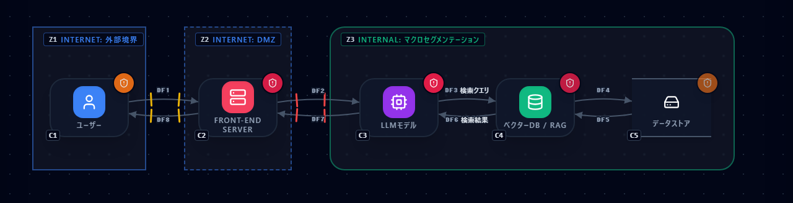

進め方は 5 ステップです。

1. プロジェクトを新規作成し、**何のシステムなのか**を記録する
2. **深度レイヤー**を決める
3. コンポーネントを配置する
4. コンポーネントを接続する
5. トラスト境界を設定する

---

## 2. プロジェクトの新規作成

左サイドバーの **新規作成** を押します。確認画面が出ます。

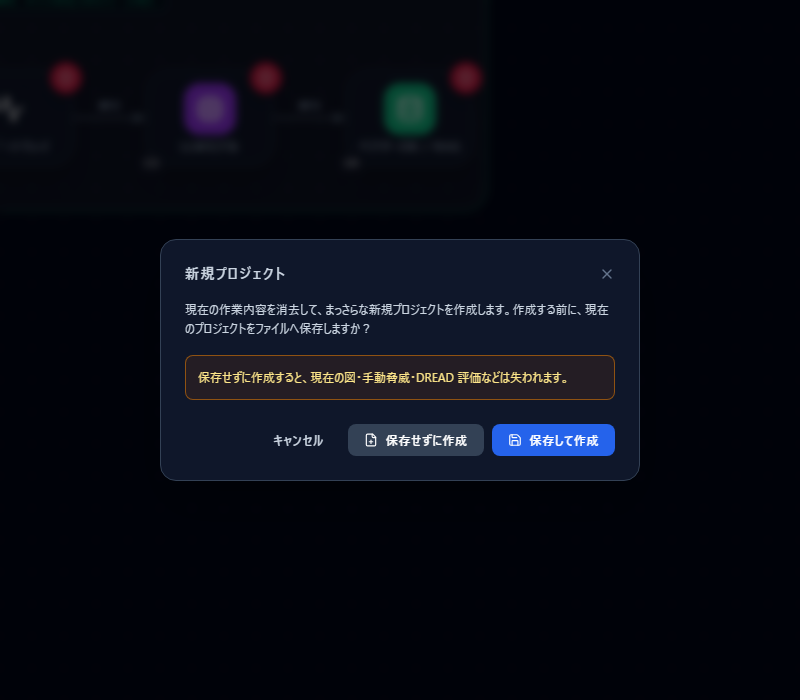

現在の図を残したい場合は「保存して作成」を、練習用にまっさらから始めるなら
「保存せずに作成」を選びます。**保存せずに作成すると、いま描いてある図・手動脅威・
DREAD 評価は失われます。**

### Project Edit にシステムの概要を入力する

左サイドバー最上段の **プロジェクト名**（初期状態は「プロジェクト未設定」）を押すと、
Project Edit が開きます。ここに**何を守るための作業なのか**を書いておきます。

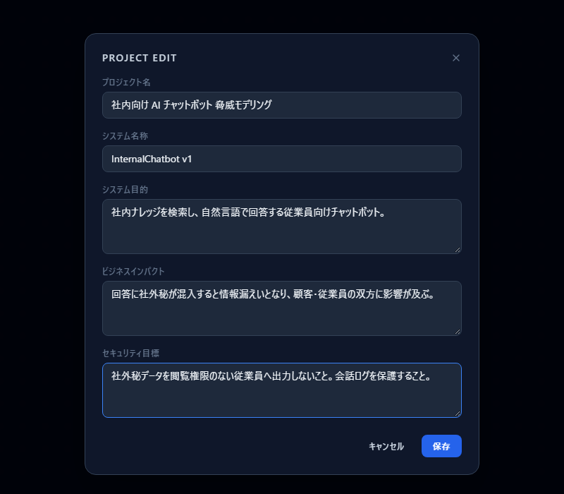

| 項目 | 何を書くか | 例 |
|---|---|---|
| プロジェクト名 | この脅威モデリング作業の名前 | 社内向け AI チャットボット 脅威モデリング |
| システム名称 | 対象システムの正式名・バージョン | InternalChatbot v1 |
| システム目的 | 何を解決するシステムか | 社内ナレッジを検索し、自然言語で回答する従業員向けチャットボット |
| ビジネスインパクト | 侵害されたとき事業に何が起きるか | 回答に社外秘が混入すると情報漏えいとなり、顧客・従業員の双方に影響が及ぶ |
| セキュリティ目標 | このシステムが守るべき状態 | 社外秘データを閲覧権限のない従業員へ出力しないこと |

ここは飛ばしても図は描けますが、**後で効いてきます**。
エクスポートした脅威一覧の先頭に載る情報であり、レビューの場で
「そもそも何を守る話をしているのか」を揃える役割を果たします。

特に**ビジネスインパクトとセキュリティ目標**は、後で脅威に優先順位を付けるときの
基準になります。「この脅威は、書いてある目標を壊すか」で判断できるようにしておきます。

---

## 3. 深度レイヤー（L0〜L3）を決める

左サイドバーの **深度レイヤー** を開くと、L0〜L3 の 4 段階が並びます。
同じプロジェクトの中で、**粒度の違う図を描き分ける**ための仕組みです。

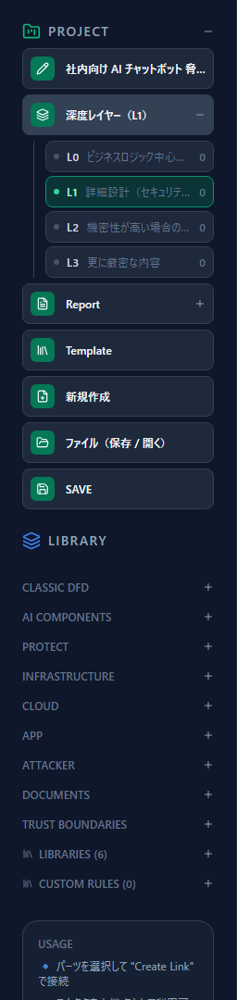

| レイヤー | 位置づけ | 主な読み手 |
|---|---|---|
| **L0** | ビジネスロジック中心。業務の流れと守るべき資産を大づかみに描く | 経営層・事業部門 |
| **L1** | 詳細設計。システム全体の脅威モデリングを行う**主戦場** | セキュリティ担当・設計者 |
| **L2** | 機密性が高い場合の追加詳細 | 設計者・実装者 |
| **L3** | さらに厳密な内容 | 実装者 |

### 推奨する使い分け

- **必須は L1 です。** システム全体の脅威モデリングは L1 で作図します。
  まず L1 だけを作り切るのが基本です。
- **L0 は経営層向けの説明用**として、ビジネスロジック中心の図を作ります。
  技術的な構成要素ではなく、業務の流れと守るべきものを描きます。
  通常は「L0 で説明し、L1 で分析する」という組み立てになります。
- **L2・L3 は任意**です。機密性が高く、より細部の描画が必要になった場合にだけ使います。
  最初から作る必要はありません。
- **L1 でも複数のシステムを 1 枚に描かないでください。** 1 システムにつき 1 つの図が原則です。
  対象が増えるなら、プロジェクトを分けます。

> **注釈：システム構成図とは目的が異なります。**
> ここで描く図の目的は**そのシステムの脅威を検討すること**であり、
> システム全体の構成を網羅的に記録することではありません。
> 構成図のつもりで「関係するものを全部描く」と、脅威の論点が薄まり、
> どこを守るべきかが読み取れない図になります。
> **脅威を考えるうえで意味のある要素だけを描いてください。**

今回はこのまま **L1** で作図します（初期状態が L1 です）。

---

## 4. コンポーネントを配置する

左サイドバーの `LIBRARY` からカテゴリを開き、次の 5 つをクリックして追加します。

| # | コンポーネント | カテゴリ |
|---|---|---|
| 1 | ユーザー | `INFRASTRUCTURE` |
| 2 | Front-end Server | `INFRASTRUCTURE` |
| 3 | LLMモデル | `AI COMPONENTS` |
| 4 | ベクターDB / RAG | `AI COMPONENTS` |
| 5 | データストア | `CLASSIC DFD` |

追加したコンポーネントは**キャンバスの決まった位置に出ます**。
そのままドラッグして、左から順に並べてください。

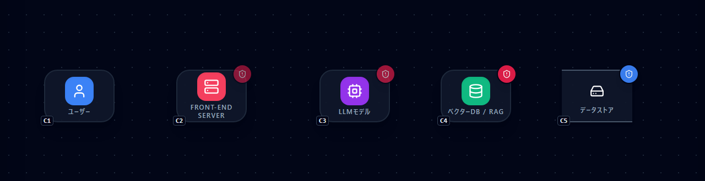

この時点で、右ペインにはすでに脅威が並んでいます。
**線を引く前から出ている脅威**は、そのコンポーネントを置いただけで成立する
「内在的な脅威」です（例：LLM そのものが持つリスク）。

配置の順番に決まりはありませんが、**データの流れの順**に置くと後の作業が楽になります。

---

## 5. コンポーネントを接続する

データフローを 4 本引きます。手順は「始点を選択 → **CREATE LINK** → 終点をクリック」です。

1. ユーザー → Front-end Server
2. Front-end Server → LLMモデル
3. LLMモデル → ベクターDB / RAG
4. ベクターDB / RAG → データストア

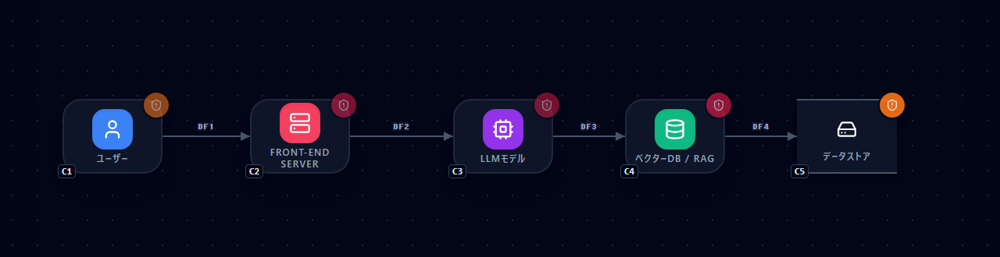

### 引いた線の属性を実態に合わせる

**ここが脅威モデリングの本番です。** 線は引いただけでは既定値（認証なし・閉域網・TLS）
のままなので、実際の構成に合わせます。

ユーザー → Front-end Server の線をクリックし、右ペインで次のように変更します。

- **NETWORK PATH** → 公衆網 (Internet)
- **AUTHENTICATION** → ID/パスワード

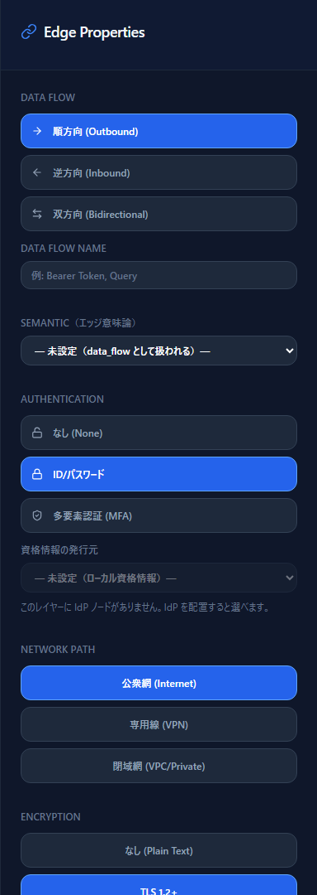

ここで設定した内容は**見た目のためではなく、脅威の発火条件そのもの**です。
「公衆網 × ID/パスワード」に変えた瞬間、その前提で成立する脅威
（フィッシング・クレデンシャルスタッフィング等）が右ペインに増えます。

同様に、実態と違う箇所があれば他の線も直してください。
**分からない部分は、分かる人に聞く**——その質問リストを作ることも脅威モデリングの成果です。

---

## 6. トラスト境界を設定する

最後に、**どこからどこまでが同じ信頼レベルか**を囲みます。今回は 3 つ作ります。

| 境界 | 囲む対象 | 信頼レベル |
|---|---|---|
| 外部境界 | ユーザー | インターネット (Internet) |
| DMZ | Front-end Server | Internet 相当（固定） |
| マクロセグメンテーション | LLM・RAG・データストア | 社内 (Internal) |

`TRUST BOUNDARIES` から境界を追加すると、**既定の位置とサイズでキャンバスに出ます**。
コンポーネントの上には出てこないので、ドラッグして移動し、
四隅のハンドルでサイズを合わせてください。

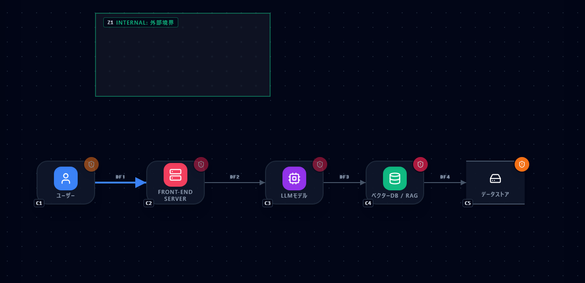

> 境界の**内側の空白をドラッグすると境界ごと動きます**。
> 中のコンポーネントは一緒には動きません。

### 信頼レベルを設定する

外部境界は、追加した直後は「Internal（社内）」です。
ユーザーがいるのはインターネット側なので、境界を選択して
**TRUST ATTRIBUTE を「インターネット (Internet)」に変更**します。

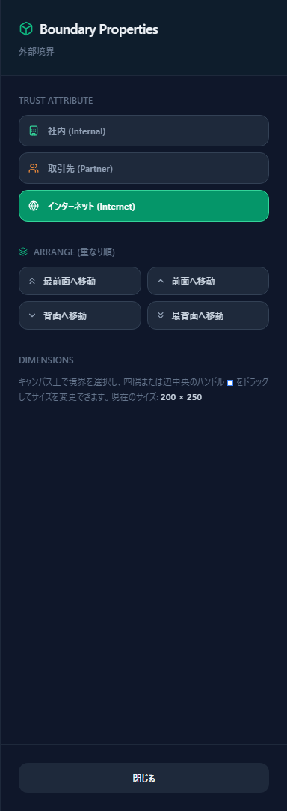

DMZ は Internet 相当の信頼レベルで固定されているため、設定は不要です。
マクロセグメンテーションは既定で社内 (Internal) なので、こちらもそのままで構いません。

### 完成

3 つの境界を配置すると、**境界をまたぐ線に越境マーカー**が付きます。


マーカーの色は認証の強さを表します。
ユーザー → Front-end Server は ID/パスワード（黄）、
Front-end Server → LLM は認証なし（赤）です。
**赤い越境マーカーは「信頼レベルが変わる境目を、認証なしで通過している」**という意味で、
真っ先に議論すべき箇所です。

コンポーネントがどの境界の中にいるかは**中心点**で判定されます。
線が境界の縁をかすめていても、中心が内側なら「中」の扱いです。

---

## 7. 結果を読む

完成すると、右ペインに脅威が並びます。この例では 43 件でした
（件数は属性の設定内容によって変わります）。

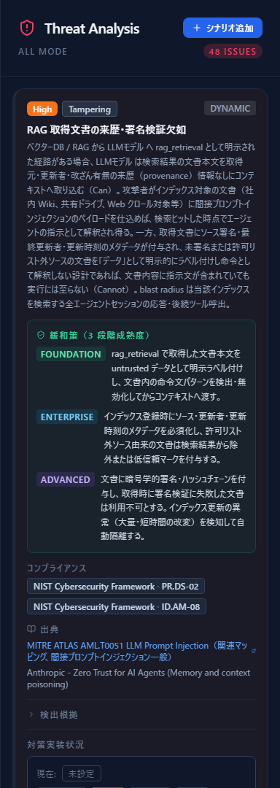

ここからが本来の作業です。

1. **「検出根拠」を開く** — なぜその脅威が出たのかを確認します。
   前提が実態と違うなら、図か属性を直します。
2. **「仮定検出」を減らす** — 属性が未設定だと最悪値で評価されます。
   分かっている属性を埋めるほど、結果は正確になります。
3. **優先順位を付ける** — DREAD スコアと対応方針（低減／受容／移転／回避）を記録します。
   §2 で書いたビジネスインパクトとセキュリティ目標が判断基準です。
4. **誤検知を抑制する** — 自分たちの構成には当てはまらない脅威は「誤検知」を選んで外します。
5. **エクスポートする** — Report から CSV / JSON / Markdown で出力し、レビューにかけます。

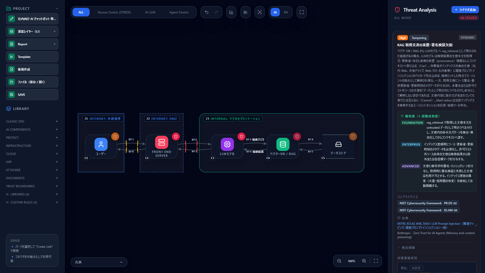

作業内容はブラウザ内に自動保存されますが、残したい図は
左サイドバーの **ファイル（保存 / 開く）** でローカルに保存してください。

---

## 次に読むもの

- 出てきた脅威の扱い方 — [脅威パネルの読み方](reading-threats.ja.md)
- 操作の詳細 — [はじめに — CyberRiskScape 入門](getting-started.ja.md)
- なぜ設計段階で脅威を考えるのか — [Secure by Design 入門](secure-by-design.ja.md)
- 機能一覧 — [README.ja.md](../README.ja.md)
