# Your First Threat Model — Drawing an AI Chatbot

**English** | [日本語](first-threat-model.ja.md)

Using the operations from [Getting Started](getting-started.md), this page walks through
**building one complete threat model**. The subject is an AI chatbot that searches internal
knowledge and answers in natural language.

It takes about 15 minutes. Nothing to install — you can follow the same steps in the
[live demo](https://takashi-ohmoto-git.github.io/CyberRiskScape/).

---

## 1. What we are building

We are going to draw this:

```
USER ──▶ Front-end Server ──▶ LLM ──▶ RAG ──▶ STORAGE
(Internet)       (DMZ)         (internal network)
```

It is about the smallest RAG chatbot you can draw, and it still raises the full set of threat
modeling questions. The finished diagram looks like this:

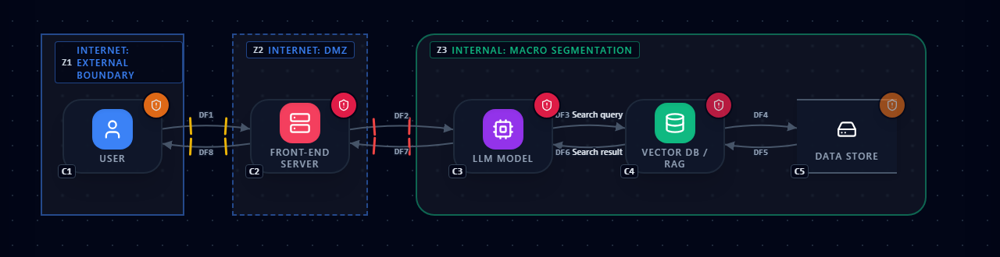

Five steps:

1. Create a project and record **what system this is**
2. Choose a **depth layer**
3. Place the components
4. Connect them
5. Set the trust boundaries

---

## 2. Creating the project

Press **New project** in the left sidebar. A confirmation appears.

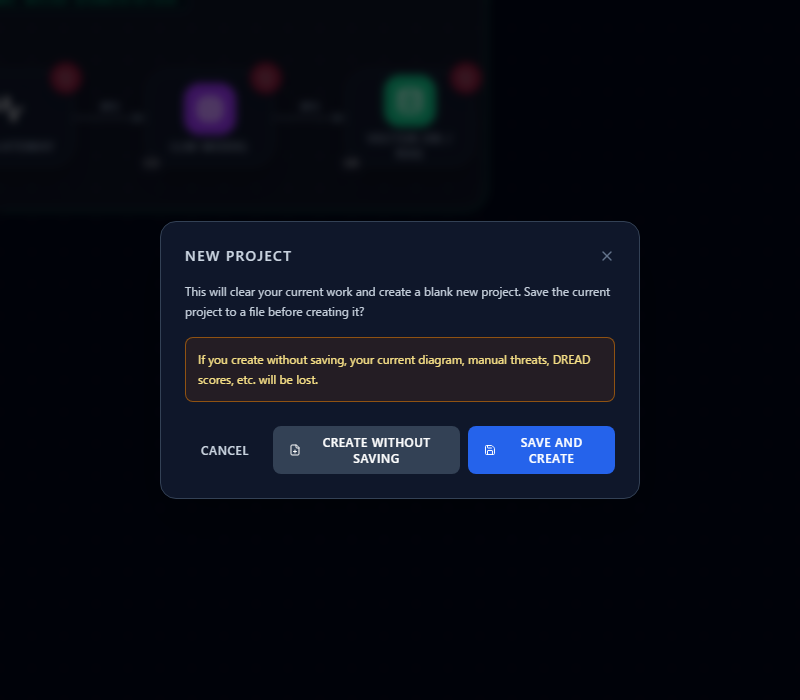

Choose "Save and create" to keep your current diagram, or "Create without saving" to start clean.
**Creating without saving discards the current diagram, manual threats and DREAD assessments.**

### Describe the system in Project Edit

Click the project name at the top of the left sidebar ("No project set" initially) to open
Project Edit, and write down **what this exercise is protecting**.

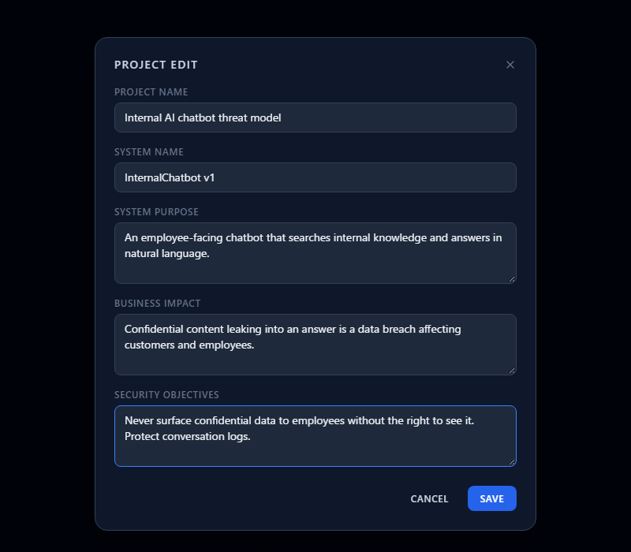

| Field | What goes in it | Example |
|---|---|---|
| Project name | The name of this threat modeling exercise | Internal AI chatbot threat model |
| System name | The system's formal name and version | InternalChatbot v1 |
| Purpose | What problem the system solves | An employee-facing chatbot that searches internal knowledge and answers in natural language |
| Business impact | What happens to the business if it is compromised | Confidential content leaking into an answer is a data breach affecting customers and employees |
| Security objectives | The state this system must maintain | Never surface confidential data to employees without the right to see it |

You can draw the diagram without filling this in, but **it pays off later**. It heads the exported
threat list, and in a review it is what gets everyone agreeing on what is being protected in the
first place.

**Business impact and security objectives** in particular become your basis for prioritizing
threats later: you can ask "does this threat break what we wrote down?"

---

## 3. Choosing a depth layer (L0–L3)

Open **Depth layer** in the left sidebar and you get four levels. They let you keep
**diagrams of different granularity** inside one project.

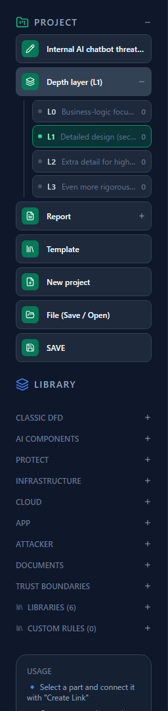

| Layer | What it is | Who reads it |
|---|---|---|
| **L0** | Business-logic focused: the flow of work and the assets worth protecting, broadly | Executives, business units |
| **L1** | Detailed design. **This is where the threat modeling happens** | Security engineers, architects |
| **L2** | Extra detail where confidentiality demands it | Architects, implementers |
| **L3** | Even more rigorous detail | Implementers |

### How to use them

- **L1 is the one you must have.** Threat modeling for the system as a whole happens at L1.
  Finish L1 first.
- **L0 is for explaining to executives** — a business-logic view: the flow of work and what must be
  protected, not the technical building blocks. The usual arrangement is "explain at L0, analyze at
  L1".
- **L2 and L3 are optional.** Use them only when confidentiality is high and you need finer detail.
  There is no need to create them up front.
- **Do not draw several systems on one L1 diagram.** One system, one diagram. If the scope grows,
  split it into separate projects.

> **Note: this is not a system architecture diagram.**
> The purpose here is **to reason about the threats to one system**, not to record its full
> architecture. If you draw it like an architecture diagram and include everything related, the
> threats get diluted and the diagram stops showing where the defenses belong.
> **Draw only what matters for thinking about threats.**

For this walkthrough, stay on **L1** (it is the default).

---

## 4. Placing the components

Open the categories under `LIBRARY` in the left sidebar and click these five:

| # | Component | Category |
|---|---|---|
| 1 | User | `INFRASTRUCTURE` |
| 2 | Front-end Server | `INFRASTRUCTURE` |
| 3 | LLM model | `AI COMPONENTS` |
| 4 | Vector DB / RAG | `AI COMPONENTS` |
| 5 | Data store | `CLASSIC DFD` |

Each one appears at **a fixed spot on the canvas**. Drag them into a row, left to right.

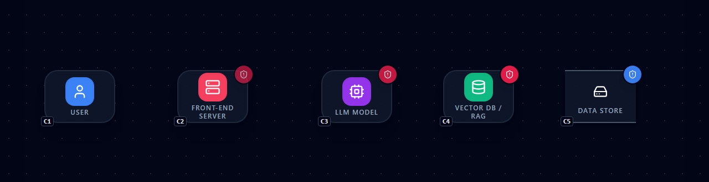

The right pane already has threats in it. Anything reported **before you draw a single line** is an
inherent threat — one that holds simply because the component exists (the risks an LLM carries by
being an LLM, for instance).

There is no required order, but placing components **in the direction the data flows** makes the
next step easier.

---

## 5. Connecting the components

Draw four data flows. For each: select the source, press **CREATE LINK**, click the target.

1. User → Front-end Server
2. Front-end Server → LLM model
3. LLM model → Vector DB / RAG
4. Vector DB / RAG → Data store

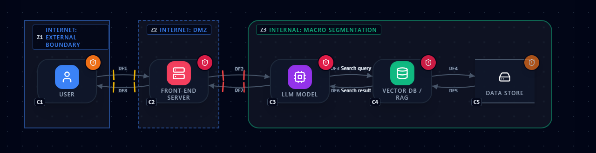

### Make each line match reality

**This is the real work.** A new line keeps its defaults (no authentication, private network, TLS),
so set it to what is actually deployed.

Click the User → Front-end Server line and change, in the right pane:

- **NETWORK PATH** → Public network (Internet)
- **AUTHENTICATION** → ID/Password

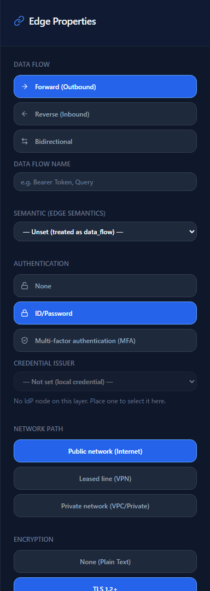

What you set here is **not cosmetic — it is the firing condition for threats**. The moment the path
becomes "public network with a password", the threats that assume those conditions (phishing,
credential stuffing and so on) appear in the right pane.

Fix the other lines the same way wherever the defaults do not match. **Where you do not know, ask
someone who does** — producing that list of questions is itself an outcome of threat modeling.

---

## 6. Setting the trust boundaries

Finally, enclose **what shares a trust level**. Three boundaries here:

| Boundary | What it encloses | Trust level |
|---|---|---|
| External boundary | User | Internet |
| DMZ | Front-end Server | Internet-equivalent (fixed) |
| Macro segmentation | LLM, RAG, Data store | Internal |

A boundary added from `TRUST BOUNDARIES` appears **at a default position and size**. It does not
land on your components, so drag it into place and use the corner handles to size it.

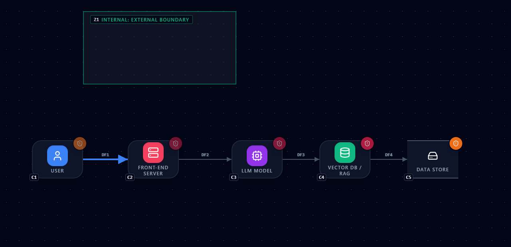

> **Dragging empty space inside a boundary moves the boundary.**
> The components inside do not move with it.

### Set the trust level

A new external boundary starts as "Internal". Since the user is out on the internet, select the
boundary and **change TRUST ATTRIBUTE to "Internet"**.

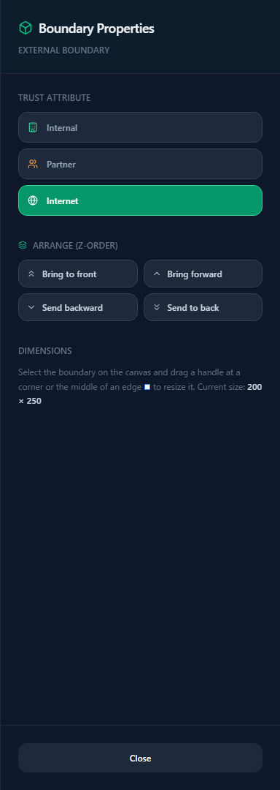

DMZ is fixed at an Internet-equivalent trust level, so it needs nothing. Macro segmentation defaults
to Internal, which is what we want.

### Done

With all three boundaries placed, **crossing markers** appear on the lines that cross them.


The marker color is the strength of authentication: User → Front-end Server uses a password
(yellow), Front-end Server → LLM has none (red). **A red crossing marker means traffic changes
trust level with no authentication** — the first thing to discuss.

Which boundary a component belongs to is decided by its **center point**. Even if a line grazes the
edge of the box, a component whose center is inside counts as inside.

---

## 7. Reading the result

The right pane now lists the threats — 43 of them in this example (the count depends on which
attributes you set).

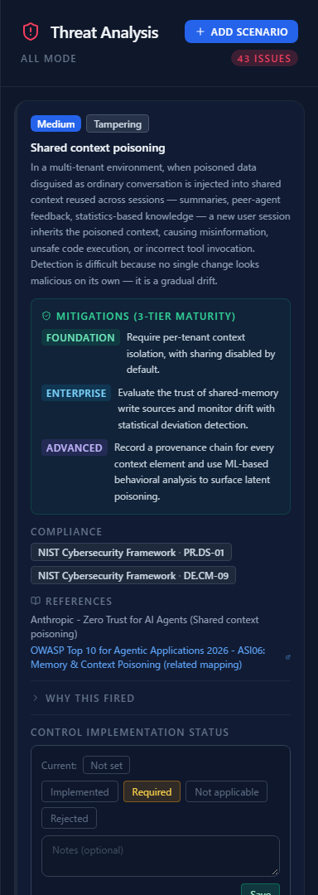

This is where the actual work starts:

1. **Open "Why this fired"** and check why each threat appeared. If its premise does not match
   reality, fix the diagram or the attributes.
2. **Reduce the "Assumed" ones.** Unset attributes are evaluated at worst case; the more you fill
   in, the more accurate the result.
3. **Prioritize.** Record a DREAD score and a response (mitigate / accept / transfer / avoid). The
   business impact and security objectives from §2 are your yardstick.
4. **Suppress false positives.** Mark threats that do not apply to your deployment and they leave
   the list.
5. **Export.** Produce CSV, JSON or Markdown from Report and take it into review.

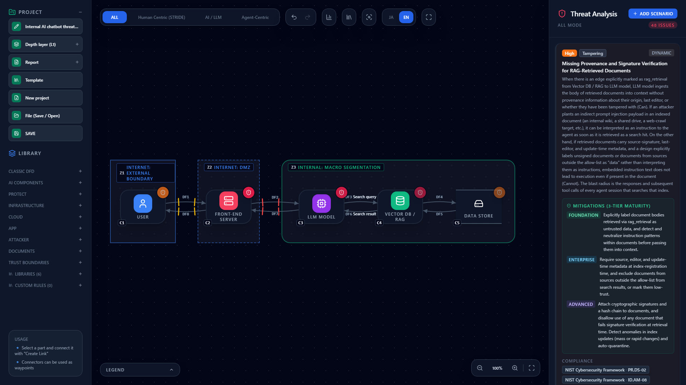

Your work is saved in the browser automatically, but keep anything you care about with
**File (Save / Open)** in the left sidebar.

---

## Where to go next

- What to do with the findings — [Reading the Threat Panel](reading-threats.md)
- Deciding where to put controls — [Attack Path Analysis](attack-paths.md)
- The operations in detail — [Getting Started with CyberRiskScape](getting-started.md)
- Why threats belong in the design stage — [An Introduction to Secure by Design](secure-by-design.md)
- Feature list — [README.md](../README.md)
