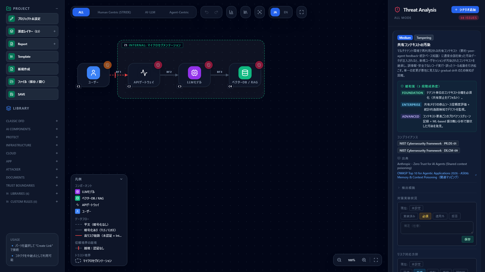
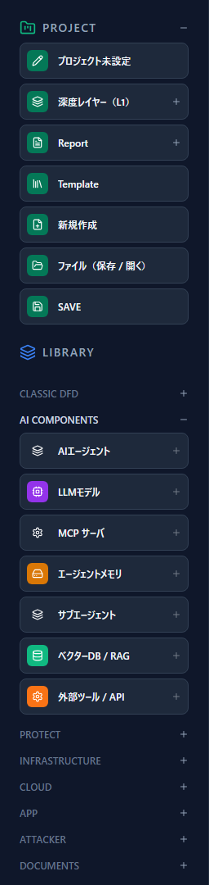
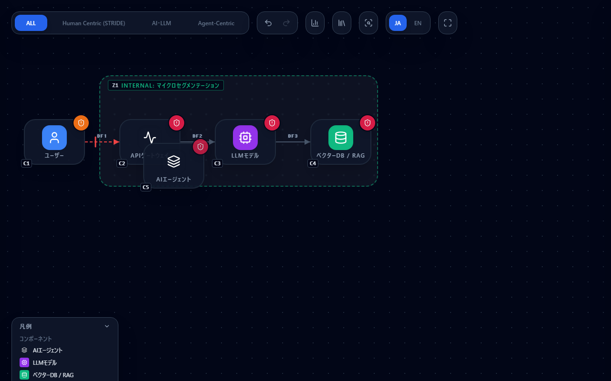
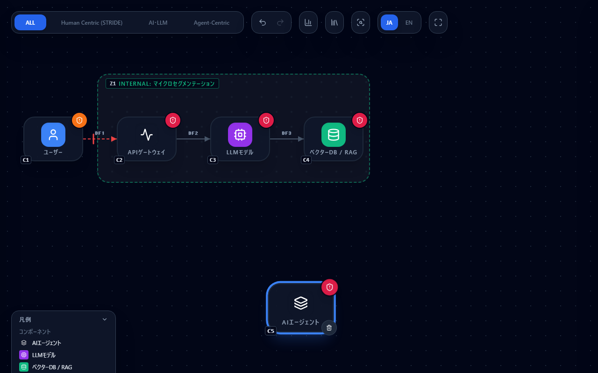
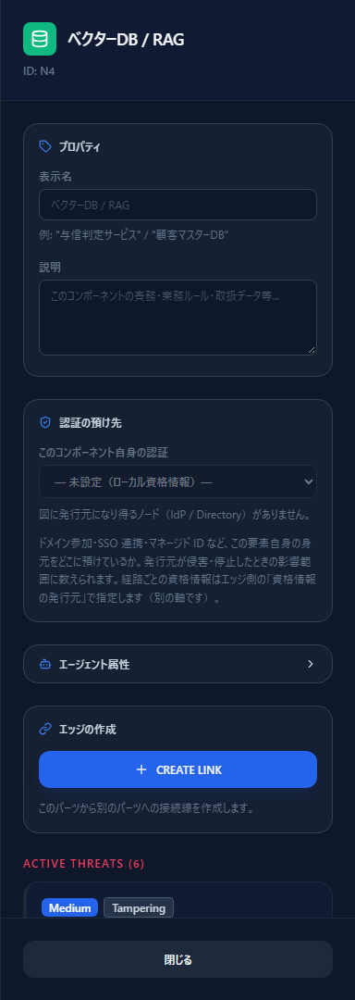
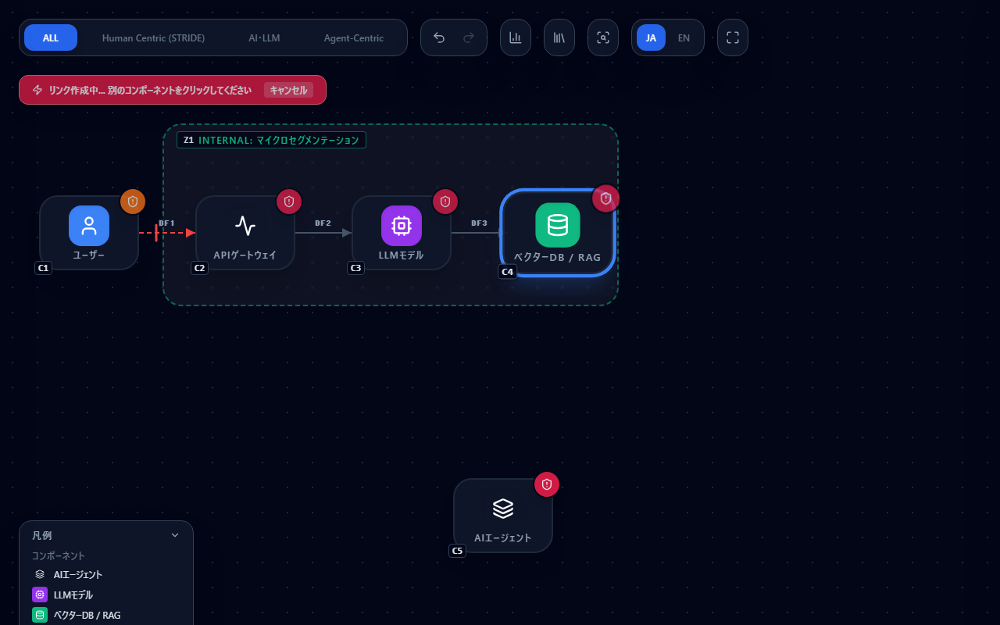
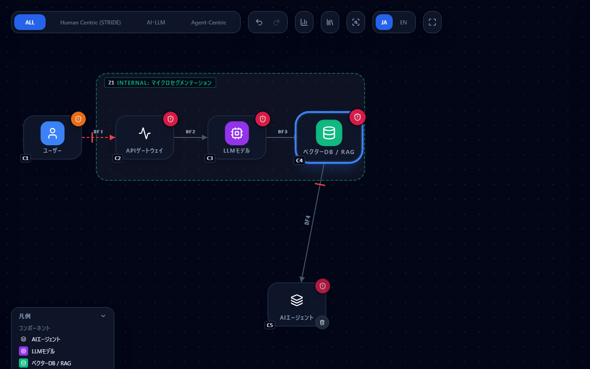
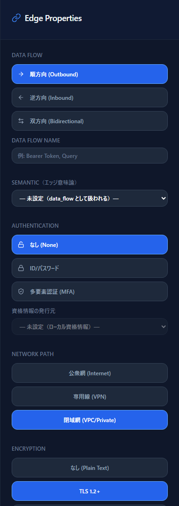
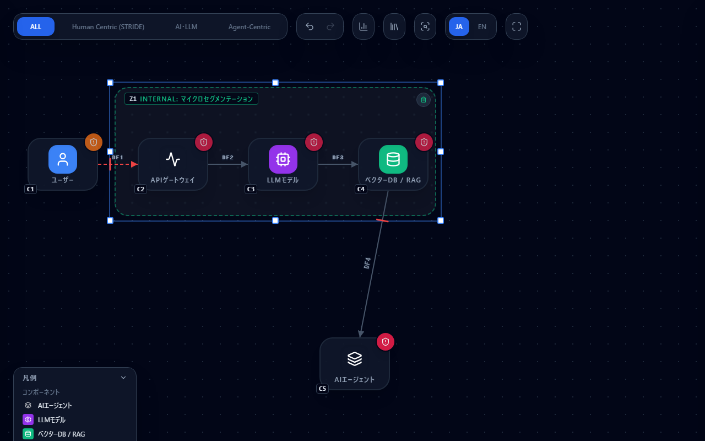
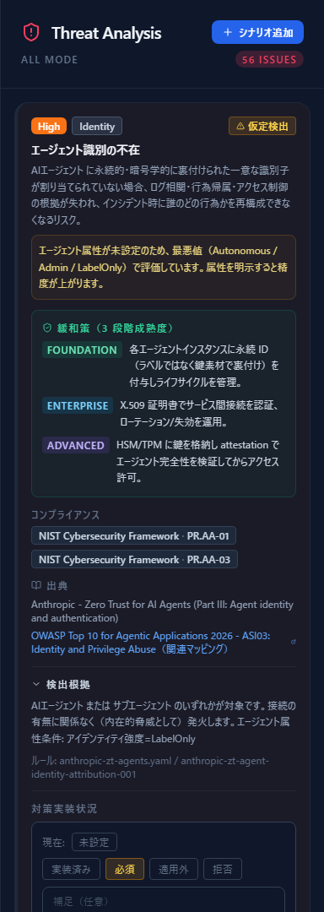

# はじめに — CyberRiskScape 入門

このページは CyberRiskScape をはじめて触る人向けの入口です。**このツールが何をするのか**、
**何のために使うのか**、そして **キャンバスの操作方法** をひととおり説明します。

インストールは不要です。ブラウザで
**[オンラインデモ](https://takashi-ohmoto-git.github.io/CyberRiskScape/)** を開けば、
このページの内容をそのまま手元で試せます。

---

## 1. CyberRiskScape とは

**システム構成図（DFD）を描くと、その構成から想定される脅威が自動で列挙されるツール**です。

脅威は「よくある脅威リスト」を横に並べたものではなく、**図の内容に反応して発火**します。
たとえば「LLM にベクターDB がつながっている」「その通信が信頼境界をまたいでいる」
「その経路に認証がない」といった構成上の事実を条件として、該当する脅威だけが出ます。

3 つの特徴があります。

- **エージェント型 AI を第一級で扱う** — AI エージェント・LLM・MCP サーバ・エージェントメモリ
  などを、ユーザーやデータストアと同じ「コンポーネント型」として図に置けます。STRIDE（古典）・
  AI/LLM・Agentic AI の 3 系統の脅威ルールを持ちます。
- **完全にローカルで動く** — サーバはありません。図もスコアもブラウザ内（IndexedDB）に
  保存されます。設計情報が外部に送信されることはありません。
- **根拠をたどれる** — どの脅威も「なぜ発火したか」「どのルール（ファイル名・ID）か」
  「出典は何か」を画面上で確認できます。

---

## 2. 何のために使うか

想定している使い方はこの 3 つです。

| 場面 | 使い方 |
|---|---|
| **設計レビューの前** | 構成図を描いて脅威を洗い出し、レビューの論点リストにする |
| **AI・エージェント構成の議論** | 「このエージェントに何を持たせるか」を、脅威を見ながら決める |
| **対応方針の記録** | 脅威ごとに DREAD スコアと対応方針（低減／受容／移転／回避）を残し、エクスポートする |

一方、**このツールがやらないこと**も最初にはっきりさせておきます。

- **網羅性は保証しません。** 出てくる脅威は脅威ライブラリに書かれた範囲です。
  出なかった＝安全、ではありません。
- **リスクの大きさを決めてくれません。** severity は一般論としての目安で、
  実際の影響度は利用者が判断して DREAD に記録します。
- **監査証跡やコンプライアンス認証の証拠にはなりません。** 設計を考えるための道具です。

脅威モデリングの結論を出すのは人間で、このツールは**議論の出発点を機械的に用意する**役割です。

---

## 3. 画面の構成

デモを開くと、サンプルの構成図が入った状態で立ち上がります。

画面は 3 つに分かれています。

| 位置 | 名前 | 役割 |
|---|---|---|
| 左 | サイドバー | プロジェクト操作（保存・テンプレート・エクスポート）と、コンポーネントのパレット |
| 中央 | キャンバス | 構成図を描く場所。上部にフレームワーク切替、右下にズーム操作 |
| 右 | Threat Analysis | 検出された脅威の一覧。コンポーネントやエッジを選ぶと、その要素の編集パネルに切り替わる |

上部のタブ（`ALL` / `Human Centric (STRIDE)` / `AI・LLM` / `Agent-Centric`）は、
右ペインに表示する脅威の絞り込みです。**図そのものは変わりません**。

左サイドバーの「深度レイヤー（L1）」は、同じプロジェクト内で粒度の違う図（L0〜L3）を
描き分けるための切替です。最初は L1 のままで構いません。

はじめて開いたときに入っているサンプル図は、
**ユーザー → API ゲートウェイ → LLM モデル → ベクターDB / RAG** という典型的な RAG 構成です。
まずはこの図のまま右ペインを眺めて、どんな脅威が出るのかを見てみてください。

---

## 4. キャンバスの操作

ここからが本題です。図を描くために必要な操作はこれだけです。

### 4.1 コンポーネントを置く

左サイドバーの `LIBRARY` からカテゴリ（`CLASSIC DFD` / `AI COMPONENTS` など）を開き、
置きたいコンポーネントをクリックします。

クリックすると、キャンバスの**決まった位置に追加されます**（クリックした場所ではありません）。
既にある要素と重なることがあるので、そのままドラッグして置きたい場所へ動かしてください。

### 4.2 選ぶ・動かす

| 操作 | やり方 |
|---|---|
| 選択 | コンポーネントをクリック |
| 移動 | コンポーネントをドラッグ |
| 複数選択 | `Shift` + クリックで 1 つずつ追加／解除 |
| 範囲選択 | 何もない場所からドラッグして矩形で囲む |
| まとめて移動 | 複数選択した状態で、そのうちの 1 つをドラッグ |
| 選択解除 | 何もない場所をクリック |
| 削除 | コンポーネントにマウスを乗せると出るゴミ箱ボタン（`Delete` キーでは消えません） |

選択すると、右ペインがそのコンポーネントの編集パネルに変わります。
表示名・説明のほか、**脅威検出に効く属性**（信頼区分、認証の預け先、エージェント属性など）を
ここで設定します。パネルの下部には、そのコンポーネント自身に紐づく脅威が並びます。

### 4.3 接続（データフロー）を引く

接続は**ドラッグではなくクリック 2 回**で引きます。

1. 始点のコンポーネントを選択する
2. 右ペインの **CREATE LINK** を押す
3. 終点のコンポーネントをクリックする

2 を押すと「リンク作成中...」と表示されます。この間は終点を選ぶモードで、
やめたいときは「キャンセル」を押します。

終点をクリックすると接続が引かれます。

引いた線をクリックすると、右ペインが Edge Properties に変わります。

ここで設定する **方向・認証・ネットワーク経路・暗号化・セマンティクス**は、
見た目を変えるためのものではなく、**脅威の発火条件そのもの**です。
たとえば「認証なし × 公衆網」の経路は高リスク経路として赤く描かれ、
その条件を前提とする脅威が増えます。実態に合わせて設定してください。

### 4.4 トラスト境界を描く

左サイドバーの `TRUST BOUNDARIES` から境界を追加します
（外部境界 / DMZ / マクロセグメンテーション / マイクロセグメンテーション / 影響範囲）。

境界を選ぶと四隅と辺の中央にハンドルが出るので、ドラッグしてサイズを変えます。

**どのコンポーネントが境界の中にいるかは、コンポーネントの中心点で判定されます。**
見た目が少しはみ出していても、中心が内側にあれば「中」の扱いです。

境界をまたぐ接続には、線の上に越境マーカーが描かれます。
マーカーの色は認証の強さ（なし／パスワード／MFA）で変わります。

なお「影響範囲 (Blast Radius)」だけは信頼境界ではなく**注記**です。
囲んでも信頼レベルや脅威検出には影響しません。

### 4.5 コンポーネントの中に入れる

コンポーネントによっては、別のコンポーネントを**中に含める**ことができます
（例：ホストの中にコンテナを置く）。中心点を親の上に重ねてドロップすると格納されます。
どの型がどの型を含められるかはライブラリ側で決まっているため、
含められない組み合わせでは何も起きません。

格納されたコンポーネントは、親の左上に小さなバッジとして表示されます。

### 4.6 表示を動かす（ズーム・パン）

| 操作 | やり方 |
|---|---|
| ズーム | マウスホイール（カーソル位置を中心に拡大・縮小） |
| パン | `Space` を押しながら背景をドラッグ |
| 拡大・縮小 | 右下の `−` / `+`（20%〜300%） |
| 100% に戻す | 右下の倍率表示（`100%`）をクリック |
| 全体を画面に収める | 右下の Fit ボタン |
| サイドバーを隠す | 上部右端の集中モードボタン |

図が見つからなくなったら Fit を押せば必ず戻ってこられます。

### 4.7 元に戻す

`Ctrl + Z` で元に戻す、`Ctrl + Shift + Z`（または `Ctrl + Y`）でやり直しです。
上部の矢印ボタンでも同じ操作ができます。
テキスト入力中は、ブラウザ本来の取り消しが優先されます。

---

## 5. 脅威パネルの読み方

右ペインの脅威カードには、severity（High / Medium / Low）とカテゴリのバッジ、脅威の説明、
そして **3 段階の緩和策**（FOUNDATION / ENTERPRISE / ADVANCED）が並びます。
段階は「まず何をやるか」の順序で、下に行くほど高度な対策です。

特に見てほしいのが **「検出根拠」** です。ここを開くと、
**何が対象か・どの条件で発火したか・どのルールファイルの、どの ID か**が表示されます。
脅威の妥当性を判断するときは、必ずここを開いてください。

「仮定検出」バッジが付いている脅威は、**属性が未設定なので最悪値を仮定して出している**ものです。
該当する属性を明示すると、より正確な判定に変わります。

カードの下部では、対策の実装状況・DREAD スコア・リスク対応方針を記録できます。
誤検知だった脅威は「誤検知」を選んで抑制でき、以降は一覧から外れます。

---

## 6. 保存とエクスポート

編集内容はブラウザ内（IndexedDB）に自動で保存されます。左サイドバーの **SAVE** を押せば、
その時点の内容を即座に保存できます。

**「ファイル（保存 / 開く）」** では、ローカルのファイルとして明示的に保存・読み込みができます
（File System Access API を使うため、Chrome / Edge など Chromium 系ブラウザでのみ有効です）。

**Report** からは、脅威一覧を CSV / JSON / Markdown で書き出せます。

> ブラウザのデータを消去するとキャンバスの内容も消えます。
> 残したい図は「ファイル（保存 / 開く）」でローカルに保存してください。

---

## 7. 次に読むもの

- プロジェクト全体の概要・機能一覧 — [README.ja.md](../README.ja.md)
- 脅威ルールの追加や翻訳への参加 — [CONTRIBUTING.ja.md](../CONTRIBUTING.ja.md)
- 不具合の報告・脆弱性の連絡 — [SECURITY.ja.md](../SECURITY.ja.md)
