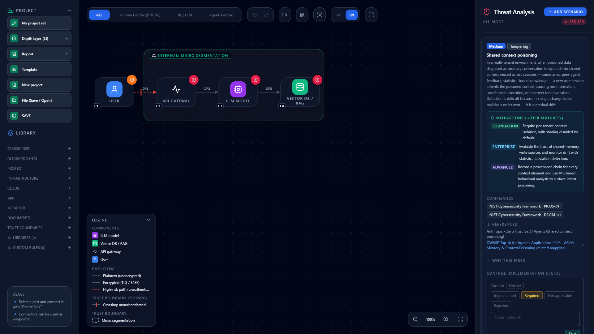
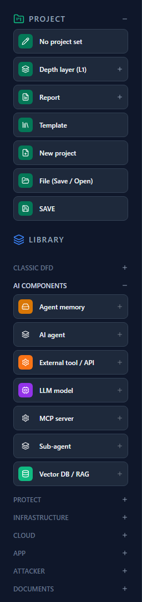
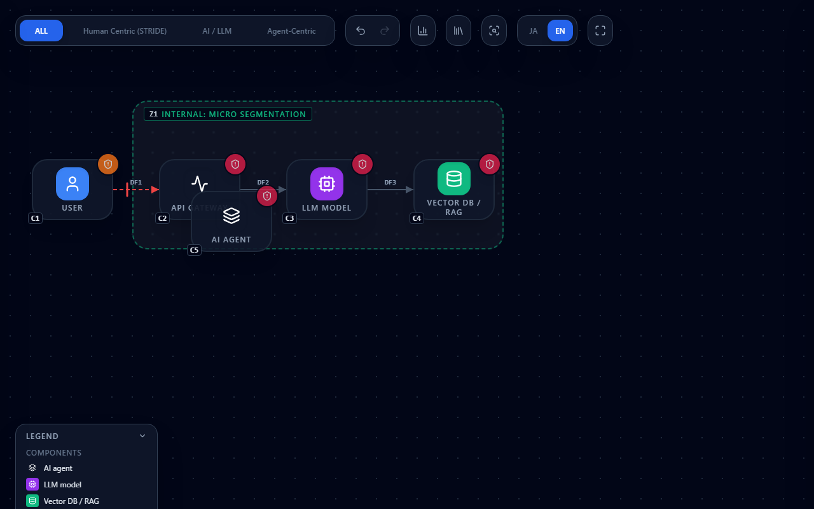
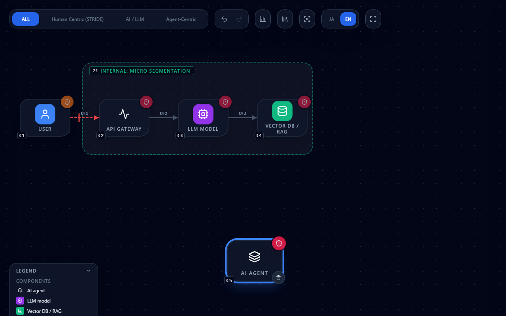
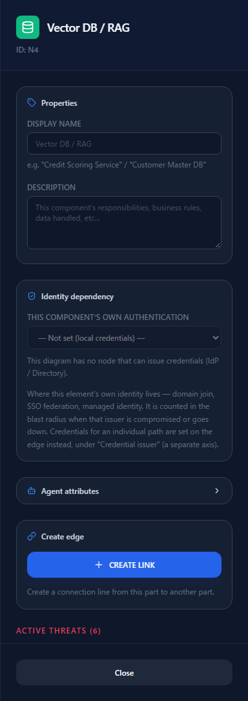
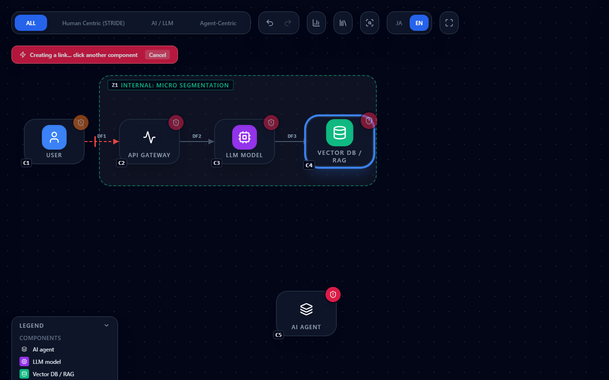
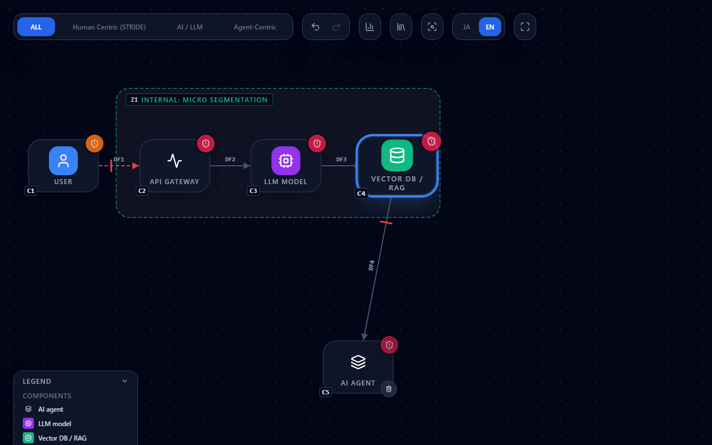
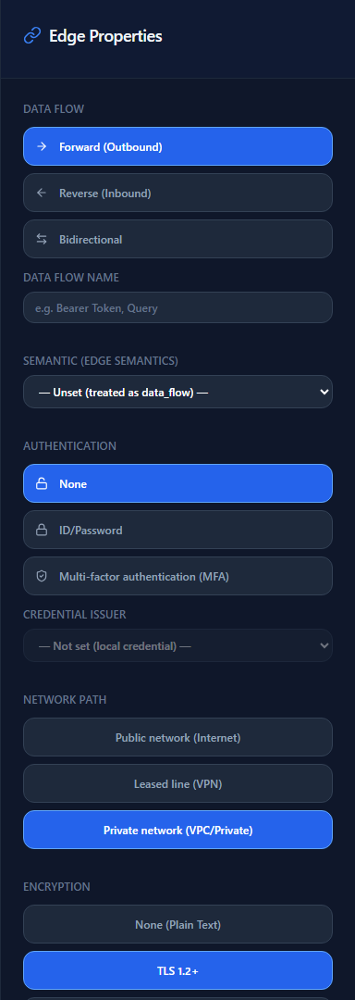
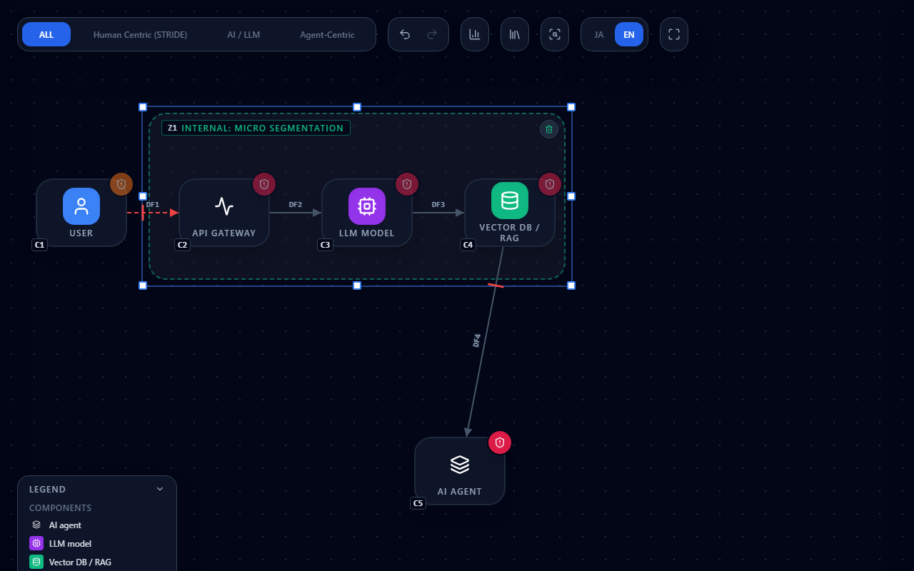
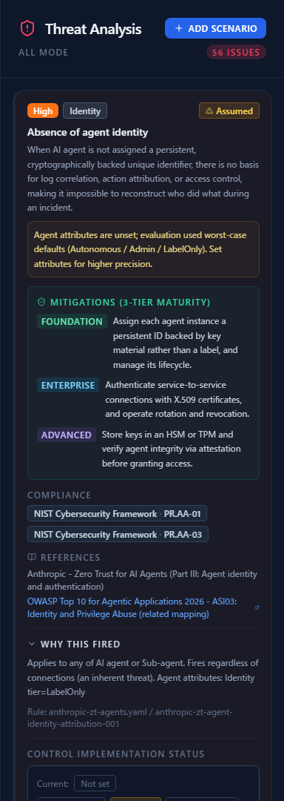

# Getting Started with CyberRiskScape

**English** | [日本語](getting-started.ja.md)

This page is the entry point for anyone opening CyberRiskScape for the first time.
It covers **what the tool does**, **what you would use it for**, and **how to work on the canvas**.

No installation is required. Open the
**[live demo](https://takashi-ohmoto-git.github.io/CyberRiskScape/)** in your browser and you can
follow along with everything on this page.

---

## 1. What CyberRiskScape is

**You draw a system diagram (DFD), and the threats implied by that structure are listed automatically.**

The threats are not a generic checklist shown side by side — they **fire in response to what the
diagram says**. Facts such as "an LLM is connected to a vector database", "that connection crosses a
trust boundary", or "that path has no authentication" act as the firing conditions, so only the
threats that apply to your design appear.

Three things set it apart:

- **Agentic AI is a first-class citizen.** AI agents, LLMs, MCP servers and agent memory are
  component types you place on the canvas, exactly like users and data stores. The rules cover three
  families: STRIDE (classic), AI/LLM, and Agentic AI.
- **It runs entirely locally.** There is no server. Your diagram and your scores live in the browser
  (IndexedDB). No design information is sent anywhere.
- **Every finding is traceable.** For each threat you can see why it fired, which rule produced it
  (file name and ID), and what it is based on.

---

## 2. What you would use it for

There are three intended uses:

| Situation | How you use it |
|---|---|
| **Before a design review** | Draw the architecture, surface the threats, and use them as the agenda for the review |
| **Deciding on an AI or agent design** | Decide what capabilities to give an agent while looking at the threats each choice introduces |
| **Recording your response** | Record a DREAD score and a response (mitigate / accept / transfer / avoid) per threat, then export |

It is just as important to be clear about **what this tool does not do**:

- **It does not guarantee completeness.** What you see is what the threat library covers.
  Nothing appearing does not mean nothing is there.
- **It does not decide how serious a risk is.** Severity is a general indication; you judge the real
  impact and record it in DREAD.
- **It is not an audit trail or evidence of compliance.** It is a tool for thinking about a design.

Humans reach the conclusions of a threat model. The tool's job is to **mechanically prepare the
starting point of the discussion**.

---

## 3. The screen

The demo opens with a sample diagram already loaded.

The screen has three parts:

| Where | Name | What it is for |
|---|---|---|
| Left | Sidebar | Project actions (save, templates, export) and the component palette |
| Center | Canvas | Where you draw. Framework tabs at the top, zoom controls at the bottom right |
| Right | Threat Analysis | The detected threats. Selecting a component or an edge turns this into its editor |

The tabs at the top (`ALL` / `Human Centric (STRIDE)` / `AI / LLM` / `Agent-Centric`) filter which
threats the right pane shows. **They do not change the diagram itself.**

"Depth layer (L1)" in the left sidebar switches between diagrams of different granularity (L0–L3)
within the same project. Leave it on L1 to begin with.

The sample diagram you start with — **User → API gateway → LLM model → Vector DB / RAG** — is a
typical RAG setup. Before changing anything, read down the right pane and see what it reports.

---

## 4. Working on the canvas

This is the part that matters. These are all the operations you need in order to draw.

### 4.1 Placing a component

Open a category under `LIBRARY` in the left sidebar (`CLASSIC DFD`, `AI COMPONENTS` and so on) and
click the component you want.

The component is added at a **fixed spot on the canvas** — not where you clicked. It may land on top
of something that is already there, so drag it to where you want it.

### 4.2 Selecting and moving

| Action | How |
|---|---|
| Select | Click a component |
| Move | Drag a component |
| Select several | `Shift` + click to add or remove one at a time |
| Select an area | Drag on empty space to draw a marquee |
| Move them together | With several selected, drag any one of them |
| Deselect | Click empty space |
| Delete | The trash button that appears when you hover over a component (the `Delete` key does nothing) |

Selecting a component turns the right pane into its editor. Besides the display name and
description, this is where you set the **attributes that drive threat detection** — trust level,
where the component's own authentication is anchored, agent attributes, and so on. The threats tied
to the component itself are listed at the bottom of the panel.

### 4.3 Drawing a connection (data flow)

Connections are made with **two clicks, not by dragging**.

1. Select the component the flow starts from
2. Press **CREATE LINK** in the right pane
3. Click the component it goes to

After step 2 the canvas shows "Creating a link...". While that is up you are choosing the endpoint;
press "Cancel" if you change your mind.

Click the endpoint and the connection is drawn.

Click the line itself and the right pane becomes Edge Properties.

The **direction, authentication, network path, encryption and semantics** you set here are not
cosmetic — they are **the firing conditions for threats**. A path that is unauthenticated over the
public internet, for instance, is drawn in red as a high-risk path, and more threats that assume
those conditions appear. Set them to match reality.

### 4.4 Drawing a trust boundary

Add boundaries from `TRUST BOUNDARIES` in the left sidebar (External boundary, DMZ,
Macro segmentation, Micro segmentation, Blast radius).

Select a boundary and handles appear at its corners and edge midpoints; drag them to resize.

**Whether a component is inside a boundary is decided by the component's center point.** If the
shape overhangs a little but its center is inside, it counts as being inside.

Connections that cross a boundary get a crossing marker drawn on the line. The color of the marker
reflects the strength of authentication (none / password / MFA).

Note that "Blast radius" is **an annotation, not a trust boundary**. Enclosing components in one does
not affect their trust level or threat detection.

### 4.5 Putting a component inside another

Some components can **contain** others (a container placed inside a host, for example). Drop a
component with its center over the parent and it is nested. Which types may contain which is defined
by the library, so nothing happens for combinations that are not allowed.

A nested component is shown as a small badge at the top left of its parent.

### 4.6 Moving the view (zoom and pan)

| Action | How |
|---|---|
| Zoom | Mouse wheel (zooms around the pointer) |
| Pan | Hold `Space` and drag the background |
| Zoom in / out | `−` / `+` at the bottom right (20%–300%) |
| Back to 100% | Click the zoom percentage (`100%`) at the bottom right |
| Fit everything on screen | The Fit button at the bottom right |
| Hide the sidebars | The focus-mode button at the top right |

If you ever lose the diagram off-screen, Fit will always bring it back.

### 4.7 Undo

`Ctrl + Z` undoes, `Ctrl + Shift + Z` (or `Ctrl + Y`) redoes. The arrow buttons at the top do the
same. While you are typing in a text field, the browser's own undo takes precedence.

---

## 5. Reading the threat pane

A threat card carries a severity badge (High / Medium / Low) and a category badge, the description,
and **mitigations at three maturity tiers** (FOUNDATION / ENTERPRISE / ADVANCED). The tiers are the
order to work in: the further down, the more advanced the control.

The part worth your attention is **"Why this fired"**. Expanding it tells you **what the threat
applies to, which conditions triggered it, and which rule file and ID it came from**. Open it
whenever you are judging whether a finding is valid.

A threat marked **"Assumed"** fired because the relevant attributes are unset, so **worst-case values
were used**. Set those attributes and the evaluation becomes more precise.

Lower down the card you record the control implementation status, the DREAD score and the risk
response. A false positive can be marked as such, which suppresses it and removes it from the list.

---

## 6. Saving and exporting

Your work is saved automatically inside the browser (IndexedDB). **SAVE** in the left sidebar stores
the current state immediately.

**"File (Save / Open)"** saves to and opens from a local file explicitly. It uses the File System
Access API, so it only works in Chromium-based browsers such as Chrome and Edge.

**Report** exports the threat list as CSV, JSON or Markdown.

> Clearing your browser data also clears the canvas.
> Use "File (Save / Open)" to keep a diagram you care about.

---

## 7. Where to go next

- Project overview and feature list — [README.md](../README.md)
- Adding threat rules, or helping with translations — [CONTRIBUTING.md](../CONTRIBUTING.md)
- Reporting bugs and vulnerabilities — [SECURITY.md](../SECURITY.md)
