# IPA の注意喚起（2026 年 10 月）の対策を、会員サイトの図で確かめる

[English](ipa-alert-2026-10.md) | **日本語**

> このページは、独立行政法人情報処理推進機構（IPA）の注意喚起
> 「不正アクセスによる漏えい等の事案を踏まえ、速やかに実施すべき対策等について」（2026 年 10 月 9 日公開。[出典 1](#参考リンク)）が
> 挙げる対策を、CyberRiskScape の構成図・運用状況の記録・注意喚起チェックリストでどう確かめるかを、架空の会員サイトを例にまとめたものです。
> IPA が作成・認定・推奨するものではありません。注意喚起の内容は日本語で要約しており、原文の転載ではありません。
> 対策の正確な内容と最新の情報は、必ず原文を確認してください。件数・状態は執筆時点（2026 年 10 月）の実測値です。

---

## 1. このページで分かること・前提

- 注意喚起が挙げる**速やかに取り組むべき対策 17 項目**（外部公開アプリケーション 7・利用中の外部サービス 6・保有データ 4）
- 簡易な会員サイト（フロントエンドサーバー・Web フォーム・決済代行への API 連携）の図で、**17 項目を 1 つずつ「図のどこを見て、何を入力すれば確かめられるか」**
- 図に書けない運用の状態（ログの保持期間・保管時の暗号化・パッチ・アカウント棚卸し・データの保有・最終点検日）を**ノードに記録する方法**
- 17 項目の現状を**注意喚起チェックリスト**で一覧し、対策後に属性を更新して**状態が変わる**ことを確かめ、**更新し続ける運用**につなげる方法

**注意喚起の要旨**

国内の幅広い事業者で、不正アクセスによる情報漏えいの公表が相次いでいます。大量の個人情報を扱うオンラインサービスや
アカウントサービスに侵入され、データを窃取される事案が目立ちます。特定の製品の脆弱性を狙った攻撃とは断定されておらず、
**外部に公開しているアプリケーション・サービスの侵害と、アカウントの侵害**が起点になっていると考えられています。
窃取した情報の公開をちらつかせた脅迫や不正売買による二次被害も広がっています。

注意喚起はまず、外部公開アプリケーションと利用中の外部サービスの**洗い出しと、ログ・アカウント・パッチの点検**を求め、
異常が見つからなくても、より強固な対策（このページの対象の 17 項目）を検討するよう求めています。

**CyberRiskScape が担う範囲**

CyberRiskScape は**設計（構成図）から脅威を洗い出す**ツールです。17 項目のうち「構成・認証・権限・ログ・データの置き場所に
弱いところが無いか」を図の上で確かめ、どこから手を付けるかを決める材料を出します。
**実機のログの異常・未適用のパッチ・不審なアカウントの有無は、図からは分かりません。** 注意喚起の点検は、実機と各サービスの
管理画面で行ってください（§8）。

**このページの前提となる知識：** [はじめに](getting-started.ja.md)の操作と、[脅威パネルの読み方](reading-threats.ja.md)、
[テンプレートを作る・使う](templates.ja.md)。

---

## 2. 題材の会員サイト — テンプレートを読み込んで構成を確認する

イメージをつかみやすいように、次のような**架空の簡易な会員サイト**を想定します。

- 会員が、スマートフォンからフロントエンドサーバー（会員サイト）にログインして閲覧する
- 会員登録・問い合わせは Web フォームから受け付け、会員 API を通して会員 DB（個人情報）に保存する
- 会員 API は、決済代行サービスの API に API キーでつなぎ、決済を依頼する
- Web フォームは、受け付けた内容を、メール配信サービス（SaaS）から通知メールで送る
- 運用者は、自宅など社外から管理画面にサインインして運用する。サインインは従業員の IdP が発行する資格情報で行う

次のテンプレートを、そのまま読み込めます（読み込み方は[テンプレートの章](templates.ja.md#3-読み込むimport)と同じです）。
**まず「対策前」を読み込んでください。**

| ファイル | 内容 |
|---|---|
| [`templates/membership-site-before.ja.json`](templates/membership-site-before.ja.json)（[英語版](templates/membership-site-before.en.json)） | 対策前：現状の構成と運用状況。未入力・問題のある値を含む |
| [`templates/membership-site-after.ja.json`](templates/membership-site-after.ja.json)（[英語版](templates/membership-site-after.en.json)） | 対策後：注意喚起の対策を取ったあとの属性（§6） |

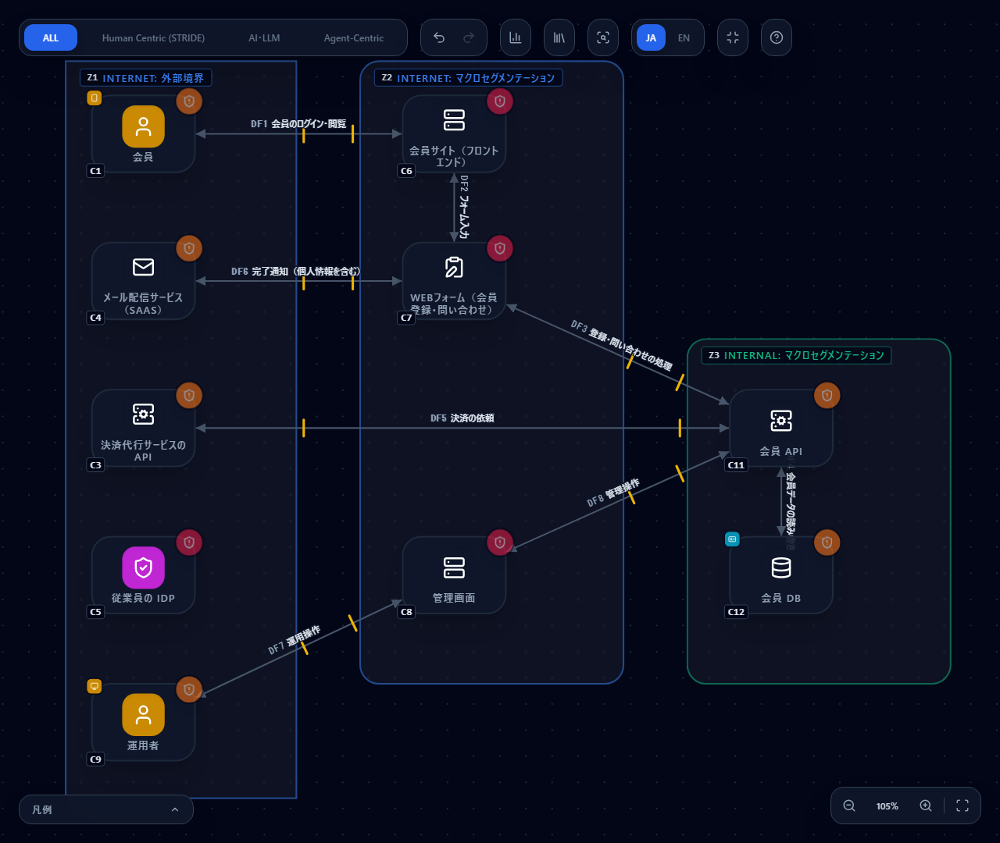

**図の中身：** コンポーネント 13・データフロー 8・トラスト境界 3（読み込むと **62 件**の脅威が検出されます。Critical 8・High 29・Medium 25）。

| 場所 | 描いたもの（型） |
|---|---|
| 外部境界（Internet） | 会員（`ユーザー`。会員のスマートフォンを内包）、メール配信サービス（`メール`）、決済代行サービスの API（`バックエンドAPI`）、従業員の IdP（`IdP`）、運用者（`ユーザー`。運用者の PC を内包） |
| 公開セグメント（Public Area） | 会員サイト（`フロントエンドサーバー`）、Web フォーム（`Webフォーム`）、管理画面（`フロントエンドサーバー`） |
| 内部セグメント（Internal） | 会員 API（`バックエンドAPI`）、会員 DB（`データベース`。会員の個人情報（`個人情報`）を内包） |

| 線 | 認証・暗号・経路 |
|---|---|
| DF1 会員 → 会員サイト | ID/パスワード・TLS・公衆網 |
| DF2 会員サイト → Web フォーム、DF3 Web フォーム → 会員 API、DF4 会員 API ⇄ 会員 DB | ID/パスワード・TLS・閉域網 |
| DF5 会員 API ⇄ 決済代行 API | API キー・TLS・公衆網 |
| DF6 Web フォーム ⇄ メール配信（個人情報を含む通知） | API キー・TLS・公衆網 |
| DF7 運用者 → 管理画面 | MFA・TLS・公衆網。**資格情報の発行元＝従業員の IdP** |
| DF8 管理画面 → 会員 API | ID/パスワード・TLS・閉域網 |

> **描き方のメモ。** 外部のサービスの出入口はすべて**インターネット側の境界**に置いています（社外の組織を DMZ に描かないため）。
> 会員サイトと管理画面は **Attack Surface Attribute**（公開の入口の属性）を入力しています。
> メール配信サービスを `SaaS` ではなく `メール` 型で描いたのは、Web フォームから通知メールへ個人情報が広がる脅威を出すためです（§4 #14）。
> 会員のスマートフォン・運用者の PC は、ユーザーの中に内包した端末です。

---

## 3. 運用状況を入力する

構成図に描いた形だけでは分からない状態があります。ログを何日残しているか、データベースは暗号化されているか、
パッチは当たっているか、アカウントの棚卸しをしているか、個人情報を何件・なぜ持っているか、最後に点検したのはいつか。
これらを、**ノードの「運用状況」セクション**に記録します（ノードを選ぶと右ペインに出ます）。

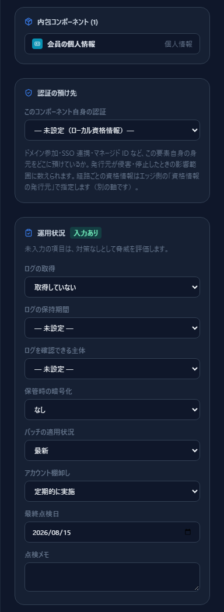

- 入力できる項目は**型ごとに決まっています**。会員 DB なら「ログ（取得・保持期間・確認できる主体）」「保管時の暗号化」「パッチ」「アカウント棚卸し」、
  Web フォームなら「ログ」「パッチ」、個人情報なら「保有の必要性」「件数規模」です（型ごとの項目は
  [`data/component-library/`](../data/component-library) の `posture:` に書かれています）。「最終点検日」「点検メモ」はどの型でも入力できます
- 公開の入口（フロントエンドサーバー・API ゲートウェイ）は、ログを取得しているかを既存の **Attack Surface Attribute の「アクセスログ」**で表し、
  運用状況には**保持期間と確認できる主体**だけを入力します

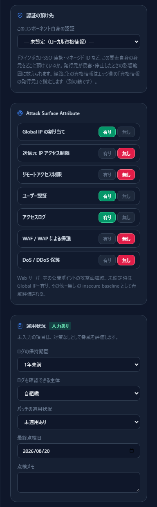

**未入力は「対策なし」として評価されます。** Attack Surface Attribute と同じ考え方です。分からないことを良い値に見せないための仕組みで、
未入力のために出た脅威には**「仮定検出」バッジ**と、「運用状況が未入力のため、対策なしとして評価しています」の注記が付きます。
たとえば決済代行サービスの API は、運用状況を何も入力していないので、次のカードが出ます。

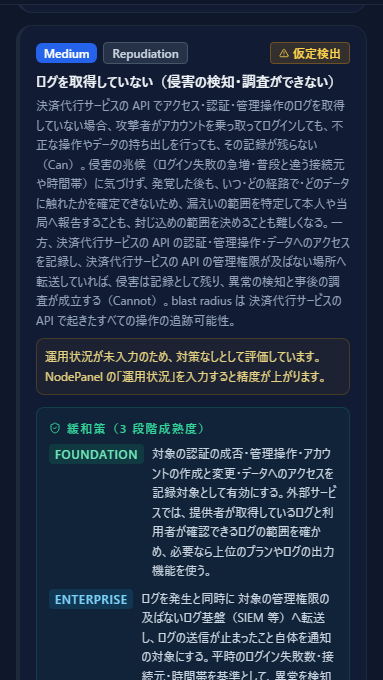

調べて入力すれば、その分の脅威が消えるか、実態に応じた重大度に変わります。入力できない項目（会員の端末など、自組織が確かめられないもの）は
未入力のまま残り、チェックリストでは「未入力」として見分けられます（§5）。

このテンプレートの「対策前」には、**入力済み・未入力・問題のある値**が混ざっています。

| 状態 | 例 |
|---|---|
| 問題のある値 | 会員 DB：保管時の暗号化「なし」・ログ「取得していない」。会員サイト：パッチ「未適用あり」。メール配信：アカウント棚卸し「不定期」。個人情報：保有の必要性「要検討」 |
| 問題のない値 | IdP：ログ「取得している・1 年以上」、アカウント棚卸し「定期的に実施」。会員 API：パッチ「最新」 |
| 未入力 | Web フォーム・決済代行サービスの API・会員のスマートフォンの運用状況（すべて空） |
| 古い最終点検日 | 会員 DB（2026-08-15）・会員サイト（2026-08-20）。最終点検日が空のノードもある |

---

## 4. 17 項目を 1 つずつ確かめる

以下、各項目を「図のどこを見て、何を入力すると、どの脅威が出る（消える）か」で並べます。
**出る脅威**の欄は、対策前の図の実測です。ルール ID は脅威カードの「検出根拠」と CSV に出ます。
`→` の右は、§6 の対策後の図の結果です。「（未入力）」は、属性が空のために仮定で出ているものです。
脅威が出なくなるまで図（＝実際の構成）を直すか、[Analytics](analytics-assessment.ja.md) でリスク対応方針と対策実装状況を記録します。

### 4.1 外部に公開しているアプリケーション（1〜7）


**#1 外部公開範囲の見直し**

- **見る場所：** 公開の入口は会員サイト（C6）と管理画面（C8）。管理画面にインターネット側から線（DF7）が届いていることが、まず目に付きます
- **入力：** 各入口の Attack Surface Attribute（Global IP・送信元 IP 制限・リモートアクセス制限）と、運用状況の「パッチの適用状況」
- **出る脅威：** グローバル IP 直接公開 `stride-web-global-ip-exposure-001`（C6・C8）、送信元 IP 無制限 `stride-web-no-source-ip-restriction-001`（C6・C8。未入力）、
  管理面リモートアクセス `stride-web-remote-mgmt-exposed-001`（C6・C8。Critical）、公開アプリの Web シェル設置 `webserver-webshell-implant-001`（C6・C8。Critical）、
  パッチの未適用 `posture-patch-missing-001`（C6 は「未適用あり」で Critical。C2・C3・C7 は未入力）
- **対策後 →** 管理画面に送信元 IP 制限・リモートアクセス制限を入れ、パッチを最新（または確認して入力）にすると、管理画面の 2 件とパッチの 3 件（C6 の未適用、C3・C7 の未入力）が消えます。
  公開していること自体に由来するグローバル IP 直接公開と Web シェルは残ります（会員に公開する以上、判断を記録する脅威です）

**#2 認証機能（多要素認証・パスワード）の強化**

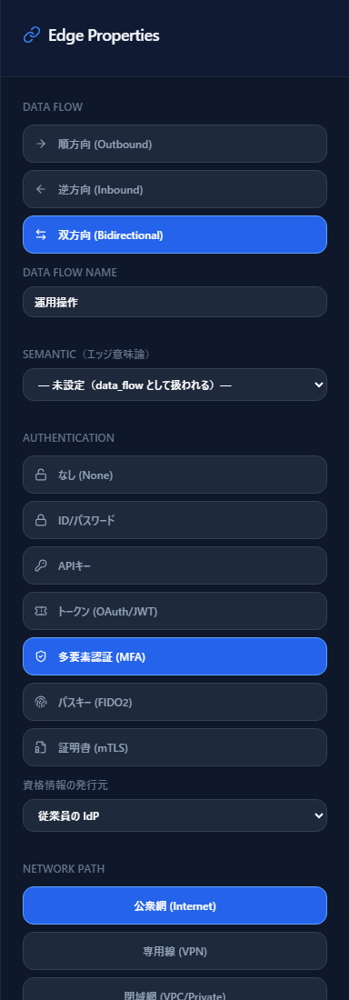

- **見る場所：** 線 DF1（会員 → 会員サイト：ID/パスワード）、DF5・DF6（API キー）、DF7（運用者 → 管理画面：MFA）。越境マーカーの色が黄色（パスワード・API キー・MFA）か赤（なし）の線が見直しの候補です。
  色は CISA ゼロトラスト成熟度モデル v2 の認証の段階に対応し、緑がパスキー・証明書です
- **入力：** 線の Authentication を実態どおりに（ID/パスワード・API キー・トークン・MFA・パスキー・証明書）
- **出る脅威：** パスワード・API キー単独の認証 / 公衆網 `stride-edge-password-internet-001`（DF1・DF5・DF6。High）、MFA を迂回する AiTM `zt-aitm-session-token-theft-001`（DF7。Medium）
- **対策後 →** DF7 をパスキーにすると AiTM が消えます。DF1・DF5・DF6 は残ります（会員の ID/パスワード認証と、決済・メール事業者が提供する API キー方式は、
  図を直しただけでは解消しません。会員向けの MFA の提供や、事業者がトークン・証明書方式を提供するかの確認が次の候補です）

**#3 アカウントへの権限付与の見直し**

- **見る場所：** 会員は `Guest`、運用者は `Employee`（ユーザーの User Trust）。運用者の線 DF7 は、認証の発行元に IdP（C5）を指定しています。
  会員の線 DF1 には発行元が無い＝会員サイト自身が会員の資格情報を持っています
- **入力：** ユーザーの User Trust、線の「資格情報の発行元」
- **出る脅威：** IdP を経由しないローカル資格情報 `identity-local-credential-outside-idp-001`（DF1。Medium）。対策後も同じです
- **扱い：** 会員の資格情報を会員サイトが持つのは設計上の事実です。会員向けの認証基盤（CIAM）に預けるのか、受容するのかを
  [Analytics](analytics-assessment.ja.md) のリスク対応方針に記録します

**#4 API 連携など構成要素単位の管理状況の見直し**

- **見る場所：** 決済代行 API への線 DF5（API キー・TLS・公衆網）。API をバックエンド API・API ゲートウェイ・API 仕様書で描くと、
  棚卸しの不備やゲートウェイを通らない直接の線が出ます
- **入力：** 連携先ごとの認証方式を線に、API の仕様を `API仕様書` で
- **出る脅威：** この図では出ません（会員サイトに API ゲートウェイも API 仕様書も描いていないため）。「問題なし」は
  **図が表す範囲で出ていない**という意味です。決済代行 API のキーの管理（保管場所・ローテーション）は図に出ないので、運用で確かめてください

**#5 構成要素単位の権限付与などの見直し**

- **見る場所：** 会員 API（C11）と決済代行 API（C3）。会員 API が決済代行を呼ぶ資格（API キー）と、管理画面が会員 API に持つ操作の範囲
- **入力：** 資格情報を持つアカウントを `サービスアカウント`・`OAuthクライアント` などで描き、何に権限を持つかを線で表します（[NHI と ID 基盤](nhi-identity.ja.md)）。
  この図では描いていないので NHI のルールは出ません
- **出る脅威：** オブジェクト・プロパティ単位の認可不備 `api-backend-object-level-authorization-001`、機能単位の認可不備 `api-backend-function-level-authorization-001`
  （C3・C11 で各 2 件。High）。対策後も同じです（認可の実装は図の属性では変わりません。API テストと設計で確かめ、対策実装状況に記録します）

**#6 ログ取得内容、保持期間の見直し**

- **見る場所：** 各ノードの運用状況（ログの取得・保持期間・確認できる主体）。公開の入口は Attack Surface の「アクセスログ」と運用状況の保持期間
- **入力：** ログの取得・保持期間（90 日未満・1 年未満・1 年以上）・確認できる主体（自組織・提供者のみ・両方）
- **出る脅威：** ログを取得していない `posture-log-not-collected-001`（会員 DB：High。C3・C7 は未入力で Medium）、
  ログの保持期間が短い `posture-log-retention-short-001`（C4・C11：Medium。C3・C7 は未入力で High）、アクセスログの保持期間が短い `posture-log-retention-short-002`（管理画面：90 日未満で High。会員サイト：Medium）、
  認証イベントの記録・保全の欠如 `identity-idp-authentication-log-gap-001`（IdP：Medium）
- **対策後 →** 各ノードのログを「取得している・1 年以上」にすると、ログの取得・保持期間の脅威（合計 9 件）がすべて消えます。
  IdP の認証イベントの記録（転送先・改ざん耐性を問う別の観点）は残ります

**#7 追加で実施できるセキュリティ対策の検討**

- **見る場所：** 公開の入口の WAF・DoS 保護。各脅威カードの対策は **[Foundation] / [Enterprise] / [Advanced]** の段階で書かれているので、今の段階の次を候補にします。
  どこに置けば最も効くかは[攻撃経路分析](attack-paths.ja.md)でチョークポイントを探します
- **入力：** Attack Surface の「WAF / WAP による保護」「DoS / DDoS 保護」、運用状況の「パッチ」
- **出る脅威：** アプリケーション層攻撃保護欠如 `stride-web-no-waf-001`（C6・C8。未入力）、DoS/DDoS 保護欠如 `stride-web-no-ddos-protection-001`（C6・C8。未入力）、`posture-patch-missing-001`
- **対策後 →** WAF を有りにすると 2 件が消え、DDoS 保護は会員サイトだけ有りにしました。**管理画面の DDoS 保護は未入力のまま**で、
  この項目の状態は「未入力」になります（正直に「まだ確かめていない」ことを示す状態です）

### 4.2 自組織が利用している外部サービス（8〜13）

会員サイトが使う外部サービスは、決済代行サービスの API（C3）、メール配信サービス（C4）、従業員の IdP（C5）です。

**#8 認証機能（多要素認証・パスワード）の強化**

- **見る場所：** 外部サービスへの線 DF5・DF6（API キー）と、IdP を使う運用者の線 DF7（MFA）。#2 と同じ線を、外部サービスの観点で見ます
- **出る脅威：** `stride-edge-password-internet-001`（DF5・DF6）、`zt-aitm-session-token-theft-001`（DF7）。対策後は DF7 のパスキー化で AiTM が消えます

**#9 アカウント付与の範囲見直し**

- **見る場所：** 委託先・取引先・ゲストの利用者（User Trust）から外部サービスや VPN への線
- **状態：** 「問題なし」。メール配信（C4）が対象になり、委託先・取引先・ゲストからの線に関する検出が無いためです（図が表す範囲での判定です。§5 で説明します）

**#10 アカウント棚卸しの運用見直し**

- **見る場所：** 線の「資格情報の発行元」（DF7 は IdP を指定、DF1 は未指定）と、外部サービス・IdP の運用状況「アカウント棚卸し」
- **入力：** 運用状況の「アカウント棚卸し」（定期的に実施・不定期・実施していない）
- **出る脅威：** アカウント棚卸しの運用がない・不定期 `posture-account-review-missing-001`（メール配信 C4：「不定期」。Medium）、`identity-local-credential-outside-idp-001`（DF1）
- **対策後 →** メール配信の棚卸しを「定期的に実施」にすると前者が消えます。DF1 は #3 のとおり残ります

**#11 API 連携など構成要素単位の管理状況の見直し**

- **見る場所：** SaaS と自組織のシステムを結ぶ連携（`OAuthクライアント`・`サービスアカウント`・`RPAボット`）
- **状態：** 「問題なし」。外部サービス（決済代行・メール配信・IdP）が対象になりますが、この図に `OAuthクライアント`・`サービスアカウント`・`RPAボット` は描いておらず、該当ルールの検出が無いためです。決済代行・メール配信との連携は、線の認証方式（#2）で見ています

**#12 ログ取得内容、保持期間の見直し**

- **見る場所：** 外部サービスのログを、**提供者と自組織のどちらが確認できるか**（運用状況の「ログを確認できる主体」）。決済代行 API・メール配信・IdP
- **入力：** ログの取得・保持期間・確認できる主体。提供者の管理画面や契約で確かめた値を入力します
- **出る脅威：** `posture-log-not-collected-001`・`posture-log-retention-short-001`（C3 は未入力、C4 は保持期間「1 年未満」）、`identity-idp-authentication-log-gap-001`（C5）
- **対策後 →** 決済代行 API は提供者に確認して「取得している・1 年以上・提供者のみ」と入力、メール配信は「1 年以上・両方」にして、残るのは IdP の 1 件です

**#13 適用できるセキュリティ対策の検討**

- **見る場所：** 把握していない外部サービス。`シャドークラウド`・`シャドーアプリ` で描くと統制外の利用として脅威が出ます
- **状態：** 「問題なし」。この図にシャドー IT は描いておらず、該当ルールの検出が無いためです（洗い出しで見つかれば描き足します）

### 4.3 保有するデータ（14〜17）

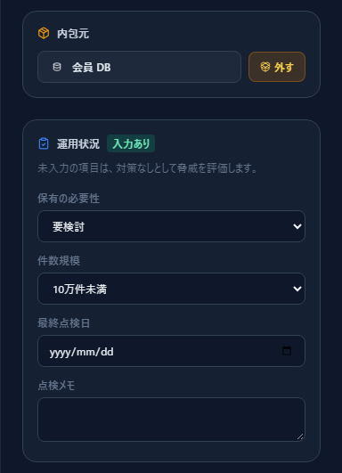

**#14 データ保有の是非の再検討**

- **見る場所：** 会員 DB（C12）に格納した個人情報（C13）の**保有の必要性と件数規模**。同じ個人情報が Web フォーム → メール配信（DF6）で通知メールにも広がっていないか
- **入力：** 個人情報ノードの「保有の必要性」（必要・要検討・不要）と「件数規模」
- **出る脅威：** 不要・要検討のデータを保有し続けている `posture-data-minimization-001`（C13：「要検討」で Medium）、
  情報漏洩 `stride-data-store-info-disclosure-001`（C12。High）、通知メール・チャットへの転送による個人情報の拡散 `webform-pii-propagation-001`（C7。Medium）
- **対策後 →** 使わない項目を削除して保有の必要性を「必要」にすると、保有の脅威が消えます。情報漏洩と、通知メールへの拡散は残ります
  （通知には受付番号だけを載せ、内容は管理画面で見る設計に変えない限り、図の線は同じです）

**#15 データ保管場所の再検討**

- **見る場所：** 会員 DB が内部セグメント（Z3）にあり、会員サイト → Web フォーム → 会員 API → 会員 DB と、インターネットから何ホップで届くか。
  [攻撃経路分析](attack-paths.ja.md)で個人情報の保管先を **OBJECTIVE** にすると、外部公開の入口からの経路とチョークポイントが出ます
- **出る脅威：** `stride-data-store-info-disclosure-001`（C12）。ストレージの公開設定の誤りは、この図にストレージを描いていないので出ません

**#16 データアクセスのログ取得内容、保持期間の見直し**

- **見る場所：** 会員 DB（C12）の運用状況（ログの取得・保持期間・確認できる主体）
- **出る脅威：** 監査追跡不能 `stride-data-store-repudiation-001`（C12。Medium）、`posture-log-not-collected-001`（C12：「取得していない」で High）
- **対策後 →** ログを取得して 1 年以上残すと後者が消えます。監査追跡不能（改ざん耐性のある保管や追記専用の記録を問う一般的な指摘）は残ります

**#17 データの暗号化**

- **見る場所：** 通信路は線の Encryption（この図は全線 TLS）。**保管時の暗号化**は会員 DB の運用状況「保管時の暗号化」
- **入力：** なし・あり（事業者管理の鍵）・あり（自組織管理の鍵）
- **出る脅威：** 保管時に暗号化していない `posture-encryption-at-rest-missing-001`（C12：「なし」で High。C2 会員のスマートフォンは未入力で Medium）、
  暗号インベントリの欠如 `pqc-crypto-inventory-cbom-gap-001`（C6・C8・C12。Medium）
- **対策後 →** 会員 DB を「あり（自組織管理の鍵）」にすると C12 の 1 件が消えます。会員のスマートフォンは自組織が確かめられないので未入力のまま残り、
  暗号インベントリの欠如も残ります（PQC レイヤーで暗号情報を記録する別の作業です。[PQC 移行を支援する](pqc-migration.ja.md)）

---

## 5. 注意喚起チェックリストで 17 項目の現状を一覧する

ここまでの確認を、**17 項目の一覧**にまとめるのが注意喚起チェックリストです。左サイドバーの **Report** メニューから
**注意喚起チェックリスト**を開きます。対象のレイヤーを選ぶと、項目ごとの状態・関係ノード・検出の内訳・確かめ方が並びます。
関係ノードをクリックすると、図の該当ノードが選ばれます。

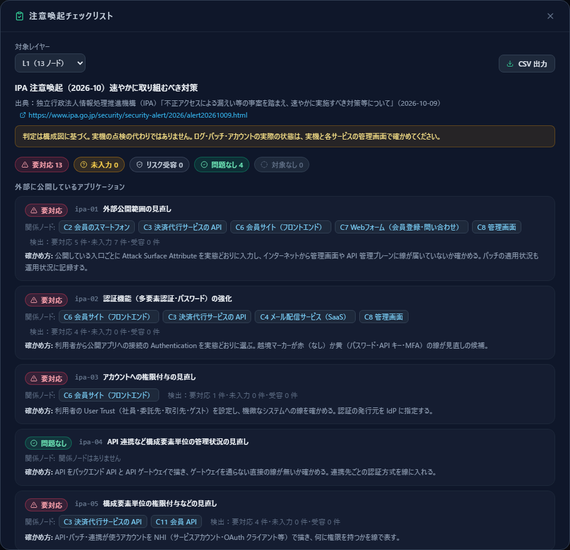

先頭の集計は、**要対応 13・未入力 0・リスク受容 0・問題なし 4・対象なし 0**です（対策前。執筆時点）。

| 状態 | 意味 | この図の例 |
|---|---|---|
| 要対応 | 未入力でない根拠で検出された脅威がある | 13 項目（#1〜#3・#5・#6・#7・#8・#10・#12・#14〜#17） |
| 未入力 | 検出はすべて未入力（属性が空）のため「対策なし」と仮定したもの | 対策前は 0 件。対策後に 1 件（§6） |
| リスク受容 | 検出はすべて、脅威カードのリスク対応方針で「受容」済み | 0 件。Analytics で受容を記録するとこの状態になる |
| 問題なし | 対象のノードがあり、検出が無い | #4・#9・#11・#13 |
| 対象なし | 図にこの項目の対象となる型のノードが無い | この図には無い（0 件） |

- 「問題なし」は、**図が表す範囲で出ていない**という意味です。実機の問題が無いという意味ではありません
- 「対象なし」は、描いていないものは評価されないという意味です。たとえば、外部サービス（`SaaS`・`メール`・`CRM` など）を 1 つも描いていない図では #8〜#13 が「対象なし」になります。
  このページの図では、外部サービスを描いているため、#9・#11・#13 は「問題なし」です（業務アプリ・クラウドも「自組織が利用している外部サービス」として対象になります）
- 一覧の最後に、**点検が古い・未記録のノード**が出ます。最終点検日が未記録か、基準日から 30 日（チェックリストごとに決まります）を超えているノードです

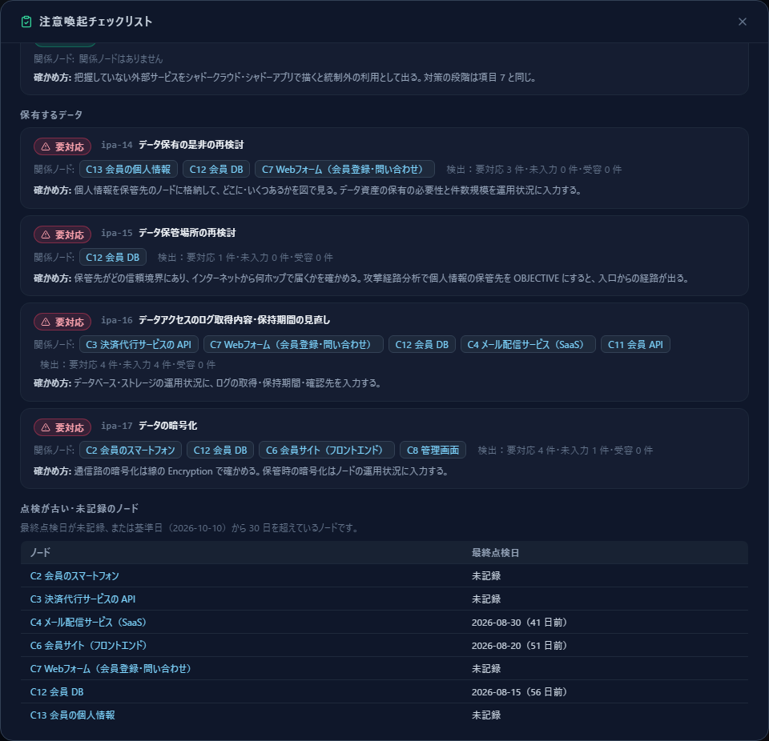

**CSV 出力。** 右上の **CSV 出力** で、項目単位の CSV（状態・対象の型のノード数・関係ノード数・要対応／未入力／受容の件数・関係ノード・確かめ方・確認が必要なノード＝要対応の検出があるノード）を書き出せます。
表計算ソフトで担当者や期限を足して、運用の台帳にできます。

**CLI で同じ一覧を出す。** 図を保存したプロジェクト JSON（左サイドバー **ファイル（保存 / 開く）** で書き出せます）を渡します。
`dist-cli/main.js` は `npm run build:cli` で作ります（[AI駆動開発のCIに組み込む](ci-integration.ja.md)）。

```bash
node dist-cli/main.js checklist membership-site.json --id ipa-alert-2026-10 --format md --as-of 2026-10-10
```

```text
## 集計

要対応 13; 未入力 0; リスク受容 0; 問題なし 4; 対象なし 0
```

`--format` は `md`・`json`・`csv`、`--as-of` は「点検が古い」判定の基準日（省略時は今日）です。
**`--fail-on-action`** を付けると、状態が「要対応」の項目が 1 つでもあれば終了コード 1 で止まります（このテンプレートは 13 項目なので止まります）。

```bash
node dist-cli/main.js checklist membership-site.json --id ipa-alert-2026-10 --fail-on-action
# --fail-on-action: 要対応の項目が 13 件あります。   （終了コード 1）
```

---

## 6. 対策後 — 属性を更新するとチェックリストが変わる

注意喚起の対策を取ったつもりで、図の属性を更新します。**「対策後」のテンプレート**（[`membership-site-after.ja.json`](templates/membership-site-after.ja.json)）を読み込むと、
更新後の状態が分かります。対策前から変えたのは次のとおりです。

| ノード | 対策前 → 対策後 |
|---|---|
| 管理画面（C8） | 送信元 IP 制限：無し → 有り。リモートアクセス制限：無し → 有り。WAF：無し → 有り。ログの保持期間：90 日未満 → 1 年以上。運用者 → 管理画面の認証：MFA → パスキー |
| 会員サイト（C6） | WAF・DoS 保護：無し → 有り。ログの保持期間：1 年未満 → 1 年以上。パッチ：未適用あり → 最新 |
| Web フォーム（C7）・決済代行 API（C3） | 運用状況：未入力 → ログ取得・1 年以上・パッチ最新（決済代行は提供者に確認して入力。確認できる主体は提供者のみ） |
| 会員 API（C11） | ログの保持期間：1 年未満 → 1 年以上 |
| 会員 DB（C12） | ログ：取得していない → 取得・1 年以上。保管時の暗号化：なし → あり（自組織管理の鍵） |
| 会員の個人情報（C13） | 保有の必要性：要検討 → 必要（使わない項目を削除したうえで） |
| メール配信（C4） | ログの保持期間：1 年未満 → 1 年以上・確認できる主体：両方。アカウント棚卸し：不定期 → 定期的に実施 |
| 各ノード | 最終点検日：2026-10-10 に更新（IdP・運用者の PC を含む） |

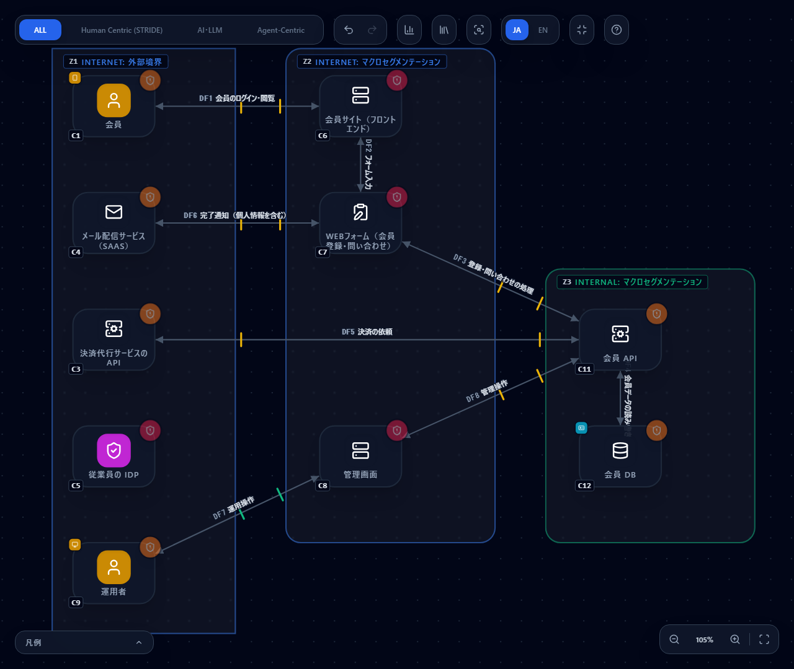

**脅威の件数：62 件 → 41 件**（Critical 8 → 6・High 29 → 18・Medium 25 → 17。実測。`diff` では「追加 0 件・解消 21 件」）。

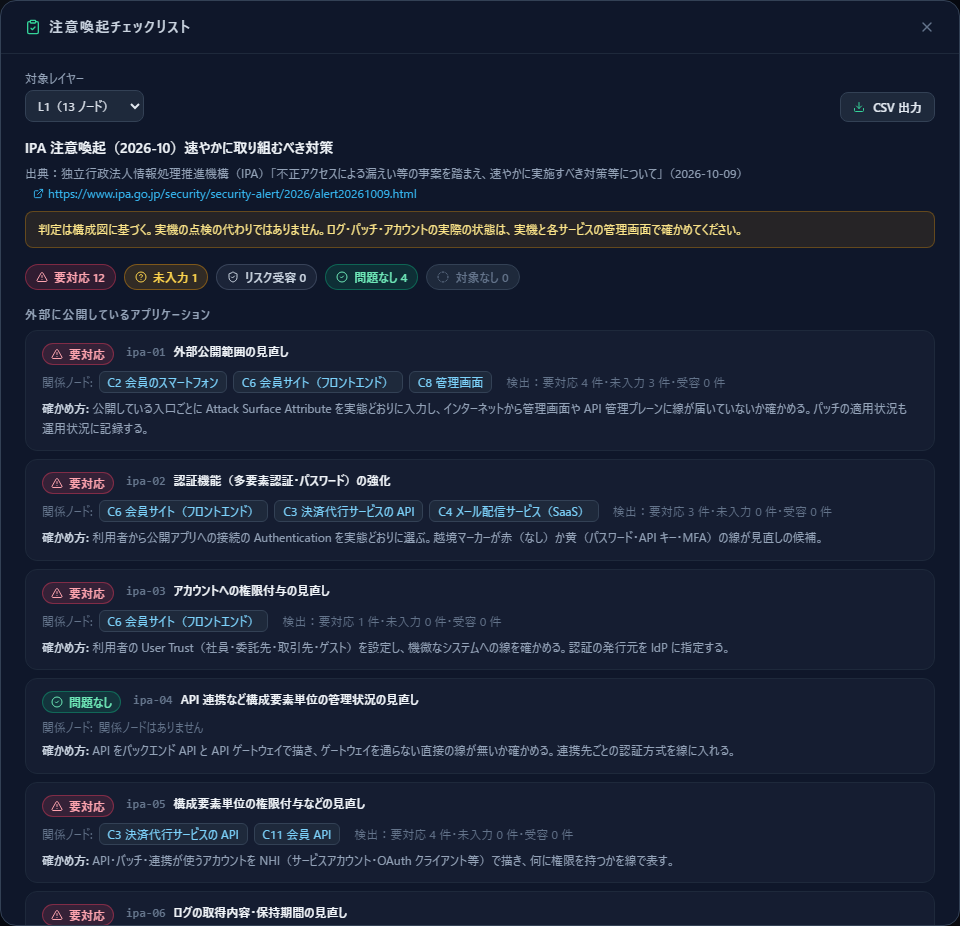

| | 対策前 | 対策後 |
|---|---|---|
| 要対応 | 13 | 12 |
| 未入力 | 0 | 1（#7。管理画面の DDoS 保護と会員の端末が空） |
| リスク受容 | 0 | 0 |
| 問題なし | 4 | 4 |
| 対象なし | 0 | 0 |
| 検出の件数（要対応＋未入力） | #1：12 → 7、#6：10 → 1、#12：8 → 1、#16：8 → 1、#7：8 → 2 など | |
| 点検が古い・未記録のノード | 7（C2・C3・C4・C6・C7・C12・C13） | 1（C2 会員のスマートフォン） |

**全部は解消しません。** 対策後も要対応が 12 項目残っています。残ったのは、会員の ID/パスワード認証（#2・#3・#8・#10）、
決済・メール事業者の API キー（#2・#8）、認可の実装（#5）、公開していることそのもの（#1）、個人情報の保有に伴う漏えいと通知メールへの拡散（#14・#15）、
監査追跡と暗号インベントリ（#16・#17）です。**図の属性では消せないものを、残ったまま正直に示す**のが、このチェックリストの使い方です。
残った項目は、Analytics でリスク対応方針（低減・受容・移転・回避）と理由を記録し、受容したものは「リスク受容」の状態にします。

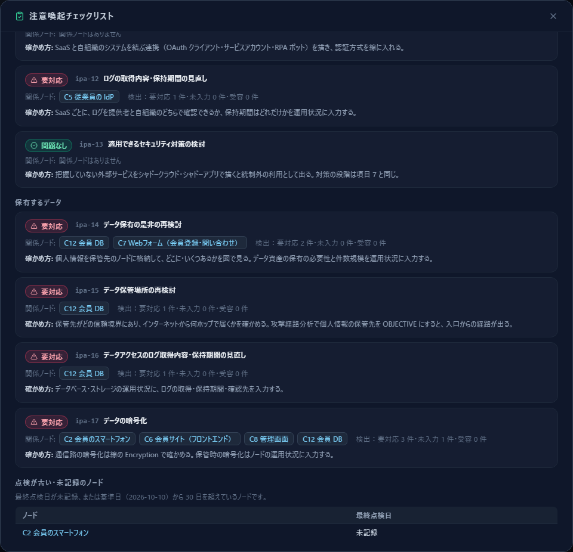

---

## 7. 更新し続ける運用

注意喚起の対応は、一度確かめて終わりではありません。構成も、ログの設定も、パッチの状況も変わります。

1. **最終点検日を更新する。** 点検したノードの運用状況の「最終点検日」を、点検した日に更新します（変えた点があれば、その属性も更新します）。
   最終点検日は**記録用で、脅威の判定には使いません**（実行日で結果が変わらないので、CI の差分が安定します）
2. **点検が古いノードを見る。** チェックリストの末尾に、最終点検日が未記録か 30 日を超えたノードが出ます（基準日は CLI の `--as-of`）。
   月に 1 回など決めた間隔で、このリストを空にします。一覧に出るのは、チェックリストの対象の型のノードです
3. **CI に組み込む。** 構成の変更で弱いところが戻ったことを、プルリクエストの時点で検知できます。
   差分ゲート（`diff --fail-on High`。[AI駆動開発のCIに組み込む](ci-integration.ja.md)）に加えて、チェックリストを CI で出す例です

   ```yaml
   # .github/workflows/ipa-alert-checklist.yml（抜粋）
   - uses: actions/checkout@v7
   # CyberRiskScape の CLI を作る手順は ci-integration を参照（dist-cli/main.js ができる）
   - name: 注意喚起チェックリスト
     run: |
       node dist-cli/main.js checklist threat-model/project.json \
         --id ipa-alert-2026-10 --format md --out checklist.md
       cat checklist.md >> "$GITHUB_STEP_SUMMARY"
       # 要対応が 0 になった後で、戻りを止めるなら次の行を足す
       # node dist-cli/main.js checklist threat-model/project.json --id ipa-alert-2026-10 --fail-on-action
   ```

   最初は要対応が残るので、`--fail-on-action` は付けずに一覧をジョブの要約に出し、対応が進んで要対応が 0 になってから付ける、という使い方を勧めます
4. **次の注意喚起は YAML を足すだけ。** チェックリストの項目・確かめ方・対象の型・関係するルールは、コードではなく
   [`data/checklists/ipa-alert-2026-10.yaml`](../data/checklists/ipa-alert-2026-10.yaml) に書かれています。次に別の注意喚起が出たら、
   同じ形式の YAML を `data/checklists/` に足すと、画面（Report メニュー）と CLI（`--id`）の両方に出ます。判定のルール（要対応・未入力など）は共通です

---

## 8. 限界（確かめられないこと）

- **実機の状態は分かりません。** ログの異常、未適用のパッチ、作成した覚えのないアカウント、無効化したはずのアカウントの有無は、
  実機・各サービスの管理画面・ログで確かめてください。運用状況は「そう運用しているはず」「確かめた」という**入力**であって、観測ではありません
- **判定は構成図に基づきます。** 描いていない SaaS・アカウント・データは評価されません。「問題なし」「対象なし」は、図が表す範囲での判定です
- **アカウントの数・権限の実際の中身**は、図からは分かりません。実際の件数や棚卸しの結果は、各システムの管理機能で確かめてください
- 注意喚起が求める**経営者のリーダーシップ・インシデント対応・専門事業者への調査依頼**は、ツールの範囲外です。
  [PDF レポート](report-export.ja.md)は、経営層への報告の材料に使えます
- チェックリストの項目と脅威ルール・型の対応は、**CyberRiskScape 側の解釈**です。IPA が定めたものではありません

---

## 参考リンク

1. IPA「不正アクセスによる漏えい等の事案を踏まえ、速やかに実施すべき対策等について」（2026 年 10 月 9 日）
   <https://www.ipa.go.jp/security/security-alert/2026/alert20261009.html>
2. JPCERT/CC の注意喚起 <https://www.jpcert.or.jp/at/2026/at260030.html>
3. 経済産業省・IPA「サイバーセキュリティ経営ガイドライン」 <https://www.meti.go.jp/policy/netsecurity/mng_guide.html>
4. CISA「Zero Trust Maturity Model」Version 2.0 <https://www.cisa.gov/zero-trust-maturity-model>

## 次に読むもの

- [インターネット露出を減らす](exposure-reduction.ja.md) — 外部公開の資産の洗い出しと、要らない露出の削減
- [NHI と ID 基盤を脅威モデリングする](nhi-identity.ja.md) — 構成要素ごとのアカウントと権限
- [攻撃経路分析](attack-paths.ja.md) — どこに対策を置けば最も効くか
- [AI駆動開発のCIに組み込む](ci-integration.ja.md) — 構成の変更で弱いところが戻ったことを検知する
