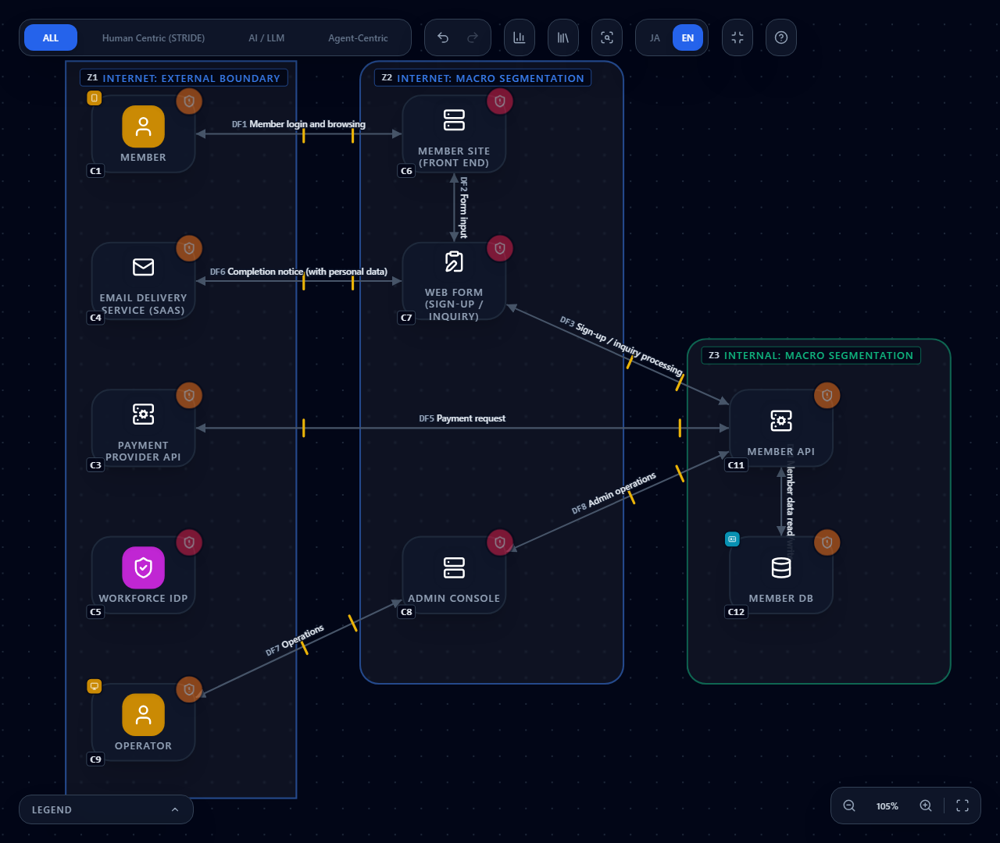
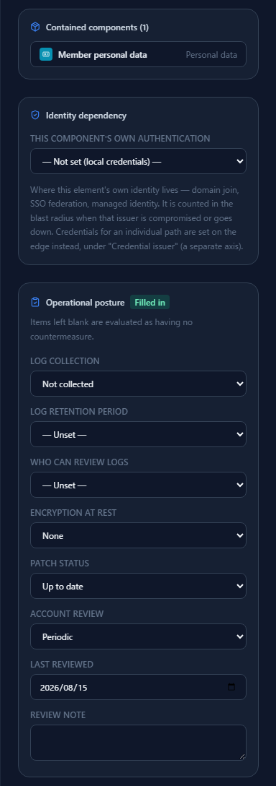
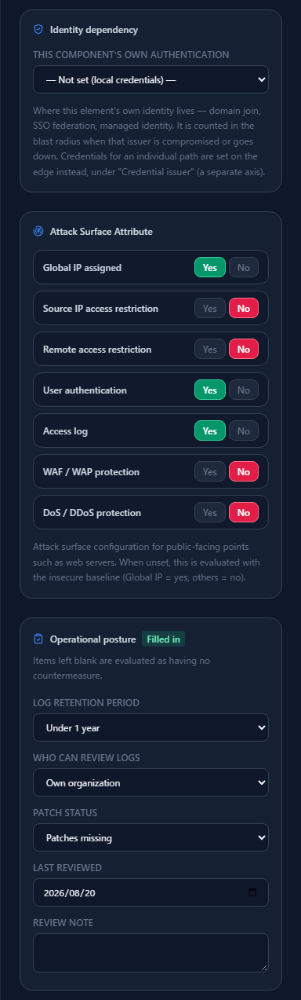
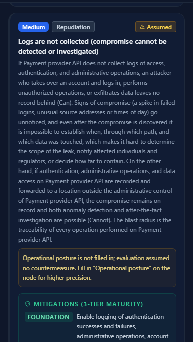
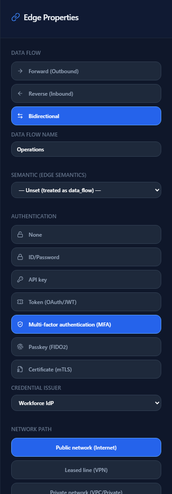
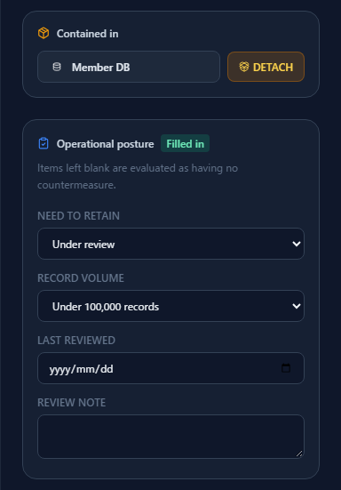
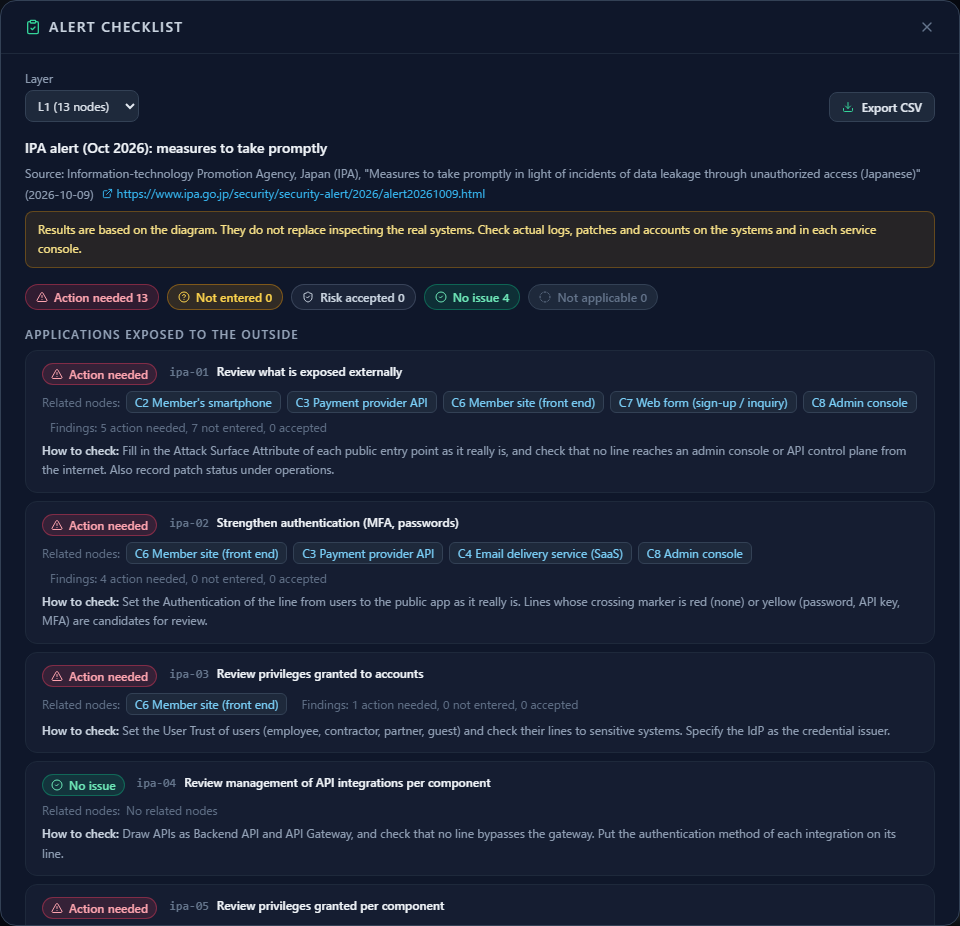
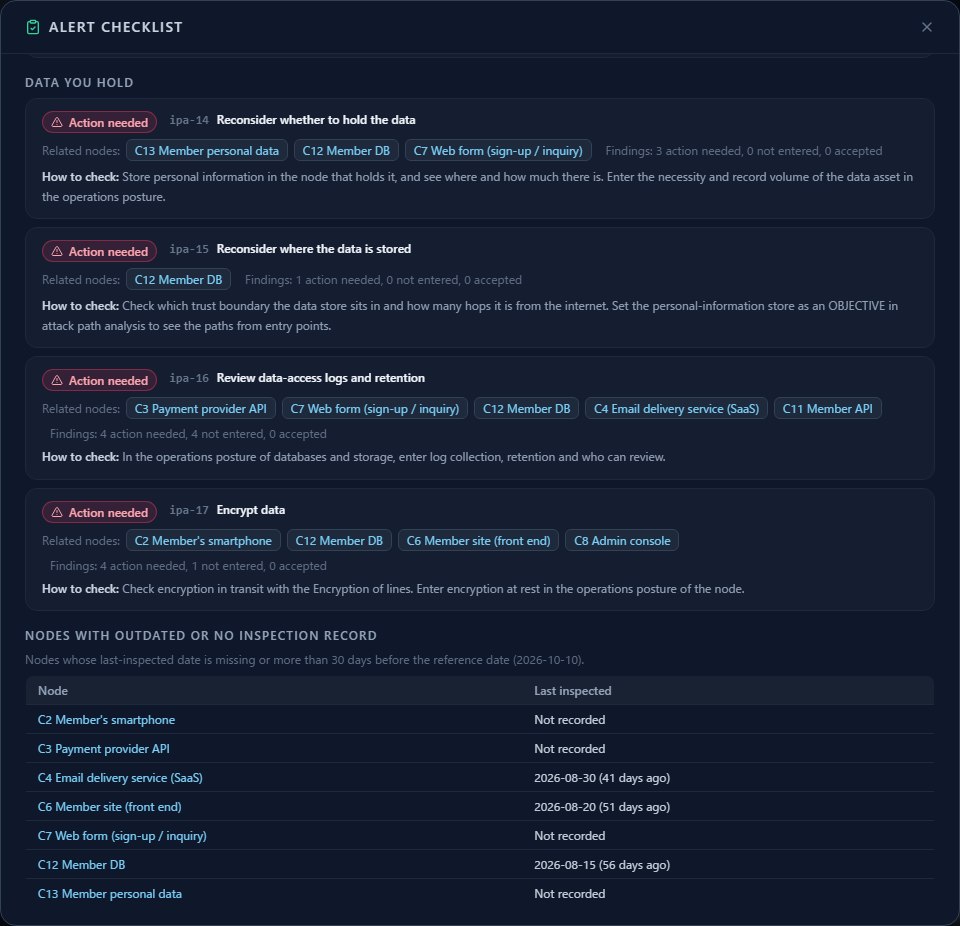
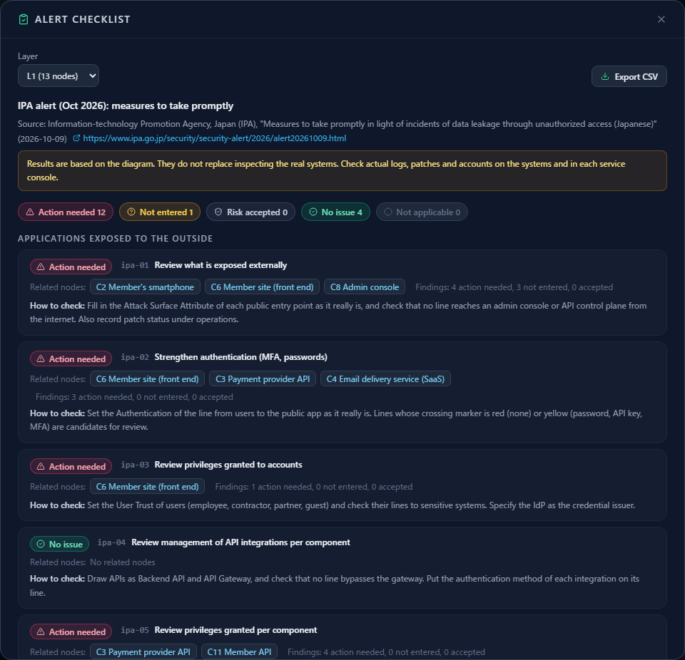
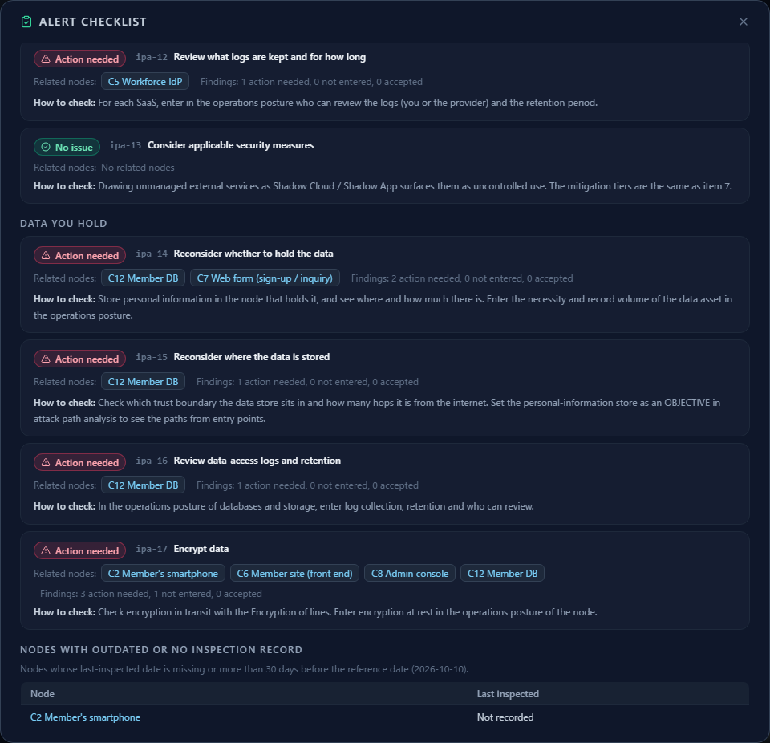

# Checking the measures in IPA's October 2026 alert with a membership-site diagram

**English** | [日本語](ipa-alert-2026-10.ja.md)

> This page explains how to check the measures listed in the alert "Measures to take promptly in light of incidents of data
> leakage through unauthorized access" published by the Information-technology Promotion Agency, Japan (IPA) on 9 October 2026
> ([source 1](#references); the original is in Japanese), using CyberRiskScape's diagram, operational-posture record, and alert
> checklist, with an imaginary membership site as the example.
> It is not produced, certified, or endorsed by IPA. The alert's contents are summarized here, not reproduced.
> Always read the original for the exact measures and the latest information. Counts and statuses are measured values as of
> writing (October 2026).

---

## 1. What you will learn, and prerequisites

- The **17 measures to take promptly** in the alert (7 for public-facing applications, 6 for external services in use, 4 for held data)
- For a simple membership site (a front-end server, a web form, and an API connection to a payment provider), **what to look at in the
  diagram and what to enter to check each of the 17 items, one by one**
- How to **record on each node** what a diagram cannot show on its own: log retention, encryption at rest, patches, account review,
  data held, and last review date
- How to list the current state of the 17 items in the **alert checklist**, update the attributes after remediation and **see the
  statuses change**, and turn that into a routine that **keeps it up to date**

**Summary of the alert**

Disclosures of data leaks through unauthorized access are continuing across a wide range of organizations in Japan. Many cases involve
online services and account services that handle large volumes of personal data being breached and the data stolen. The attacks are not
attributed to a vulnerability in one specific product; the starting points are thought to be **compromise of publicly exposed
applications and services, and compromise of accounts**. Secondary harm is also spreading, such as extortion that threatens to publish
the stolen data and illegal sales of it.

The alert first asks organizations to **inventory their public-facing applications and external services, and to inspect logs,
accounts, and patches**, and then, even if nothing abnormal is found, to consider stronger measures (the 17 items on this page).

**What CyberRiskScape covers**

CyberRiskScape is a tool that **finds threats from the design (the diagram)**. For the 17 items, it checks on the diagram whether there
is a weakness in configuration, authentication, privileges, logging, or where data is kept, and produces material for deciding where to
start. **Whether logs show anomalies, whether patches are missing, or whether suspicious accounts exist cannot be known from a diagram.**
Do that inspection on the real systems and in each service's console (§8).

**Prerequisites:** the operations in [Getting Started](getting-started.md), [Reading the Threat Panel](reading-threats.md), and
[Creating and Using Templates](templates.md).

---

## 2. The example membership site: load the template and look at the structure

To make this easy to picture, assume the following **imaginary, simple membership site**.

- Members log in to the front-end server (the member site) from a smartphone and browse
- Sign-ups and inquiries are accepted through a web form and saved to the member database (personal data) through a member API
- The member API connects to a payment provider's API with an API key to request payments
- The web form sends completion notices as email through an email delivery service (SaaS)
- Operators sign in to an admin console from outside the office, such as from home, with credentials issued by the workforce IdP

You can load the following templates as they are (the procedure is the same as in [the templates chapter](templates.md#3-importing)).
**Load "before" first.**

| File | Contents |
|---|---|
| [`templates/membership-site-before.en.json`](templates/membership-site-before.en.json) ([Japanese](templates/membership-site-before.ja.json)) | Before: the current structure and posture, including blank and problematic values |
| [`templates/membership-site-after.en.json`](templates/membership-site-after.en.json) ([Japanese](templates/membership-site-after.ja.json)) | After: the attributes once the alert's measures are taken (§6) |



**What the diagram contains:** 13 components, 8 data flows, and 3 trust boundaries. Loading it detects **62 threats** (8 Critical,
29 High, 25 Medium).

| Place | What is drawn (type) |
|---|---|
| External boundary (Internet) | Member (`User`, containing the member's smartphone), email delivery service (`Mail`), payment provider API (`Backend API`), workforce IdP (`IdP`), operator (`User`, containing the operator's PC) |
| Public segment (Public Area) | Member site (`Front-end Server`), web form (`Web form`), admin console (`Front-end Server`) |
| Internal segment (Internal) | Member API (`Backend API`), member DB (`Database`, containing the members' personal data (`Personal data`)) |

| Flow | Authentication, encryption, path |
|---|---|
| DF1 Member to member site | ID/password, TLS, public network |
| DF2 Member site to web form, DF3 Web form to member API, DF4 Member API and member DB | ID/password, TLS, private network |
| DF5 Member API and payment provider API | API key, TLS, public network |
| DF6 Web form and email delivery (notice that contains personal data) | API key, TLS, public network |
| DF7 Operator to admin console | MFA, TLS, public network. **Credential issuer: the workforce IdP** |
| DF8 Admin console to member API | ID/password, TLS, private network |

> **Drawing notes.** The external services' entry points are all on the **Internet side of the boundary** (an outside organization is
> not drawn in the DMZ). The member site and the admin console have their **Attack Surface Attribute** (the attributes of a public entry
> point) filled in. The email delivery service is drawn with the `Mail` type, not `SaaS`, so that the threat of personal data spreading
> from the web form to notification mail appears (§4 #14). The member's smartphone and the operator's PC are devices contained inside
> their users.

---

## 3. Enter the operational posture

Some states cannot be known from the shape of the diagram: how many days of logs are kept, whether the database is encrypted, whether
patches are applied, whether accounts are reviewed, how many records of personal data are held and why, and when it was last inspected.
You record these in the **"Operational posture" section of a node** (it appears in the right pane when you select the node).



- The fields you can enter **depend on the type**. For the member DB: logs (collection, retention, who can review), encryption at rest,
  patches, and account review. For a web form: logs and patches. For personal data: need to retain and record volume (the fields per
  type are in the `posture:` entries under [`data/component-library/`](../data/component-library)). "Last reviewed" and "Review note"
  can be entered on any type
- Public entry points (front-end servers and API gateways) express whether logging is on with the existing **Attack Surface Attribute
  "Access log"**, and you enter only **retention and who can review** in the operational posture



**Blank fields are evaluated as "no countermeasure".** This is the same idea as the Attack Surface Attribute, a way of not making
unknowns look good. A threat that appears because of a blank field gets an **"Assumed" badge** and the note "Operational posture is not
filled in; evaluation assumed no countermeasure." For example, the payment provider's API has no posture entered at all, so this card
appears.



If you investigate and enter the value, that threat disappears or changes to the severity the real state deserves. Fields you cannot
fill in (such as members' devices, which your organization cannot verify) stay blank, and the checklist distinguishes them as "Not
entered" (§5).

The "before" template **mixes filled-in, blank, and problematic values**.

| State | Example |
|---|---|
| Problematic values | Member DB: encryption at rest "None", logs "Not collected". Member site: patches "Patches missing". Email delivery: account review "Irregular". Personal data: need to retain "Under review" |
| Unproblematic values | IdP: logs "Collected, 1 year or more", account review "Periodic". Member API: patches "Up to date" |
| Blank | Web form, payment provider API, and the member's smartphone (all empty) |
| Old last reviewed date | Member DB (2026-08-15) and member site (2026-08-20). Some nodes have no date |

---

## 4. Check the 17 items one by one

Below, each item is described as "where to look in the diagram, what to enter, and which threats appear (or disappear)". The **threats
that appear** are measured on the "before" diagram. The rule IDs appear in the threat card's "Detection basis" and in the CSV. What
follows `→` is the result on the "after" diagram of §6. "(blank)" marks threats that appear on an assumption because an attribute is
empty. Either fix the diagram (that is, the real configuration) until the threat no longer appears, or record the risk treatment and
countermeasure status in [Analytics](analytics-assessment.md).

### 4.1 Public-facing applications (1 to 7)


**#1 Review what is exposed externally**

- **Where to look:** the public entry points are the member site (C6) and the admin console (C8). What stands out first is that a flow
  (DF7) reaches the admin console from the Internet side
- **What to enter:** the Attack Surface Attribute of each entry point (Global IP, source IP restriction, remote access restriction) and
  the operational posture's "Patch status"
- **Threats that appear:** Direct Global IP Exposure `stride-web-global-ip-exposure-001` (C6, C8), Unrestricted Source IP Access
  `stride-web-no-source-ip-restriction-001` (C6, C8; blank), Exposed Remote Management Interface `stride-web-remote-mgmt-exposed-001`
  (C6, C8; Critical), Web shell planted by exploiting a public-facing application `webserver-webshell-implant-001` (C6, C8; Critical),
  and unapplied patches `posture-patch-missing-001` (C6 is "Patches missing", Critical; C2, C3, and C7 are blank)
- **After →** adding a source IP restriction and a remote access restriction to the admin console and bringing patches up to date (or
  confirming and entering them) removes 2 threats on the admin console and 3 patch threats (C6 missing, C3 and C7 blank). Direct
  Global IP Exposure and the web shell, which come from being public at all, remain (they are threats whose decision you record,
  since the site must be open to members)

**#2 Strengthen authentication (MFA, passwords)**



- **Where to look:** flow DF1 (member to member site: ID/password), DF5 and DF6 (API keys), and DF7 (operator to admin console: MFA).
  Flows whose boundary-crossing marker is yellow (password, API key, MFA) or red (none) are candidates for review. The colors
  correspond to the authentication stages of the CISA Zero Trust Maturity Model v2, and green is passkey or certificate
- **What to enter:** the flow's Authentication, as it really is (ID/password, API key, token, MFA, passkey, certificate)
- **Threats that appear:** Password- or API-Key-Only Authentication over a Public Network `stride-edge-password-internet-001` (DF1,
  DF5, DF6; High) and AiTM phishing session-token theft that bypasses MFA `zt-aitm-session-token-theft-001` (DF7; Medium)
- **After →** making DF7 a passkey removes the AiTM threat. DF1, DF5, and DF6 remain (members' ID/password authentication and the API
  key method offered by the payment and email providers are not resolved by editing the diagram. Next candidates are offering MFA to
  members and asking the providers whether they offer a token or certificate method)

**#3 Review privileges granted to accounts**

- **Where to look:** members are `Guest` and the operator is `Employee` (the User Trust of a user). The operator's flow DF7 names the
  IdP (C5) as the credential issuer. The member's flow DF1 has no issuer, meaning the member site itself holds the members' credentials
- **What to enter:** the User Trust of users and the flow's "Credential issuer"
- **Threats that appear:** Local credentials that bypass the central IdP `identity-local-credential-outside-idp-001` (DF1; Medium).
  The same after remediation
- **How to treat it:** the member site holding members' credentials is a fact of the design. Record in the risk treatment of
  [Analytics](analytics-assessment.md) whether you will move them to a customer identity platform (CIAM) or accept the risk

**#4 Review management of API integrations per component**

- **Where to look:** DF5 to the payment provider's API (API key, TLS, public network). Drawing APIs with a backend API, an API gateway,
  and an API specification brings out inventory gaps and direct flows that bypass the gateway
- **What to enter:** the authentication method of each integration on its flow, and the API's specification as an `API specification`
- **Threats that appear:** none in this diagram (the member site has no API gateway or API specification drawn). "No issue" means
  **nothing appears in what the diagram represents**. How the payment provider's API key is managed (where it is stored, rotation) does
  not show in the diagram, so check it in operations

**#5 Review privileges granted per component**

- **Where to look:** the member API (C11) and the payment provider API (C3): the credential (API key) the member API uses to call the
  payment provider, and the range of operations the admin console has on the member API
- **What to enter:** draw the accounts that hold credentials as `Service account`, `OAuth client`, and so on, and show what they have
  privileges on with flows ([Threat Modeling NHIs and Identity Platforms](nhi-identity.md)). They are not drawn in this diagram, so the NHI rules
  do not appear
- **Threats that appear:** Broken object and property level authorization `api-backend-object-level-authorization-001` and Broken
  function level authorization `api-backend-function-level-authorization-001` (2 each on C3 and C11; High). The same after remediation
  (authorization implementation does not change with diagram attributes; check it with API tests and design, and record the
  countermeasure status)

**#6 Review what is logged and for how long**

- **Where to look:** each node's operational posture (log collection, retention, who can review). For public entry points, the Attack
  Surface "Access log" and the posture's retention
- **What to enter:** collection, retention (under 90 days, under 1 year, 1 year or more), and who can review (own organization,
  provider only, both)
- **Threats that appear:** Logs are not collected `posture-log-not-collected-001` (member DB: High; C3 and C7 are blank, Medium), Log
  retention is too short `posture-log-retention-short-001` (C4 and C11: Medium; C3 and C7 are blank, High), Access log retention is too
  short `posture-log-retention-short-002` (admin console: under 90 days, High; member site: Medium), and Missing recording and
  preservation of authentication events `identity-idp-authentication-log-gap-001` (IdP: Medium)
- **After →** setting each node's logs to "Collected, 1 year or more" removes all of the collection and retention threats (9 in
  total). The IdP's authentication-event recording (a different angle, asking about forwarding and tamper resistance) remains

**#7 Consider additional security measures**

- **Where to look:** the WAF and DoS protection of the public entry points. Each threat card's mitigations are written in the stages
  **[Foundation] / [Enterprise] / [Advanced]**, so make the stage after your current one the candidate. To find where one measure helps
  most, look for choke points with [Attack Path Analysis](attack-paths.md)
- **What to enter:** the Attack Surface "WAF / WAP protection" and "DoS / DDoS protection", and the posture's "Patch status"
- **Threats that appear:** Missing Application-Layer Attack Protection `stride-web-no-waf-001` (C6, C8; blank), Missing DoS/DDoS
  Protection `stride-web-no-ddos-protection-001` (C6, C8; blank), and `posture-patch-missing-001`
- **After →** turning WAF on removes 2 threats, and DDoS protection is on for the member site only. **The admin console's DDoS
  protection stays blank**, so the item's status becomes "Not entered" (a status that honestly shows "not yet checked")

### 4.2 External services in use (8 to 13)

The external services the member site uses are the payment provider's API (C3), the email delivery service (C4), and the workforce IdP
(C5).

**#8 Strengthen authentication (MFA, passwords)**

- **Where to look:** flows DF5 and DF6 to external services (API key) and the operator's flow DF7 (MFA), which uses the IdP. The same
  flows as #2, seen from the external-service side
- **Threats that appear:** `stride-edge-password-internet-001` (DF5, DF6) and `zt-aitm-session-token-theft-001` (DF7). After
  remediation, making DF7 a passkey removes the AiTM threat

**#9 Review the scope of accounts granted**

- **Where to look:** flows from contractor, partner, and guest users (User Trust) to external services or a VPN
- **Status:** "No issue". The email delivery (C4) is a target and nothing was detected for flows from contractor, partner, or guest users (a judgment within what the diagram represents; explained in §5)

**#10 Review how accounts are inventoried**

- **Where to look:** the flow's "Credential issuer" (DF7 names the IdP, DF1 names none) and the "Account review" posture of external
  services and the IdP
- **What to enter:** the posture's "Account review" (Periodic, Irregular, Not performed)
- **Threats that appear:** No or irregular account review `posture-account-review-missing-001` (email delivery C4: "Irregular";
  Medium) and `identity-local-credential-outside-idp-001` (DF1)
- **After →** setting the email delivery's account review to "Periodic" removes the former. DF1 remains, as in #3

**#11 Review management of API integrations per component**

- **Where to look:** the integrations that connect SaaS with your own systems (`OAuth client`, `Service account`, `RPA bot`)
- **Status:** "No issue". The external services (payment provider, email delivery, IdP) are targets, but no `OAuth client`, `Service account`, or `RPA bot` is drawn in this diagram, so no matching rule fired. The integrations with the payment provider and email
  delivery are covered by the flows' authentication methods (#2)

**#12 Review what is logged and for how long**

- **Where to look:** for external services' logs, **whether the provider or your organization can review them** (the posture's "Who can
  review logs"): payment provider API, email delivery, IdP
- **What to enter:** collection, retention, and who can review. Enter the values you confirmed in the provider's console or contract
- **Threats that appear:** `posture-log-not-collected-001` and `posture-log-retention-short-001` (C3 is blank; C4 has retention "Under 1
  year") and `identity-idp-authentication-log-gap-001` (C5)
- **After →** confirm with the provider and enter "Collected, 1 year or more, provider only" for the payment provider API, and "1 year
  or more, both" for email delivery. One threat remains, on the IdP

**#13 Consider applicable security measures**

- **Where to look:** external services you have not identified. Drawing them as `Shadow cloud` or `Shadow app` raises threats as use
  outside control
- **Status:** "No issue". No shadow IT is drawn in this diagram, so no matching rule fired (draw it as it is found in the inventory)

### 4.3 Held data (14 to 17)



**#14 Reconsider whether to hold the data**

- **Where to look:** the **need to retain and the record volume** of the personal data (C13) stored in the member DB (C12). Also whether
  the same personal data spreads into notification mail through web form to email delivery (DF6)
- **What to enter:** the personal data node's "Need to retain" (Required, Under review, Not required) and "Record volume"
- **Threats that appear:** Unneeded or unreviewed data is kept `posture-data-minimization-001` (C13: "Under review", Medium),
  Information Disclosure `stride-data-store-info-disclosure-001` (C12; High), and Personal data spread by forwarding to notification
  mail or chat `webform-pii-propagation-001` (C7; Medium)
- **After →** deleting the fields you do not use and setting need to retain to "Required" removes the retention threat. Information
  disclosure and the spread into notification mail remain (the flow is the same on the diagram unless you change the design so that
  notices carry only a reference number and the content is viewed in the admin console)

**#15 Reconsider where data is kept**

- **Where to look:** the member DB is in the internal segment (Z3), and how many hops it is from the Internet: member site, web form,
  member API, then member DB. Setting the personal-data store as the **OBJECTIVE** in [Attack Path Analysis](attack-paths.md) shows
  the routes from the public entry points and the choke points
- **Threats that appear:** `stride-data-store-info-disclosure-001` (C12). Misconfigured public storage does not appear, because no
  storage is drawn in this diagram

**#16 Review what is logged for data access and for how long**

- **Where to look:** the member DB's (C12) operational posture (log collection, retention, who can review)
- **Threats that appear:** Loss of Audit Trail `stride-data-store-repudiation-001` (C12; Medium) and `posture-log-not-collected-001`
  (C12: "Not collected", High)
- **After →** collecting logs and keeping them for 1 year or more removes the latter. Loss of Audit Trail (a general point about
  tamper-resistant storage and append-only records) remains

**#17 Encrypt data**

- **Where to look:** the flow's Encryption for the communication path (every flow here is TLS). For **encryption at rest**, the member
  DB's "Encryption at rest" posture
- **What to enter:** None, Yes (provider-managed key), or Yes (customer-managed key)
- **Threats that appear:** Data is not encrypted at rest `posture-encryption-at-rest-missing-001` (C12: "None", High; C2, the member's
  smartphone, is blank, Medium) and Absence of a cryptographic inventory (CBOM) `pqc-crypto-inventory-cbom-gap-001` (C6, C8, C12;
  Medium)
- **After →** setting the member DB to "Yes (customer-managed key)" removes the C12 threat. The member's smartphone stays blank
  because your organization cannot verify it, and the missing cryptographic inventory remains (recording cryptographic details on the
  PQC layer is a separate task; see [Supporting PQC Migration](pqc-migration.md))

---

## 5. List the state of the 17 items in the alert checklist

The **alert checklist** gathers these checks into a **list of the 17 items**. Open **Alert checklist** from the **Report** menu in the
left sidebar. Choose the layer, and the status, related nodes, breakdown of findings, and how to check are listed per item. Clicking a
related node selects it in the diagram.



The summary at the top is **Action needed 13, Not entered 0, Risk accepted 0, No issue 4, Not applicable 0** (before; as of writing).

| Status | Meaning | In this diagram |
|---|---|---|
| Action needed | A threat was detected on grounds that are not just missing input | 13 items (#1 to #3, #5 to #8, #10, #12, #14 to #17) |
| Not entered | All findings come from empty attributes, evaluated as "no control" | 0 before; 1 after (§6) |
| Risk accepted | All findings are risk-accepted in the threat cards' risk treatment | 0. Recording acceptance in Analytics produces this status |
| No issue | Target nodes exist and nothing was detected | #4, #9, #11, #13 |
| Not applicable | The diagram has no node of a type this item targets | None in this diagram (0) |

- "No issue" means **nothing appears in what the diagram represents**. It does not mean there is no problem on the real systems
- "Not applicable" means that what is not drawn is not evaluated. For example, in a diagram that draws no external service at all
  (`SaaS`, `Mail`, `CRM`, and so on), #8 to #13 are "Not applicable". In this page's diagram external services are drawn, so #9, #11, and #13
  are "No issue" (business apps and cloud services also count as "external services your organization uses")
- At the end of the list appear the **nodes with an outdated or missing review record**: nodes whose last reviewed date is not recorded
  or is more than 30 days (set per checklist) before the reference date



**CSV export.** **Export CSV** at the top right writes a per-item CSV (status, number of target nodes, counts of action needed / not
entered / accepted, related nodes, how to check, related rules). Add owners and due dates in a spreadsheet to make a ledger for
operations.

**The same list from the CLI.** Pass the project JSON you saved from the diagram (write it out with **File (save / open)** in the left
sidebar). `dist-cli/main.js` is built with `npm run build:cli` ([Integrating with AI-Driven Development CI](ci-integration.md)).

```bash
node dist-cli/main.js checklist membership-site.json --id ipa-alert-2026-10 --format md --as-of 2026-10-10 --locale en
```

```text
## Summary

Action needed 13; Not entered 0; Risk accepted 0; No issue 4; Not applicable 0
```

`--format` is `md`, `json`, or `csv`, and `--as-of` is the reference date for the "outdated" decision (today by default). With
**`--fail-on-action`**, the command stops with exit code 1 if even one item is "Action needed" (this template has 13, so it stops).

```bash
node dist-cli/main.js checklist membership-site.json --id ipa-alert-2026-10 --fail-on-action --locale en
# --fail-on-action: 13 item(s) need action.   (exit code 1)
```

---

## 6. After: update the attributes and the checklist changes

Update the diagram's attributes as if the alert's measures were taken. Loading the **"after" template**
([`membership-site-after.en.json`](templates/membership-site-after.en.json)) shows the updated state. What changed from "before":

| Node | Before to after |
|---|---|
| Admin console (C8) | Source IP restriction: No to Yes. Remote access restriction: No to Yes. WAF: No to Yes. Log retention: under 90 days to 1 year or more. Operator to admin console authentication: MFA to passkey |
| Member site (C6) | WAF and DoS protection: No to Yes. Log retention: under 1 year to 1 year or more. Patches: patches missing to up to date |
| Web form (C7), payment provider API (C3) | Posture: blank to logs collected, 1 year or more, patches up to date (the payment provider's values were confirmed with the provider; who can review: provider only) |
| Member API (C11) | Log retention: under 1 year to 1 year or more |
| Member DB (C12) | Logs: not collected to collected, 1 year or more. Encryption at rest: none to yes (customer-managed key) |
| Members' personal data (C13) | Need to retain: under review to required (after deleting the fields not used) |
| Email delivery (C4) | Log retention: under 1 year to 1 year or more; who can review: both. Account review: irregular to periodic |
| Every node | Last reviewed updated to 2026-10-10 (including the IdP and the operator's PC) |


**Threats: 62 to 41** (Critical 8 to 6, High 29 to 18, Medium 25 to 17; measured. `diff` reports "0 added, 21 resolved").



| | Before | After |
|---|---|---|
| Action needed | 13 | 12 |
| Not entered | 0 | 1 (#7: the admin console's DDoS protection and members' devices are blank) |
| Risk accepted | 0 | 0 |
| No issue | 4 | 4 |
| Not applicable | 0 | 0 |
| Findings (action needed + not entered) | #1: 12 to 7, #6: 10 to 1, #12: 8 to 1, #16: 8 to 1, #7: 8 to 2, and so on | |
| Nodes with an outdated or missing review record | 7 (C2, C3, C4, C6, C7, C12, C13) | 1 (C2, the member's smartphone) |

**Not everything is resolved.** 12 items still need action after remediation. What remains: members' ID/password authentication (#2,
#3, #8, #10), the payment and email providers' API keys (#2, #8), the authorization implementation (#5), being public at all (#1),
the leakage and the spread into notification mail that come with holding personal data (#14, #15), and the audit trail and
cryptographic inventory (#16, #17). The way to use this checklist is to **show honestly, as remaining, what the diagram's attributes
cannot clear**. For the remaining items, record the risk treatment (mitigate, accept, transfer, avoid) and the reason in Analytics, and
the ones you accept move to the "Risk accepted" status.



---

## 7. Keep it up to date

Responding to an alert is not done once. Configurations, log settings, and patch status all change.

1. **Update the last reviewed date.** Set the node's "Last reviewed" in its operational posture to the day you inspected it (and
   update the attributes if anything changed). The last reviewed date is **for the record and is not used to judge threats** (so
   results do not change with the day you run it, and CI diffs stay stable)
2. **Look at the nodes that are outdated.** At the end of the checklist appear the nodes whose last reviewed date is missing or older
   than 30 days (the reference date is the CLI's `--as-of`). Empty this list at a set interval, such as once a month. The list covers
   nodes of the types the checklist targets
3. **Put it in CI.** You can detect, at pull-request time, that a weakness has come back through a configuration change. In addition to
   the diff gate (`diff --fail-on High`; [Integrating with AI-Driven Development CI](ci-integration.md)), here is an example that
   produces the checklist in CI:

   ```yaml
   # .github/workflows/ipa-alert-checklist.yml (excerpt)
   - uses: actions/checkout@v7
   # See ci-integration for how to build the CyberRiskScape CLI (this produces dist-cli/main.js)
   - name: Alert checklist
     run: |
       node dist-cli/main.js checklist threat-model/project.json \
         --id ipa-alert-2026-10 --format md --out checklist.md
       cat checklist.md >> "$GITHUB_STEP_SUMMARY"
       # Once action needed reaches 0, add the next line to stop regressions
       # node dist-cli/main.js checklist threat-model/project.json --id ipa-alert-2026-10 --fail-on-action
   ```

   At first some items still need action, so we suggest putting the list in the job summary without `--fail-on-action`, and adding it
   once the action-needed items reach 0
4. **For the next alert, just add a YAML file.** The checklist's items, how to check, target types, and related rules are written not
   in code but in [`data/checklists/ipa-alert-2026-10.yaml`](../data/checklists/ipa-alert-2026-10.yaml). When another alert is
   published, add a YAML file of the same shape to `data/checklists/` and it appears in both the screen (Report menu) and the CLI
   (`--id`). The status rules (action needed, not entered, and so on) are common to all checklists

---

## 8. Limits (what cannot be checked)

- **The real state is not known.** Whether logs show anomalies, whether patches are missing, and whether there are accounts you do not
  remember creating or accounts that should have been disabled must be checked on the real systems, in each service's console, and in
  the logs. The operational posture is an **input** saying "we operate this way" or "we confirmed this", not an observation
- **The judgment is based on the diagram.** SaaS, accounts, and data that are not drawn are not evaluated. "No issue" and "Not
  applicable" are judgments within what the diagram represents
- **The number of accounts and the actual contents of their privileges** cannot be known from the diagram. Check actual counts and
  review results in each system's admin functions
- The alert's calls for **executive leadership, incident response, and asking specialist firms to investigate** are outside the tool.
  The [PDF report](report-export.md) can serve as material for reporting to management
- The correspondence between checklist items and threat rules and types is **CyberRiskScape's interpretation**, not something IPA
  defined

---

## References

1. IPA, "Measures to take promptly in light of incidents of data leakage through unauthorized access" (9 October 2026; in Japanese)
   <https://www.ipa.go.jp/security/security-alert/2026/alert20261009.html>
2. JPCERT/CC alert (in Japanese) <https://www.jpcert.or.jp/at/2026/at260030.html>
3. METI and IPA, "Cybersecurity Management Guidelines" (in Japanese) <https://www.meti.go.jp/policy/netsecurity/mng_guide.html>
4. CISA, "Zero Trust Maturity Model" Version 2.0 <https://www.cisa.gov/zero-trust-maturity-model>

## What to read next

- [Reducing Internet Exposure](exposure-reduction.md): inventorying public assets and reducing exposure you do not need
- [Threat Modeling NHIs and Identity Platforms](nhi-identity.md): accounts and privileges per component
- [Attack Path Analysis](attack-paths.md): where one measure helps most
- [Integrating with AI-Driven Development CI](ci-integration.md): detecting that a weakness has come back through a change
