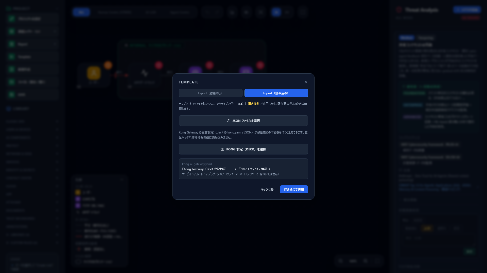
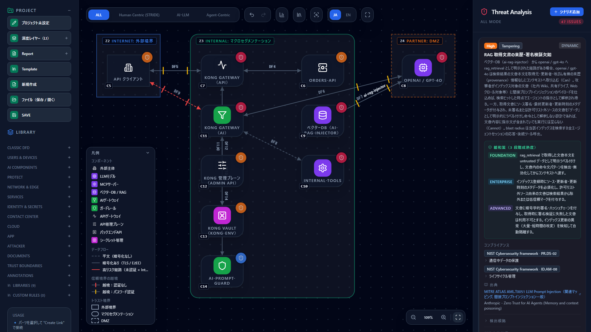
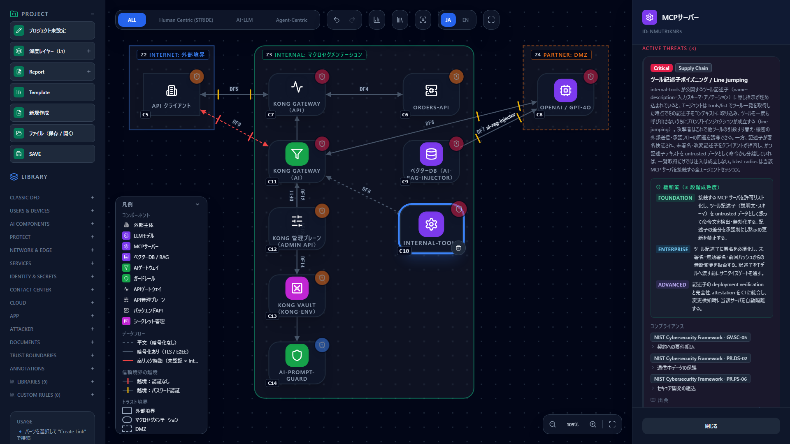
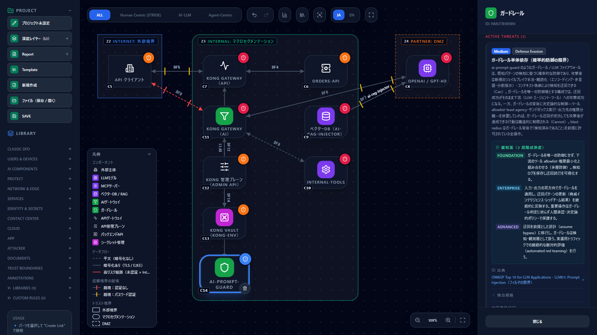
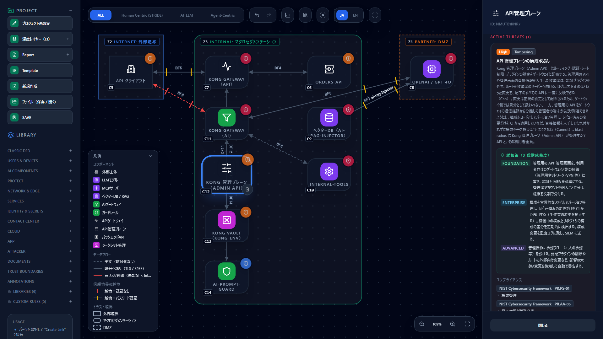

# Threat Modeling Kong AI Gateway — Draft a Diagram from Your decK Configuration

**English** | [日本語](kong-ai-gateway.ja.md)

> Kong is a trademark of Kong Inc. This page explains how to threat-model a Kong Gateway setup with
> CyberRiskScape; it is not provided, certified, or endorsed by Kong Inc. Plugin names and configuration
> formats follow the official documentation at the time of writing (October 2026). Check the linked official
> sources for the latest information.

---

## 1. What this page covers and prerequisites

- How to **draft a diagram automatically** from a Kong Gateway declarative configuration (decK `kong.yaml`),
  from the UI or the CLI
- Which parts of the configuration become which CyberRiskScape component types and connection attributes
- The threats **actually detected** on the generated diagram, and the threats worth watching in an AI Gateway setup
- Watching `kong.yaml` changes in a PR and failing CI when new threats appear
- What this import **cannot tell** (attributes you need to fill in on the diagram)

**Background: Kong Gateway and decK** (per the official documentation at the time of writing)

- Kong Gateway is an API gateway built from **Services** (upstream APIs), **Routes** (which requests go to which
  Service), **Plugins** (authentication, rate limiting, logging and so on), and **Consumers** (API users).
- **decK** is the official tool for managing this configuration declaratively in a file (`kong.yaml`). Plugins are
  either written at the top level with `service:` / `route:` pointing at their target, or nested under a Service
  or Route ([source 1](#references)).
- **Kong AI Gateway** is the name for the set of AI plugins: `ai-proxy` (connecting to LLM providers), guard plugins
  such as `ai-prompt-guard`, `ai-rag-injector` (RAG), `ai-mcp-proxy` (MCP), and more ([source 2](#references)).

**Assumed knowledge**: the basic operations in [Getting Started](getting-started.md) and the import steps in
[Creating and Using Templates](templates.md).

---

## 2. Mapping the configuration to CyberRiskScape types

The import **only translates the configuration into diagram elements**. Threats are detected by the same threat
rules as any other diagram.

| kong.yaml element | CyberRiskScape type / attribute | Notes |
|---|---|---|
| Kong Gateway itself | `GATEWAY` (API gateway) / `AI_GATEWAY` | Services that use AI plugins go through the AI Gateway, the rest through the API gateway. If both exist, two gateways are drawn |
| Admin API (management plane) | `API_CONTROL_PLANE` (API control plane) | Always drawn — a configuration file implies a management plane |
| Service (ordinary API) | `BACKEND_API` (Backend API) | Named after the Service. An https upstream URL means encrypted, http means plaintext |
| Service + `ai-proxy` | `LLM` | Named "provider / model". External providers such as OpenAI sit in a Partner boundary; ollama, vllm and llama sit inside the organization |
| Service + `ai-proxy-advanced` | `LLM` (one per target) | Each load-balancing target becomes its own LLM |
| Service + `ai-mcp-proxy` | `MCP_SERVER` (MCP server) | |
| Service + `ai-a2a-proxy` | `AGENT` (AI agent) | |
| `ai-rag-injector` | `DB` (Vector DB / RAG) | Drawn as a retrieval path into the LLM (`semantic: rag_retrieval`) |
| Guard plugins | `GUARDRAIL` (Guardrail) | `ai-prompt-guard`, `ai-semantic-prompt-guard`, `ai-semantic-response-guard`, `ai-sanitizer`, `ai-lakera-guard`, `ai-azure-content-safety`, `ai-aws-guardrails`, `ai-gcp-model-armor`, `ai-custom-guardrail` |
| `vaults` / `{vault://…}` references | `SECRETS_VAULT` (Secrets manager) | |
| Authentication plugins | "Authentication" on the client → gateway connection | `key-auth`, `basic-auth`, `hmac-auth`, `jwt`, `oauth2`, `openid-connect`, `ldap-auth`, `mtls-auth` and others. **All treated as password authentication** (§7) |
| Route `protocols` | "Encryption" on the client → gateway connection | Plaintext if any Route allows `http` |
| `ip-restriction` and logging plugins | Attack-surface attributes of the API gateway | Set source-IP restriction and access logging to "yes" |
| Consumers | Not drawn | Only the count is shown; credentials are not read |

**Secrets are not read.** Only names, types, host names and model names are extracted. Authentication header
values, consumer API keys, and the user name, password and query in URLs never reach the diagram.

**The client → gateway connection is drawn once**, using the **weakest authentication** among the Services
reachable through Routes. Per-Service authentication is listed in the gateway's description.

---

## 3. How to import

### 3.1 From the UI

1. Open **Template** in the left sidebar and choose the **Import** tab.
2. Press **"Select Kong config (decK)"** and choose `kong.yaml` (or JSON).
3. The counts for the generated diagram and the source configuration (services, routes, plugins, consumers)
   are shown. Press **"Apply"** to replace the active layer with the generated diagram (Undo restores it).



A sample to try is in [`templates/kong-ai-gateway.yaml`](templates/kong-ai-gateway.yaml) (it contains no real
credentials; the API key is a vault reference).

### 3.2 From the CLI

```bash
npm ci && npm run build:cli
node dist-cli/main.js import-kong kong.yaml --out model.json
node dist-cli/main.js analyze model.json --format md
```

`import-kong` writes a project JSON with the diagram on L1. You can open it with "File (Save / Open)" in the UI
or pass it straight to `analyze` and `diff`. For the CLI in general, see
[Integrating with AI-Driven Development CI](ci-integration.md).

---

## 4. Example of a generated diagram

The sample configuration has three Services: an ordinary API protected by OpenID Connect (`orders-api`), a
support chat that connects to OpenAI through `ai-proxy` (`support-chat`, with `key-auth`, `ai-prompt-guard` and
`ai-rag-injector`), and `internal-tools`, which exposes internal tools over MCP (no authentication, http allowed).



This sample produces **47 threats** (7 Critical, 24 High, 16 Medium) at the time of writing.

### 4.1 Assumptions on the diagram (attributes to review after importing)

- **The API gateway's global IP, WAF, DDoS protection and management-plane restrictions** cannot be read from
  `kong.yaml`, so they are left unset (assumed insecure). Set the gateway's attributes to match your environment.
- **Authentication strength**: if OIDC enforces MFA, raise the client → gateway connection to "MFA".
- **Connections to backends** are drawn as "internal network, no authentication" (the common setup that trusts
  traffic forwarded by the gateway). Change them if you use mutual TLS or similar.

---

## 5. Threats worth watching

### 5.1 Routes without authentication and plaintext paths

The `internal-tools` Route has no authentication plugin and allows `http`. Because the weakest path is used,
the client → AI Gateway connection becomes "no authentication, plaintext, over the internet".

| Threat | Severity | Element |
|---|---|---|
| Unauthenticated public-network path (`stride-edge-unauth-internet-001`) | Critical | Client → AI Gateway |
| Plaintext communication (`stride-edge-plain-encryption-001`) | High | Same, and AI Gateway → `internal-tools` |

One missing setting on one Route lowers the assessment for every path through the same gateway. This is
"one added line of configuration widens the attack surface" in action, and exactly where the CI watch in §6 helps.

### 5.2 Internal tools exposed over MCP

A Service with `ai-mcp-proxy` is drawn as an MCP server, and MCP-specific threats appear.

| Threat | Severity |
|---|---|
| Tool descriptor poisoning / line jumping (`mcp-tool-descriptor-poisoning-001`) | Critical |
| MCP server impersonation / typosquatting (`mcp-server-impersonation-typosquatting-001`) | High |



### 5.3 Guardrails are a probabilistic defense

`ai-prompt-guard` is drawn as a guardrail. Even with the guardrail, direct and indirect prompt injection
(`owasp-llm01-prompt-injection-001`, `atlas-aml-t0051-indirect-prompt-injection-001`) remain on the LLM. The
guardrail itself also gets a threat for "relying on it alone can be bypassed".

| Threat | Severity |
|---|---|
| Single reliance on a guardrail (limits of probabilistic defense) (`zt-guardrail-probabilistic-bypass-001`) | Medium |



> **Note** — The current threat rules do not mark LLM threats as mitigated just because a guardrail is present.
> A regex deny list (`ai-prompt-guard`) can be bypassed by rephrasing, so leaving the threats open is the safer
> assessment. Record what you have implemented under "Control status" on the threat card.

### 5.4 Provenance of documents injected by RAG

`ai-rag-injector` is drawn as a retrieval path from the vector DB into the LLM, so the path by which instructions
planted in retrieved documents reach the LLM is assessed.

| Threat | Severity |
|---|---|
| Missing provenance / signature checks on RAG documents (`agentic-rag-retrieval-provenance-gap-001`) | High |
| Vector and embedding weaknesses (`owasp-llm08-vector-embedding-weaknesses-001`) | High |

### 5.5 Control plane and secrets manager

Whoever obtains Admin API credentials can rewrite authentication and routing for every API under management.
The vault is where API keys are concentrated.

| Threat | Severity | Element |
|---|---|---|
| Configuration tampering in the API control plane (`api-control-plane-config-tampering-001`) | High | API control plane |
| Remote access to the management plane (`api-control-plane-internet-exposure-001`) | Critical | When a connection from the internet side to the control plane is drawn |
| Concentration of privilege in the secrets manager (`api-secrets-vault-concentration-001`) | High | Secrets manager |



### 5.6 Backend authorization and the gateway

| Threat | Severity | Element |
|---|---|---|
| Broken object and property level authorization (BOLA / BOPLA) (`api-backend-object-level-authorization-001`) | High | Backend API |
| Authorization boundary gaps (`stride-gateway-elevation-of-privilege-001`) | High | API gateway |
| Log concentration in the AI Gateway (`zt-ai-gateway-log-concentration-001`) | Medium | AI Gateway |

A gateway can validate tokens and scopes, but it does not know **who owns a record**. That BOLA can only be
checked in the backend is a natural discussion point for a design review.

---

## 6. Use case: watching kong.yaml changes in a PR

If your decK configuration is in Git, you can build a diagram from the configuration before and after each PR and
gate on **newly introduced threats** only.

```bash
# Build a project JSON from the configuration before (main) and after (the PR)
git show origin/main:kong.yaml > base-kong.yaml
node dist-cli/main.js import-kong base-kong.yaml --out base.json
node dist-cli/main.js import-kong kong.yaml --out head.json

# Exit 1 (block the PR) if there are new threats of High or above
node dist-cli/main.js diff base.json head.json --format md --fail-on High --out result.md
```

Element IDs are derived from Service names and the like, so adding a Service does not change the identity of
existing elements. For example, adding a Service that connects to an external LLM (Anthropic via `ai-proxy`) lists
the added threats and flags the execution triggers **T1 (new trust boundary), T6 (new third-party integration) and
T8 (change to models, training data or RAG sources)**. For wiring this into GitHub Actions, see
[Integrating with AI-Driven Development CI](ci-integration.md).

---

## 7. Limitations

- **A plugin does not make a threat "mitigated".** The import only builds the diagram; control status is not set
  automatically
- **Authentication strength is estimated conservatively.** Every authentication plugin counts as password
  authentication. Whether MFA is enforced depends on the IdP and cannot be read from `kong.yaml`
- **The client → gateway connection is a single edge** assessed at the weakest Route. If you need per-Route
  assessment, split the client on the diagram and redraw the connections
- **The gateway's global IP, WAF, DDoS protection and management-plane restrictions are unknown** (§4.1). The
  Kong Konnect API is not called
- One file is read. If your configuration is split across several decK files, merge them first (for example with
  `deck file merge`)
- Consumers, Upstreams (load-balancing targets) and Workspaces are not drawn
- The automatic layout is simple and connections may cross. Tidy the layout as needed
- Plugin names and configuration formats follow the official documentation at the time of writing. Plugins the
  import does not know are simply ignored

---

## References

1. decK (Kong's declarative configuration tool) — getting started — <https://developer.konghq.com/deck/get-started/>
2. Kong AI plugins — <https://developer.konghq.com/plugins/?category=ai>
3. AI Proxy plugin — <https://developer.konghq.com/plugins/ai-proxy/>
4. OWASP API Security Top 10 2023 — <https://owasp.org/API-Security/editions/2023/en/0x11-t10/>
5. OWASP Top 10 for LLM Applications 2025 — <https://genai.owasp.org/llm-top-10/>

---

## What to read next

- How to read detected threats — [Reading the Threat Panel](reading-threats.md)
- Finding where to defend along paths — [Attack Path Analysis](attack-paths.md)
- Requiring diagram updates in PRs — [Integrating with AI-Driven Development CI](ci-integration.md)
- The same flow for another product — [Threat Modeling Salesforce Agentforce](agentforce.md)
