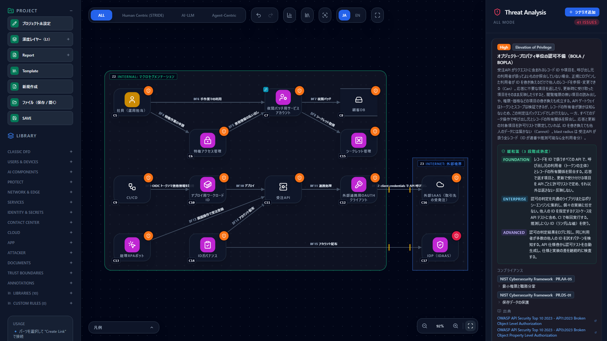
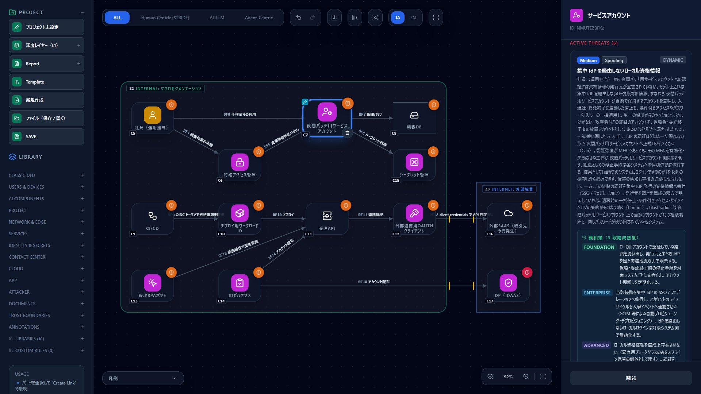
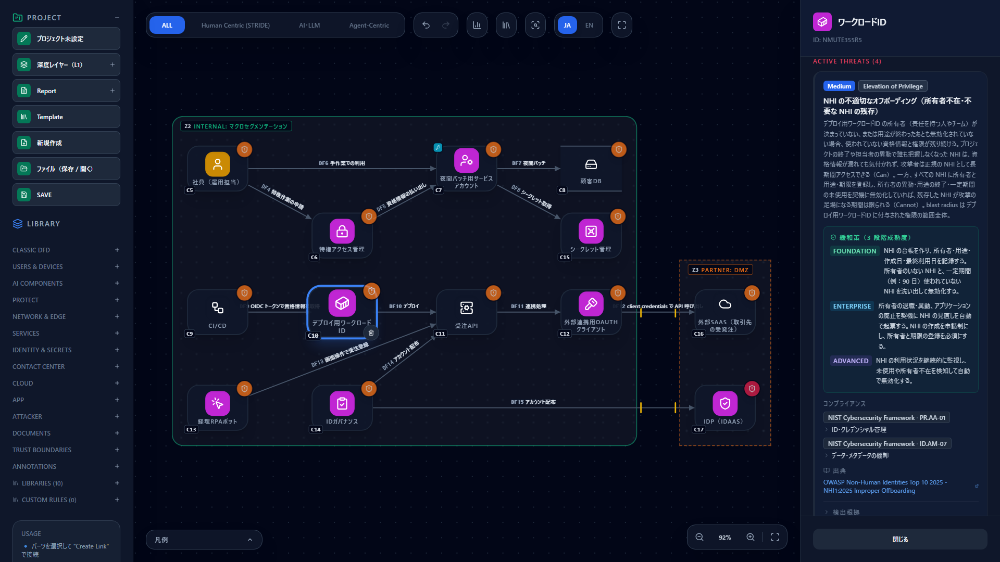
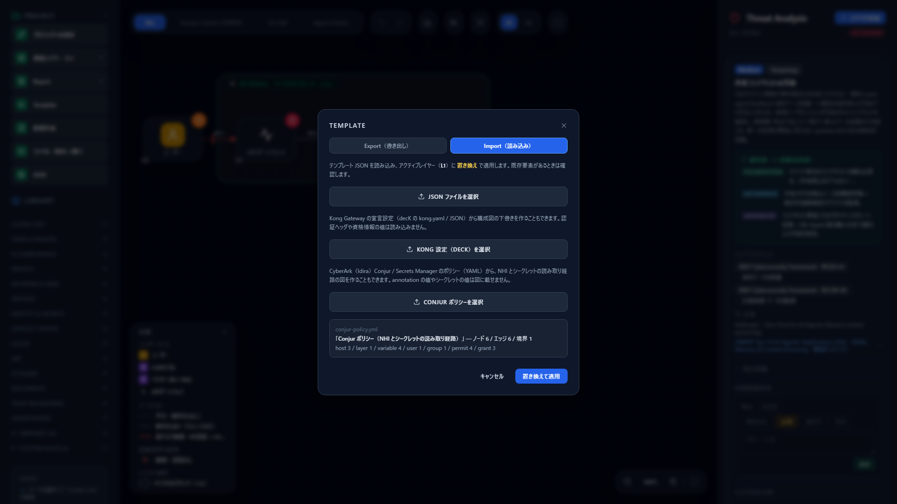
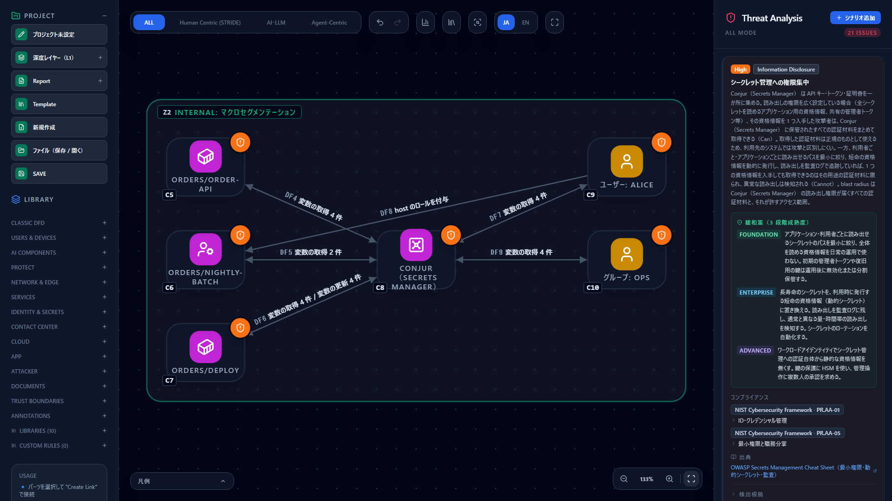
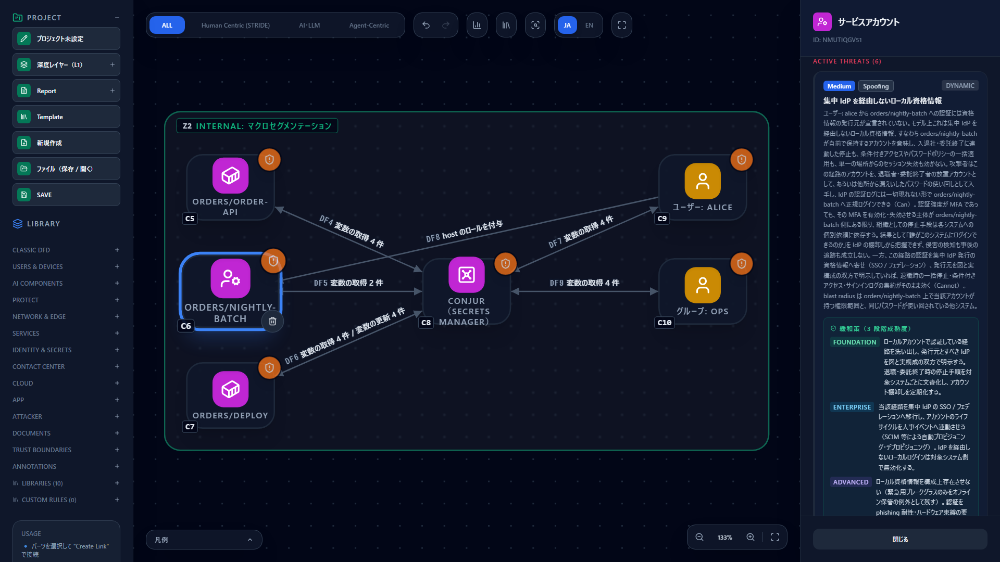

# Threat Modeling NHIs and Identity Platforms — Pairing with Okta, SailPoint and CyberArk (Idira)

**English** | [日本語](nhi-identity.ja.md)

> Okta, SailPoint, CyberArk and Idira are trademarks of their respective owners. This page explains how to threat-model
> non-human identities (NHIs) and identity platforms with CyberRiskScape and pair it with each vendor's MCP server; it is
> not provided, certified, or endorsed by any of them. Product and MCP server details follow the official information at
> the time of writing (October 2026). Check the linked sources for the latest.

---

## 1. What this page covers and prerequisites

- How to draw **NHIs (non-human identities — identities not tied to a person)** such as service accounts, workload
  identities, OAuth clients and RPA bots, together with privileged access management (PAM) and identity governance (IGA)
- The NHI threats detected on that diagram (based on the OWASP Non-Human Identities Top 10)
- **Registering the Okta, SailPoint and CyberArk (Idira) MCP servers in the same AI agent as the CyberRiskScape MCP
  server**, and cross-checking the threat model against the real state of your identities
- **Loading a CyberArk (Idira) Conjur policy** to draft a diagram of NHIs and secret read paths automatically
- Safety precautions for this pairing, and its limitations

**Background: why NHIs matter in threat modeling**

It is common for an organization to have more NHIs than human accounts. NHIs sit outside MFA and joiner-mover-leaver
processes, tend to hold broad permissions, and keep the same credentials for long periods. In 2025 OWASP published the
NHI-specific risks as the **Non-Human Identities Top 10** ([source 1](#references)). AI agents are NHIs too, and how the
API keys and service accounts they use are handled directly determines the blast radius.

**Assumed knowledge**: the basic operations in [Getting Started](getting-started.md), and
[Using It from Coding Agents — MCP Server Setup Guide](mcp-integration.md).

---

## 2. Mapping products and building blocks to CyberRiskScape types

All types are in the **Identity & Access** category. The four NHI types show the credentials they hold as a contained
"Credentials" element, and declare with the node's **Identity Tier** whether they run on a static key, a cryptographic
identity, or a hardware-bound identity.

| Building block (example products) | CyberRiskScape type | Setup notes |
|---|---|---|
| Service accounts, shared technical accounts | `SERVICE_ACCOUNT` (Service account) | If it runs on a password or API key, leave Identity Tier unset (label only) |
| IAM roles, managed identities, workload identity federation | `WORKLOAD_IDENTITY` (Workload identity) | Draw a connection from the credential issuer (CI, cloud) |
| OAuth service apps, M2M clients (Okta service apps, etc.) | `OAUTH_CLIENT` (OAuth client) | For private key JWT or mTLS, set Identity Tier to "Cryptographic" |
| RPA bots | `RPA_BOT` (RPA bot) | If it runs on a person's account, note that in the description |
| Privileged access management (CyberArk / Idira PAM, etc.) | `PAM` (Privileged access management (PAM)) | Draw administrator → PAM → managed system |
| Identity governance (SailPoint Identity Security Cloud, etc.) | `IGA` (Identity governance (IGA)) | Draw connections to the systems it provisions |
| IDaaS (Okta, etc.) | `IDENTITY_PROVIDER` (IdP) with kind "IDaaS" | Set it as the connection's credential issuer |
| Secrets management (CyberArk / Idira Secrets Manager, etc.) | `SECRETS_VAULT` (Secrets manager) | Draw NHI → secrets manager |
| AI agents | `AGENT` (AI agent) | Agent-specific threats are covered by the existing rules |

**Drawing conventions** (the NHI rules assume these directions):

- Draw **user side → NHI → target**: from the workloads and CI that use an NHI to the NHI, and from the NHI to the data
  and APIs it accesses.
- A **person → NHI** connection means "a person is using the NHI" (this triggers NHI10).
- An NHI without an Identity Tier is treated as "label only" — running on a static key.

---

## 3. Example diagram

A template that brings together a typical NHI and identity-platform setup is available.

| File | Contents |
|---|---|
| [`templates/nhi-identity.ja.json`](templates/nhi-identity.ja.json) | Japanese |
| [`templates/nhi-identity.en.json`](templates/nhi-identity.en.json) | English |

For how to load it, see [Creating and Using Templates](templates.md).



**Contents:** 14 components, 12 data flows and 2 trust boundaries. It includes an operator going through privileged
access management while also using the same service account directly by hand, CI issuing credentials to a workload
identity with an OIDC token, an order API calling an external SaaS through an OAuth client, and IGA provisioning
accounts to each system. Loading it produces **70 threats** at the time of writing.

---

## 4. Threats worth watching

### 4.1 NHI threats based on the OWASP Non-Human Identities Top 10

| Threat | Severity | Fires when |
|---|---|---|
| Improper offboarding of NHIs (`nhi-improper-offboarding-001`, NHI1) | Medium | Any NHI exists (owner and expiry management) |
| Overprivileged NHI (`nhi-overprivileged-001`, NHI5) | High | There is a connection from the NHI to a target |
| Long-lived static secrets on an NHI (`nhi-long-lived-secret-001`, NHI7) | High | Identity Tier is "label only" (including unset). Workload identities are excluded |
| Insufficient environment isolation for NHIs (`nhi-environment-isolation-001`, NHI8) | Medium | Any NHI exists (sharing between development and production) |
| NHI reuse (`nhi-reuse-001`, NHI9) | Medium | There is a connection from a workload, CI or agent to the NHI |
| Human use of an NHI (`nhi-human-use-001`, NHI10) | High | There is a connection from a person or device to the NHI |



> **Note** — "Long-lived static secrets" stops firing once Identity Tier is set to "Cryptographic" (private key JWT,
> mTLS, X.509 and so on) or "HardwareBound" (HSM, TPM). Confirm the actual authentication method before declaring it
> (UC2 in §5.3).

### 4.2 Workload identity, PAM and IGA threats

| Threat | Severity | Element |
|---|---|---|
| Workload identity federation trust conditions are too broad (`nhi-workload-federation-trust-001`) | High | Workload identity |
| Concentration of privilege in privileged access management (`pam-privileged-concentration-001`) | High | Privileged access management |
| Privileged paths that bypass privileged access management (`pam-bypass-path-001`) | Medium | Privileged access management |
| Identity governance connector privileges reaching every system (`iga-connector-privilege-001`) | High | Identity governance |
| Rubber-stamp access reviews and NHIs outside governance (`iga-certification-gap-001`) | Medium | Identity governance |



Existing rules apply as well, such as credentials without an issuing IdP (`identity-local-credential-outside-idp-001`),
credential sprawl (`zt-credential-sprawl-static-secret-001`) and privilege concentration in the secrets manager
(`api-secrets-vault-concentration-001`).

---

## 5. Pairing with each vendor's MCP server

Register the CyberRiskScape MCP server and a vendor's MCP server **side by side in the same AI agent**, and you can
cross-check "what the diagram assumes" against "what is actually in the identity platform" in a single conversation. The
two servers do not talk to each other; the agent connects them (the same pattern as
[pairing with Snyk](mcp-use-cases.md)).

### 5.1 Vendor MCP servers (per the official information at the time of writing)

| Product | MCP server | Read tools | Write tools | Notes |
|---|---|---|---|---|
| **Okta** | The official Okta MCP Server (open source, generally available) ([source 2](#references)) | List and get apps, users, groups, policies and system logs (`list_applications`, `get_application`, `get_logs`, and others) | Create, change and delete users, groups, apps and policies | **Only the tools matching the granted scopes are enabled.** Grant only `okta.*.read` to run it read-only. Destructive operations ask for confirmation |
| **SailPoint** | The Identity Security Cloud MCP Server ([source 3](#references)) | Search requestable access (`list-requestable`), view access request status (`view-access-requests`) | Create and cancel access requests (`create-access-request`, `cancel-access-request`) | At the time of writing the tools are the four around access requests; **there is no tool to read the identity or NHI inventory** |
| **CyberArk (Idira)** | The Secrets Manager MCP Server ([source 4](#references)) | List workloads, secrets and resources (`list_hosts`, `list_secrets`, `list_all_resources`), `whoami` | Create workloads and secrets, grant permissions (`create_workload`, `create_secret`, `grant_secret_permission`, and others) | Officially **for development environments** (production is not supported) |
| **CyberArk (Idira)** | The Secure Cloud Access (SCA) MCP Server ([source 5](#references)) | — | Temporary privilege elevation in AWS (`login_to_aws_default`, `elevate_aws_account_access`) | A tool for **obtaining** privileges. Do not register it in a threat-modeling agent (§6) |

Palo Alto Networks acquired CyberArk in 2026, and the products are moving to the **Idira** brand in phases
([source 6](#references)).

### 5.2 Registering (Claude Code example)

List both servers in the project's `.mcp.json`. The CyberRiskScape entry is the same as in the
[MCP Server Setup Guide](mcp-integration.md). Okta gets read scopes only.

```json
{
  "mcpServers": {
    "cyberriskscape": {
      "command": "node",
      "args": ["${CLAUDE_PROJECT_DIR}/dist-cli/main.js", "mcp", "--root", "${CLAUDE_PROJECT_DIR}"]
    },
    "okta-mcp-server": {
      "command": "uvx",
      "args": ["okta-mcp-server"],
      "env": {
        "OKTA_ORG_URL": "https://<your-org>.okta.com",
        "OKTA_CLIENT_ID": "<CLIENT_ID>",
        "OKTA_SCOPES": "okta.apps.read okta.users.read okta.groups.read okta.logs.read"
      }
    }
  }
}
```

This example uses browser-based authentication (Device Authorization Grant). If you use private-key authentication
(Private Key JWT), **do not write the private key into `.mcp.json`**; pass it from environment variables or a secrets
manager. For SailPoint and CyberArk (Idira), follow each vendor's official setup steps ([sources 3 and 4](#references)).

### 5.3 Use cases

**UC1: Cross-check the NHIs on the diagram against the NHIs that exist (Okta, CyberArk)**

```text
List the NHIs (service accounts, workload identities, OAuth clients, RPA bots) on L1 of threat-model/project.json.
Then get the service apps (those using client credentials) from Okta's application list and the workloads from
Secrets Manager, and cross-check them with the diagram. Tabulate "on the diagram but does not exist" and "exists but
not on the diagram", and for the latter run apply_model_changes with dryRun to show how threats would change if they
were added (I will confirm before anything is actually applied).
```

Flow: `get_model` (CyberRiskScape) → `list_applications` (Okta), `list_hosts` (CyberArk / Idira) → the agent matches
them → check the impact with `apply_model_changes` (`dryRun`). **The matching is the agent's inference.** Check that it
is not treating things as the same just because their names match.

**UC2: Confirm the Identity Tier declarations against the actual authentication method (Okta)**

```text
For each OAuth client on the diagram, check the token endpoint authentication method from the matching Okta app's
settings (get_application). Treat client_secret_basic / client_secret_post as LabelOnly and private_key_jwt as
Cryptographic, and list the ones that differ from what the diagram declares.
```

"Long-lived static secrets" (NHI7) then reflects the real state.

**UC3: Find unused NHIs (Okta)**

```text
For the Okta service apps that correspond to NHIs on the diagram, check the system log for the past 90 days
(get_logs) and list the ones with no activity, matched to the diagram's nodes (ElementalIDs).
```

The result serves as evidence for the "Improper offboarding of NHIs" check. Decisions to disable, and recording them on
the threat card (risk treatment, control status), are made by people (the agent cannot change them).

**UC4: Find the least access that can be requested instead of excessive permissions (SailPoint)**

```text
For the NHI used by the order API, which has "Overprivileged NHI", search the access that can be requested in
SailPoint (list-requestable) and suggest the smallest roles or access profiles its purpose needs. Do not submit any
request.
```

Requests (`create-access-request`) are made by people. See §6 for how to keep the agent from submitting requests.

---

## 6. Build a diagram from a CyberArk (Idira) Conjur policy

CyberArk (Idira) Secrets Manager (Conjur) manages **who (hosts and users) can read which secrets** with a declarative YAML
policy. Load that policy and a diagram of NHIs and secret read paths is drafted automatically. The policy is only read as
a file; the Conjur API is not called.

### 6.1 Mapping

| Policy element | CyberRiskScape type / attribute |
|---|---|
| `!host` with an authenticator annotation (`authn-jwt`, `authn-k8s`, `authn-iam`, `authn-azure`, `authn-gcp`) | `WORKLOAD_IDENTITY` (Workload identity), Identity Tier "Cryptographic" |
| `!host` without such an annotation (authenticates with an API key) | `SERVICE_ACCOUNT` (Service account), Identity Tier unset (static key) |
| `!variable` | Aggregated into one `SECRETS_VAULT` (Conjur). Connections from each NHI and person read "Fetch N variables" / "Update N variables" |
| `!user`, `!group` | Drawn as `USER` only when they hold variable privileges or have been granted a host role |
| `!grant` (a host role granted to a person) | A person → NHI connection ("Human use of an NHI" is detected) |
| `!layer` | Not drawn; noted in the member hosts' descriptions. Privileges are resolved as effective privileges by following `!grant` memberships |
| `!policy` | Nested `id`s are used as prefixes to resolve each element's id |

**Annotation values are not put on the diagram** (they are used only to determine the authentication method). Policies hold
no secret values, so none can reach the diagram. Change statements such as `!deny`, `!revoke` and `!delete` are out of scope.

### 6.2 How to import

- **From the UI**: in Template → Import tab, choose the YAML with **"Select Conjur policy"**.
- **From the CLI**: `node dist-cli/main.js import-conjur policy.yml --out model.json`

A sample to try is in [`templates/conjur-policy.yml`](templates/conjur-policy.yml) (three hosts of an order system, four
variables, an operations group, and an operator granted a host role).





The sample produces **25 threats** at the time of writing. nightly-batch, which runs on an API key, gets "Long-lived static
secrets" and, because alice holds its role, "Human use of an NHI"; the authn-jwt and authn-k8s hosts get "Workload identity
federation trust conditions"; and Conjur gets "Concentration of privilege in the secrets manager".



### 6.3 Where it helps

- **Reviewing privileges**: the number of variables each NHI can fetch appears on its connection, so NHIs with far more
  access than their purpose needs (NHI5), and how widely people can read secrets, are visible at a glance.
- **Watching in PRs**: if the policy is in Git, build project JSON from the policy before and after with `import-conjur`,
  just as [for Kong](kong-ai-gateway.md), and gate new threats with `diff`. Element IDs are derived from host and variable ids.

---

## 7. Safety precautions

- **Vendor MCP servers talk to their clouds.** The CyberRiskScape MCP server makes no outbound calls, but the vendor
  servers registered alongside it connect to your identity platform, and what they retrieve is passed to the agent (and
  the LLM behind it). Check your organization's rules on whether user names, app names, logs and the like may be given
  to AI.
- **Allow read access only.** Narrow Okta's scopes to `okta.*.read`. Where the agent uses tools without approval (such
  as GitHub Copilot's `tools` allow list), **do not allow** write tools (changing accounts, apps or policies, creating
  access requests, creating workloads or secrets, granting permissions).
- **Do not register tools that obtain privileges.** CyberArk (Idira)'s SCA MCP Server exists to give an agent temporary
  cloud privileges. Registered in a threat-modeling agent, a conversation meant for investigation could end up obtaining
  privileges.
- **Keep secret values out of the conversation.** With a secrets manager's MCP, stick to the names (metadata) of
  workloads and secrets. Do not use tools that retrieve values or generate fetch code (`generate_fetch_code`) for this purpose.
- **People make the final call.** Check diagram updates with `apply_model_changes` in `dryRun` and apply them after a
  person confirms. Risk acceptance, assessments and control status are decided by people in the CyberRiskScape UI and
  in PRs (the agent cannot change them).

---

## 8. Limitations

- **The cross-check is the agent's inference.** Diagram nodes and identity-platform entities are matched by names and
  notes, so mismatches and omissions are possible. Ask for the evidence and have a person check it
- **NHI rules are judged from the diagram's structure.** CyberRiskScape does not know the actual size of permissions or
  whether an owner exists. "Overprivileged" and "offboarding" appear as check items for NHIs that may be affected
- **SailPoint's MCP offers only access-request tools at the time of writing.** The NHI inventory and owner information
  cannot be read this way
- **CyberArk (Idira)'s Secrets Manager MCP is for development environments.** It cannot be used to inventory
  production. To diagram the permissions between workloads and secrets (who can read what), use the policy import (§6)
- Vendor MCP servers may change. Check tool names and scope in the official documentation

---

## References

1. OWASP Non-Human Identities Top 10 (2025) — <https://owasp.org/www-project-non-human-identities-top-10/>
2. Okta MCP Server (Okta's GitHub) — <https://github.com/okta/okta-mcp-server>
3. SailPoint MCP Server: available tools (SailPoint Developer Community) — <https://developer.sailpoint.com/docs/extensibility/mcp-available-tools/>
4. Secrets Manager MCP Server (CyberArk / Idira documentation; based on an excerpt of the official documentation) — <https://docs.cyberark.com/secrets-manager-saas/latest/en/content/conjurcloud/cc-mcp-server.htm>
5. SCA MCP Server (CyberArk / Idira documentation; based on an excerpt of the official documentation) — <https://docs.cyberark.com/sca/latest/en/content/automation/sca-mcp-server.htm>
6. Palo Alto Networks completes acquisition of CyberArk (February 2026) — <https://www.paloaltonetworks.com/company/press/2026/palo-alto-networks-completes-acquisition-of-cyberark-to-secure-the-ai-era>

---

## What to read next

- Connecting over MCP — [Using It from Coding Agents](mcp-integration.md)
- Pairing with other tools — [MCP Use Cases](mcp-use-cases.md)
- All products you can integrate with — [Integrations](integrations.md)
