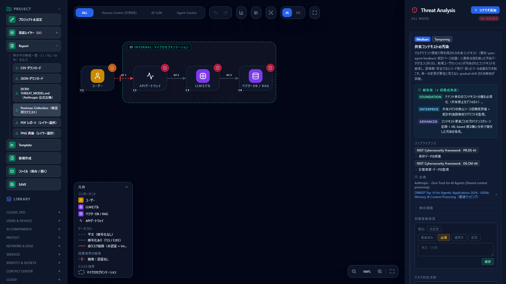

# 脅威を Postman で確かめる — 検出した脅威から検証用リクエストを書き出す

[English](postman.md) | **日本語**

> Postman は Postman, Inc. の商標です。このページは「CyberRiskScape で検出した脅威を Postman で確かめる方法」を
> 説明するもので、Postman 社が提供・認定・推奨するものではありません。コレクションの形式と実行ツールの状況は
> 執筆時点（2026 年 10 月）の公式の情報によります。最新は各リンク先で確認してください。

---

## 1. このページで分かること・前提

- 脅威モデルで検出した脅威のうち、**HTTP のリクエストで確かめられるもの**について、確認リクエストを
  Postman Collection として書き出す方法（画面・CLI）
- どの脅威にどの確認リクエストが作られるか、何を確かめるのか
- Postman・Postman CLI・Newman で実行する手順と、CI に組み込む方法
- 書き出しの**限界**（確かめられないこと）

脅威モデリングで「認証が無い」「他人のレコードを読めうる」と分かっても、実装がそのとおりかは別に確かめる必要が
あります。この書き出しは、**脅威の特定 → 対策の確認**を 1 つの流れにするためのものです。

**このページの前提となる知識**：[脅威パネルの読み方](reading-threats.ja.md)。CLI と CI については
[AI駆動開発のCIに組み込む](ci-integration.ja.md)。

> **確かめる対象について** — 書き出したリクエストは、**自分が管理する、または検証の許可を得たシステムに対してだけ**
> 実行してください。リクエストは「守られているか」を確かめる無害な確認（認証なしで送る、他人の ID を指定する、
> カナリア文字列を使う、など）に限っており、攻撃用のペイロードは含みません。

---

## 2. 書き出し方

### 2.1 画面から

左サイドバーの **Report** を開き、**「Postman Collection（検証用リクエスト）」** を押します。表示中のレイヤー・
フレームワークで検出された脅威が対象で、`*.postman_collection.json` がダウンロードされます。



### 2.2 CLI から

```bash
npm ci && npm run build:cli
node dist-cli/main.js export-postman model.json --out checks.postman_collection.json
```

`--layer`（既定：ノードがある最初のレイヤー）・`--framework`・`--locale` を指定できます。
[Kong の設定から作った図](kong-ai-gateway.ja.md)なら、`import-kong` の出力をそのまま渡せます。

---

## 3. 作られる確認リクエスト

検出した脅威の canonicalId（同じ脅威をまとめるための ID）ごとに、次の確認リクエストを作ります。宛先は、
脅威の対象がノードならそのノード、接続ならその受け側のノードです。同じノードに同じ確認が複数の脅威から
当たる場合は 1 件にまとめます。

| 確認 | 対象の脅威（canonicalId） | 合格の条件 |
|---|---|---|
| 認証なしのリクエストが拒否されるか | 未認証の公衆網経路・認証なしの公開 等 | 401 / 403 |
| http（平文）で接続できないか | 平文通信 | https へのリダイレクト、400 / 403 / 426、または接続できない |
| 他人のレコードを参照できないか（BOLA） | `api-object-level-authorization` | 403 / 404 |
| 一般利用者が管理機能を呼び出せないか（BFLA） | `gateway-authorization-gap` | 401 / 403 |
| レート制限が掛かっているか | `gateway-resource-exhaustion`・`llm-resource-exhaustion` | レート制限のヘッダがある（負荷はかけない） |
| 管理面に外から到達できないか | `web-remote-management-exposure` | 401 / 403、または接続できない |
| 指示の上書きに従わないか（カナリア文字列） | `direct-prompt-injection` | 応答にカナリア文字列が無い |
| システムプロンプトを開示しないか | `system-prompt-leakage` | 応答に目印の文字列が無い |
| MCP のツール記述子に隠し指示が無いか | `tool-descriptor-poisoning` | `tools/list` の説明文に指示の上書きを促す文言が無い |

このほかの脅威（学習データの汚染、ワークスペースからの認証情報の露出など）は、HTTP のリクエストでは
確かめられないためテストを作りません。件数はコレクションの説明欄に出ます。

対応表は `data/test-templates/postman.yaml` にあります。コードではなくデータなので、確認を足すときは
この YAML にテンプレートを足します。

### 3.1 書き出されるリクエストの例

```json
{
  "name": "他人のレコードを参照できないか（BOLA）",
  "request": {
    "method": "GET",
    "header": [{ "key": "Authorization", "value": "Bearer {{token_user_a}}" }],
    "url": "https://{{C2_host}}{{C2_object_path}}"
  },
  "event": [{
    "listen": "test",
    "script": {
      "type": "text/javascript",
      "exec": [
        "pm.test(\"Another user's object is not accessible (403/404)\", function () {",
        "  pm.expect(pm.response.code).to.be.oneOf([403, 404]);",
        "});"
      ]
    }
  }]
}
```

リクエストはノードごとのフォルダ（`C2 orders-api` のように ElementalID と名前）に入り、説明欄には
確かめる脅威の名前と ID が載ります。

---

## 4. 実行する前に変数を埋める

図にはホスト名やトークンが無いため、コレクション変数のままで書き出します。Postman の環境
（Environment）か、CLI の `--env-var` で、自分のテスト環境の値を設定してください。

| 変数 | 設定する値 |
|---|---|
| `C7_host` など（`<ElementalID>_host`） | そのノードに届く入口のホスト名（例：`api.example.com`、ポート付きも可） |
| `C7_path` など | 確認に使うパス（既定 `/`） |
| `C2_object_path` | 利用者 B が所有するレコードを指すパス（既定 `/resources/{{object_id_user_b}}`） |
| `C3_admin_function_path` | 管理者だけが呼び出せる機能のパス |
| `C3_admin_url` | 管理用の URL（Admin API・管理画面） |
| `C4_chat_path` | LLM に届くチャットの入口のパス。LLM ノードの `_host` には、**その LLM に届くアプリやゲートウェイの入口**を設定します |
| `C6_mcp_path` | MCP（Streamable HTTP）のエンドポイントのパス |
| `token_user_a` | 一般利用者（利用者 A）のアクセストークン |
| `object_id_user_b` | 利用者 B が所有するレコードの ID |
| `canary` | 応答に含まれてはいけないカナリア文字列（既定値あり） |
| `system_prompt_marker` | テスト環境のシステムプロンプトに入れておく目印の文字列（既定値あり） |

ElementalID（`C7` など）は、図のノードの左下に表示される番号です。

---

## 5. 実行する

### 5.1 Postman で

Postman で **Import** を選び、書き出した JSON を読み込みます。Postman v12 以降も、この形式（v2.1）を読み込めます。
v12 の Git 連携（コレクション v3 の YAML）で管理したい場合は、Postman CLI の
`postman collection migrate` で変換できます（[出典 2](#参考リンク)）。

### 5.2 CLI で（CI への組み込み）

```bash
# Postman CLI（ローカルのコレクションはサインインなしで実行できる）
postman collection run checks.postman_collection.json -e test-env.json

# Newman（v2.1 形式なので実行できる）
npx newman run checks.postman_collection.json -e test-env.json --env-var token_user_a=$TOKEN
```

テストが 1 件でも不合格なら終了コードが 0 以外になるので、CI のジョブを止められます。トークンは CI の
シークレットから渡し、環境ファイルに書き込まないでください。

> **Newman について** — 公式は Postman CLI への移行を案内しており、Newman はコレクション v3 形式に対応していません
> （[出典 3](#参考リンク)）。この書き出しは v2.1 形式なので、どちらでも実行できます。

### 5.3 結果の読み方

- **不合格**は「図で指摘した脅威が、実装でも成立している可能性が高い」ことを示します。脅威カードの
  「対策実装状況」を「必須」のままにし、対策を進めてください
- **合格**は、その確認の範囲では守られていることを示します。脅威そのものが無くなったことは意味しません
  （たとえばカナリア文字列 1 つに従わなくても、別の言い回しでは従いうる）。対策実装状況の記録の根拠として使ってください
- 平文や管理面の確認で**接続できない**場合は、テストは合格になり、実行結果にはリクエストのエラーも表示されます

---

## 6. 限界

- **確かめられるのは、HTTP で確かめられる一部の脅威だけです。** 対応表に無い脅威にはテストを作りません
- **確認は 1 回のリクエストです。** プロンプトインジェクションの耐性や BOLA の有無を網羅的に評価するものではありません。
  網羅的な検査には、専用の診断ツールや人による検査を併用してください
- **リクエストの形は一般的なものです。** チャットの本文は OpenAI 互換の形式、MCP は `tools/list` を直接送ります。
  実際の API に合わせて本文やヘッダを直してください（MCP サーバーによっては事前に `initialize` が要ります）
- 宛先は図の構造から決まります。図の接続が実際と違えば、確認する場所も違います
- 書き出すのは表示中の 1 レイヤー分です

---

## 参考リンク

1. Postman Collection Format v2.1.0（JSON スキーマ） — <https://schema.getpostman.com/json/collection/v2.1.0/collection.json>
2. Postman CLI のコレクション操作（`collection run`・`collection migrate`） — <https://learning.postman.com/docs/postman-cli/postman-cli-collections>
3. Newman による実行と Postman CLI への移行 — <https://learning.postman.com/docs/collections/using-newman-cli/command-line-integration-with-newman/>
4. OWASP API Security Top 10 2023 — <https://owasp.org/API-Security/editions/2023/en/0x11-t10/>
5. OWASP Top 10 for LLM Applications 2025 — <https://genai.owasp.org/llm-top-10/>

---

## 次に読むもの

- 対策実装状況を記録する — [Analytics でリスクを評価する](analytics-assessment.ja.md)
- PR で脅威の差分を判定する — [AI駆動開発のCIに組み込む](ci-integration.ja.md)
- 構成図を設定から作る — [Kong AI Gateway を脅威モデリングする](kong-ai-gateway.ja.md)
