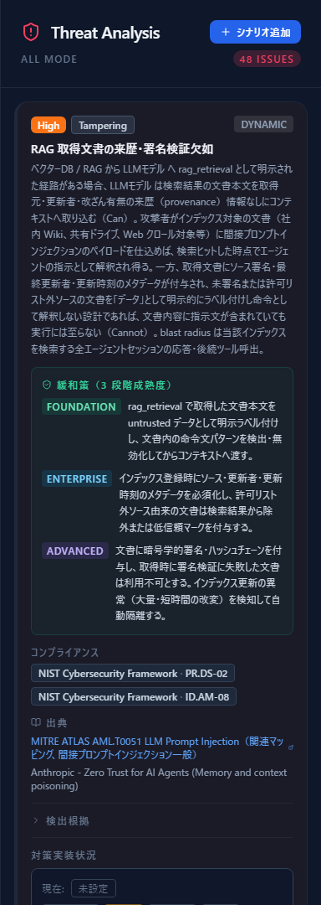
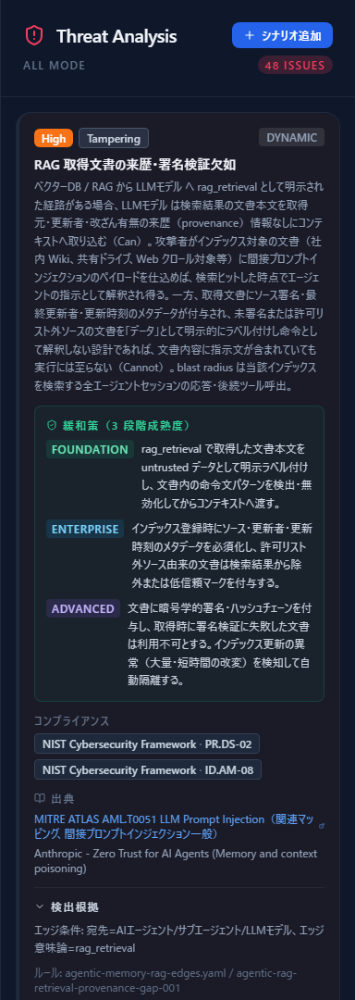
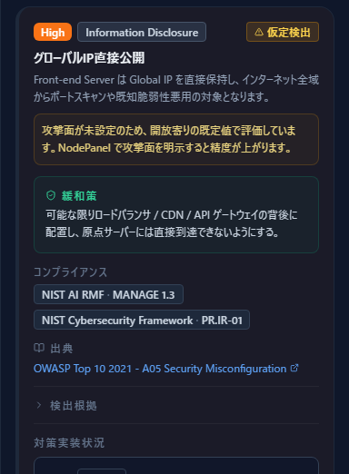
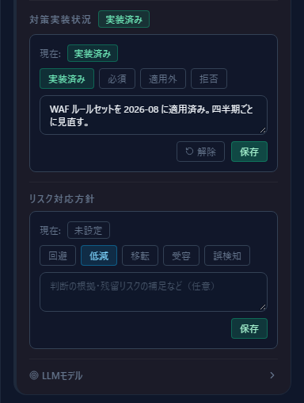
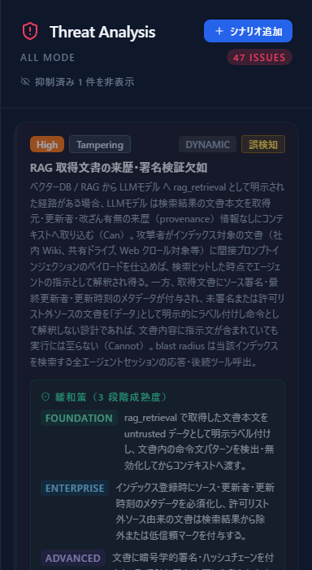
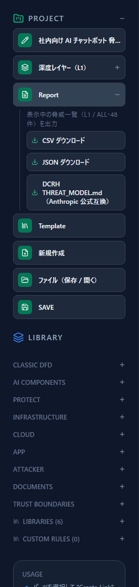

# 脅威パネルの読み方

[English](reading-threats.md) | **日本語**

図を描き終えると、右ペインに脅威が並びます。**ここからが脅威モデリングの本体**です。
このページでは、並んだ脅威をどう読み、どう記録し、どう外へ出すかを説明します。

作図の手順は [はじめての脅威モデル](first-threat-model.ja.md) を参照してください。

---

## 1. パネルの全体像

右ペインの **Threat Analysis** が脅威の一覧です。

ヘッダには 3 つの情報があります。

| 表示 | 意味 |
|---|---|
| `ALL MODE` | いま表示しているフレームワークの区分（上部タブと連動） |
| `48 ISSUES` | **抑制されていない**脅威の件数 |
| シナリオ追加 | 自動検出では出てこない脅威を手で足す（後述） |

上部のフレームワークタブ（`ALL` / `Human Centric (STRIDE)` / `AI・LLM` / `Agent-Centric`）は、
この一覧の絞り込みです。**図そのものは変わりません。**
絞り込んだ状態は後述のエクスポート対象にもそのまま効きます。

---

## 2. 脅威カードの構造

1 件の脅威は 1 枚のカードです。上から順に、severity バッジ・カテゴリ・タイトル・説明、
そして **3 段階の緩和策**（FOUNDATION / ENTERPRISE / ADVANCED）が並びます。

段階は**着手する順番**です。FOUNDATION は「まずこれをやる」、ADVANCED は
「高度な体制がある組織向け」。上から順に埋めていけば、そのまま改善のロードマップになります。

カードの右上に付くバッジで、その脅威の素性が分かります。

| バッジ | 意味 |
|---|---|
| `Manual` | 手で追加した脅威（自動検出ではない） |
| `Custom` | 自分で書いたカスタムルール由来 |
| `Dynamic` | 図の状態に応じて動的に生成された脅威 |
| 複数ソース | 複数のルールが同じ脅威を指している（裏付けが強い） |
| **仮定検出** | 属性が未設定のため、最悪値を仮定して出している |
| 対応方針 | 回避／低減／移転／受容／誤検知のうち、記録済みのもの |

下部には、その脅威が紐づく**コンプライアンス項目**（NIST CSF / NIST AI RMF /
AI 事業者ガイドライン）と、**出典**（OWASP・MITRE ATLAS・Anthropic 等へのリンク）が並びます。

---

## 3. 「検出根拠」を読む

**このツールで最初に開くべき場所です。**
カード下部の「検出根拠」を開くと、次の 3 つが表示されます。

1. **何が対象で、どの条件で発火したか** — 「接続の有無に関係なく（内在的脅威として）発火します」
   「〇〇から △△ への接続があるとき」といった、発火条件の説明
2. **ルールの出所** — ファイル名とルール ID（例：`anthropic-zt-agents.yaml / anthropic-zt-shared-context-poisoning-001`）
3. **裏付けているルール** — 複数ソースが同じ脅威を指している場合、その一覧

脅威が妥当かどうかは、ここを見ないと判断できません。
**前提が実態と違うなら、脅威を消すのではなく図か属性を直します。**

---

## 4. 「仮定検出」を減らす

「仮定検出」バッジが付いた脅威は、**判断に必要な属性が未設定**なため、
**最悪値を仮定して**出しているものです。カードには、何が未設定なのかが明示されます。

上の例では「攻撃面が未設定のため、開放寄りの既定値で評価している」と書かれています。
コンポーネントを選んで攻撃面を設定すれば、この脅威は消えるか、より正確な内容に変わります。

**仮定検出が多い＝図の情報が足りない**というサインです。
件数を減らそうと抑制するのではなく、属性を埋めて精度を上げてください。

---

## 5. 記録する — 2 つの独立したレイヤー

カード下部には**性格の違う 2 つの記録欄**があります。混同しやすいので、違いを押さえてください。

### 対策実装状況（Control Implementation Status）

**対策側の事実**を記録します。

| 状態 | 意味 | 補足 |
|---|---|---|
| 実装済み | 対策が入っている | **必須** |
| 必須 | やると決めた（まだ入っていない） | 任意 |
| 適用外 | この構成では対策が要らない | **必須** |
| 拒否 | 対策を入れないと決めた | **必須** |

「実装済み」「適用外」「拒否」は**補足の入力が必須**です。
後から読む人に「なぜそう判断したか」が残らない記録を作らせない仕組みです。

### リスク対応方針（Risk Treatment）

**リスクをどう扱うか**を記録します。回避／低減／移転／受容／誤検知の 5 つです。

> **重要：一覧から消える（抑制される）のは「受容」と「誤検知」だけです。**
> 回避・低減・移転を選んだ脅威は、**件数にも一覧にも残り続けます**。
> 対応方針を決めたことと、その脅威を見なくてよくなることは別だからです。

### 抑制したあとの見え方

「受容」または「誤検知」を記録すると、その脅威は淡色になり、`ISSUES` の件数から外れます。
ヘッダに「**抑制済み N 件を非表示**」の切り替えが出るので、隠すことも見直すこともできます。

抑制はあくまで**表示上の整理**です。記録自体は残り、後述のエクスポートにも
「誤検知」「受容」という状況と、その理由として出力されます。

---

## 6. DREAD で優先順位を付ける

severity はルールが持つ一般論の目安です。**自分たちの文脈での深刻さ**は、
上部ツールバーの **Analytics** を開いて DREAD で評価します。

DREAD は 5 項目（損害・再現性・攻撃容易性・影響範囲・発見容易性）をそれぞれ
1〜3 で評価し、合計 5〜15 をランクへ変換する方式です。
**評価するとルール由来の severity は上書きされます。**

評価の具体的な手順と、リスク対応方針・対策実装状況をまとめて記録するやり方は、
次章の [Analytics でリスクを評価する](analytics-assessment.ja.md) で扱います。

---

## 7. 手で脅威を足す

自動検出は脅威ライブラリが覆う範囲しか出しません。
業務固有のリスクや、レビューで出た指摘は、ヘッダの **シナリオ追加** から手で足します。

手で足した脅威は `Manual` バッジが付き、カードから編集・削除ができます。
エクスポートでも「手動」と「検出」が区別されるので、
**どこまでが自動で、どこからが人の判断か**が後から分かります。

---

## 8. エクスポートする

左サイドバーの **Report** を開くと、3 つの形式でダウンロードできます。

| 形式 | 用途 |
|---|---|
| CSV | 表計算ソフトでの仕分け・共有。ID / 資産 / 分類 / 脅威 / severity / 対策 / 状況 / コメント / 由来の列 |
| JSON | 他ツールへの取り込み・自動処理 |
| DCRH THREAT_MODEL.md | Anthropic の `defending-code-reference-harness` 互換の Markdown |

出力対象は**いま表示している脅威一覧**です。
メニューに「表示中の脅威一覧（L1 / ALL・48 件）を出力」と出ているとおり、
**深度レイヤーとフレームワークタブの絞り込みがそのまま効きます。**
特定の観点だけを切り出したいときは、先にタブを切り替えてから出力してください。

抑制した脅威も、**「誤検知」「受容」という状況と、記録した理由つきで出力されます**。
一覧から消すことと、記録から消すことは別です。

---

## 9. つまずきやすいところ

**Q. 件数が減らない。**
回避・低減・移転は抑制されない仕様です。件数を減らすことは目的ではありません。
「対応方針が未記録の脅威をゼロにする」ことを目標にしてください。

**Q. 明らかに自分たちには当てはまらない脅威が出る。**
まず「検出根拠」を開いてください。発火条件が実態と違うなら、図か属性の側を直すのが本筋です。
それでも当てはまらないなら「誤検知」を記録します（理由を書いておくと、次回の見直しが楽です）。

**Q. severity が高すぎる／低すぎる。**
ルール由来の severity は一般論です。Analytics で DREAD を付ければ、
自分たちの文脈での評価に置き換わります（→ [Analytics でリスクを評価する](analytics-assessment.ja.md)）。

---

## 次に読むもの

- 評価して記録する手順 — [Analytics でリスクを評価する](analytics-assessment.ja.md)
- 対策をどこに置くか決める — [攻撃経路分析](attack-paths.ja.md)
- 規格との対応を確認する — [コンプライアンスマップ](compliance-map.ja.md)
- 作図の手順 — [はじめての脅威モデル](first-threat-model.ja.md)
- 操作の詳細 — [はじめに — CyberRiskScape 入門](getting-started.ja.md)
- なぜ設計段階で脅威を考えるのか — [Secure by Design 入門](secure-by-design.ja.md)
