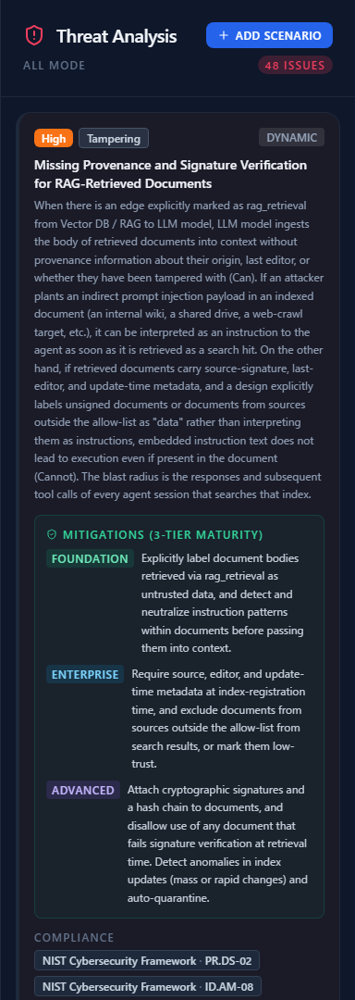
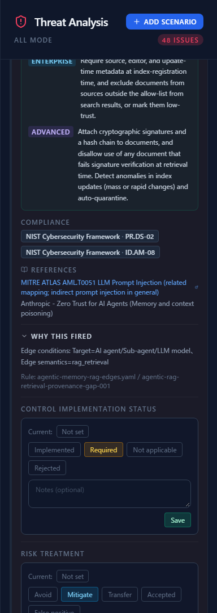
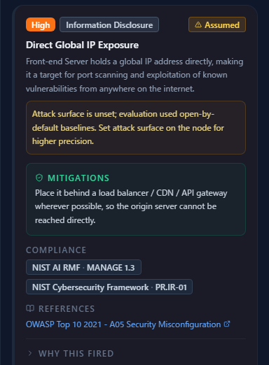
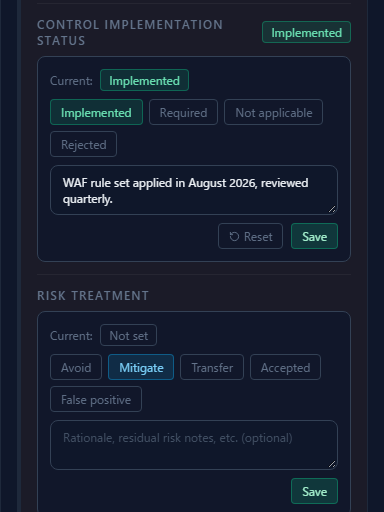
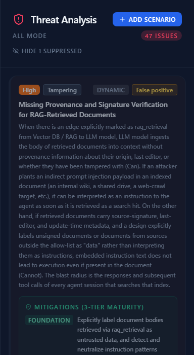
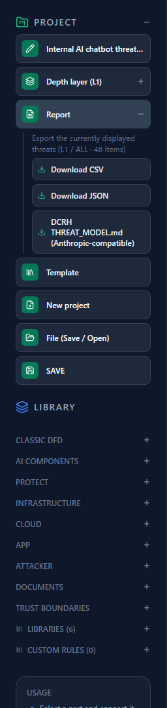

# Reading the Threat Panel

**English** | [日本語](reading-threats.ja.md)

Once the diagram is drawn, the right pane fills with threats. **This is where threat modeling
actually happens.** This page covers how to read what is listed, how to record your decisions, and
how to get the result out of the tool.

For how to draw the diagram, see [Your First Threat Model](first-threat-model.md).

---

## 1. The panel at a glance

**Threat Analysis** in the right pane is the list of threats.

The header carries three things:

| What you see | What it means |
|---|---|
| `ALL MODE` | Which framework view is currently shown (follows the tabs at the top) |
| `48 ISSUES` | The number of threats that are **not suppressed** |
| Add scenario | Add a threat by hand that detection will never produce (see below) |

The framework tabs (`ALL` / `Human Centric (STRIDE)` / `AI / LLM` / `Agent-Centric`) filter this
list. **They do not change the diagram**, and the filtering carries through to the export described
later.

---

## 2. Anatomy of a threat card

Each threat is one card: severity badge, category, title, description, and then
**mitigations at three tiers** (FOUNDATION / ENTERPRISE / ADVANCED).

The tiers are **the order to work in**. FOUNDATION is "do this first"; ADVANCED assumes an
organization with the capability for it. Working down the tiers gives you an improvement roadmap.

Badges in the top right tell you where the threat came from:

| Badge | Meaning |
|---|---|
| `Manual` | Added by hand, not by detection |
| `Custom` | Produced by a custom rule you wrote |
| `Dynamic` | Generated dynamically from the state of the diagram |
| Multiple sources | Several rules point at the same threat — stronger corroboration |
| **Assumed** | Attributes are unset, so worst-case values were used |
| Risk treatment | Whichever of avoid / mitigate / transfer / accept / false positive you recorded |

Below that are the **compliance items** the threat maps to (NIST CSF, NIST AI RMF, Japan's AI
Business Operator Guidelines) and the **references** it is based on (links to OWASP, MITRE ATLAS,
Anthropic and others).

---

## 3. Read "Why this fired"

**This is the first thing to open.** Expanding it at the bottom of a card shows three things:

1. **What it applies to and what triggered it** — "fires regardless of connections (an inherent
   threat)", "when there is a connection from X to Y", and so on
2. **Where the rule lives** — the file name and rule ID (for example
   `anthropic-zt-agents.yaml / anthropic-zt-shared-context-poisoning-001`)
3. **Corroborating rules** — when several sources point at the same threat, the list of them

You cannot judge whether a finding is valid without this. **If the premise does not match reality,
fix the diagram or the attributes rather than deleting the threat.**

---

## 4. Reduce the "Assumed" findings

A threat badged **Assumed** fired because the attributes needed to judge it are unset, so
**worst-case values were used**. The card says which ones.

In the example above, the attack surface is unset, so the evaluation defaulted to the exposed end of
the range. Select the component, set its attack surface, and the threat either disappears or becomes
more precise.

**A lot of Assumed findings means the diagram is missing information.** Fill in the attributes to
raise accuracy instead of suppressing them to shrink the count.

---

## 5. Recording decisions — two independent layers

The bottom of the card has **two record fields of different character**. They are easy to confuse,
so here is the difference.

### Control implementation status

Records **a fact about the control**.

| Status | Meaning | Note field |
|---|---|---|
| Implemented | The control is in place | **Required** |
| Required | Decided to do it; not in place yet | Optional |
| Not applicable | This deployment does not need the control | **Required** |
| Rejected | Decided not to implement it | **Required** |

"Implemented", "Not applicable" and "Rejected" **require a note**. The point is to stop anyone
leaving behind a record that does not say why the call was made.

### Risk treatment

Records **what you are doing about the risk**: avoid, mitigate, transfer, accept, or false positive.

> **Important: only "Accepted" and "False positive" remove a threat from the list.**
> Threats marked avoid, mitigate or transfer **stay in the list and in the count**.
> Deciding how to treat a risk is not the same as no longer needing to look at it.

### What suppression looks like

Record "Accepted" or "False positive" and the threat dims and leaves the `ISSUES` count. The header
gains a **"Hide N suppressed"** toggle, so you can either hide them or review them.

Suppression is **presentation only**. The record itself stays, and the export below carries it out
as a status ("False positive", "Accepted") together with the reason you wrote.

---

## 6. Prioritize with DREAD

Severity is the rule's general-purpose estimate. For **how serious it is in your context**, open
**Analytics** in the top toolbar and score it with DREAD.

DREAD scores five factors (damage, reproducibility, exploitability, affected users,
discoverability) from 1 to 3 and maps the 5–15 total to a rank.
**A DREAD score overrides the rule's severity.**

The step-by-step procedure — and how to record the risk treatment and control implementation status
in the same place — is the next chapter,
[Assessing Risk in Analytics](analytics-assessment.md).

---

## 7. Adding threats by hand

Detection only produces what the threat library covers. Risks specific to your business, and points
raised in review, go in by hand through **Add scenario** in the header.

Threats added this way carry a `Manual` badge and can be edited or deleted from the card. Exports
distinguish manual from detected, so later readers can see **where automation ended and human
judgment began**.

---

## 8. Exporting

**Report** in the left sidebar offers three formats.

| Format | Use |
|---|---|
| CSV | Sorting and sharing in a spreadsheet. Columns: ID, asset, framework, category, threat, severity, mitigation, status, comments, origin |
| JSON | Feeding other tools or automation |
| DCRH THREAT_MODEL.md | Markdown compatible with Anthropic's `defending-code-reference-harness` |

What gets exported is **the list you are currently looking at**. As the menu says — "Export the
threats currently shown (L1 / ALL, 48)" — **the depth layer and the framework tab both apply**.
To cut out one particular view, switch tabs first, then export.

Suppressed threats are included too, **carrying their status ("False positive", "Accepted") and the
reason you recorded**. Removing something from the list is not the same as removing it from the
record.

---

## 9. Common sticking points

**Q. The count will not go down.**
By design, avoid / mitigate / transfer do not suppress anything. Reducing the count is not the goal;
aim instead for "no threat left without a recorded treatment".

**Q. A threat clearly does not apply to us.**
Open "Why this fired" first. If the firing condition does not match reality, the right fix is the
diagram or the attributes. If it genuinely does not apply, record "False positive" — and write the
reason, which makes the next review much easier.

**Q. The severity looks too high, or too low.**
Rule severity is a general estimate. Score it with DREAD in Analytics and it is replaced with an
assessment made in your context (see
[Assessing Risk in Analytics](analytics-assessment.md)).

---

## Where to go next

- How to assess and record — [Assessing Risk in Analytics](analytics-assessment.md)
- Deciding where to put controls — [Attack Path Analysis](attack-paths.md)
- Lining threats up against standards — [The Compliance Map](compliance-map.md)
- How to draw the diagram — [Your First Threat Model](first-threat-model.md)
- The operations in detail — [Getting Started with CyberRiskScape](getting-started.md)
- Why threats belong in the design stage — [An Introduction to Secure by Design](secure-by-design.md)
