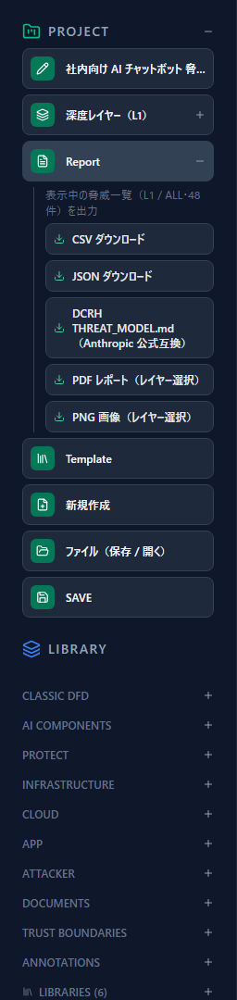
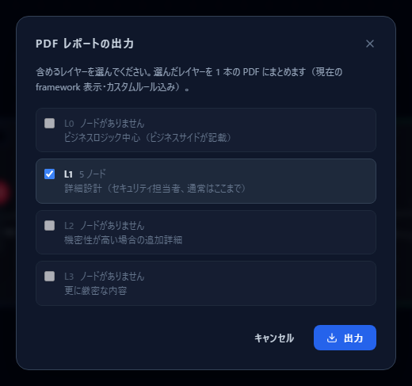
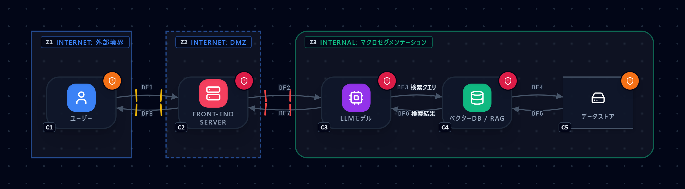
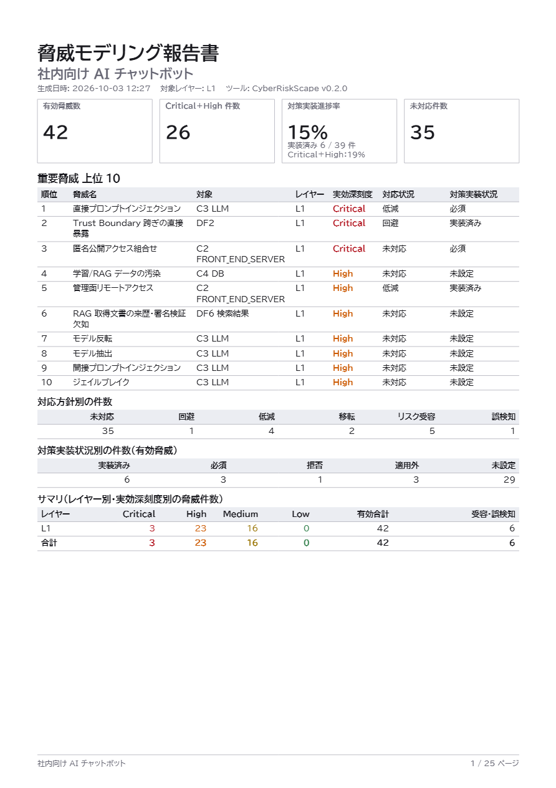
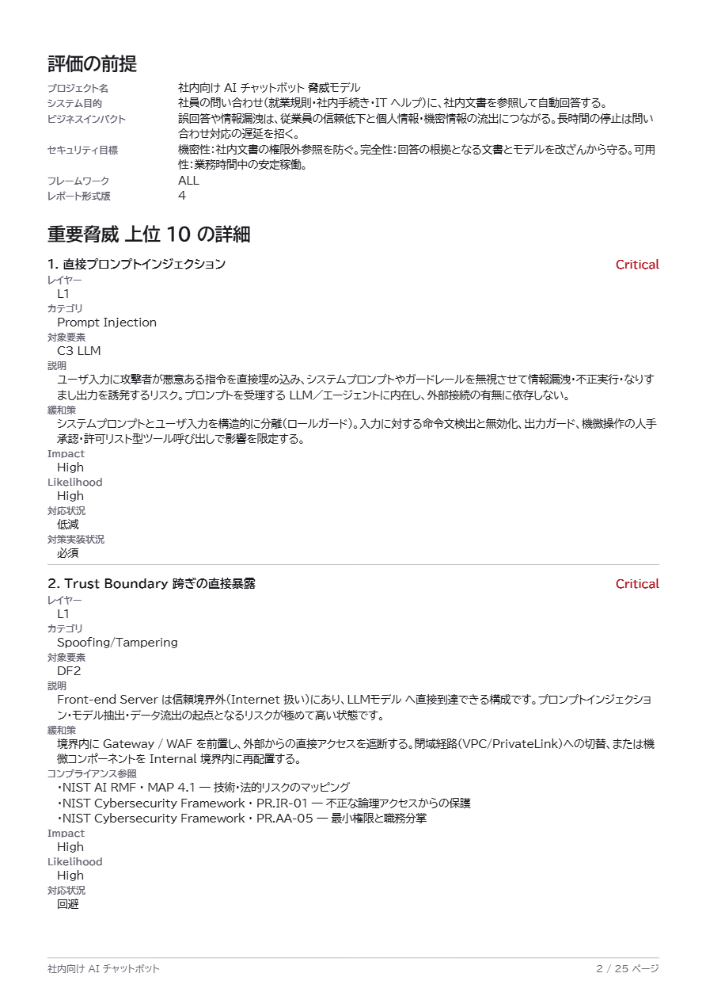
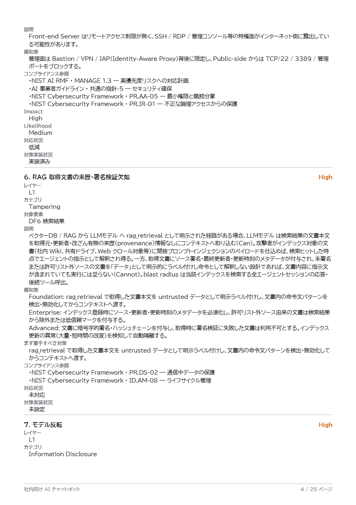
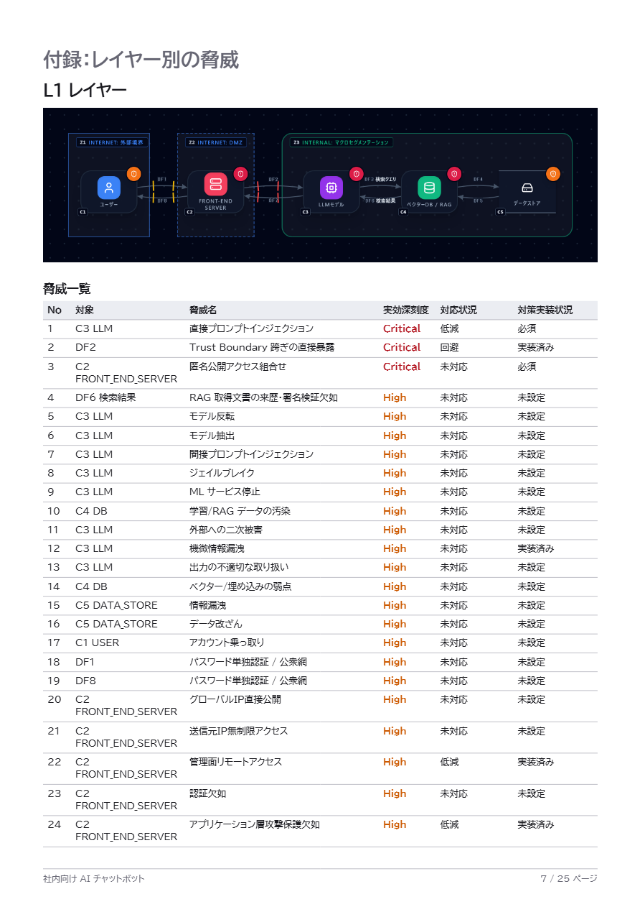

# PDF レポートと構成図（PNG）を出力する

[English](report-export.md) | **日本語**

脅威モデルができたら、次は**他の人に見せる**番です。
このページでは、左サイドバー **Report** にある **PDF レポート**と **PNG 画像**の使い方を説明します。
PDF は CISO・経営層への報告を想定した、1 枚サマリ付きの報告書です。

脅威の読み方・記録の仕方は [脅威パネルの読み方](reading-threats.ja.md)、
評価の入力は [Analytics でリスクを評価する](analytics-assessment.ja.md) を参照してください。

---

## 1. 何を出力できるか

**Report** には 5 つの項目があります。

| 項目 | 出力されるもの | 向いている用途 |
|---|---|---|
| CSV ダウンロード | 脅威 1 件＝1 行の表 | 表計算ソフトでの仕分け・共有 |
| JSON ダウンロード | 構造化データ | 他ツールへの取り込み・自動処理 |
| DCRH THREAT_MODEL.md | Markdown | AI の入力として使う（[Security Context の章](security-context.ja.md)） |
| **PDF レポート（レイヤー選択）** | A4 縦の報告書 1 本 | **CISO・経営層への報告、レビュー資料** |
| **PNG 画像（レイヤー選択）** | 構成図の画像（レイヤーごとに 1 ファイル） | 設計書・スライド・チケットへの貼り付け |

CSV / JSON / DCRH は**いま表示している脅威一覧**（深度レイヤーは 1 つ）をそのまま書き出します。
PDF と PNG は、**出力するレイヤーを自分で選べる**点が違います。

どの形式でも、出力は**現在のフレームワークタブ（ALL / STRIDE / AI / MAESTRO）とカスタムルール**の
状態を反映します。数値は CSV / JSON と同じデータから作られるので、形式間で食い違うことはありません。

---

## 2. 出力の手順

1. 左サイドバーの **Report** を開き、**PDF レポート（レイヤー選択）** または
   **PNG 画像（レイヤー選択）** を選びます。
2. 出力するレイヤー（L0〜L3）を選びます。

   

   - **ノードのないレイヤーは選べません**（灰色表示）。
   - 初期状態では、**ノードのある全レイヤー**にチェックが入っています。
3. **出力**を押すと、ファイルがダウンロードされます。

**PNG** はレイヤーごとに 1 ファイルです。図だけを出力し、アプリと同じダークな背景のまま、
脅威バッジ（各コンポーネントの脅威の有無を示す丸印）も写ります。

**PDF** は選んだレイヤーをまとめた 1 本です。生成には数秒かかります。

> **初回の PDF 出力は少し時間がかかります。** 日本語を埋め込むためのフォント（約 9 MB）を
> 最初に 1 度ダウンロードするためです。2 回目以降はブラウザのキャッシュが効いて速くなります。

すべてブラウザの中で完結します。**図も脅威もサーバーには送信されません。**

---

## 3. PDF の構成

PDF は上から順に、次の 4 部構成です。

| 部 | 内容 |
|---|---|
| ① 1 枚サマリ | 4 つの指標、重要脅威 上位 10、各種の件数表。**1 ページに収まります** |
| ② 評価の前提 | プロジェクト情報（目的・ビジネスインパクト・セキュリティ目標） |
| ③ 上位 10 の詳細 | 重要脅威 10 件の説明・緩和策・コンプライアンス参照 |
| ④ 付録 | レイヤーごとの構成図、全脅威の一覧と詳細、受容・誤検知の一覧 |

### 3.1 1 枚サマリの読み方

最上段に 4 つの指標が並びます。

| 指標 | 意味 |
|---|---|
| **有効脅威数** | 受容・誤検知を**除いた**脅威の数 |
| **Critical＋High 件数** | 有効脅威のうち、実効深刻度が Critical または High のもの |
| **対策実装進捗率** | 対策がどれだけ入っているか（定義は下記）。全体と、Critical＋High だけの 2 つを表示 |
| **未対応件数** | 有効脅威のうち、リスク対応方針が**まだ記録されていない**もの |

> 上の画像は、このガイドの AI チャットボットに記録を少し入れた例です。
> 有効脅威 42 件・実装済み 6 / 39 件（進捗率 15%）といった数字は、あくまで**この例での値**です。

#### 対策実装進捗率の定義

    進捗率 ＝ 実装済み ÷（有効脅威 − 対策実装状況が「適用外」のもの）

- 分母は「有効脅威」から、対策実装状況が**適用外**のもの（この構成では対策が要らないと判断したもの）を引いた数です。
  上の例では、有効脅威 42 件から適用外の 3 件を除いた 39 件が分母です。
- **未設定・必須（やると決めたが未実装）・拒否**は、**未実装**として分母に残ります。
  「記録していない」ことで進捗が良く見えることはありません。
- 分母が 0 件のときは **「—」** と表示します。

各状態の意味は [脅威パネルの読み方 §5](reading-threats.ja.md) を参照してください。

#### サマリのその他の表

- **重要脅威 上位 10** — 順位・脅威名・対象・レイヤー・実効深刻度・対応状況・対策実装状況
- **対応方針別の件数** — 未対応／回避／低減／移転／受容／誤検知（受容・誤検知も含む全脅威）
- **対策実装状況別の件数** — 実装済み／必須／拒否／適用外／未設定（有効脅威のみ）
- **レイヤー別・実効深刻度別の件数** — 有効合計と、受容・誤検知の件数

### 3.2 評価の前提

プロジェクト情報（**システム目的・ビジネスインパクト・セキュリティ目標**）が載ります。
読み手が「何を守る前提で評価したのか」を最初に確認できます。
内容は PROJECT 設定の入力がそのまま使われるため、**空のままだと空欄**になります（§5 参照）。

### 3.3 上位 10 の詳細

上位 10 件それぞれに、次が載ります。

- 説明、対象要素、Impact / Likelihood、対応状況、対策実装状況
- **緩和策** — Foundation / Enterprise / Advanced の 3 段階に分けて表示
- **まず着手すべき対策** — 対策が**まだ実装済みでない**脅威に限り、Foundation の対策を抜き出して表示
- **コンプライアンス参照** — NIST CSF 2.0 / NIST AI RMF / AI 事業者ガイドラインの該当項目（項目名つき）

> 脅威ルールによっては段階つきの緩和策を持たないものがあり、その場合は
> 「まず着手すべき対策」は出ず、緩和策は 1 つの文で表示されます。

### 3.4 付録（レイヤー別）

選んだレイヤーごとに、**構成図 → 全脅威の一覧 → 全脅威の詳細** が続きます。
最後に、**受容・誤検知とした脅威**が、記録した理由つきで別セクションにまとまります。
後から「なぜこの脅威を見送ったのか」を追えるようにするためです。

---

## 4. 上位 10 の選び方

上位 10 は次の順で決まります。**選んだ全レイヤーを横断**して数えます。

1. **実効深刻度**（Critical → High → Medium → Low）。リスク評価をしていれば、それを反映した値です
2. **Impact**（High → Low）
3. **Likelihood**（High → Low。**未評価は最後**）
4. **未対応を先に**（対応方針が未記録の脅威を優先）

**受容・誤検知とした脅威は対象外**です。
リスク評価をしていない脅威は Impact・Likelihood が空のため、同じ深刻度の中では評価済みのものより後ろに並びます。

---

## 5. 報告の前に整えておくこと

PDF は入力した記録をそのまま集計します。**記録が空だと、サマリも空に近くなります。**
出力する前に、次を確認してください。

- **対応方針・対策実装状況・リスク評価を記録する。**
  未記録のままだと、「未対応」と「未設定」ばかりのサマリになります。
  手順は [Analytics でリスクを評価する](analytics-assessment.ja.md) を参照してください。
- **PROJECT 情報を埋める。** システム名・目的・ビジネスインパクト・セキュリティ目標が
  「評価の前提」の項になります。
- **フレームワークタブを先に選ぶ。** 特定の観点（たとえば AI だけ）の報告書にしたいときは、
  タブを切り替えてから出力します。
- **手動で足した脅威は「未対応」で出ます。** 手動脅威にはリスク対応の記録欄がないため、
  PDF では未対応として扱われます（[脅威パネルの読み方 §7](reading-threats.ja.md)）。

---

## 6. 制約・注意

- **コンプライアンスの規格横断表は出力しません。** PDF に載るのは、脅威ごとの参照項目だけです。
  規格どうしの対応関係は [コンプライアンスマップ](compliance-map.ja.md) の画面で確認してください。
- **構成図はダークテーマのままです。** 印刷用の白背景には切り替えられません。
- **フォントにない文字は「□」になります。** 日本語は BIZ UDPゴシックを埋め込みますが、
  収録されていない文字（一部の記号・絵文字など）は四角で表示されます。
- **PDF のテキストは選択・検索できます。** 画像ではなく文字として埋め込まれています。
- **PDF は 1 レイヤーでも数十ページになり得ます。** 付録に全脅威の詳細が入るためです。
  経営層に渡すのは 1 ページ目（サマリ）と、上位 10 の詳細までが目安です。

---

## 7. つまずきやすいところ

**Q. 対策実装進捗率が「—」になる。**
分母が 0 件のときの表示です。有効脅威がない、またはすべて「適用外」のときに起きます。

**Q. 進捗率が思ったより低い。**
対策実装状況を**記録していない脅威は未実装として数えます**。実際には対策が入っているなら、
Analytics で「実装済み」と記録してください。

**Q. 脅威の件数が CSV と合わない。**
PDF の「有効脅威数」は**受容・誤検知を除いた数**です。CSV は抑制した脅威も出力するため、
その分だけ CSV のほうが多くなります。

**Q. 出力しようとすると「読み込めませんでした」と出る。**
ページを開いたまま、アプリの新しい版が公開されたときに起きます。
ページを再読み込みしてから、もう一度出力してください。編集内容はブラウザに自動保存されています。

**Q. 出力が遅い。**
初回はフォント（約 9 MB）のダウンロードがあるためです。2 回目以降は速くなります。

---

## 次に読むもの

- 脅威を評価して記録する — [Analytics でリスクを評価する](analytics-assessment.ja.md)
- 脅威パネルの読み方と、CSV / JSON の出力 — [脅威パネルの読み方](reading-threats.ja.md)
- 規格との対応を確認する — [コンプライアンスマップ](compliance-map.ja.md)
- 書き出した Markdown を AI の入力として使う — [脅威モデルを AI が読める Security Context に変換する](security-context.ja.md)
- なぜ設計段階で脅威を考えるのか — [Secure by Design 入門](secure-by-design.ja.md)
