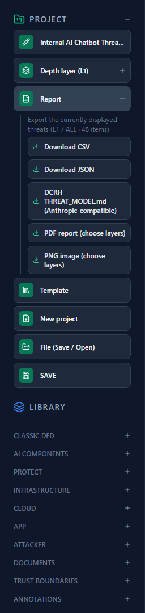
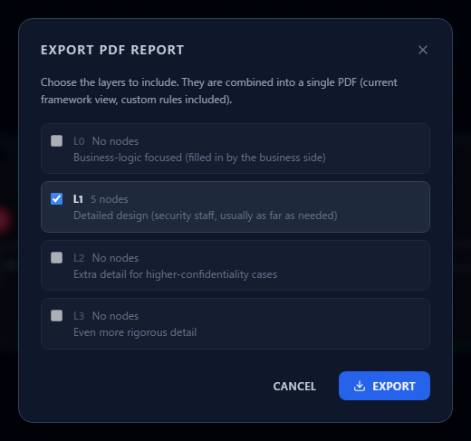
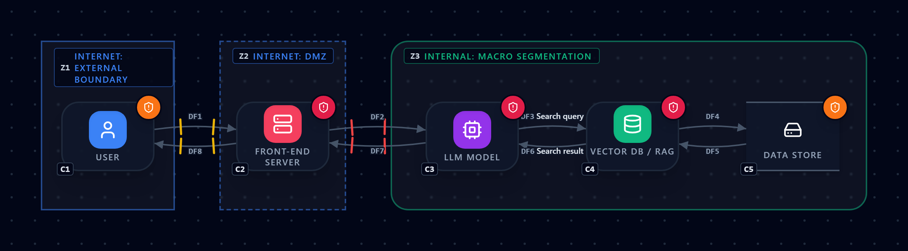
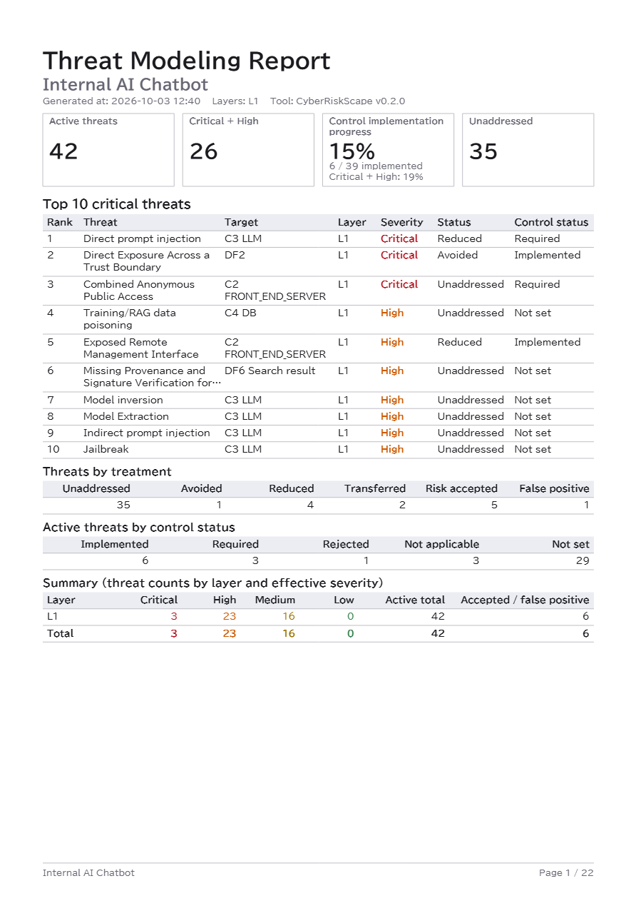
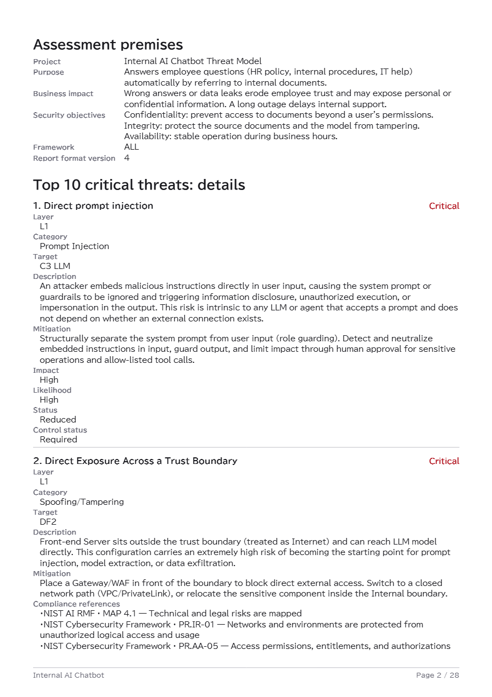
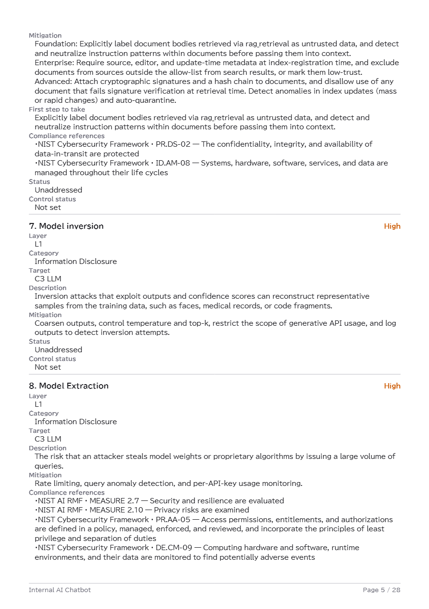
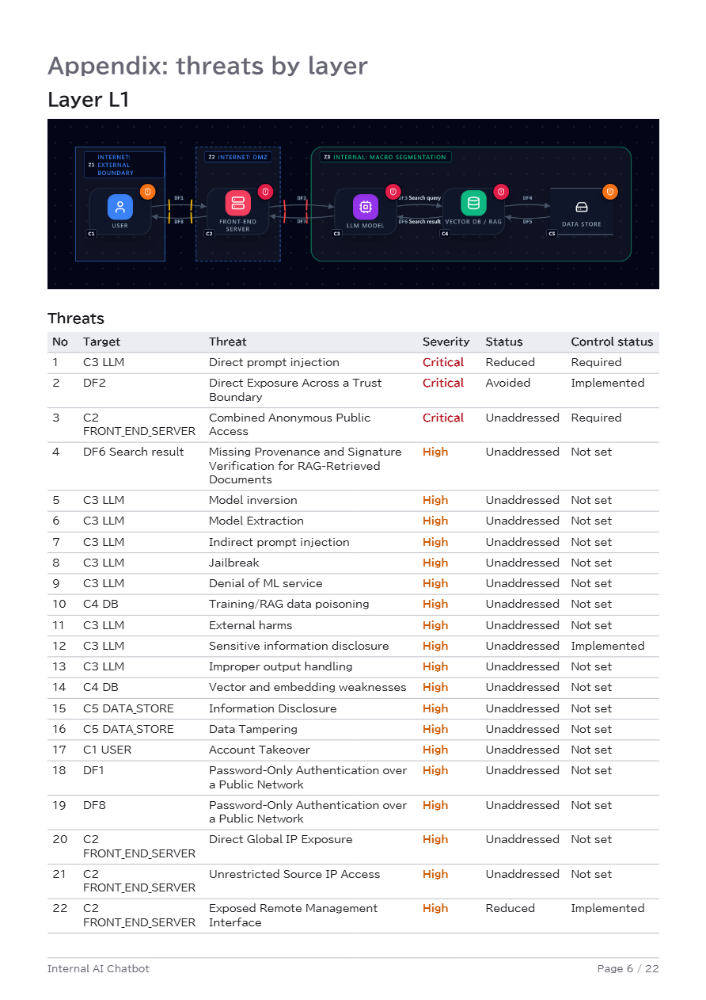

# Exporting PDF Reports and Diagram Images

**English** | [日本語](report-export.ja.md)

Once the threat model is done, the next job is **showing it to other people**.
This page covers the **PDF report** and **PNG image** items under **Report** in the left sidebar.
The PDF is a report with a one-page summary, written for reporting to a CISO or executives.

For how to read and record threats, see [Reading the Threat Panel](reading-threats.md);
for entering assessments, see [Assessing Risk in Analytics](analytics-assessment.md).

---

## 1. What you can export

**Report** has five items.

| Item | What you get | Good for |
|---|---|---|
| Download CSV | One row per threat | Sorting and sharing in a spreadsheet |
| Download JSON | Structured data | Feeding other tools or automation |
| DCRH THREAT_MODEL.md | Markdown | Input to an AI (see [Security Context](security-context.md)) |
| **PDF report (choose layers)** | One A4 portrait report | **Reporting to a CISO or executives; review material** |
| **PNG image (choose layers)** | Images of the diagram, one file per layer | Pasting into design docs, slides or tickets |

CSV, JSON and DCRH export **the list you are currently looking at** (one depth layer).
PDF and PNG differ in that **you choose which layers to export**.

While the PQC layer is selected, **Report** also offers a **PQC migration report (CSV)**, a simple
per-segment report for PQC migration. It is a separate output from the five items above; see
[Supporting PQC Migration](pqc-migration.md).

In every format, the output reflects **the current framework tab (ALL / STRIDE / AI / MAESTRO) and
your custom rules**. The numbers come from the same data as CSV and JSON, so the formats never disagree.

---

## 2. How to export

1. Open **Report** in the left sidebar and choose **PDF report (choose layers)** or
   **PNG image (choose layers)**.
2. Choose the layers (L0–L3) to export.

   

   - **Layers without nodes cannot be selected** (they are greyed out).
   - By default, **every layer that has nodes** is checked.
3. Press **Export** and the file downloads.

**PNG** produces one file per layer. It contains the diagram only, on the same dark background as
the app, with the threat badges (the round marks showing that a component has threats).

**PDF** combines the selected layers into a single file. Generation takes a few seconds.

> **The first PDF export takes a little longer.** The font used to embed Japanese text (about 9 MB)
> is downloaded once at the start. Later exports are faster thanks to the browser cache.

Everything runs in your browser. **Neither the diagram nor the threats are sent to a server.**

---

## 3. What is in the PDF

The PDF has four parts, in this order.

| Part | Contents |
|---|---|
| 1. One-page summary | Four indicators, the top 10 critical threats, and count tables. **Fits on one page** |
| 2. Assessment premises | Project information (purpose, business impact, security objectives) |
| 3. Top-10 details | Description, mitigations and compliance references for the 10 threats |
| 4. Appendix | Per layer: the diagram, every threat as a table and in detail, and the accepted / false-positive list |

### 3.1 Reading the one-page summary

Four indicators run across the top.

| Indicator | Meaning |
|---|---|
| **Active threats** | The number of threats **excluding** accepted and false-positive ones |
| **Critical + High** | Active threats whose effective severity is Critical or High |
| **Control implementation progress** | How many controls are in place (defined below). Shown overall and for Critical + High only |
| **Unaddressed** | Active threats with **no risk treatment recorded yet** |

> The image above is the guide's AI chatbot with a handful of records entered.
> Figures such as 42 active threats and 6 / 39 implemented (15%) are **values for this example only**.

#### How control implementation progress is defined

    progress = implemented ÷ (active threats − those whose control status is "Not applicable")

- The denominator is the active threats minus those whose control status is **Not applicable**
  (you decided no control is needed in this design). In the example, 42 active threats minus
  3 "Not applicable" gives a denominator of 39.
- **Not set, Required (decided to do, not yet in place) and Rejected** count as **not implemented**
  and stay in the denominator. Leaving something unrecorded never makes progress look better.
- When the denominator is 0, the value shows **"—"**.

For what each status means, see [Reading the Threat Panel, section 5](reading-threats.md).

#### The other tables on the summary

- **Top 10 critical threats** — rank, threat, target, layer, effective severity, status, control status
- **Threats by treatment** — Unaddressed / Avoided / Reduced / Transferred / Accepted / False positive (all threats, including accepted and false-positive ones)
- **Active threats by control status** — Implemented / Required / Rejected / Not applicable / Not set (active threats only)
- **Counts by layer and effective severity** — active totals, and the accepted / false-positive counts

### 3.2 Assessment premises

This shows the project information (**purpose, business impact, security objectives**), so the reader
can see first what was being protected. It is taken straight from your PROJECT settings, so
**it is blank if you left them empty** (see section 5).

### 3.3 Top-10 details

Each of the ten threats shows:

- Description, target, Impact / Likelihood, treatment status and control status
- **Mitigation** — split into Foundation / Enterprise / Advanced
- **First step to take** — for threats whose controls are **not yet implemented**, the Foundation step is pulled out
- **Compliance references** — the mapped items in NIST CSF 2.0, the NIST AI RMF and Japan's AI Business Operator Guidelines, with their titles

> Some threat rules have no tiered mitigation. For those, "First step to take" is omitted and the
> mitigation appears as a single sentence.

### 3.4 Appendix (by layer)

For each selected layer, the appendix gives **the diagram, then every threat as a table, then every
threat in detail**. At the end, the **accepted and false-positive threats** are gathered in their own
section with the reasons you recorded, so you can later trace why something was set aside.

---

## 4. How the top 10 is chosen

The top 10 is decided in this order, counting **across all the layers you selected**.

1. **Effective severity** (Critical → High → Medium → Low), reflecting your risk assessment if you made one
2. **Impact** (High → Low)
3. **Likelihood** (High → Low; **unassessed comes last**)
4. **Unaddressed first** (threats with no recorded treatment take priority)

**Accepted and false-positive threats are excluded.**
A threat you have not assessed has no Impact or Likelihood, so within the same severity it ranks
behind assessed ones.

---

## 5. Before you report

The PDF tallies exactly what you have recorded. **If the records are empty, the summary is nearly empty.**
Check these before exporting.

- **Record treatment, control status and risk assessment.** Without them the summary is all
  "Unaddressed" and "Not set". See [Assessing Risk in Analytics](analytics-assessment.md).
- **Fill in the PROJECT information.** System name, purpose, business impact and security objectives
  become the "Assessment premises" section.
- **Pick the framework tab first.** To report on one angle only (the AI view, say), switch tabs
  before exporting.
- **Manually added threats appear as "Unaddressed".** They have no risk-treatment field, so the PDF
  treats them as unaddressed ([Reading the Threat Panel, section 7](reading-threats.md)).

---

## 6. Limits and cautions

- **The cross-standard compliance matrix is not output.** The PDF shows only each threat's mapped
  items. To see how the standards relate to each other, use [The Compliance Map](compliance-map.md).
- **The diagram stays dark-themed.** It cannot be switched to a white background for printing.
- **Glyphs missing from the font render as boxes.** Japanese text is embedded in BIZ UDPGothic,
  but characters it does not contain (some symbols, emoji) appear as squares.
- **The PDF text is selectable and searchable.** It is embedded as text, not as an image.
- **A PDF can run to well over ten pages even for one layer,** because the appendix holds every threat in
  detail. As a rule, hand executives page 1 (the summary) and the top-10 details.

---

## 7. Common sticking points

**Q. Control implementation progress shows "—".**
That is what appears when the denominator is 0: there are no active threats, or all of them are "Not applicable".

**Q. Progress is lower than I expected.**
Threats whose control status is **not recorded count as not implemented**. If a control really is in
place, record "Implemented" in Analytics.

**Q. The threat count does not match the CSV.**
The PDF's "Active threats" **excludes accepted and false-positive threats**. The CSV includes
suppressed threats, so it has that many more rows.

**Q. Exporting says the feature could not be loaded.**
This happens when a new version of the app was deployed while the page was open.
Reload the page and export again. Your edits are saved automatically in the browser.

**Q. Exporting is slow.**
The first time, the font (about 9 MB) has to download. Later exports are faster.

---

## Where to go next

- Assess and record threats — [Assessing Risk in Analytics](analytics-assessment.md)
- Exporting the PQC migration report — [Supporting PQC Migration](pqc-migration.md)
- Reading the panel, and the CSV / JSON exports — [Reading the Threat Panel](reading-threats.md)
- Lining threats up against standards — [The Compliance Map](compliance-map.md)
- Using the exported Markdown as input for an AI — [Turning Your Threat Model into an AI-Readable Security Context](security-context.md)
- Why threats belong in the design stage — [An Introduction to Secure by Design](secure-by-design.md)
