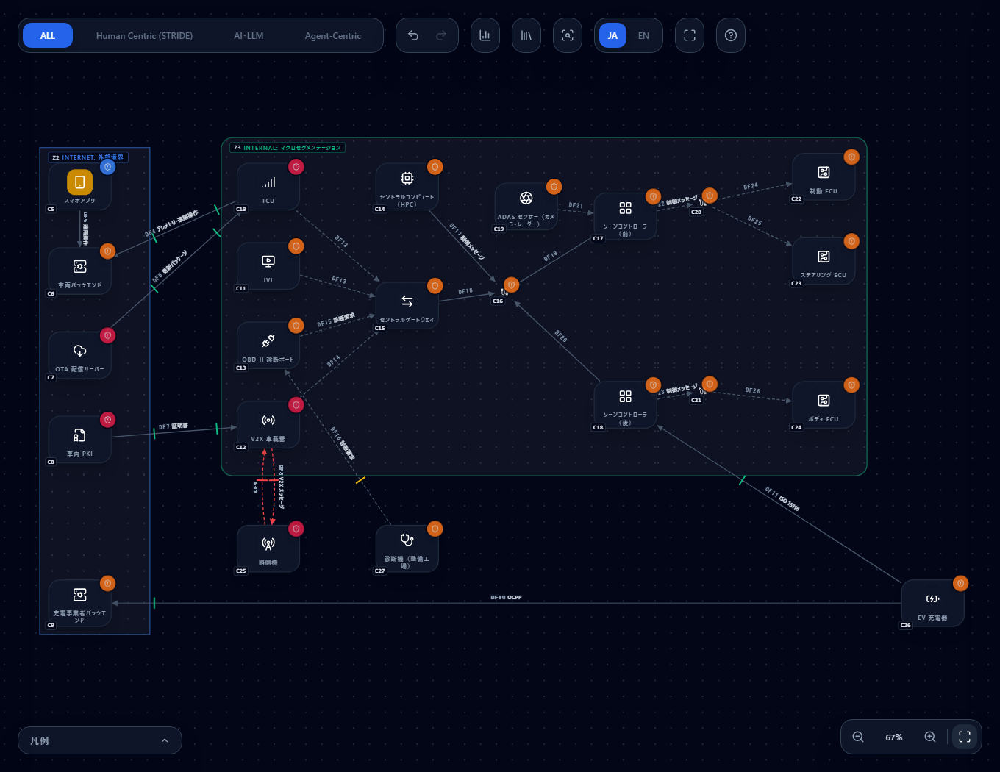

# SDV（Software Defined Vehicle）を脅威モデリングする — ゾーン型アーキテクチャのテンプレートと脅威ルール

[English](sdv.md) | **日本語**

> UN Regulation No. 155、ISO/SAE 21434、CAN、ISO 15118、OCPP などの規格名・名称は、**記述的な使用**として挙げています。
> このページは、CyberRiskScape で SDV・コネクテッドカーの構成を脅威モデル化する方法の説明であり、
> 各規格の策定団体が提供・認証・推奨するものではありません。規格の条文は逐語転載せず、要約して参照しています。
> 法的な効力を持つのは各規格の原文のみです。
> 特定のメーカー・車種や、個別の事故の事例は扱いません。

---

## 1. このページで分かること・前提

- SDV の構成要素を、CyberRiskScape の**型**（コンポーネント）に対応づける方法
- ゾーン型アーキテクチャの**構成図テンプレート**（読み込んでそのまま使える）と、読み込んだ直後に**実際に検出される脅威**
- 押さえるべき脅威と、検出するルール ID・**UN R155 Annex 5 の脅威番号**との対応
- TCU や OBD-II ポートから走行系 ECU までの**攻撃経路**の見方
- **PQC 移行支援モード**との関係（車両寿命が長いことの意味、ファームウェア署名、終端判定）
- 検出**されない**こと（限界）

**想定する読み手：** 車載機器・コネクテッドサービスのセキュリティを、設計の段階で整理したい方。

**このページの前提となる知識：** [はじめに](getting-started.ja.md)の操作と、[テンプレートの作成と利用](templates.ja.md)の読み込み手順。
§5 は [攻撃経路分析](attack-paths.ja.md)、§6 は [PQC 移行を支援する](pqc-migration.ja.md) を読んでいると分かりやすくなります。

---

## 2. SDV の構成要素と型の対応

SDV 専用の型は、左サイドバーの **VEHICLE (SDV)** カテゴリに **15 型**あります。ライブラリのトグルで無効にもできます
（パレットから隠れるだけで、配置済みの図・検出・保存データは変わりません）。

| SDV の構成要素 | 型 | 描き方のメモ |
|---|---|---|
| 走行・制動・ボディなどの制御ユニット | `ECU` | 内蔵 HSM / SHE は、ノードの暗号情報（鍵の格納場所）で表す |
| ゾーンごとに機器を束ねる制御装置 | `ZONE_CONTROLLER` | ゾーン内外のネットワーク境界。ゾーンの数だけ置く |
| 機能を集約する高性能コンピュータ | `CENTRAL_COMPUTE`（HPC） | |
| 車載ネットワーク間を中継するゲートウェイ | `CENTRAL_GATEWAY` | 外部接続面と走行系の間の防壁 |
| 携帯電話網で車両とクラウドをつなぐ通信ユニット | `TCU` | 車外から到達できる外部接続面 |
| ナビ・音楽・スマホ連携などの情報娯楽システム | `IVI` | Bluetooth・USB・アプリなど利用者側の入口が多い |
| CAN / CAN-FD / LIN / FlexRay / 車載Ethernet | `IN_VEHICLE_NETWORK` | **バスやセグメントをノードで描く**（§7 参照） |
| OBD-II 診断ポート | `OBD_PORT` | 車室内の物理的な入口 |
| V2X 車載器 | `V2X_OBU` | |
| 路側機 | `V2X_RSU` | |
| 整備工場・販売店の診断／リプログラミングツール | `DIAGNOSTIC_TOOL` | |
| EV 充電器 | `EV_CHARGER` | 車両側は ISO 15118、事業者側は OCPP |
| OTA 配信サーバー | `OTA_SERVER` | |
| 車両 PKI（ECU・V2X・Plug & Charge の証明書） | `VEHICLE_PKI` | |
| カメラ・LiDAR・レーダー・GNSS | `ADAS_SENSOR` | |

**既存の型で代用するもの**

| 構成要素 | 型 | 描き方のメモ |
|---|---|---|
| スマホアプリ | `SMARTPHONE` | |
| 車両バックエンド／テレマティクスサーバー | `BACKEND_API` | 車外のサーバーに関する脅威（認可不備・内部者など）は、この型の既存ルールが担当する |
| 充電事業者のバックエンド（CSMS） | `BACKEND_API`（または `SAAS`） | |
| ネットワーク上の HSM | `HSM` | |
| 車両そのもの | 信頼境界（ROUNDED） | 「車両」の区画として囲む |

> **境界の使い分け** — インターネット上の外部組織（車両バックエンド・OTA 配信サーバー・車両 PKI・充電事業者・スマホ）は
> **Internet 境界（RECT、「外部境界」）**で囲みます。専用線・VPN の取引先を表す Partner や、自組織の公開セグメントを表す DMZ は使いません。
> 車両の内部は組織内の区画として **ROUNDED（Security Zone）**を使います。

---

## 3. 構成図の例

ゾーン型アーキテクチャの車両と、その周辺（更新・証明書・整備・充電・路側）を 1 枚に描いたテンプレートです。

| ファイル | 内容 |
|---|---|
| [`templates/sdv-zonal-architecture.ja.json`](templates/sdv-zonal-architecture.ja.json) | 日本語 |
| [`templates/sdv-zonal-architecture.en.json`](templates/sdv-zonal-architecture.en.json) | 英語 |

読み込みは [テンプレートの作成と利用](templates.ja.md) と同じです。左サイドバーの **Template** → **Import** で JSON を選び、適用します。

**構成：** コンポーネント 23、データフロー 23、信頼境界 2（インターネット側＝Internet、車両＝Security Zone）。

- **車両の中** — セントラルコンピュート（HPC）・セントラルゲートウェイ・ゾーンコントローラ（前・後）・TCU・IVI・OBD-II 診断ポート・V2X 車載器・ADAS センサー。
  ゾーン内の CAN と幹線の車載Ethernet は**ノード**として描き、ECU（制動・ステアリング・ボディ）はバス経由で接続
- **インターネット側** — スマホアプリ・車両バックエンド・OTA 配信サーバー・車両 PKI・充電事業者バックエンド
- **車両の外の物理的・無線の相手** — 路側機・EV 充電器・診断機（整備工場）

**読み込み後に 104 件の脅威**（Critical 6・High 72・Medium 26）が検出されます。Medium のうち 4 件は、証明書で認証する公衆網の経路に出る「クライアント証明書の秘密鍵・失効確認・期限切れ」です（`zt-client-certificate-lifecycle-001`）。そのうち SDV 専用の 19 ルールすべてが発火します（42 件）。

### 3.1 図の前提（仮置きの属性）

| 要素 | 設定 | 理由と、変えるとき |
|---|---|---|
| 車内の CAN（ゾーン内） | `auth: None`、`encryption: Plain` | 送信元の認証が無く平文という、一般的な前提。SecOC（メッセージ認証）を使っている場合は、エッジ属性では表せないため実態に合わせて注記する |
| 幹線の車載Ethernet・ゲートウェイへの接続 | `encryption: TLS` / `Plain` | 幹線は MACsec 等の保護を想定して `TLS`（暗号化あり）とした。実際の方式に合わせて変える |
| TCU ⇔ 車両バックエンド、OTA 配信サーバー → TCU | `auth: Certificate`、`network: Internet`、`encryption: TLS` | 相互認証の TLS（機器証明書）を想定。実際の方式に合わせて変える（例：`Token`） |
| 診断機 → OBD-II 診断ポート | `auth: Password`、`encryption: Plain` | 診断セッションの認可（資格情報）はあるが、通信は保護されない想定 |
| 路側機 ⇔ V2X 車載器 | `auth: None`、`encryption: Plain` | 無線上の署名は別の仕組み（証明書）で担保される。エッジ属性では表せないため仮置き |
| EV 充電器 ⇔ ゾーンコントローラ（後） | `auth: Certificate`、`encryption: TLS` | ISO 15118 の TLS と証明書（Plug & Charge）を想定 |
| 車両 PKI → V2X 車載器 | `auth: Certificate`、`encryption: TLS` | 証明書の発行要求を、機器の登録用証明書で認証する想定 |
| EV 充電器 → 充電事業者バックエンド（OCPP） | `auth: Certificate`、`encryption: TLS` | OCPP のセキュリティプロファイルのうち、TLS のクライアント証明書を使うものを想定。TLS 上の Basic 認証を使うプロファイルなら `ApiKey` に変える |

エッジの属性は、実際の設計に合わせて必ず確認してください。

---

## 4. 押さえるべき脅威

SDV 専用のルールは **19 件**（`data/threat-library/sdv.yaml`）です。出典は **UN R155 Annex 5**（Part A Table A1 の脅威の番号と、
対策 M1〜M24）で、ルールは日本語の要約です（条文は転載しません）。
**車両の外のサーバーに関する脅威**（Table A1 の #1〜#3：内部者による権限の悪用、サーバーへの不正アクセス、サーバーの停止、データ漏えい）は、
車両バックエンドを `BACKEND_API` で描く前提で、**既存の汎用ルール**（認可不備・ゲートウェイを経由しない直接到達など）が担当します。
ゲートウェイ迂回の既存ルールには、送信元に TCU を追加しています。

| ルール ID | 脅威 | 対象の型 | 重大度 | UN R155 Annex 5 Table A1 の番号（攻撃例） |
|---|---|---|---|---|
| `sdv-in-vehicle-message-injection-001` | 車載ネットワークへの不正メッセージの注入・なりすまし | 車載ネットワーク | High | #11（11.1）・#6（6.1） |
| `sdv-in-vehicle-bus-flooding-dos-001` | 車載ネットワークのフラッディングによるサービス妨害 | 車載ネットワーク | High | #24（24.1） |
| `sdv-gateway-network-separation-bypass-001` | ゲートウェイの不備による車載ネットワーク分離の回避 | ゲートウェイ・ゾーンコントローラ | High | #29（29.2） |
| `sdv-obd-port-diagnostic-access-abuse-001` | OBD 診断ポートを経由した攻撃・車両パラメータの改ざん | OBD-II 診断ポート | High | #18（18.3）・#25（25.1） |
| `sdv-diagnostic-tool-session-abuse-001` | 診断機の侵害・診断セッションの認証の不備による不正な書き換え | 診断機 | High | #11（11.3）・#9（9.1）・#15（15.1） |
| `sdv-telematics-remote-attack-001` | テレマティクスを経由した遠隔攻撃・遠隔操作機能の悪用 | TCU | Critical | #16（16.1・16.2）・#29（29.1） |
| `sdv-ivi-third-party-app-media-malware-001` | 第三者アプリ・USB / メディア経由のマルウェア | IVI | High | #17（17.1）・#18（18.1・18.2）・#10（10.1） |
| `sdv-ota-update-compromise-001` | OTA 更新手順の侵害・更新前のソフトウェアの改ざん | OTA 配信サーバー | Critical | #12（12.1・12.3） |
| `sdv-software-signing-key-compromise-001` | ソフトウェア提供者の署名鍵の漏えいによる不正な更新 | OTA 配信サーバー | Critical | #12（12.4） |
| `sdv-firmware-downgrade-replay-001` | ファームウェアのダウングレード（古い正規版の再適用） | ECU・ゾーンコントローラ・HPC・ゲートウェイ | High | #6（6.3） |
| `sdv-update-denial-001` | 正規の更新の配信の妨害 | OTA 配信サーバー | Medium | #13（13.1） |
| `sdv-v2x-message-spoofing-sybil-001` | V2X メッセージのなりすまし・Sybil 攻撃 | V2X 車載器・路側機 | High | #4（4.1・4.2）・#11（11.2） |
| `sdv-vehicle-pki-trust-compromise-001` | 車両 PKI の CA 鍵の侵害・誤発行・失効の不備 | 車両 PKI | Critical | #4（4.2）・#20（20.1）・#26（26.1） |
| `sdv-ecu-key-extraction-debug-access-001` | ECU からの暗号鍵の抽出・デバッグポートの残存 | ECU | High | #19（19.3）・#28（28.2） |
| `sdv-ev-charging-manipulation-001` | 充電パラメータの改ざん・充電器を経由した車両への攻撃 | EV 充電器 | High | #25（25.2）・#16（16.1） |
| `sdv-adas-sensor-spoofing-001` | センサー入力のなりすまし・妨害（GNSS スプーフィング等） | ADAS センサー | High | #4（4.1）・#16（16.3）・#32（32.1） |
| `sdv-ownership-change-personal-data-residue-001` | 所有者・利用者の変更時の個人データの残存 | IVI・HPC | Medium | #31（31.1）・#19（19.2） |
| `sdv-central-compute-isolation-escalation-001` | 重要度の異なるソフトウェアの分離不備・権限昇格 | セントラルコンピュート | High | #9（9.1）・#29（29.2） |
| `sdv-firmware-signature-pqc-001` | 車両寿命に対して量子脆弱なファームウェア署名の検証 | ECU・ゾーンコントローラ・HPC・ゲートウェイ・OTA・車両 PKI | Medium | #26（26.1〜26.3） |

> 番号は UN R155 Annex 5 の Part A Table A1 の「脅威の番号」と「攻撃例」の番号です。ルールの `references` には、対応する対策の番号（M1〜M24）も記してあります。
> 規制が求める対策の網羅性は、この表では確認できません（§7）。

**テンプレートで検出される件数（SDV 専用ルール、型ごと）**

| 型（図中のノード） | 検出件数 |
|---|---|
| 車載ネットワーク（幹線・CAN 前・CAN 後） | 各 2（注入・フラッディング）＝ 6 |
| セントラルゲートウェイ | 3（分離回避・ダウングレード・署名の PQC） |
| ゾーンコントローラ（前・後） | 前 2・後 3（ダウングレード・署名の PQC。後は EV 充電器と直接つながるため分離回避も出る） |
| セントラルコンピュート（HPC） | 4 |
| ECU（制動・ステアリング・ボディ） | 各 3（ダウングレード・鍵の抽出・署名の PQC）＝ 9 |
| TCU | 1 |
| IVI | 2 |
| OBD-II 診断ポート | 1 |
| 診断機 | 1 |
| V2X 車載器・路側機 | 各 1 |
| OTA 配信サーバー | 4 |
| 車両 PKI | 2 |
| EV 充電器 | 1 |
| ADAS センサー | 1 |

---

## 5. 攻撃経路分析

脅威の一覧は「何が起こりうるか」を示しますが、「**どこに対策を 1 つ置けば最も効くか**」は示しません。
そのための手段が [攻撃経路分析](attack-paths.ja.md) です。SDV では、**外部接続面から走行系 ECU までの経路**を見ます。

1. 左サイドバーの Attacker カテゴリから攻撃者を置き、**最初に触れる入口**につなぎます。SDV では TCU（携帯網）、OBD-II 診断ポート（物理）、
   IVI（Bluetooth・USB・アプリ）、V2X 車載器（無線）、EV 充電器・診断機が入口の候補です
2. 攻撃者の **OBJECTIVE** に、目標のコンポーネント（例：制動 ECU）を指定します
3. 「Attack path analysis」を押します

**このテンプレートでの読み方**（図の構造から）

- TCU・IVI・OBD-II 診断ポート・V2X 車載器は、**いずれもセントラルゲートウェイにだけ**つながっています。
  したがって、これらの入口から制動 ECU への経路は、ゲートウェイ → 車載Ethernet（幹線）→ ゾーンコントローラ（前）→ CAN（前ゾーン）→ 制動 ECU を通ります。
  ゲートウェイと幹線が**共通の通過点（チョークポイント）**になると読め、ここにフィルタリングと診断要求の認可を置く効果が大きいと考えられます
- **EV 充電器はゾーンコントローラ（後）に直接つながっています**。ゲートウェイを通らない経路があるため、
  ゲートウェイの強化だけでは充電器から入る経路を塞げません。ゾーンコントローラ自体のフィルタリングが要点になります
- 経路の各ホップには、そのホップを通れるようにする脅威（§4 のルール）が根拠として付きます。ホップに根拠の脅威が出ない場合は、
  図のエッジ属性（認証・暗号化）や、バスをノードで描いているかを確認してください

実際の経路やコストは、攻撃者の種別と、リスク評価・対策の実装状況の入力で変わります。

---

## 6. PQC 移行支援モードとの関係

SDV は、PQC（耐量子計算機暗号）への移行で**早めの着手を要する**分野の 1 つです。[PQC 移行を支援する](pqc-migration.ja.md) の観点では、次のように効きます。

- **車両寿命が長い（20 年近い）** — 暗号を移行するまでの期間に加え、販売済みの車両の暗号を入れ替える期間も長いため、
  Mosca の不等式（暗号が守るべき期間 X ＋ 移行にかかる期間 Y が、暗号学的に十分な量子計算機の出現までの期間を超えるか）の X ＋ Y が**大きくなりやすい**
- **ファームウェア署名が最優先** — 署名は、更新を受け入れる信頼の根です。車両側が検証に使う公開鍵は車両に長く残り、入れ替えにくいため、
  古典署名（RSA / ECDSA）だけに頼ると、将来、署名鍵を導かれて不正な更新を正規に見せられます。
  `sdv-firmware-signature-pqc-001` は、ECU・ゾーンコントローラ・HPC・ゲートウェイ・OTA 配信サーバー・車両 PKI に出ます。
  候補は **LMS / XMSS**（NIST SP 800-208）や ML-DSA / SLH-DSA（NIST FIPS 204 / 205）です。LMS / XMSS は状態を持つ署名のため、署名の状態管理（HSM 等）が要点です
- **CAN-FD の帯域と ECU の性能が制約** — PQC の署名・鍵は古典暗号より大きく、車載バスのフレームや小さな ECU には載せにくい場合があります。
  どこまでを ECU で検証し、どこをゲートウェイやゾーンコントローラで受けるかの設計が必要です
- **終端判定の既定値**（`data/crypto-behavior/termination.yaml`）— **TCU・EV 充電器は終端**（TLS を終端して別の暗号で再接続する）、
  **セントラルゲートウェイ・ゾーンコントローラは透過**（暗号を変えずに転送する）です。ゲートウェイやゾーンコントローラが、方式の異なる区間の変換で
  認証子を付け直したり、診断通信の TLS を終端したりする構成では終端になるので、別の構成として確認してください。
  これらは設計からの一般的な推定で、実機の設定を確かめた結果ではありません

---

## 7. 限界（検出されないこと）

- **UN R155 の型式認証や ISO/SAE 21434 の TARA の代替ではありません。** このツールは設計段階の脅威を洗い出す補助で、
  規制への適合を判定・保証するものではありません。ISO/SAE 21434 は番号と表題を参照しているだけです
- **SFOP（安全・財務・運用・プライバシー）の影響評価と、攻撃可能性の評価は未対応**です。TARA への本格的な対応にはリスク評価モデルの拡張が必要で、需要を見て別途判断します
- **V2X の署名の PQC 化は標準化の途上**です。方式と証明書の運用が定まっていないため、V2X に関する PQC の判定は暫定的です
- **車載バスの平文のエッジには、汎用の平文通信ルールも出ます。** これは仕様です。エッジを `Plain` と描けば `plaintext-transmission` 系のルールが出ます
  （車内の盗聴は、CAN ではなく機密データの扱いの問題として扱い、SDV 専用ルールでは重ねていません）
- **注入・フラッディングのルールは、バスを `IN_VEHICLE_NETWORK` のノードで描いた場合に出ます。** ECU 同士を直接つないだ図には出ません。
  CAN などのバスは、ゾーンコントローラや ECU とは別のノードとして描いてください
- 車両の**物理的な改ざん**（ハードウェアの解析・サイドチャネルなど）は、鍵の抽出・デバッグポートのルールに含まれる範囲に限られます
- 車両バックエンド・OTA 配信サーバーの**クラウド側の設計**は、`BACKEND_API` など汎用のルールで見ます。SDV 専用のルールが見るのは、更新と署名の観点です

---

## 参考リンク

- [UN Regulation No. 155（EU 官報版・EUR-Lex）](https://eur-lex.europa.eu/eli/reg/2025/5/oj/eng) — Annex 5 に脅威と対策の一覧があります。法的な効力を持つのは UNECE の原文のみです
- [UNECE 車両規則（WP.29）](https://unece.org/transport/vehicle-regulations) — UN R155（サイバーセキュリティ）・R156（ソフトウェア更新）の公式の入口
- [NIST SP 800-208](https://csrc.nist.gov/pubs/sp/800/208/final) — 状態を持つハッシュベース署名（LMS / XMSS）の推奨事項
- ISO/SAE 21434 "Road vehicles — Cybersecurity engineering"（番号と表題のみ参照。内容は規格書で確認してください）

## 次に読むもの

- [攻撃経路分析](attack-paths.ja.md) — 入口から走行系 ECU までの経路と、チョークポイントの見つけ方
- [PQC 移行を支援する](pqc-migration.ja.md) — 暗号の終端・復号の位置と、署名の PQC 判定
- [脅威パネルの読み方](reading-threats.ja.md) — 検出された脅威と対策の段階の読み方
