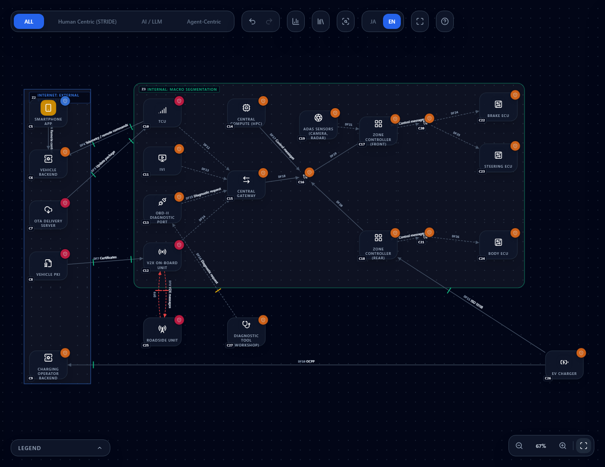

# Threat Modeling an SDV (Software Defined Vehicle) — A Zonal Architecture Template and Threat Rules

**English** | [日本語](sdv.ja.md)

> UN Regulation No. 155, ISO/SAE 21434, CAN, ISO 15118, OCPP and the like are named here in a **descriptive** sense.
> This page explains how to threat-model an SDV or connected-car design in CyberRiskScape. It is not provided, certified
> or endorsed by the bodies that publish those standards. Standards are summarized, not quoted verbatim; only the
> original texts carry legal force. No specific manufacturer, model or individual incident is discussed.

---

## 1. What this page covers, and assumptions

- How to **map** SDV building blocks to CyberRiskScape component types
- A **zonal-architecture diagram template** (load it and use it as is), and the threats **actually detected** on it
- The threats worth watching, with the rule IDs that detect them and the matching **UN R155 Annex 5 threat numbers**
- How to read an **attack path** from the TCU or the OBD-II port to a driving-critical ECU
- How it relates to **PQC migration support** (why a long vehicle life matters, firmware signatures, termination verdicts)
- What is **not** detected (limits)

**Assumed knowledge:** the operations in [Getting Started](getting-started.md) and the import steps in
[Creating and Using Templates](templates.md). §5 reads better after [Attack Path Analysis](attack-paths.md), and §6 after
[Supporting PQC Migration](pqc-migration.md).

---

## 2. Mapping SDV to CyberRiskScape types

The SDV-specific types are the **15 types** in the **VEHICLE (SDV)** category of the left sidebar. You can disable the
library with its toggle; this only hides it from the palette and does not change placed diagrams, detection or saved data.

| SDV building block | Type | Modeling notes |
|---|---|---|
| Control unit for driving, braking, body and so on | `ECU` | Express a built-in HSM / SHE through the node's crypto information (key storage) |
| Controller that gathers devices per zone | `ZONE_CONTROLLER` | A network boundary between a zone and the rest. Place one per zone |
| High-performance computer that consolidates functions | `CENTRAL_COMPUTE` (HPC) | |
| Gateway between in-vehicle networks | `CENTRAL_GATEWAY` | The barrier between external-facing units and the driving network |
| Unit connecting the vehicle to the cloud over cellular | `TCU` | An external connection surface reachable from outside |
| Infotainment (navigation, media, phone integration) | `IVI` | Many user-side entry points: Bluetooth, USB, apps |
| CAN / CAN-FD / LIN / FlexRay / automotive Ethernet | `IN_VEHICLE_NETWORK` | **Draw buses and segments as nodes** (see §7) |
| OBD-II diagnostic port | `OBD_PORT` | A physical entry point in the cabin |
| V2X on-board unit | `V2X_OBU` | |
| Roadside unit | `V2X_RSU` | |
| Workshop / dealer diagnostic and reprogramming tool | `DIAGNOSTIC_TOOL` | |
| EV charger | `EV_CHARGER` | ISO 15118 toward the vehicle, OCPP toward the operator |
| OTA delivery server | `OTA_SERVER` | |
| Vehicle PKI (certificates for ECUs, V2X, Plug & Charge) | `VEHICLE_PKI` | |
| Camera, LiDAR, radar, GNSS | `ADAS_SENSOR` | |

**Substitutes from existing types**

| Building block | Type | Modeling notes |
|---|---|---|
| Smartphone app | `SMARTPHONE` | |
| Vehicle backend / telematics server | `BACKEND_API` | Threats on off-vehicle servers (authorization flaws, insiders and so on) are covered by this type's existing rules |
| Charging operator backend (CSMS) | `BACKEND_API` (or `SAAS`) | |
| Network HSM | `HSM` | |
| The vehicle itself | Trust boundary (ROUNDED) | Enclose it as a "vehicle" zone |

> **Choosing boundaries** — Draw external organizations on the internet (vehicle backend, OTA server, vehicle PKI, charging
> operator, smartphone) inside an **Internet boundary (RECT, "external boundary")**. Do not use Partner (a private-line or VPN
> counterparty) or DMZ (your own public segment). Use **ROUNDED (Security Zone)** for the inside of the vehicle.

---

## 3. An example diagram

This template puts a zonal-architecture vehicle and its surroundings (updates, certificates, service, charging, roadside) on one canvas.

| File | Contents |
|---|---|
| [`templates/sdv-zonal-architecture.en.json`](templates/sdv-zonal-architecture.en.json) | English |
| [`templates/sdv-zonal-architecture.ja.json`](templates/sdv-zonal-architecture.ja.json) | Japanese |

Import works the same way as in [the templates page](templates.md): open **Template** in the left sidebar, choose **Import**,
select the JSON, and apply it.

**What is in it:** 23 components, 23 data flows, 2 trust boundaries (the internet side = Internet, the vehicle = Security Zone).

- **Inside the vehicle** — central compute (HPC), central gateway, zone controllers (front and rear), TCU, IVI, OBD-II
  diagnostic port, V2X on-board unit, ADAS sensors. The in-zone CAN buses and the Ethernet backbone are drawn as **nodes**,
  and the ECUs (brake, steering, body) connect through the buses
- **Internet side** — smartphone app, vehicle backend, OTA delivery server, vehicle PKI, charging operator backend
- **Physical and wireless counterparts outside the vehicle** — roadside unit, EV charger, diagnostic tool (workshop)

**After loading, 73 threats** are detected (6 Critical, 48 High, 19 Medium). Four of the Medium findings concern client-certificate private keys, revocation checks, and expiry on the public-network paths authenticated by certificate (`zt-client-certificate-lifecycle-001`). All 19 SDV-specific rules fire (42 findings).

### 3.1 Assumptions in the diagram (placeholder attributes)

| Element | Setting | Why, and when to change it |
|---|---|---|
| In-zone CAN | `auth: None`, `encryption: Plain` | The common assumption: no sender authentication and no encryption. If you use SecOC (message authentication), edge attributes cannot show it, so note it separately |
| Backbone Ethernet and links to the gateway | `encryption: TLS` / `Plain` | The backbone is assumed protected (for example MACsec) and drawn as `TLS` (encrypted). Change it to the real mechanism |
| TCU ⇔ vehicle backend, OTA server → TCU | `auth: Certificate`, `network: Internet`, `encryption: TLS` | Mutual-authentication TLS (device certificates) is assumed. Change it to match the real method (for example `Token`) |
| Diagnostic tool → OBD-II port | `auth: Password`, `encryption: Plain` | A diagnostic session has authorization (credentials), but the link is assumed unprotected |
| Roadside unit ⇔ V2X on-board unit | `auth: None`, `encryption: Plain` | Signatures over the air are backed by certificates, which edge attributes cannot show, so this is a placeholder |
| EV charger ⇔ zone controller (rear) | `auth: Certificate`, `encryption: TLS` | ISO 15118 TLS and certificates (Plug & Charge) are assumed |
| Vehicle PKI → V2X on-board unit | `auth: Certificate`, `encryption: TLS` | Certificate enrollment is assumed to authenticate the device with its enrollment certificate |
| EV charger → charge point operator backend (OCPP) | `auth: Certificate`, `encryption: TLS` | The OCPP security profile with TLS client certificates is assumed. If the charger uses the profile with Basic authentication over TLS, change it to `ApiKey` |

Always check the edge attributes against your real design.

---

## 4. Threats to watch

There are **19 SDV-specific rules** (`data/threat-library/sdv.yaml`). The source is **UN R155 Annex 5** (the threat numbers of
Part A Table A1 and mitigations M1 to M24), and the rules are Japanese summaries, not quotations.
**Threats on servers outside the vehicle** (Table A1 #1 to #3: abuse of privileges by insiders, unauthorized access to servers,
server outage, data leakage) are left to the **existing general-purpose rules** (authorization flaws, reaching a backend
without passing through the gateway, and so on), on the premise that you draw the vehicle backend as `BACKEND_API`.
We added the TCU to the sources of the existing gateway-bypass rule.

| Rule ID | Threat | Applies to | Severity | UN R155 Annex 5 Table A1 number (attack example) |
|---|---|---|---|---|
| `sdv-in-vehicle-message-injection-001` | Injection or spoofing of messages on an in-vehicle network | In-vehicle network | High | #11 (11.1), #6 (6.1) |
| `sdv-in-vehicle-bus-flooding-dos-001` | Denial of service by flooding an in-vehicle network | In-vehicle network | High | #24 (24.1) |
| `sdv-gateway-network-separation-bypass-001` | Bypassing in-vehicle network separation through gateway flaws | Gateway, zone controller | High | #29 (29.2) |
| `sdv-obd-port-diagnostic-access-abuse-001` | Attacks and parameter tampering through the OBD port | OBD-II port | High | #18 (18.3), #25 (25.1) |
| `sdv-diagnostic-tool-session-abuse-001` | Compromised diagnostic tool or weak session authentication leading to unauthorized rewriting | Diagnostic tool | High | #11 (11.3), #9 (9.1), #15 (15.1) |
| `sdv-telematics-remote-attack-001` | Remote attack through telematics, abuse of remote-control features | TCU | Critical | #16 (16.1, 16.2), #29 (29.1) |
| `sdv-ivi-third-party-app-media-malware-001` | Malware through third-party apps and USB / media | IVI | High | #17 (17.1), #18 (18.1, 18.2), #10 (10.1) |
| `sdv-ota-update-compromise-001` | Compromise of the OTA update procedure, tampering before the update | OTA server | Critical | #12 (12.1, 12.3) |
| `sdv-software-signing-key-compromise-001` | Leak of the software provider's signing key leading to malicious updates | OTA server | Critical | #12 (12.4) |
| `sdv-firmware-downgrade-replay-001` | Firmware downgrade (replaying an older legitimate version) | ECU, zone controller, HPC, gateway | High | #6 (6.3) |
| `sdv-update-denial-001` | Blocking delivery of legitimate updates | OTA server | Medium | #13 (13.1) |
| `sdv-v2x-message-spoofing-sybil-001` | V2X message spoofing and Sybil attacks | V2X OBU, RSU | High | #4 (4.1, 4.2), #11 (11.2) |
| `sdv-vehicle-pki-trust-compromise-001` | CA key compromise, mis-issuance or weak revocation in the vehicle PKI | Vehicle PKI | Critical | #4 (4.2), #20 (20.1), #26 (26.1) |
| `sdv-ecu-key-extraction-debug-access-001` | Key extraction from an ECU, leftover debug ports | ECU | High | #19 (19.3), #28 (28.2) |
| `sdv-ev-charging-manipulation-001` | Tampering with charging parameters, attacks on the vehicle through a charger | EV charger | High | #25 (25.2), #16 (16.1) |
| `sdv-adas-sensor-spoofing-001` | Spoofing or jamming of sensor input (such as GNSS spoofing) | ADAS sensor | High | #4 (4.1), #16 (16.3), #32 (32.1) |
| `sdv-ownership-change-personal-data-residue-001` | Personal data left behind when the owner or user changes | IVI, HPC | Medium | #31 (31.1), #19 (19.2) |
| `sdv-central-compute-isolation-escalation-001` | Weak isolation between software of different criticality, privilege escalation | Central compute | High | #9 (9.1), #29 (29.2) |
| `sdv-firmware-signature-pqc-001` | Firmware signature verification that is quantum-vulnerable over the vehicle's life | ECU, zone controller, HPC, gateway, OTA, vehicle PKI | Medium | #26 (26.1 to 26.3) |

> The numbers are the "threat number" and "attack example" numbers of UN R155 Annex 5, Part A Table A1. Each rule's `references`
> also lists the matching mitigation numbers (M1 to M24). This table cannot confirm whether the mitigations the regulation
> requires are complete (§7).

**Findings on the template (SDV-specific rules, by type)**

| Type (node in the diagram) | Findings |
|---|---|
| In-vehicle network (backbone, front CAN, rear CAN) | 2 each (injection, flooding) = 6 |
| Central gateway | 3 (separation bypass, downgrade, PQC signature) |
| Zone controller (front, rear) | front 2, rear 3 (downgrade, PQC signature; the rear one also gets separation bypass because the EV charger connects to it directly) |
| Central compute (HPC) | 4 |
| ECU (brake, steering, body) | 3 each (downgrade, key extraction, PQC signature) = 9 |
| TCU | 1 |
| IVI | 2 |
| OBD-II port | 1 |
| Diagnostic tool | 1 |
| V2X OBU, roadside unit | 1 each |
| OTA server | 4 |
| Vehicle PKI | 2 |
| EV charger | 1 |
| ADAS sensor | 1 |

---

## 5. Attack path analysis

A list of threats tells you what could happen, not **where one control buys you the most**. That is what
[Attack Path Analysis](attack-paths.md) is for. For an SDV, look at the **routes from the external connection surfaces to a
driving-critical ECU**.

1. From the Attacker category in the left sidebar, place an attacker and connect it to **whatever it touches first**. In an SDV,
   candidates are the TCU (cellular), the OBD-II port (physical), the IVI (Bluetooth, USB, apps), the V2X on-board unit (radio),
   the EV charger and the diagnostic tool
2. Set the attacker's **OBJECTIVE** to the target component (for example the brake ECU)
3. Press "Attack path analysis"

**Reading it on this template** (from the structure of the diagram)

- The TCU, IVI, OBD-II port and V2X on-board unit **all connect only to the central gateway**. Routes from these entry points
  to the brake ECU therefore pass through the gateway, the Ethernet backbone, the front zone controller, the front CAN and the brake ECU.
  The gateway and the backbone should show up as **common points (choke points)**, so filtering and authorizing diagnostic
  requests there is likely to pay off most
- **The EV charger connects directly to the rear zone controller.** Because there is a route that avoids the gateway, hardening
  the gateway alone does not close the routes that enter through the charger. Filtering at the zone controller itself matters
- Each hop of a route carries, as evidence, the threats (the §4 rules) that make that hop passable. If a hop shows no evidence,
  check the edge attributes (authentication, encryption) and whether you drew the bus as a node

The actual routes and costs change with the attacker type and with your risk scores and control implementation status.

---

## 6. Relationship to PQC migration support

SDV is one of the areas that need an **early start** on PQC (post-quantum cryptography) migration. In the view of
[Supporting PQC Migration](pqc-migration.md):

- **The vehicle life is long (close to 20 years).** The time to migrate, plus the time to replace cryptography in vehicles
  already sold, is long, so X + Y in Mosca's inequality (the period cryptography must protect, X, plus the migration time, Y,
  against the time until a cryptographically relevant quantum computer) **tends to be large**
- **Firmware signatures come first.** A signature is the root of trust for accepting an update. The public key a vehicle uses
  to verify stays in the vehicle for a long time and is hard to replace, so relying on classical signatures (RSA / ECDSA) alone
  could let a future attacker derive the signing key and make malicious updates look legitimate.
  `sdv-firmware-signature-pqc-001` fires on ECUs, zone controllers, the HPC, the gateway, the OTA server and the vehicle PKI.
  Candidates are **LMS / XMSS** (NIST SP 800-208) and ML-DSA / SLH-DSA (NIST FIPS 204 / 205). LMS / XMSS are stateful signatures,
  so managing the signing state (for example in an HSM) is the key point
- **CAN-FD bandwidth and ECU performance are constraints.** PQC signatures and keys are larger than classical ones and may not fit
  in in-vehicle bus frames or small ECUs. You need to design how much is verified on the ECU and how much is received at the
  gateway or zone controller
- **Default termination verdicts** (`data/crypto-behavior/termination.yaml`): the **TCU and the EV charger terminate** (they end TLS
  and reconnect with different cryptography), while the **central gateway and the zone controller pass through** (they forward
  without changing the cryptography). If a gateway or zone controller re-attaches authenticators when converting between
  segment types, or terminates diagnostic-channel TLS, it terminates, so check that as an alternative configuration.
  These are general estimates from the design, not a check of real device settings

---

## 7. Limits (what is not detected)

- **This is not a substitute for UN R155 type approval or an ISO/SAE 21434 TARA.** The tool helps you find threats at design time;
  it does not judge or guarantee regulatory compliance. ISO/SAE 21434 is referenced only by number and title
- **SFOP (safety, financial, operational, privacy) impact rating and attack feasibility rating are not supported.** Full TARA
  support would need an extension of the risk model, which will be decided separately depending on demand
- **PQC signatures for V2X are still being standardized.** Because the scheme and the certificate operations are not settled,
  PQC verdicts about V2X are provisional
- **A plaintext edge on an in-vehicle bus also triggers the general plaintext-transmission rule.** This is by design: draw an edge
  as `Plain` and the `plaintext-transmission` rules fire (eavesdropping inside the vehicle is treated as a matter of handling
  confidential data, not of CAN itself, so the SDV rules do not duplicate it)
- **The injection and flooding rules fire when you draw the bus as an `IN_VEHICLE_NETWORK` node.** They do not fire on a diagram
  that connects ECUs directly to each other. Draw a CAN or other bus as its own node, separate from the zone controller or ECU
- **Physical tampering** with the vehicle (hardware analysis, side channels and so on) is covered only to the extent of the
  key-extraction and debug-port rule
- **The cloud-side design** of the vehicle backend and the OTA server is handled by general rules such as those for `BACKEND_API`.
  The SDV-specific rules look at updates and signing

---

## References

- [UN Regulation No. 155 (EU Official Journal version, EUR-Lex)](https://eur-lex.europa.eu/eli/reg/2025/5/oj/eng) — Annex 5 lists the threats and mitigations. Only the UNECE original carries legal force
- [UNECE vehicle regulations (WP.29)](https://unece.org/transport/vehicle-regulations) — the official entry point for UN R155 (cybersecurity) and R156 (software updates)
- [NIST SP 800-208](https://csrc.nist.gov/pubs/sp/800/208/final) — recommendations for stateful hash-based signatures (LMS / XMSS)
- ISO/SAE 21434 "Road vehicles — Cybersecurity engineering" (referenced by number and title only; check the standard itself for its content)

## What to read next

- [Attack Path Analysis](attack-paths.md) — routes from entry points to driving-critical ECUs, and finding choke points
- [Supporting PQC Migration](pqc-migration.md) — where encryption terminates or is decrypted, and PQC verdicts for signatures
- [Reading the Threat Panel](reading-threats.md) — how to read detected threats and mitigation tiers
