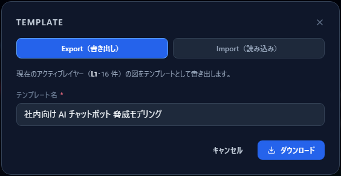
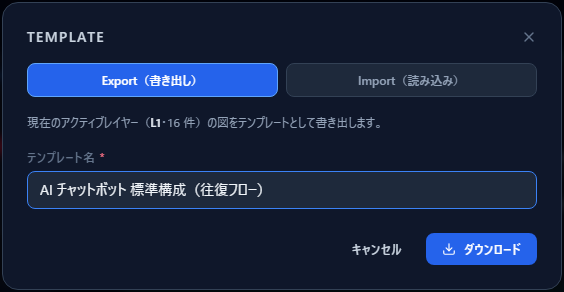
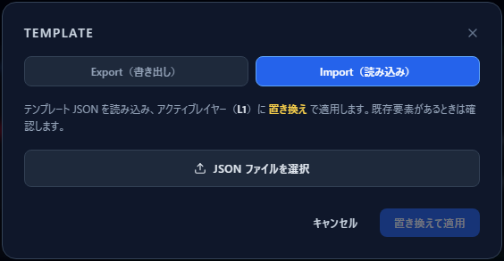
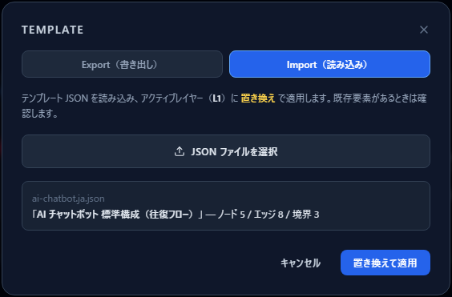

# テンプレートを作る・使う

[English](templates.md) | **日本語**

同じ構成を何度も描き直すのは無駄です。CyberRiskScape は、**描いた図を JSON として書き出し、
別のプロジェクトで読み込む**ことができます。

このガイドで使っている **AI チャットボット構成のテンプレート**も用意しているので、
[はじめての脅威モデル](first-threat-model.ja.md)を自分で描く代わりに、
これを読み込んで以降の章に進むこともできます。

---

## 1. テンプレートに入るもの・入らないもの

テンプレートは **1 つの深度レイヤー分の図**です。

| 入るもの | 入らないもの |
|---|---|
| コンポーネント（種類・位置・属性） | プロジェクト情報（名称・目的・ビジネスインパクト） |
| データフロー（向き・認証・経路・暗号化・セマンティクス） | リスク評価 |
| トラスト境界（種類・位置・大きさ・信頼レベル） | リスク対応方針・対策実装状況 |
| | 手動で追加した脅威 |

**評価の記録は引き継がれません。** テンプレートは「構成の雛形」であって、
分析結果の保存形式ではないからです。作業中のプロジェクトを丸ごと保存したいときは、
左サイドバーの **ファイル（保存 / 開く）** を使ってください。

なお、各要素の ElementalID（C1 / DF1 / Z1 …）は書き出し時に取り除かれ、
**読み込んだ側で振り直されます**。別のレイヤーに取り込んでも番号が衝突しません。

---

## 2. 書き出す（Export）

左サイドバーの **Template** を開くと、Export タブが出ます。



対象は**いま開いているアクティブレイヤー**です（「現在のアクティブレイヤー（L1・16 件）の図を
テンプレートとして書き出します」と表示されます）。

テンプレート名を入力して **ダウンロード** を押すと、JSON ファイルが保存されます。



名前は読み込むときに表示されるので、「AI チャットボット 標準構成（往復フロー）」のように
**中身が分かる名前**を付けてください。

---

## 3. 読み込む（Import）

**Import（読み込み）** タブに切り替えます。



「JSON ファイルを選択」でファイルを選ぶと、**テンプレート名と要素数**が表示されます。



> **適用はアクティブレイヤーの「置き換え」です。**
> 既存の要素があるときは確認が出ます。置き換えても `Ctrl + Z` で元に戻せますが、
> 大事な図は先に **ファイル（保存 / 開く）** で保存しておくのが安全です。

読み込み先は**いま選んでいる深度レイヤー**です。L1 の図を壊したくないときは、
先に L2 へ切り替えてから読み込むという手もあります。

---

## 4. AI チャットボットのテンプレート

このガイドで使っている構成を、そのまま読み込めるテンプレートとして置いています。

| ファイル | 内容 |
|---|---|
| [`templates/ai-chatbot.ja.json`](templates/ai-chatbot.ja.json) | 日本語版（データフロー名が日本語） |
| [`templates/ai-chatbot.en.json`](templates/ai-chatbot.en.json) | 英語版 |

GitHub 上でファイルを開き、**Raw** からダウンロードしてください。

**中身：** コンポーネント 5・データフロー 8・トラスト境界 3。

```
ユーザー ⇄ フロントエンドサーバー ⇄ LLMモデル ⇄ ベクターDB / RAG ⇄ データストア
（Internet）      （DMZ）        （内部ネットワーク：マクロセグメンテーション）
```

- ユーザー ⇄ フロントエンドサーバーの往復は **公衆網 + ID/パスワード**
- ベクターDB / RAG → LLMモデル（検索結果）は **セマンティクス `rag_retrieval`**
- 境界は 外部境界（Internet）／DMZ／マクロセグメンテーション（Internal）

読み込むと、そのまま **48 件**の脅威が検出されます。
[脅威パネルの読み方](reading-threats.ja.md)以降の章は、この状態を前提にしています。

### コンタクトセンターのテンプレート

有人とAIが混在するコンタクトセンターの構成を、1 枚の図にまとめたテンプレートです。

| ファイル | 内容 |
|---|---|
| [`templates/contact-center.ja.json`](templates/contact-center.ja.json) | 日本語版 |
| [`templates/contact-center.en.json`](templates/contact-center.en.json) | 英語版 |

**中身：** コンポーネント 15・データフロー 25・トラスト境界 3（顧客側＝Internet、LINE＝Internet、社内コンタクトセンター＝Internal）。

4 つの応対パターンが同じ図に入っています。

- **有人 Call** — 顧客（電話）→ PBX → 有人オペレーター
- **AI Call** — PBX → STT → AI オペレーター → TTS → PBX（段階型）。別系統として PBX ⇄ STS（音声対音声）も 1 本
- **AI Chat** — 顧客 → LINE → AI オペレーター（Webhook で受け、返信 API で返す）
- **有人 Chat** — 顧客 → チャット → 有人オペレーター

共通部分として、PBX の前段の IVR、声紋認証、通話録音、CRM（`tool_invocation`）、LLM（インテント分析・要約）、
AI から有人へのエスカレーションを含みます。

読み込むと **62 件**の脅威が検出されます。主なもの：声紋認証のクローン音声による突破、
有人オペレーターへの電話のソーシャルエンジニアリング、STS のガードレール漏れ、
STT 経由の発話によるプロンプトインジェクション、PBX の不正発信（toll fraud）・発信者番号の偽装、
LINE の Webhook 署名未検証・チャネル乗っ取り、通話録音（生体情報）の漏えい。

### Salesforce Agentforce のテンプレート

顧客向けの Service agent と社員向けの Employee agent を 1 枚にまとめたテンプレートです。
外部の人が Web フォームから CRM に書き込み、それを Employee agent が読んで外部へ送れてしまう
経路（ForcedLeak 型）を含みます。

| ファイル | 内容 |
|---|---|
| [`templates/agentforce-service-agent.ja.json`](templates/agentforce-service-agent.ja.json) | 日本語版 |
| [`templates/agentforce-service-agent.en.json`](templates/agentforce-service-agent.en.json) | 英語版 |

**中身：** コンポーネント 14・データフロー 25・トラスト境界 3（顧客・外部＝Internet、Salesforce 組織＝Internal、外部 API／外部 MCP サーバー＝Internet）。
読み込むと **103 件**の脅威が検出されます。構成要素の対応づけと、検出される脅威の読み方は
[Salesforce Agentforce を脅威モデリングする](agentforce.ja.md)を参照してください。

### NHI と ID 基盤のテンプレート

サービスアカウント・ワークロードID・OAuthクライアント・RPAボットと、特権アクセス管理・ID ガバナンス・IdP を
1 枚にまとめたテンプレートです。運用担当が特権アクセス管理を経由しつつ、同じサービスアカウントを手作業で
直接も使っている経路（人による NHI の利用）を含みます。

| ファイル | 内容 |
|---|---|
| [`templates/nhi-identity.ja.json`](templates/nhi-identity.ja.json) | 日本語版 |
| [`templates/nhi-identity.en.json`](templates/nhi-identity.en.json) | 英語版 |

**中身：** コンポーネント 14・データフロー 12・トラスト境界 2（組織内＝Internal、外部 SaaS と IDaaS＝Internet）。
読み込むと **41 件**の脅威が検出されます。型の対応と脅威の読み方は
[NHI と ID 基盤を脅威モデリングする](nhi-identity.ja.md)を参照してください。

---

## 5. なぜ往復のフローを入れてあるのか

このテンプレートには、**要求（往路）だけでなく応答（復路）のデータフローも**入っています。
見た目の問題ではなく、**検出される脅威が変わる**ためです。

### エッジの向きは判定条件そのもの

脅威ルールの接続条件は、**エッジの source → target** を見ます。
Edge Properties の「順方向 (Outbound) / 逆方向 (Inbound) / 双方向 (Bidirectional)」は
**矢印の描き方を変えるだけ**で、判定には使われません。

つまり、**応答の経路を表現したいなら、逆向きのエッジを引く**必要があります。
「双方向」に設定しても、脅威エンジンから見れば片方向のままです。

### 具体例：間接プロンプトインジェクション

`atlas-aml-t0051-indirect-prompt-injection-001`（間接プロンプトインジェクション）の
発火条件は、**LLM / エージェントに対して、改ざん可能なソース
（RAG・ツール・データストア・メモリ等）からの inbound エッジがあること**です。

- **往路だけの図**：LLM → ベクターDB / RAG しかない。LLM から見て inbound が無いので発火しない
- **往復の図**：ベクターDB / RAG → LLM がある。**検索結果に仕込まれた指令**という、
  RAG 構成で最も重要な脅威が発火する

実際、このテンプレートの構成では片道 8 本のうち復路 4 本を足したことで、
検出数が **43 件 → 48 件**に増えました。

### 作図のときの原則

**データが返ってくる経路も描く。** 特に次の場合は、復路が脅威の本体です。

- RAG・データストアからの**取得結果**が LLM に入る（間接プロンプトインジェクション）
- LLM の**生成結果**がアプリケーションやユーザーに返る（出力の未検証・機微情報の漏えい）
- 外部ツール・API の**応答**をエージェントが処理する（ツール応答の汚染）

---

## 6. 使いどころ

- **社内標準構成を配る** — 自組織の典型構成をテンプレート化しておけば、
  各チームは「描く」ところからではなく「自分たちの違いを直す」ところから始められます
- **レビューの出発点** — レビュー前にテンプレートを配り、当日は差分だけを議論する
- **演習・教育** — 同じ図から始めて、全員が同じ脅威一覧を見ながら議論できる

外部から受け取ったテンプレート JSON は、**読み込む前に中身を確認**してください
（テキストファイルなのでそのまま読めます）。

---

## 次に読むもの

- 図を自分で描く — [はじめての脅威モデル](first-threat-model.ja.md)
- 出てきた脅威を読む — [脅威パネルの読み方](reading-threats.ja.md)
- 評価して記録する — [Analytics でリスクを評価する](analytics-assessment.ja.md)
