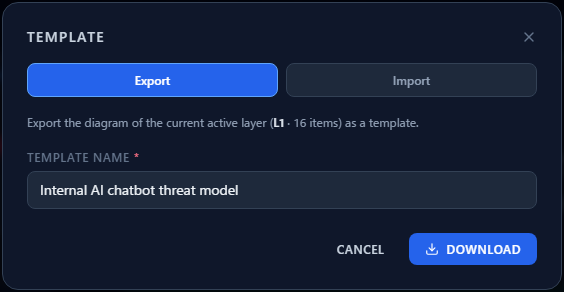
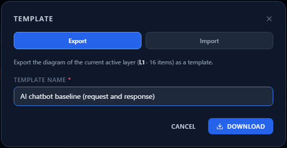
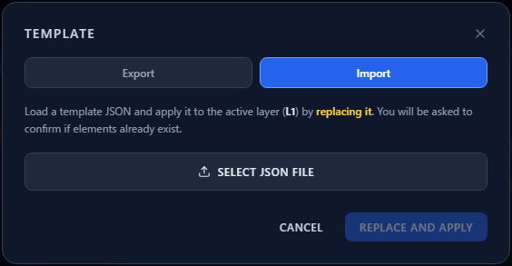
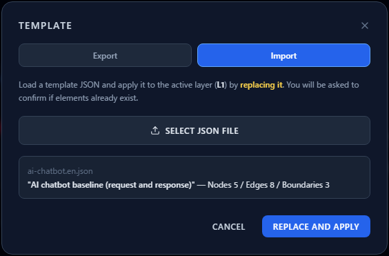

# Creating and Using Templates

**English** | [日本語](templates.ja.md)

Redrawing the same architecture over and over is wasted effort. CyberRiskScape can **export a
diagram as JSON and import it into another project**.

A **template of the AI chatbot** used throughout this guide is provided, so instead of drawing
[Your First Threat Model](first-threat-model.md) yourself, you can import it and move straight on to
the later chapters.

---

## 1. What a template does and does not carry

A template is **one depth layer's diagram**.

| Included | Not included |
|---|---|
| Components (type, position, attributes) | Project information (name, purpose, business impact) |
| Data flows (direction, authentication, network, encryption, semantics) | Risk scores |
| Trust boundaries (type, position, size, trust level) | Risk treatment and control implementation status |
| | Threats added by hand |

**Your assessments do not travel with it.** A template is a starting shape, not a save format for
analysis. To keep a whole project, use **File (Save / Open)** in the left sidebar.

The ElementalIDs (C1 / DF1 / Z1 …) are stripped on export and **renumbered on import**, so importing
into another layer never collides.

---

## 2. Exporting

**Template** in the left sidebar opens on the Export tab.



The scope is **the active depth layer** ("Export the diagram on the current active layer (L1, 16
elements) as a template").

Enter a name and press **Download** to save the JSON file.



The name is what you see when importing, so give it one that **says what is inside** — for example
"AI chatbot baseline (request and response)".

---

## 3. Importing

Switch to the **Import** tab.



Choose a file with "Select a JSON file" and the **template name and element counts** appear.



> **Applying it replaces the active layer.**
> You are asked to confirm when the layer already has elements. `Ctrl + Z` undoes the replacement,
> but saving anything you care about with **File (Save / Open)** first is the safer habit.

It imports into **the depth layer you currently have selected**. If you would rather not touch L1,
switch to L2 before importing.

---

## 4. The AI chatbot template

The configuration this guide uses is available as a ready-made template.

| File | Contents |
|---|---|
| [`templates/ai-chatbot.en.json`](templates/ai-chatbot.en.json) | English (data flow names in English) |
| [`templates/ai-chatbot.ja.json`](templates/ai-chatbot.ja.json) | Japanese |

Open the file on GitHub and download it with **Raw**.

**Inside:** 5 components, 8 data flows, 3 trust boundaries.

```
User ⇄ Front-end Server ⇄ LLM model ⇄ Vector DB / RAG ⇄ Data store
(Internet)     (DMZ)        (internal network: macro segmentation)
```

- Both directions between User and Front-end Server are **public network + ID/Password**
- Vector DB / RAG → LLM model (the search result) carries the **`rag_retrieval` semantic**
- The boundaries are External boundary (Internet), DMZ and Macro segmentation (Internal)

Import it and **48 threats** are detected straight away. Every chapter from
[Reading the Threat Panel](reading-threats.md) onward assumes this state.

---

## 5. Why the flows run both ways

The template carries **the response path as well as the request path**. That is not a cosmetic
choice — **it changes which threats are detected**.

### Edge direction is a firing condition

A rule's connection requirement looks at **edge source → target**. The "Forward (Outbound) / Reverse
(Inbound) / Bidirectional" setting in Edge Properties only **changes how the arrows are drawn**; the
engine does not read it.

So **to represent a response, you draw a reverse edge**. Setting an edge to "bidirectional" still
looks one-way to the threat engine.

### A concrete case: indirect prompt injection

`atlas-aml-t0051-indirect-prompt-injection-001` fires on an LLM or agent that has
**an inbound edge from a tamperable source** (RAG, tools, data stores, memory, and so on).

- **Request-only diagram**: there is only LLM model → Vector DB / RAG. The LLM has no inbound edge,
  so the threat never fires.
- **Round-trip diagram**: Vector DB / RAG → LLM model exists, and **instructions planted in the
  retrieved documents** — the defining threat of a RAG design — is reported.

In this configuration, adding the four return flows took detection from **43 threats to 48**.

### The rule of thumb

**Draw the path the data comes back on.** It matters most when:

- **retrieved content** from a RAG or data store enters an LLM (indirect prompt injection)
- **generated output** goes back to an application or user (unvalidated output, sensitive data
  leakage)
- **responses** from external tools or APIs are processed by an agent (poisoned tool output)

---

## 6. Where templates help

- **Distributing a house standard** — template your organization's typical architecture and teams
  start from "change what differs for us" rather than from an empty canvas
- **A starting point for review** — circulate the template beforehand and spend the meeting on the
  differences
- **Training** — everyone starts from the same diagram and argues over the same threat list

Check the contents of a template you received from someone else **before importing it** — it is a
plain text file.

---

## Where to go next

- Draw the diagram yourself — [Your First Threat Model](first-threat-model.md)
- Read what was detected — [Reading the Threat Panel](reading-threats.md)
- Assess and record — [Assessing Risk in Analytics](analytics-assessment.md)
